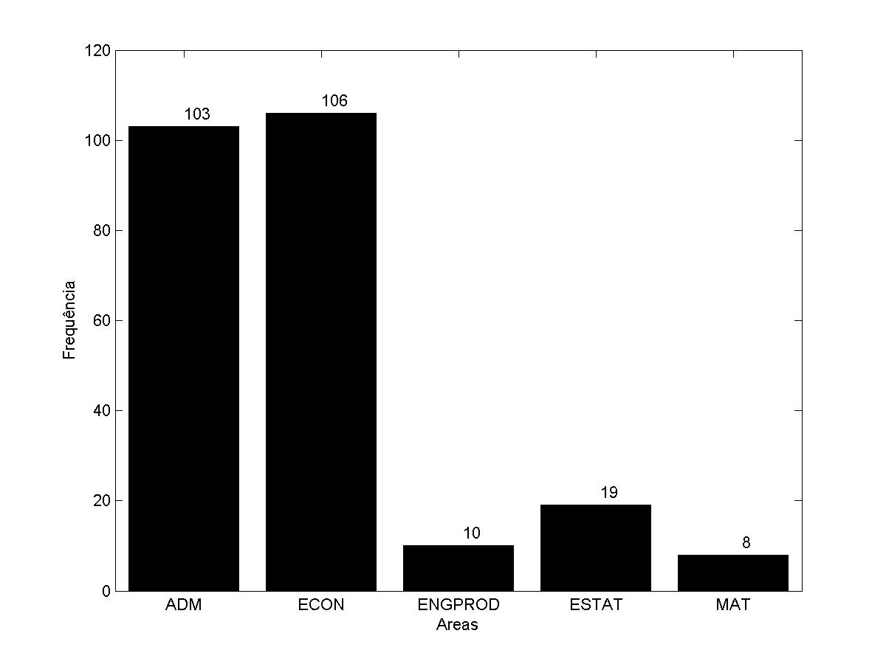
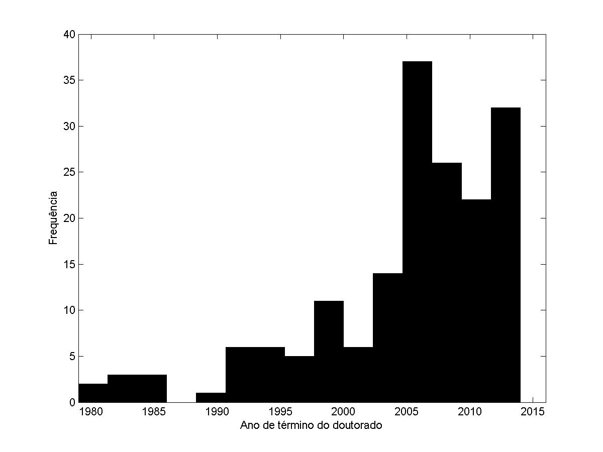
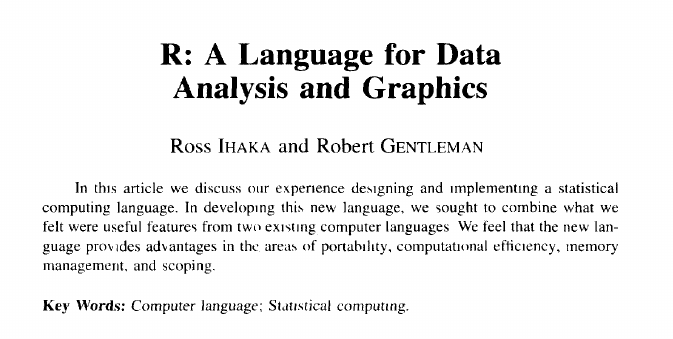
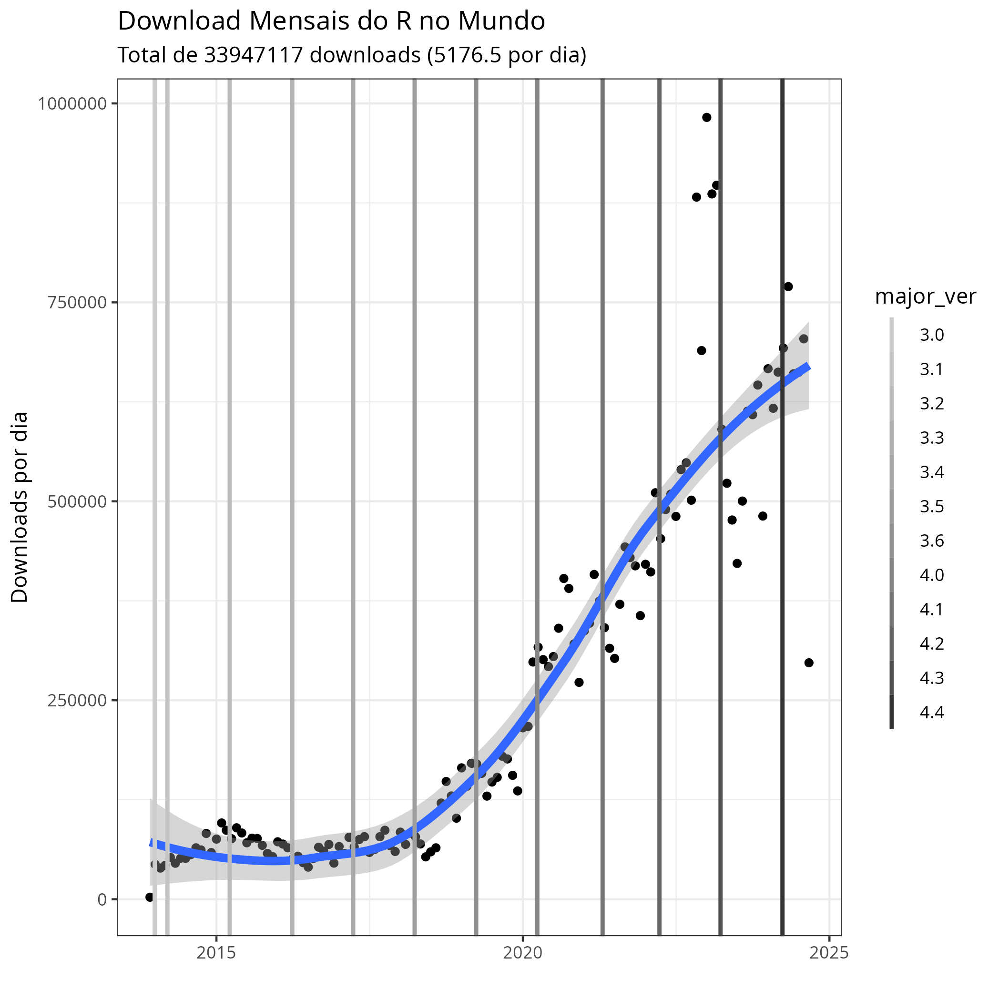
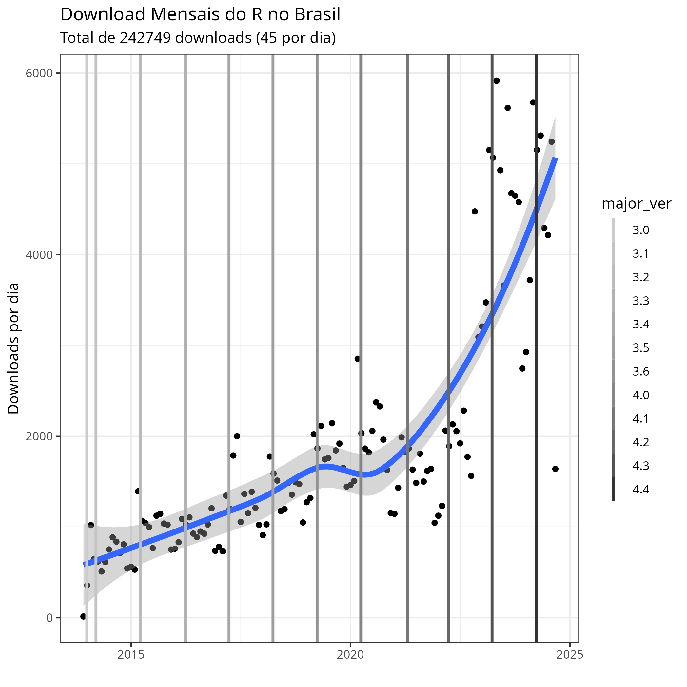

```{r}
classtools::setup_quarto_slides("content")

# parameters
l_info <- classtools::get_class_info("ADFER", 202502)

link_plano <- l_info$info$gdrive_schedule
```







# Pesquisa em Finanças

## Introdução

> Research is a systematic inquiry to describe, explain, predict and control the observed phenomenon. [@babbie2015practice]

:::{.incremental}

- Na prática, pesquisa aplicada é um jogo de argumentação baseada em informação incompleta e análise de dados.

-   Carreiras em Finanças
    -   Bancos e fundos (analista buy/sell side, traders quantitativos)
    -   Bancos centrais, agências de regulação e centros de pesquisa
    -   Analista/engenheiro de dados e ML (modelos preditivos)
    -   Pesquisa e docência acadêmica
:::

## Áreas de Finanças

::: columns
::: {.column width="40%"}
No Brasil:

-   Derivativos e Risco
-   Econometria e Métodos Numéricos em Finanças
-   Finanças Corporativas
-   Investimentos
:::

::: {.column width="60%"}
No mundo:

-   Corporate Governance
-   Asset Pricing
-   Portfolio Management and Asset Allocation
-   Risk Management
-   Financial Crisis
-   Management Compensation
-   Investments - Behavioural Issues
-   Market Efficiency and Anomalies
-   Venture Capital
-   Market Microstructure
-   Credit Risk
-   and more..
:::
:::

## Os pesquisadores de Finanças no Brasil {visibility="hidden"}

[Os pesquisadores, as publicações e os periódicos da área de Finanças no Brasil: Uma análise com base em currículos da plataforma Lattes. Revista Brasileira de Finanças (Impresso).](http://bibliotecadigital.fgv.br/ojs/index.php/rbfin/article/view/47157) [@perlin2015pesquisadores]

::: columns
::: {.column width="50%"}

:::

::: {.column width="50%"}

:::
:::

## Ciclo de Vida de um Artigo Científico

::: {.incremental}
1.  Pesquisa e Desenvolvimento (código, escrita e  muito estudo) (3 - 6 meses)
1.  \[Opcional\] Congressos (EBFIN, ENAMPAD, EFMA, ..)
1.  Revisão do artigo
1.  Submissão para Periódicos:
  -   Desk-reject (o editor entende que não é um bom "fit" para o periódico)
  -   Revisão #1 -\> Revisão #2 -\> Revisão #3..#K
1.  Publicação e Churrasco!
1.  Siga para etapa 1 e repita
:::

## Dicas para a sua produção científica

::: {.incremental}
- Artigos = vitrine acadêmica
- Escolha um tópico que alinhe com a sua carreira profissional
- Todo trabalho deve ter um claro lugar na literatura
    - o peso da inovação muda de acordo com título acadêmico: pouco peso para o mestrado, alto peso para doutorado
- Simplique - método **KISS**
- um bom **acadêmico** deve saber **falar**, **escrever** e **programar/analisar dados**. Escolha dois!
- Aproveite! Passa rápido.
- **A escolha do software correto para a pesquisa é fundamental!**
:::

## Softwares para pesquisa científica

::: {.incremental}
-   Escrita e Edição de texto
    -   LLMs (ChatGPT & Gemini) !?
    -   Word (MSFT)/Writer (Libreoffice)/Google Docs (Mathtype + Zotero)
    -   **Latex** (Miktex/Texlive + texstudio, [Overleaf](https://www.overleaf.com/project))
    -   **LLMs (ChatGPT & Gemini) !?**    
-   Tabelas
    -   Excel/Calc/Google Sheets
    -   Latex, com exportação via código
-   Referências
    -   Endnote (Word), **Bibtex** (Latex), **Zotero** (Word e Latex)
-   Manipulação de dados e teste de hipóteses
    -   **R**, Python, Stata, SPSS, SAS, Matlab, entre muitos outros
:::


## Software de pesquisa

> A ciência promove **colaboração** e **reproducibilidade**

Um software deve ser escolhido baseado em:

-   A capacidade de resolver o problema

-   A facilidade de compartilhar procedimentos (colaboração e reproducibilidade)

-   Na prática, programas de pesquisa são escolhidos com base em:

    -   O que o grupo de pesquisa/orientador usa;
    -   Quão fácil é para você usar;
    -   Quão bonito é a interface gráfica;
    -   O orçamento (\$);

## 

> Aprender a utilizar os programas corretos não é fácil, mas existem fortes benefícios no longo prazo

- Automatizar procedimentos em dados;

- Trabalhar inteligente, e não intensamente (_work smarter, not harder_)

- Reutilizar (e abusar) de códigos antigos ou de outras pessoas.


# Sobre o R {background-image="figs/R_logo.svg.png" background-opacity=0.5}

## O que é o R {background-image="figs/R_logo.svg.png" background-opacity=0.5}

> Ross Ihaka and Robert Gentleman. R: A language for data analysis and graphics. Journal of Computational and Graphical Statistics, 5(3):299–314, 1996. [@ihaka1996r]

{fig-align="center"}


## Cronologia

 ](figs/history-R.png)


## Sobre o R

Definição
:   O R é uma linguagem de programação voltada para a resolução de problemas estatísticos e para a visualização gráfica de dados.

Autores
:   Ross Ihaka e Robert Gentleman (*The University of Auckland*)

Funcionalidade
:   R é sinônimo de programação voltada à análise de dados

Custo
:   **O R é totalmente livre** e disponível em vários sistemas operacionais.


## Por que Escolher o R {background-image="figs/R_logo.svg.png" background-opacity=0.5}

::: {.incremental}
-   R é uma plataforma madura, estável, continuamente suportada e intensamente utilizada na indústria.
-   Aprender a linguagem do R é fácil.
-   A interface do R e RStudio torna o uso da ferramenta bastante produtivo.
-   Os pacotes do R permitem as mais diversas funcionalidades.
-   O R tem compatibilidade com diferentes linguagens e sistemas operacionais.
-   O R é totalmente gratuito!
:::

## R VS Python {background-image="figs/python-logo.jpeg" background-opacity=0.5}

| Característica | R | Python |
| :--- | :--- | :--- |
| **Ponto Forte Principal** | Análise Estatística e Visualização | Versatilidade e Machine Learning |
| **Curva de Aprendizagem**| Moderada, especialmente para não-programadores | Baixa, sintaxe clara e intuitiva |
| **Principais Bibliotecas** | `ggplot2`, `dplyr`, `tidyverse` | `Pandas`, `NumPy`, `Scikit-learn` |
| **Uso Ideal** | Pesquisa, estatística, análise exploratória | Projetos de ponta a ponta, machine learning, integração |
| **Comunidade** | Forte na academia e pesquisa | Ampla e diversa, forte na indústria de tecnologia |


## Usos do R {background-image="figs/R_logo.svg.png" background-opacity=0.5}

::: {.incremental}
-   Importação, exportação, tratamento e armazenamento de dados financeiros e econômicos com base em arquivos locais ou da internet;
-   Criação de rotinas para o cálculo e a administração do risco de uma carteira de investimento;
-   Desenvolvimento de rotinas para a administração e execução de ordens financeiras no mercado de capitais;
-   Criação de ferramentas para controle, avaliação e divulgação de índices econômicos sobre um país ou região;
-   Execução de diversas possibilidades de pesquisa empírica através da estimação de modelos econométricos e testes de hipóteses;
-   Criação de *websites* dinâmicos com o pacote `Shiny`, possibilitando que qualquer pessoa no mundo utilize uma ferramenta criada por você;
-   Organização de um processo automatizado de criação e divulgação de relatórios técnicos com o pacote `knitr` e a tecnologia *RMarkdown*.
:::

## Downloads pelo mundo e Brasil

::: columns
::: {.column width="50%"}

:::

::: {.column width="50%"}

:::
:::

## Número de pacotes no CRAN

```{r}
library(rvest)
library(magrittr)
library(ggplot2)
library(plotly)
library(dplyr)
library(zoo)

url <- "https://cran.r-project.org/web/packages/available_packages_by_date.html"

tbl_page <- read_html(url) |>
  html_node("table") %>%
  html_table()

pkgs <- tbl_page %>%
  mutate(count = rev(1:nrow(.))) %>%
  mutate(Date = as.Date(Date)) %>%
  mutate(Month = format(Date, format="%Y-%m")) %>%
  group_by(Month) %>%
  summarise(published = min(count)) %>%
  mutate(Date = as.Date(as.yearmon(Month)))

per_month <- tbl_page |>
  mutate(Date = as.Date(Date),
         Month = as.Date(format(Date, format="%Y-%m-01"))) |>
  group_by(Month) |>
  count()

my.text <- paste0("Total number of packages (", Sys.Date(), ')', 
                  ': ', sum(per_month$n))

p_month <- ggplot(per_month, aes(x = Month, y = n)) +
  geom_col() + 
  labs(title = 'Number of Published/Updated CRAN Packages per Month',
       subtitle = my.text,
       y = 'Number of Packages', 
       x = 'Year-Month') + 
  theme_light()

print(p_month)
```

## Instalando R e o RStudio

R
:   [Instalador do R (maior versão encontrada)](https://cran.r-project.org/bin/windows/base/)

Rtools (apenas usuários do windows)
:   [Instalador RTools (maior versão encontrada)](https://cran.r-project.org/bin/windows/Rtools/)

RStudio
:   <https://www.rstudio.com/>

Positron
: <https://www.appsilon.com/post/introducing-positron>

Também recomendo a instalação do tinytex para compilação de relatórios em pdf Latex:

```{r}
#| echo: true
#| eval: false
# execute no prompt do R
install.packages('tinytex')
tinytex::install_tinytex()
```

## Referências {.unlisted}
