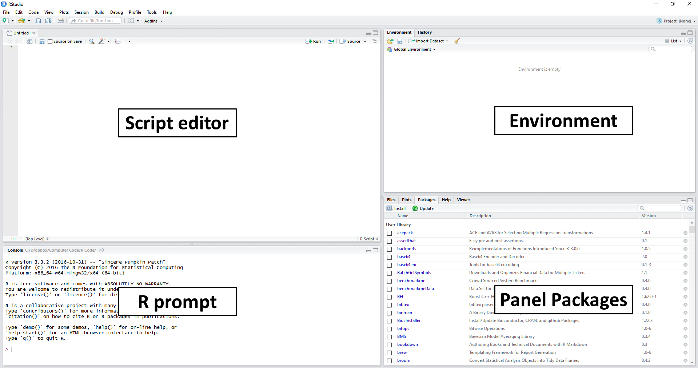
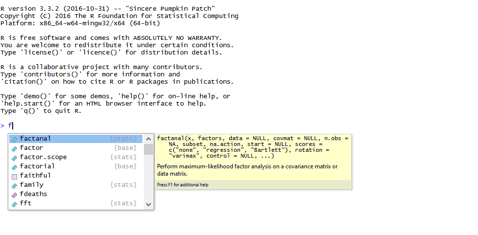
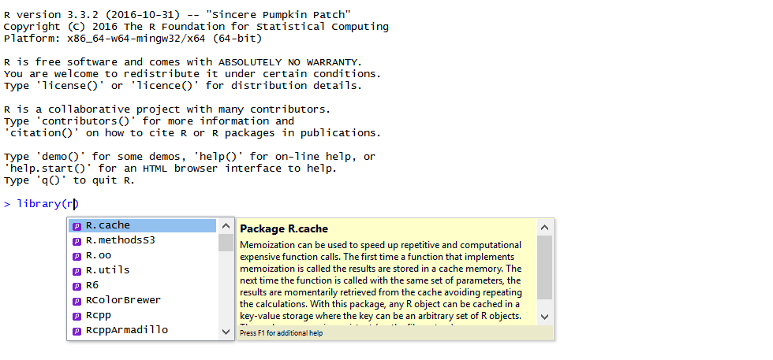
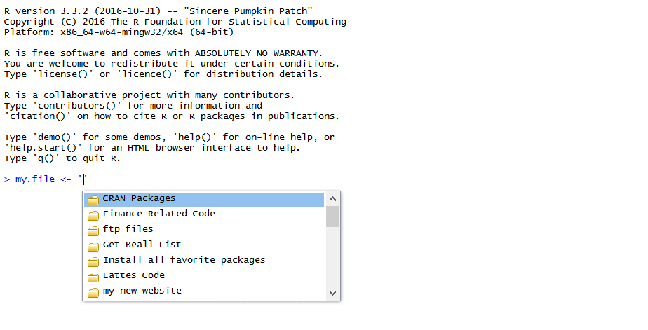

# Funcionamento do R e RStudio

```{r}
#| echo: false
classtools::setup_quarto_slides("content")

```


## Como o R e RStudio funciona?

::: {.incremental}
- Um _script_ automatiza a análise de dados, produzindo algo no final, geralmente uma tabela ou uma figura
- Códigos serão inseridos e salvos em um _script_ com extensão .R (ex. 01_run-research.R)
- Como um compilado de instruções em sequência, o _script_ irá rodar **sempre** da mesma forma 
- O código pode ser reaproveitado em projetos futuros
:::

## Explicando a Tela do RStudio

```{r}
#| fig-cap: "A tela do RStudio"

```

## Passos iniciais

::: {.incremental}
- uma sessão do R é inicializada com o RStudio
- na execução, código é lido de cima para baixo;
- símbolo `<-` ou `=` define objetos na sessão do R
- cada objeto possui métodos diferentes
- função são métodos aplicados a objetos, tendo entradas e uma saída 
:::

## Seu primeiro _Script_

Digite e execute os seguintes comandos em um novo _script_ do R:

::: {.columns}

::: {.column width="55%"}
```{r, eval=FALSE}
#| echo: true
# Isso é um comentário (não roda nada)
x <- 1
y <- "meu lindo texto em português"

# mostre o valor do x
print(x)

# apresente um gráfico
plot(1:10)
```
:::

::: {.column width="45%"}
::: {.callout-tip title="Atalhos para rodar código"}
**control + shift + s**
: executa o arquivo atual sem eco no console;

**control + shift + enter**
: executa o arquivo atual com eco;

**control + enter**
: executa a linha selecionada;
:::
:::

:::

## Seu segundo _script_

Digite os seguintes comandos em um novo _script_ do R:

```{r}
#| echo: true
#| eval: false

# carregue pacotes
library(datasets)

# busque tabela
df <- datasets::chickwts

# verifique dados
print(df)

# adicione nova coluna
df$nova_coluna <- paste0("Linha ", 1:nrow(df))

# salve em arquivo temporário (ou na pasta do projeto)
write.csv(df, fs::file_temp(ext = ".csv"))
```

# Objetos no R

## Tipos de objetos

No R, **tudo é um objeto, e cada tipo de objeto tem suas propriedades**.

```{r}
#| echo: true
# numeric
x <- 1 # unique value
x <- 1:10 # sequence
x <- c(1, 4.1, 6.5, 7) # vector
x <- c(1, 1:10, 99) # combined vector
x <- runif(100) # 100 random numbers
x <- seq(1, 10, by = 2)

# Date
my_date <- as.Date("2022-01-05")
today <- Sys.Date()

# character
y <- 'text' # simples text
y <- c('my text 1', 'my.text2') # vector of texts

# logical
l <- TRUE
l <- FALSE
l <- c(TRUE, FALSE)

# dataframe (tabela)
df <- data.frame(x = 1:10,
                 z = paste0('linha ', 1:10))
```


## O Formato Internacional

- **decimal:** O decimal no R é definido pelo ponto (.), tal como em `2.5` e não vírgula, como em `2,5`. 

- evite **caracteres latinos** ao máximo. Nos textos (objeto de caracteres), é possível utilizá-los desde que a codificação do objeto esteja correta (UTF-8 ou Latin1).

**formato das datas:** as datas no R são formatadas de acordo com o padrão [ISO 8601](https://www.iso.org/iso-8601-date-and-time-format.html), seguindo o padrão `YYYY-MM-DD`


# Pacotes do R

## Introdução a pacotes

> Pacotes são módulos **gratuitos**, desenvolvidos por outros usuários, e podem ser instalados e usados livremente em seu computador. 

::: {.incremental}
- O R possui hoje em torno de `r tryCatch(nrow(available.packages(repos="https://cran.rstudio.com/")), error = function(e) "20.000+")` pacotes à disposição dos usuários

- O repositório oficial de pacotes é o [CRAN (The Comprehensive R Archive Network)](https://cran.r-project.org/), mas alguns pacotes estão disponíveis no [Github](https://github.com/)

- Cada pacote é nada mais que um conjunto de arquivos, copiado para sua pasta local e compilado localmente conforme necessidade. No meu caso (comando `.libPaths()`), a pasta é: `r .libPaths()[1]`

- O [task views](https://cran.r-project.org/) é uma ótima fonte para estudar potenciais pacotes em uma determinada área de conhecimento

- **DICA: é extremamente provável que o método que pretende usar em seu artigo/dissertação/tese esteja disponível em um pacote**
:::


## Instalando Pacotes

- Pacotes do CRAN são instalados com comando `install.packages()`

```{r}
#| eval: false
#| echo: true
# install pkg readr
install.packages('readr')
```

- Pacotes do Github são instalados com `remotes::install_github()` ou `pak::pkg_install()`:

```{r}
#| eval: false
#| echo: true
# install ggplot2 from github using remotes or pak
remotes::install_github("hadley/ggplot2")
# ou com pak:
# pak::pkg_install("hadley/ggplot2")
```

```{r}
i_exerc <- 1
```

## Pacote `pak`

> Pacote `pak` é uma versão **moderna** de `utils::install.packages()` para a instalação de pacotes do R, que otimiza a instalação de pacotes e suas dependências.

- Baixa e compila múltiplos pacotes simultaneamente

- Resolução inteligente de dependências

- Sintaxe unificada para múltiplas fontes: Instala de diversas origens usando o mesmo comando (`pak::pkg_install()`): CRAN/Github/Bioconductor

- Executa o processo de build em uma sessão de R separada, evitando conflitos com pacotes já carregados na sua sessão atual.

- Dependências de sistema automáticas: No Linux, identifica e instala (ou instrui como instalar) as bibliotecas C/C++ necessárias no sistema operacional.

- Feedback visual claro: Interface mais limpa, indicando o progresso, tempo restante e o plano de resolução antes de aplicar as mudanças.

## Ambientes isolados no R

> No R, é possível criar ambientes isolados, com pacotes e versões específicas, para cada projeto. Isso evita conflitos de versões de pacotes entre projetos diferentes.

- Pacote `renv` permite criar ambientes isolados para cada projeto, com pacotes e versões específicas.

- Vantagens: conflitos de pacotes entre projetos diferentes são evitados, e é possível compartilhar o ambiente com outros usuários.

- Desvantagens: necessita da reinstalação dos pacotes a cada projeto.


## Exercício `r i_exerc`

1. Crie um novo _script_ e rode:

```{r}
#| echo: true
#| eval: false
yvec <- c('text1', 'text2', 'text3', 'text4', 'text5', 'text6')
zvec <- paste0('text', 1:6)

print(yvec)
print(zvec)
```

`yvec` e `zvec` são iguais? Por que?

2. Pacote `fortunes` permite que o usuário **conte piadas** com o R. Instale o mesmo e execute a sua principal função `fortune()`. Qual é a piada contada?

3. Pacote `afedR3` foi construído baseado na versão em inglês do livro da disciplina. Instale o mesmo com o comando `remotes::install_github("msperlin/afedR3")`. Após isso, execute o código abaixo e descreva qual a finalidade do mesmo.

```{r}
#| echo: true
#| eval: false

# importe dados
f_df <- afedR3::data_path("CH04_ibovespa.csv")
df <- readr::read_csv(f_df)

# apresente a tabela
print(df)
```

# Interagindo com o Sistema Operacional

## Operações mais comuns e importantes

::: {.incremental}
- Mudança de diretório de trabalho
  - comandos `setwd()`/`getwd()`
  - DICA: uso de PROJETOS do RStudio automatiza essa tarefa no dia-a-dia
- Limpeza de memória: 
  - comando `rm()` limpa a memória
  - reinicialização da sessão com _control + shift + f10_. 
  - Caso necessário, force a limpeza da memória RAM (_garbage collection_) com `gc()`
- Listar arquivos e diretórios
  - comando `fs::dir_ls(PATH)`
  - o R possui uma pasta temporária, a qual pode ser usada nas mais diferentes operações. Para descobrir a sua, use a função `fs::path_temp()`. A minha é "`r fs::path_temp()`"
- Apagar e remover diretórios
  - diversos comandos com pacote `fs`.
:::


# Interagindo com a Internet

## Baixando Arquivos da Internet

- função `download.file` baixa arquivos da internet:

```{r}
#| echo: true
#| eval: false
# set link
link <- 'go.microsoft.com/fwlink/?LinkID=521962'
local_file <- fs::file_temp(ext = ".xlsx")

download.file(url = link,
              destfile = local_file)

df <- readxl::read_excel(local_file)

print(df)
```

## Interagindo com APIs

- acesse APIs da internet com `jsonlite::fromJSON()`
- exemplo: acesso o api do Banco Central do Brasil para importar taxas atuais de financiamento de veículos

```{r}
#| echo: true
url <- "https://www.bcb.gov.br/api/servico/sitebcb/historicotaxajurosdiario/TodosCampos?filtro=codigoSegmento%20eq%20%271%27%20and%20codigoModalidade%20eq%20%27401101%27%20and%20InicioPeriodo%20eq%20%272023-05-09%27"

df_taxas_auto <- jsonlite::fromJSON(url)[[1]]

df_taxas_auto |>
  gt::gt()
```


# Ferramentas de produtividade do RStudio

## _Code completion_

- ative a ferramenta _code completion_ com a tecla _tab_
- Serve para facilitar o encontro de:
  - nomes de objetos;
  - nome de pacotes;
  - nome de arquivos; 
  - nomes de entradas em funções. 

```{r autocomplete, echo=FALSE, fig.cap = 'Uso do autocomplete para objetos'}

```


```{r autocomplete-pacotes, echo=FALSE, fig.cap = 'Uso do autocomplete para pacotes' }

```


```{r autocomplete-arquivos, echo=FALSE, fig.cap = 'Uso do autocomplete para arquivos'}

```


```{r}
i_exerc <- i_exerc +1
```

## Exercícios `r i_exerc` (1/2)

1. Utilize o R para baixar o arquivo compactado com o material do livro, disponível neste [link](`r afedR3::links_get()$book_blog_zip`). Salve o mesmo como um arquivo na pasta temporária da sessão (veja função `fs::file_temp(ext = ".zip")`).

2. Utilize a função `unzip` para descompactar o arquivo baixado na questão anterior e, após a operação, utilize a função `fs::file_delete()` para remover o arquivo zipado do computador, após a sua descompactação. Quantos arquivos estão disponíveis no arquivo zipado?

3. Toda vez que o usuário instala um pacote do R, os arquivos desse são armazenados localmente em uma pasta específica do computador. Utilizando os comandos `Sys.getenv('R_LIBS_USER')` e `fs::dir_ls()`, liste todos os diretórios desta pasta. Quantos pacotes estão disponíveis nesta pasta?

4. No mesmo assunto do exercício anterior, liste todos os arquivos em todas as subpastas do diretório contendo os arquivos dos diferentes pacotes. Em média, quantos arquivos são necessários para cada pacote?


## Exercícios `r i_exerc` (2/2)

5. Instale o pacote `GetTDData` no seu computador. Leia o manual do pacote e utilize a função `GetTDData::get.yield.curve()` para baixar a curva de juros atual no sistema financeiro Brasileiro. Verifique o exemplo de uso da função para entender como utilizá-la.

6. Utilizando o pacote `remotes` (ou `pak`), instale a versão de desenvolvimento do pacote `ggplot2` no repositório de [Hadley Wickham](https://github.com/hadley). Carregue o pacote usando `library` e crie uma figura simples com o código `qplot(y = rnorm(10), x = 1:10)`.

7. **DESAFIO** - Utilizando sua capacidade de programação, verifique no seu computador qual pasta, a partir do diretório de raiz, possui o maior número de arquivos. Apresente na tela do R as cinco pastas com maior número de arquivos.

