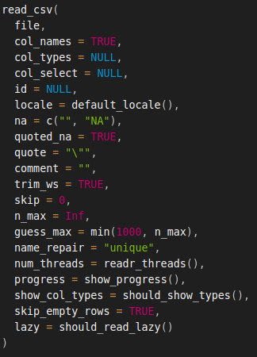

# Importação de dados locais no R

```{r}
#| echo: false

classtools::setup_quarto_slides("templates")
```

## Formatos disponíveis

> Dados são serializados ou salvos em texto em diferentes tipos de arquivos. 

Em ordem de populariedade:

::: {.incremental}
- Dados delimitados em texto (_csv_, _tsv_);
- Planilhas do Microsoft Excel (_xls_, _xlsx_);
- Arquivos de dados nativos do R (_RData_ e _rds_)
- SQLite (_SQLITE_)
- Texto não estruturado (_txt_)
- Formato `fst` (_fst_)
- Outros notáveis: [Feather](https://posit.co/blog/feather/) e [parquet](https://arrow.apache.org/docs/2.0/r/articles/dataset.html)
:::

## Pontos importantes

- o local do arquivo no sistema deve ser indicado explicitamente no código. **Use o autocomplete com tecla _tab_**

```{r}
my_file <- 'C:/Data/MyData.csv'
```

- Note o uso de barras (`/`) para designar o diretório do arquivo.  Referências relativas também funcionam, tal como em:

```{r}
my_file <- 'Data/MyData.csv'
```

- os dados serão importados e exportados no R como **objetos do tipo `dataframe`**. 


## Pacote `afedR3`

> Pacote `afedR3` [@afedr] é o pacote oficial do livro, contendo diversos arquivos de dados de exemplo.

Passos:

1. Instale o pacote `remotes` (caso ainda não o tenha feito)
1. Instale `afedR3` com comando `remotes::install_github("msperlin/afedR3")`
2. Após instalação, verifique os dados disponíveis com o comando abaixo:

```{r}
#| message: true
afedR3::data_list()
```

- Para ter o caminho completo de cada arquivo, basta usar função `afedR3::data_path` tendo o nome do arquivo como entrada:

```{r, eval = FALSE}
# get location of file
my_f <- afedR3::data_path('CH11_grunfeld.csv')

# print it
print(my_f)
```


# Arquivos _csv_

## Introdução

::: {.incremental}
- formato mais popular em análise de dados
- arquivos texto que podem ser abertos por qualquer editor/plataforma
- comportam dados volumosos e podem ser facilmente compactados para .zip ou .tar.gz
- funciona apenas para objetos do tipo `dataframes`
- a importação pode ser problemática, dependendo de onde o arquivo é gerado
:::

## Argumentos da função `readr::read_csv`

```{r}
help("read_csv", package = 'readr')
```

```{r}
#| echo: false


```

## Importação

```{r, eval = TRUE}
#| echo: true
# get location of file
my_f <- afedR3::data_path('CH04_ibovespa.csv')

df <- readr::read_csv(my_f)
print(df)
```


## Algumas dicas para lidar com csv

::: {.incremental}
1. Verifique a existência de texto antes dos dados e a necessidade de ignorar algumas linhas iniciais. 

1. Verifique a existência ou não dos nomes das colunas na primeira linha com os dados.;

1. Verifique qual o símbolo de separador de colunas. Comumente, seguindo notação internacional, será a vírgula, porém nunca se tem certeza sem checar; 
1. Para dados numéricos, verifique o símbolo de decimal, o qual deve ser o ponto (`.`) tal como em `2.5`. Caso necessário, podes ajustar o símbolo na própria função de leitura;

1. Verifique a codificação do arquivo de texto (UTF-8, Latin1 (ISO-8859) ou windows1252) e ajuste o código de importação para sincronizar a codificação. 

1. **Nunca modifique dados brutos manualmente**. Sempre que você encontrar uma estrutura de texto inesperada em um arquivo _.csv_, use os argumentos da função de leitura _csv_ para importar as informações corretamente. 
:::

## Um arquivo problemático (1/2)

Agora, vamos estudar um caso mais anormal de arquivo _.csv_. No pacote do livro temos um arquivo chamado `CH04_funky-csv-file.csv` onde: 

- o cabeçalho possui texto com informações dos dados;
- o arquivo usará a vírgula como decimal;
- o texto do arquivo conterá caracteres latinos.

As primeiras 10 linhas dos arquivos contém o seguinte conteúdo:

```{r}
#| echo: true
my_f <- afedR3::data_path('CH04_funky-csv-file.csv')

readr::read_lines(my_f, n_max = 10)
```

## Um arquivo problemático (2/2)

```{r}
my_locale <- readr::locale(decimal_mark = ',')

df_not_funky <- readr::read_delim(
  file = my_f, 
  skip = 7, # how many lines do skip
  delim = ';', # column separator
  col_types = readr::cols(), # column types
  locale = my_locale # locale
)

dplyr::glimpse(df_not_funky)
```


## Exportação de Dados

```{r}
library(readr)

# set number of observations
N <- 100

# create dataframe with random data
my_df <- data.frame(y = runif(N),
                    z = rep('a', N))

# write to file
f_out <- tempfile(fileext = '.csv')
readr::write_csv(x = my_df, file = f_out)
```

# Arquivos _Excel_ (_xls_ e _xlsx_)

## Introdução

::: {.incremental}
- formato popular na indústria por razões de praticidade
- baixa portabilidade, arquivo pode corromper com o tempo
- muito difícil de trabalhar com dados volumosos
- funciona apenas para objetos  `dataframes`
- EVITEM usar o excel no R!
- boa alternativa: Google Sheets
:::

## Lendo arquivos _Excel_

Imagine agora a existência de um arquivo chamado `Ibov_xls.xlsx` que contenha os mesmos dados do Ibovespa que importamos na seção anterior. A importação das informações contidas nesse arquivo para o R será realizada através da função `read_excel`: \index{readxl!read\_excel}

```{r}
# set file
my_f <- afedR3::data_path("CH04_ibovespa-Excel.xlsx")

# read xlsx into dataframe
my_df <- readxl::read_excel(my_f, sheet = 'Sheet1')

# glimpse contents
dplyr::glimpse(my_df)
```

## Exportação de Dados

```{r}
# set number of rows
N <- 50

# create random dataframe
my_df <- data.frame(y = seq(1,N),
                    z = rep('a',N))

# write to xlsx
f_out <- tempfile(fileext = '.xlsx')
writexl::write_xlsx(
  my_df, 
  f_out
)
```

# Arquivos _.rds_

## Introdução

::: {.incremental}
- RDS = R Data Serialization
- formato nativo do R (só é usado no R!)
- rápido acesso e arquivo resultante é relativamente compacto
- funciona em qualquer tipo de objeto no R (`listas` são ótimas para salvar em .rds!)
- ótima opção para projetos exclusivos do R!
- péssima opção para compartilhar dados
:::

## Importação de Dados

```{r}
# set file path
my_file <- afedR3::data_path('CH04_example-rds.rds')

# load content into workspace
my_df <- readr::read_rds(file = my_file)
dplyr::glimpse(my_df)
```

## Exportação de Dados

```{r}
# set data and file
df <- data.frame(
  x = 1:100
)

my_file <- fs::file_temp(ext = '.rds')

# save as .rds
readr::write_rds(df, my_file)
```


# Arquivos _fst_ (pacote `fst`)

## Introdução

::: {.incremental}
- formato [_fst_](http://www.fstpackage.org/) foi especialmente desenhado para possibilitar a gravação e leitura de dados tabulares de forma rápida e com mínimo uso do espaço no disco. 
- usa todos os **núcleos** da máquina na importação e exportação (computação paralela)
- baixa portabilidade (funciona apenas no R)
- funciona apenas para objetos  `dataframes`
- ótima opção para trabalhar com volumosas bases de dados em computadores potentes. 
:::

## Importação de Dados

O uso do formato _fst_ é bastante simples. Utilizamos a função `read_fst` para ler arquivos:

```{r}
#| echo: true
my_file <- afedR3::data_path('CH04_example-fst.fst')
my_df <- fst::read_fst(my_file)

dplyr::glimpse(my_df)
```

## Exportação de Dados

```{r}
#| echo: true
library(fst)

# create dataframe
N <- 1000
my_file <- tempfile(fileext = '.fst')
my_df <- data.frame(x = runif(N))

# write to fst
write_fst(x = my_df, path = my_file)
```


## Testando o Tempo de Execução do Formato _fst_


```{r}
library(fst)
library(readr)

# set number of rows
N <- 5000000

# create random dfs
my_df <- data.frame(y = seq(1,N),
                    z = rep('a',N))

# set files
my_file_1 <- fs::file_temp(ext = ".rds")
my_file_2 <- fs::file_temp(ext = ".fst")

# test write
time_write_rds <- system.time(write_rds(my_df, my_file_1 ))
time_write_fst <- system.time(write_fst(my_df, my_file_2 ))

# test read
time_read_rds <- system.time(readRDS(my_file_1))
time_read_fst <- system.time(read_fst(my_file_2))

# test file size (MB)
file_size_rds <- file.size(my_file_1)/1000000
file_size_fst <- file.size(my_file_2)/1000000
```

Após a execução, vamos verificar o resultado:

```{r}
#| message: true
# results
my_formats <- c('.rds', '.fst')
results_read <- c(time_read_rds[3], time_read_fst[3])
results_write<- c(time_write_rds[3], time_write_fst[3])
results_file_size <- c(file_size_rds , file_size_fst)

# print text
my_text <- paste0('\nTime to WRITE dataframe with ',
                  my_formats, ': ',
                  results_write, ' seconds', collapse = '')
message(my_text)

my_text <- paste0('\nTime to READ dataframe with ',
                  my_formats, ': ',
                  results_read, ' seconds', collapse = '')
message(my_text)

my_text <- paste0('\nResulting FILE SIZE for ',
                  my_formats, ': ',
                  results_file_size, ' MBs', collapse = '')
message(my_text)
```

# Arquivos _SQLite_

## Introdução

::: {.incremental}
- alta portabilidade (SQLITE é uma tecnologia de banco de dados)
- permite leituras parciais dos dados (ex. ler apenas uma parte específica dos dados)
- permite _queries_ personalizadas com a linguagem SQL, e de rápida execução no banco de dados (ex. contar número de casos)
- permite a criação e acesso a múltiplas tabelas
- ótima para casos onde o banco de dados fica mudando com novas inserções
:::

## Importação de Dados

Assumindo a existência de um arquivo com formato SQLite, podemos importar suas tabelas com o pacote `RSQLite`: \index{RSQLite!dbReadTable} \index{RSQLite!dbConnect}

```{r}
# set name of SQLITE file
f_sqlite <- afedR3::data_path('CH04_example-sqlite.SQLite')

# open connection
my_con <- RSQLite::dbConnect(drv = RSQLite::SQLite(), 
                             f_sqlite)

# list tables
RSQLite::dbListTables(my_con)

# read table
my_df <- RSQLite::dbReadTable(conn = my_con,
                              name = 'MyTable1') # name of table in sqlite

# print with str
dplyr::glimpse(my_df)
```


```{r}
# open connection
my_con <- RSQLite::dbConnect(drv = RSQLite::SQLite(), 
                             f_sqlite)

# set sql statement
my_SQL_statement <- "select * from myTable2 where G='A'"

# get query
my_df_A <- RSQLite::dbGetQuery(conn = my_con, 
                               statement = my_SQL_statement)

# disconnect from db
RSQLite::dbDisconnect(my_con)

# print with str
print(my_df_A)
```

## Exportação de Dados


```{r}
#| echo: true
library(RSQLite)

# set number of rows in df
N = 10^6 

# create simulated dataframe
my_large_df_1 <- data.frame(x=runif(N), 
                            G= sample(c('A','B'),
                                      size = N,
                                      replace = TRUE))

my_large_df_2 <- data.frame(x=runif(N), 
                            G = sample(c('A','B'),
                                       size = N,
                                       replace = TRUE))

# set name of SQLITE file
f_sqlite <- tempfile(fileext = '.SQLITE')

# open connection
my_con <- dbConnect(drv = SQLite(), f_sqlite)

# write df to sqlite
dbWriteTable(conn = my_con, name = 'MyTable1', 
             value = my_large_df_1)
dbWriteTable(conn = my_con, name = 'MyTable2', 
             value = my_large_df_2)

# disconnect
dbDisconnect(my_con)
```


# Dados Não-Estruturados e Outros Formatos

## Introdução

::: {.incremental}
- dados podem ser armazenados de forma não-estruturada, tal como um texto qualquer. 
- tornar uma base de dados não-estrutura em estruturada pode ser um trabalho significativo
- o caso clássico de base de dados não-estruturada remete a importação de texto bruto
:::

## O livro _Pride and Prejudice_

```{r}
# set file to read
my_f <- afedR3::data_path('CH04_price-and-prejudice.txt')

# read file line by line
my_txt <- read_lines(my_f)

# print 50 characters of first fifteen lines
print(stringr::str_sub(string = my_txt[1:15], 
                       start = 1, 
                       end = 50))
```


## Exportando de Dados Não-Estruturados

```{r}
# set file
my_f <- tempfile(fileext = '.txt')

# set some string
my_text <- paste0('Today is ', Sys.Date(), '\n', 
                  'Tomorrow is ', Sys.Date()+1)

# save string to file
readr::write_lines(x = my_text, file = my_f, append = FALSE)
```


```{r}
print(read_lines(my_f))
```


# Selecionando o Formato

## Qual formato selecionar?

O usuário deve levar em conta três pontos na decisão de formato de arquivos de dados:

- velocidade de importação e exportação;
- tamanho do arquivo resultante;
- compatibilidade com outros programas e sistemas.

Na grande maioria das situações, o uso de arquivos _csv_ satisfaz esses quesitos!

Caso abrir mão de portabilidade não faça diferença ao projeto, o formato _rds_ é ótimo e prático. Se este não foi suficiente, então a melhor alternativa é partir para o _fst_, o qual usa maior parte do _hardware_ do computador para importar os dados. Como sugestão, caso puder, apenas **evite o formato do Excel**, o qual é o menos eficiente de todos.  


## Exercícios

1. Crie um dataframe com o código a seguir:

```{r, eval=FALSE}
library(dplyr)

n_row <- 10000
df <- tibble(x = 1:n_row,
             y = runif(n_row))
```

Exporte o dataframe resultante para cada um dos cinco formatos destacados a seguir:

- csv
- rds
- xlsx
- fst

Qual dos formatos ocupou maior espaço na memória do computador? Podes verificar o tamanho dos arquivos no Windows Explorer, por exemplo. No R, função `file.size` realiza o mesmo serviço.

2. Defina o valor de `n_row` no código anterior para `1000000`. Esta mudança modifica as respostas das duas últimas perguntas?

3. No material do livro (pacote `afedR3`) existe um arquivo de dados chamado  `CH08_some-stocks-SP500.csv`. Usando função, `afedR3::data_path`. utilize função `readr::read_csv` para carregar o seu conteúdo. Utilize função `glimpse` para verificar o conteúdo dos dados importados. Quantas colunas e qual o nome de cada coluna da tabela?

4. Na página da CVM é possível obter informações de todas as empresas atualmente listadas na bolsa em um arquivo disponível no link <https://dados.cvm.gov.br/dados/CIA_ABERTA/CAD/DADOS/cad_cia_aberta.csv>. Utilizando o R, baixe o arquivo em seu computador, importe os dados diretamente usando `readr::read_csv` (a função importa diretamente de arquivo compactados, sem necessidade de descompactação explícita). Quantas empresas fazem parte da bolsa atualmente (verifique o número de linhas do dataframe com função `nrow`).

# Referências {.unlisted}