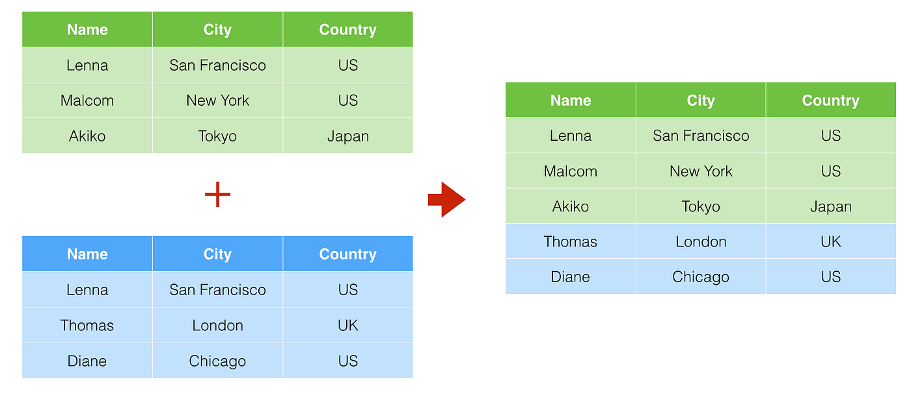
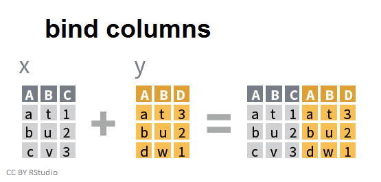
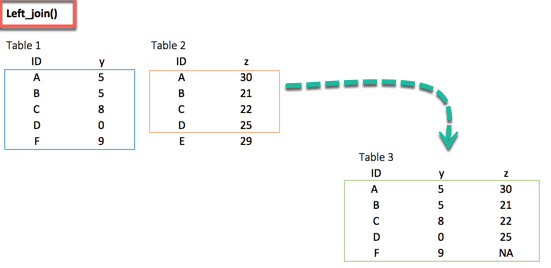
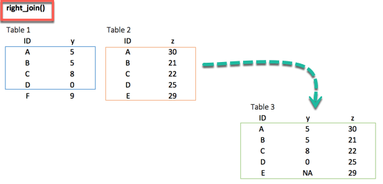
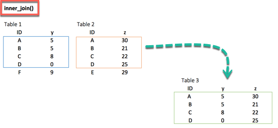

```{r}
#| echo: false
classtools::setup_quarto_slides("templates")
```

# As Classes de Armazenamento no R

## Introdução

- As classes básicas de objetos no R (números, texto, ...) em vetores são difíceis de trabalhar com dados em larga escala (muitas observações, muitas colunas)
- Classes de armazenamento facilitam a agregação de objetos de forma estruturada
- `dataframes` e `lists` são os objetos mais usados no R

 
# Dataframes {background-image="figs/2023-08-11-dataframes.webp" background-opacity=0.5}

## Introdução 

> `dataframe`  ou `tibble` significa “estrutura ou organização de dados”. Grosso modo, um objeto da classe dataframe nada mais é do que uma **tabela**, com linhas e colunas.

- **principal objeto utilizado no trabalho com o R**, sendo usado como tipo de entrada para diferentes funções
- `dataframe` é um tipo especial de lista, onde cada coluna é um vetor atômico com o mesmo número de elementos, porém com sua própria classe.
- organiza os dados, forçando o pareamento de variáveis
- altamente escalável para dados complexos


## Criando `dataframes`

### Exemplo simples

```{r}
df <- tibble::tibble(
  x = 1:10,
  y = sample(letters, 10)
)

dplyr::glimpse(df)
```

### Exemplo menos simples

```{r}
# set tickers
ticker <- c(rep('ABEV3',4),
            rep('BBAS3', 4),
            rep('BBDC3', 4))

# set dates
ref_date <- as.Date(rep(c('2010-01-01', '2010-01-04',
                          '2010-01-05', '2010-01-06'),
                        3) )

# set prices
price <- c(736.67, 764.14, 768.63, 776.47,
           59.4  , 59.8  , 59.2  , 59.28,
           29.81 , 30.82 , 30.38 , 30.20)

# create tibble/dataframe
my_df <- dplyr::tibble(
  ticker, 
  ref_date, 
  price
  )

# print it
print(my_df)
```


## Inspecionando um `dataframe`

::: {.callout-caution}
## Atenção!

Inspecionar tabelas é uma das artes em análise de dados, exigindo intimidades com os dados e o problema em questão.
:::

Estamos interessados em:

::: {.incremental}
- Número de linhas e colunas
- Nomes das colunas
  - sem caracteres latinos, espaços ou até mesmo caixa alta
  - preferencialmente em inglês
- **Classes das colunas**
- **Existência de dados omissos (`NA`)**
- Verificar se dados **fazem sentido**
:::

## Função `dplyr::glimpse()`

```{r}
library(dplyr)

# check content of my_df
glimpse(my_df)
```

## Função `base::summary()`

```{r}
# check variation my_df
summary(my_df)
```


## Função `skimr::skim()`

```{r}
skimr::skim(my_df)
```

## Exemplo

Avalie os seguintes dados:

```{r}
#| echo: false

set.seed(1)
N <- 10
df <- tibble::tibble(
  `Data` = format(Sys.Date(), "%d/%m/%Y"),
  id.candidato = 1,
  `Nome do candidato` = sample(LETTERS, N),
  `Profissão` = sample(c("advogado", 'professor', "casado"), N, replace = TRUE),
  `age` = sample(-5:N, N),
  `ano_casamento` = sample(1990:2010, N)
)

df |>
  gt::gt()
```

## Problemas

::: {.incremental}
- coluna `Data` em formato local (dd/mm/yyyy)
- coluna `id.candidato` tem somente valor 1
- coluna `Nome do Candidato` tem espaço no nome da coluna, e valores que não fazem sentido
- coluna `Profissão` tem caracter latino e valor "casado", o qual não faz sentido
- coluna `age` está em inglês
- **ninguém com menos de 10 anos pode estar casado!!!!**
:::

## Acessando Elementos de um `dataframe`

- use sempre nomes para acessar colunas (via posição é possível, mas não recomendado)
- toda coluna de um _dataframe_ vira um vetor atômico
- todo `dataframe` possui notação matricial para elementos indiviudais ou blocos

## Acessando colunas inteiras

Existem duas principais maneiras de acessar uma coluna de um _dataframe_ via nome:

```{r}
# isolate columns of df
my_ticker <- my_df$ticker
my_prices <- my_df[['price']]

# print contents
print(my_ticker)
print(my_prices)
```

## Acessando valores específicos

```{r}
# first element
my_price <- my_df$price[1] 

print(my_price)
```

```{r}
# first 10 elements
my_prices <- my_df$price[1:10] 

print(my_prices)
```

```{r}
# first 10 rows of first and second column (returns a tibble!)
my_prices <- my_df[1:10, 1:2] 

print(my_prices)
```

::: {.callout-caution}
## Atenção!

Ao usar notação de matriz ([row, column]) em um _dataframe_, o resultado é sempre outro _dataframe_.
:::


# Operador de _pipeline_ {background-image="figs/pipelines.jpg" background-opacity=0.7}

## Introdução

> O operador de _pipeline_ é usado com o símbolos `|>` (nativo com R > 4.1) e `%>%` (pacote `magritt`) e permite que dataframes sejam criados em etapas consecutivas

Imagine o seguinte código, onde a ideia é repassar um _dataframe_ entre diferentes e consecutivas funções:

```{r}
#| eval: false
df1 <- fct1(df0)
df2 <- fct2(df1)
df3 <- fct3(df2)
```

Uma maneira equivalente e mais elegante:

```{r, eval=FALSE}
my_tab <- my_df |>
  fct1() |>
  fct2() |>
  fct3()
```

## Um exemplo prático

```{r}
df <- tibble::tibble(
  x = 1:10,
  y = runif(10)
)

fct1 <- function(df_in) {
  df_in$col1 <- 1
  return(df_in)
}

fct2 <- function(df_in) {
  df_in$col2 <- 2
  return(df_in)
}

fct3 <- function(df_in) {
  df_in$col3 <- 3
  return(df_in)
}


df_3 <- df |>
  fct1() |>
  fct2() |>
  fct3()

dplyr::glimpse(df_3)
```


## Modificando um `dataframe`

Para criar novas colunas em um `dataframe`, basta utilizar a função `dplyr::mutate`

```{r}
library(dplyr)

# add columns with mutate
my_df <- my_df |>
  mutate(ret = price/dplyr::lag(price) -1,
         my_seq1 = 1:nrow(my_df),
         my_seq2 =  my_seq1 +9) |>
  glimpse()

```

A maneira mais tradicional, e comumente encontrada em código, para criar novas colunas é utilizar o símbolo `$`:

```{r}
# add new column with base R
my_df$my_seq3 <- 1:nrow(my_df)

# check it
glimpse(my_df)
```


## Removendo colunas 

Para remover colunas de um `dataframe`, basta usar `dplyr::select` com operador negativo para o nome das colunas indesejadas:

```{r}
# removing columns
my_df_temp <- my_df |>
  select(-my_seq1, -my_seq2, -my_seq3) |>
  glimpse()
```

No uso de funções nativas do R, a maneira tradicional de remover colunas é alocar o valor nulo (`NULL`):

```{r}
# set temp df
temp_df <- my_df

# remove cols
temp_df$price <- NULL
temp_df$ref_date  <- NULL

# check it
glimpse(temp_df)
```


## Filtrando linhas de um `dataframe`

- selecione linhas de um tabela com `dplyr::filter()`:

```{r}
library(dplyr)

# filter df for single stock
df_temp1 <- my_df |>
  filter(ticker == 'ABEV3') |>
  glimpse()
```

A função também aceita mais de uma condição. Veja a seguir onde filtramos os dados para `'ABEV3'` em datas após ou igual a `'2010-01-05'`:

```{r}
library(dplyr)
# filter df for single stock and date
my_df_temp <- my_df |>
  filter(ticker == 'ABEV3',
         ref_date >= as.Date('2010-01-05')) |>
  glimpse()
```


## Ordenando um `dataframe`

No `tidyverse`, a forma de ordenar `dataframes` é pelo uso da função `arrange`. No caso de ordenamento decrescente, encapsulamos o nome das colunas com `desc`: \index{dplyr!desc}

```{r}
library(dplyr)

# set df
my_df <- tibble(col1 = c(4,1,2),
                col2 = c(1,1,3),
                col3 = c('a','b','c'))

# sort ascending, by col1 and col2
my_df <- my_df |>
  arrange(col1, col2) |>
  print()

# sort descending, col1 and col2
my_df <- my_df |>
  arrange(desc(col1), desc(col2)) |>
  print()
```


## Combinando e Agregando `dataframes`

- podemos combinar tabelas por linhas (orientação vertical): `dplyr::bind_rows()`  
- podemos combinar tabelas por colunas (orientação horizontal): `dlyr::bind_cols()`
- **agregar** tabelas de acordo com colunas: `dplyr::inner_join`, `dplyr::left_join`, `dplyr::right_join`, `dplyr::full_join`

## Função `dplyr::bind_rows()`  



## Exemplo de uso

```{r}
library(dplyr)

# set dfs
my_df_1 <- tibble(col1 = 1:5,
                  col2 = rep('a', 5))

my_df_2 <- tibble(col1 = 6:10,
                  col2 = rep('b', 5),
                  col3 = rep('c', 5))

# bind by row
my_df <- bind_rows(my_df_1, my_df_2) |>
  glimpse()
```

## Função `dplyr::bind_cols()`  




## Exemplo de uso

```{r}
# set dfs
my_df_1 <- tibble(col1 = 1:5, col2 = rep('a', 5))
my_df_2 <- tibble(col3 = 6:10, col4 = rep('b', 5))

# bind by column
my_df <- bind_cols(my_df_1, my_df_2) |>
  glimpse()
```

## Funções da família `join` 


## `left_join()`



## `right_join()`



## `inner_join()`




## Exemplo `dplyr::inner_join()`

```{r}
# set df
my_df_1 <- tibble(date = as.Date('2016-01-01')+0:10,
                  x = 1:11)

my_df_2 <- tibble(date = as.Date('2016-01-05')+0:10,
                  y = seq(20,30, length.out = 11))

# aggregate tables
my_df <- inner_join(my_df_1, my_df_2)

glimpse(my_df)
```


# Listas

## Introdução

> Uma lista (`list`) é uma classe de objeto extremamente flexível. Ao contrário de vetores atômicos, a lista não apresenta restrição alguma em relação aos tipos de elementos nela contidos. 

- um dos objetos mais utilizados no R
- acomoda informações complexas de forma fácil

## Criando Listas

Uma lista pode ser criada através do comando `base::list`, seguido por seus elementos separados por vírgula: 

```{r}
library(dplyr)

# create list
my_l <- list(c(1, 2, 3),
             c('a', 'b'),
             factor('A', 'B', 'C'),
             tibble(col1 = 1:5))

# use base::print
print(my_l)

# use dplyr::glimpse
glimpse(my_l)
```

Também podemos nomear os elementos:

```{r}
# set named list
my_named_l <- list(ticker = 'TICK4',
                   market = 'Bovespa',
                   df_prices = tibble(P = c(1,1.5,2,2.3),
                                      ref_date = Sys.Date()+0:3))

# check content
glimpse(my_named_l)
```


## Acessando os Elementos de uma Lista

Os elementos de uma lista podem ser acessados através do uso de duplo colchete (`[[ ]]`) ou `$`, tal como em:

```{r}
# accessing elements from list
print(my_named_l[[2]]) # using position
print(my_named_l[["df_prices"]]) # using name
print(my_named_l$ticker) # using $
```


## Adicionando e Removendo Elementos de uma Lista

Para adicionar ou substituir, basta definir um novo objeto na posição desejada da lista:

```{r}
# set list
my_l <- list(slot1 = 'a',
             slot2 = 1:10)

# add new elements to list
my_l$slot3 <- c(1:5)
my_l$slot4 <- rep("b", 15)

# print result
glimpse(my_l)
```

## Removendo elementos de uma lista

Para remover elementos de uma lista, basta definir o elemento para o símbolo reservado `NULL` (nulo):

```{r}
# set list
my_l <- list(text = 'b', 
             num1 = 2, 
             num2 = 4)

# remove elements
my_l$num1 <- NULL
my_l$num2 <- NULL

glimpse(my_l)
```

## Processando os Elementos de uma Lista

> Toda lista pode ser processado de forma programática através de funções específicas. 

- processar elemento por elemento de uma lista

Por exemplo, imagine uma lista com vetores numéricos de diferentes tamanhos, tal como a seguir:

```{r}
# set list
my_l_num <- list(c(1, 2, 3),
                 seq(1:50),
                 seq(-5, 5, by = 0.5))
```

Caso quiséssemos calcular a média de cada elemento de `my_l_num` e apresentar o resultado na tela como um vetor, poderíamos fazer isso através de um procedimento simples, processando cada elemento individualmente:

```{r}
# calculate mean of vectors
mean_1 <- mean(my_l_num[[1]])
mean_2 <- mean(my_l_num[[2]])
mean_3 <- mean(my_l_num[[3]])

# print it
print(c(mean_1, mean_2, mean_3))
```

O código anterior funciona, porém não é recomendado devido sua falta de escabilidade. 

Uma maneira mais fácil, elegante e inteligente seria utilizar a função `sapply`:

```{r}
# using sapply
my_mean <- sapply(my_l_num, mean)

# print result
print(my_mean)
```


# Matrizes

## Introdução

> uma matriz é uma representação bidimensional de diversos valores, arranjados em linhas e colunas. O uso de matrizes é uma poderosa maneira de representar dados numéricos em duas dimensões e, em certos casos, funções matriciais podem simplificar operações matemáticas complexas.

Um claro exemplo do uso de matrizes em Finanças seria a representação dos preços de diferentes ações ao longo do tempo. 

| Data       | ABEV3  | BBAS3 | BBDC3 |
|------------|--------|-------|-------|
| 2010-01-01 | 736.67 | 59.4  | 29.81 |
| 2010-01-04 | 764.14 | 59.8  | 30.82 |
| 2010-01-05 | 768.63 | 59.2  | 30.38 |
| 2010-01-06 | 776.47 | 59.28 | 30.20 |

A matriz anterior poderia ser criada da seguinte forma no R:

```{r}
# create matrix
data <- c(736.67, 764.14, 768.63, 776.47,
          59.4, 59.8, 59.2, 59.28,
          29.81, 30.82, 30.38, 30.20)

my_mat <- matrix(data, nrow = 4, ncol = 3)

# set names of cols and rows
colnames(my_mat) <- c('ABEV3', 'BBAS3', 'BBDC3')
rownames(my_mat) <- c('2010-01-01', '2010-01-04',
                      '2010-01-05', '2010-01-06')

print(my_mat)
```

## Selecionando Valores de uma Matriz

- Os elementos de uma matriz podem ser acessados pela notação `[i,j]`, onde _i_ representa a linha e _j_ a coluna. Veja o exemplo a seguir:

```{r}
my_mat <- matrix(1:9, nrow = 3)
print(my_mat)
print(my_mat[1,2])
```

O uso de testes lógicos para selecionar valores de matrizes também é possível. Veja a seguir:

```{r}
my_mat <- matrix(1:9, nrow = 3)
print(my_mat >5)
```

# Tarefa final de aula

## Tarefa 03

1. Crie um dataframe chamado `my_df` com uma coluna chamada `x` contendo uma sequência de 1 a 100 e outra coluna chamada `y` com o valor da coluna x adicionada de 5. Usando código, qual a quantidade de valores em `x` maiores que 10 e menores que 25?

2. Use função `dplyr::mutate` para criar uma nova coluna em `my_df` chamada `cumsum_x`, contendo a soma cumulativa de `x` (função `base::cumsum()`). Desta nova coluna, quantos valores são maiores que 50?

3. Com função `dplyr::filter()`, filtre o dataframe `my_df` para manter apenas as linhas onde o valor da coluna `x` é maior que 25.

4. Utilize pacote `yfR` para baixar dados da ação do META/Facebook (META) desde a data `'2010-01-01'` até hoje. Filtre os dados para mentar apenas dados onde o dia da semana era segunda feira.

5. Importe os dados disponíveis no arquivo `CH11_grunfeld.csv`, disponível no arquivo com os dados do livro. Utilize funções `dplyr::glimpse`, `summary` e `skimr::skim` para conhecer os dados importados.

6. Crie um objeto do tipo lista com três dataframes em seu conteúdo, `df1`,  `df2` e `df3`. O conteúdo e tamanho dos dataframes é livre. Utilize função `sapply` para descobrir o número de linhas e colunas em cada dataframe.

7. Usando pacote `yfR`, baixe os dados da Petrobras (PETR4.SA) e do índice ibovespa (^BVSP) em dois dataframes diferentes (duas chamadas da função `yfR::yf_get`). Empilhe os dados das duas ações com o comando `dplyr::bind_rows`.

8. Usando os mesmos dados do exercício anterior, crie uma nova coluna na tabela da Petrobras com os retornos do índice ibovespa. A tabela resultante deve ser como a apresentada a seguir:

```{r}
#| echo: false
df <- tibble::tibble(
  ref_date = Sys.Date()+1:10,
  ret_petr3 = 100 + cumsum(runif(10)),
  ret_ibov = 100 + cumsum(runif(10))
) 

df |>
  gt::gt()
```
Note que precisarás:

- renomear e selecionar colunas da tabela da Petrobras
- renomear e selecionar colunas da tabela do Ibovespa
- realizar o "merge" das tabelas usando as datas como referências

## Referências {.unlisted}