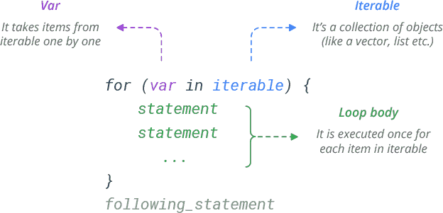
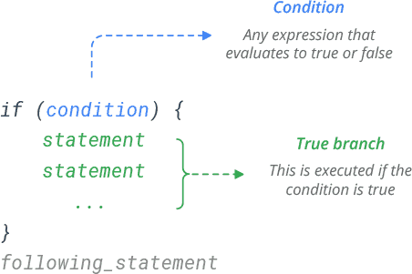
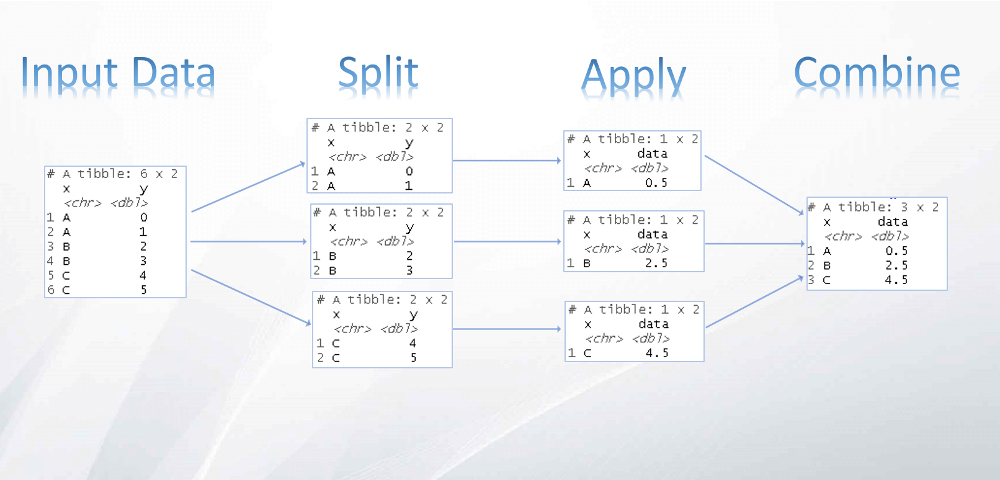

```{r}
#| echo: false
classtools::setup_quarto_slides('content')
```


# Objetivos de Aprendizagem {.unlisted}

## Objetivos de Aprendizagem

Ao final desta aula, você será capaz de:

::: {.incremental}
- Criar e usar **funções** para encapsular procedimentos
- Repetir tarefas com **_loops_** e executar código condicionalmente (`if`/`else`)
- Aplicar **programação funcional** com o pacote `purrr`
- Realizar operações de agrupamento (_split-apply-combine_) com o `dplyr`
:::


# Introdução a Programação com o R 

## Introdução

> Programação é a execução de um conjunto de instruções complexas ao computador, as quais solucionam algum problema de análise de dados

::: {.incremental}

- permite iterações sequenciais, encapsulamento de métodos, e automatização de qualquer procedimento computacional

- Em resumo, o computador será uma poderosa e escalável extensão do seu cérebro
:::

# Funções no R

## Introdução

> _Everything that exists is an object. Everything that happens is a function call_ — John Chambers, creator of the S language, the predecessor to R. 

::: {.incremental}
- Uma função representa o encapsulamento de método
- O uso de funções organiza o código, aumenta a aplicabilidade de procedimentos genéricos, e permite a rápida solução de problemas. 
- um conjunto de funções é o maior ativo do pesquisador
- menos tempo reescrevendo códigos, e mais tempo pensando
:::

## Estrutura de uma função no R

::: {.incremental}
- Uma função sempre possui três partes conexas: 
  - entradas:  informações necessárias para o processamento
  - processamento: manipulação das informações
  - saída: informações de interesse
:::

```{mermaid}
%%| fig-cap: "Diagrama de uma função"
%%| echo: false

flowchart LR
A[Entrada_1 <br> Entrada_2 <br> ... <br> Entrada_k] --> B(((Processamento)))
B --> C[Resultado_1 <br> Resultado_2 <br> ... <br> Resultado_k]
```

## Qual é a sua idade?

```{mermaid}
%%| fig-cap: "Exemplo de diagrama de uma função"
%%| echo: false

flowchart LR
A[<b> Entradas:</b> <br><br>Ano de Nascimento <br> Ano Atual] --> B(((<b>Processamento:</b><br><br>Ano atual menos nascimento)))
B --> C[<b>Saída:</b> <br><br> Idade Atual]
```

## Sintaxe de uma função

```{r}
#| echo: false
knitr::include_graphics("figs/r-function-syntax.png")
```

## Criando Funções

```{r}
my_fct <- function(arg1 = 1, arg2 = 'abc'){
  
  length_arg1 <- length(arg1)
  length_arg2 <- length(arg2)
  
  msg1 <- paste0('Number of elements in arg1: ', length_arg1)
  message(msg1)
  
  msg2 <- paste0('Number of elements in arg2: ', length_arg2)
  message(msg2)
  
  out <- c(length_arg1, length_arg2)
  return(out)
  
}


out1 <- my_fct(arg1 = 2, arg2 = 'bcd')
print(out1)

out2 <- my_fct(arg1 = 1:10, 
               arg2 = c('dab', 'asc'))
print(out2)
```


## Um exemplo prático

> Vamos criar uma função que calcule, para qualquer ação do Yahoo Finance (`yfR`), o retorno acumulado entre 2015 e a data atual

```{r}
get_cum_ret <- function(ticker){
  
  first_date <- "2015-01-01"
  last_date <- Sys.Date()
  
  df_yf <- yfR::yf_get(ticker, first_date, last_date)
  
  first_price <- dplyr::first(df_yf$price_adjusted)
  last_price <- dplyr::last(df_yf$price_adjusted)
  cum_ret <- last_price/first_price - 1
  
  return(cum_ret)
  
}
```

Testando a função:

```{r}
#| cache: true
ticker <- "PETR4.SA"
print(get_cum_ret(ticker))
```

# Loops

## Utilizando Loops (comando _for_)

> Utilizados de forma ostensiva na análise de dados, os _loops_ permitem a repetição estruturada de códigos e possibilitam o processamento de itens individualmente de uma forma fácil.

- o tamanho do _loop_ é definido dinamicamente, com base em dados

A estrutura de um _loop_ segue o seguinte esqueleto de código:


```{r}
#| echo: false

```

## Um exemplo prático 

```{r}
# set seq
my_seq <- seq(-5,5)

# do loop
for (i in my_seq){
  message(paste('The value of i is',i))
}
```

O uso de _loops_ encadeados, isto é, um _loop_ dentro de outro _loop_, também é possível. Veja o exemplo a seguir, onde apresentamos todos os elementos de uma matriz:

```{r}
# set matrix
my_mat <- matrix(1:9, nrow = 3)

# loop all values of matrix
for (i in seq(1, nrow(my_mat))){
  for (j in seq(1, ncol(my_mat))){
    message(paste0('Element [', i, ', ', j, '] = ', my_mat[i, j]))
  }
}
```

## Coletando retornos acumulados com loops

```{r}
#| cache: true
ticker_vec <- c("PETR4.SA", "GRND3.SA", "WEGE3.SA", "AMER3.SA", "^BVSP")

cum_ret_vec <- numeric()
for (i_ticker in seq_along(ticker_vec) ) {
  
  this_ticker <- ticker_vec[i_ticker]
  this_cum_ret <- get_cum_ret(this_ticker)
  
  cum_ret_vec[this_ticker] <- this_cum_ret
}

cum_ret_vec

```

## Usando dados em loops

```{r}
#| cache: true
sp_comp <- yfR::yf_index_composition("SP500")

ticker_vec <- sp_comp$ticker[1:5]

cum_ret_vec <- numeric()
for (i_ticker in seq_along(ticker_vec) ) {
  
  this_ticker <- ticker_vec[i_ticker]
  this_cum_ret <- get_cum_ret(this_ticker)
  
  cum_ret_vec[this_ticker] <- this_cum_ret
}

cum_ret_vec
```

## Exemplo de loop e agrupamento de dados

- Outro exemplo prático do uso de um _loop_ é o processamento de dados de acordo com grupos. Por exemplo, para dados de preços de diferentes ações do índice SP500, caso quiséssemos calcular o preço médio de cada ação, construiríamos o seguinte código para importar os dados e processá-los:

```{r, tidy=FALSE}
library(dplyr)

# read data
my_f <- afedR3::data_path('CH08_some-stocks-SP500.csv')
my_df <- readr::read_csv(my_f)

# find unique tickers in column ticker
unique_tickers <- unique(my_df$ticker)

# create empty df
tab_out <- tibble()

# loop tickers
for (i_ticker in unique_tickers){
  
  # create temp df with ticker i_ticker
  temp_df <- my_df |>
    filter(ticker == i_ticker)
  
  temp_mean_price <- mean(temp_df$price_adjusted)
  temp_last_date <- dplyr::last(temp_df$ref_date)
  
  tibble_temp <- tibble(ticker = i_ticker,
                        mean_price = temp_mean_price,
                        last_date = temp_last_date)
  
  tab_out <- bind_rows(tab_out,
                       tibble_temp)
  
}

# print result
print(tab_out[1:10, ])
```

::: {.callout-tip}
## Dica de desempenho

Crescer `tab_out` com `bind_rows` a cada iteração funciona, mas é ineficiente. Em produção, colete os resultados em uma lista e combine-os uma única vez ao final do _loop_ (ou use `purrr::map()` combinado com `dplyr::bind_rows()`).
:::

# Execuções Condicionais (`if`, `else`, `switch`)

## Introdução

> Execuções condicionais permitem tomar decisões binárias no código, do tipo **se, então** (_if_, _then_)

```{r}
#| echo: false

```


## Um exemplo com loop

```{r}
my_x <- 1:10
my_thresh <- 5

for (i in my_x){
  if (i > my_thresh){
    message('Value of i is ', i, ' - Higher than ', my_thresh)
  } else {
    message('Value of i is ', i, ' - Lower or equal than ', my_thresh)
  }
}
```

Podemos, também, aplicar mais de uma condição lógica com o comando `else` e `else if`. Veja a seguir: 

```{r}
my_x <- 1:10
my_thresh <- 5

for (i in my_x){
  if (i > my_thresh){
    message('Value of i is ', i, ' - Higher than ', my_thresh)
  } else if (i == my_thresh) {
    message('Value of i ', i, ' - equal to ', my_thresh)
  } else {
    message('Value of i ', i, ' - lower than ', my_thresh)
  }
}
```


# Programação Funcional com o R

## Introdução

> Programação funcional é o uso exclusivo de funções para resolver algum problema de análise de dados. 

::: {.incremental}
- Pontos positivos:
  - código fica mais limpo e organizado
  - permite controle automático de erros de execução
  - código mais fácil de manter e de ser reutilizado
- Pontos negativos:
  - maior curva de aprendizado para iniciantes
  - erros de execução podem ser mais difíceis de depurar
:::


## Comparação de código

```{r}
fct <- function(x) {
  return(x+1)
}

y_vec <- 1:10
```


:::: {.columns}

::: {.column width="50%"}

**Versão com loop**
```{r}
x_results <- numeric(length = length(y_vec))
for (i in seq_along(y_vec)) {
  
  x_results[i] <- fct(y_vec[i])
}

x_results
```

:::

::: {.column width="50%"}

**Versão com `purrr::map_dbl`**
```{r}
x_results <- purrr::map_dbl(y_vec, fct)
x_results
```

ou:

```{r}
x_results <- y_vec |>
  purrr::map_dbl(fct)
x_results
```

:::

::::


## As funções de programação funcional

::: {.incremental}
- Pacote `base` oferece funções nativas da família _apply_: `sapply`, `lapply`, `tapply`, `mapply`, `apply` e `by`. 
- No `tidyverse`, programação funcional é oferecida pelo pacote `r classtools::cite_pkg("purrr", clean_up = TRUE)`
- O foco aqui será com as funções do pacote `purrr`
:::


## Pacote `purrr`

Principais funções:

- `map()`: retorna sempre uma lista
- `map_dbl()`: retorna sempre um vetor numérico (_double_)
- `map_int()`: retorna sempre um vetor de inteiros (_integer_)
- `map_chr()`: retorna sempre um vetor de texto (_character_)
- `map_lgl()`: retorna sempre um vetor lógico (_logical_)
- `pmap()`: retorna uma lista, mas com entrada flexível de argumentos

## Função  `r afedR3::format_fct_ref("purrr", "map")`

```{r}
library(purrr)

# set list
my_l <- list(vec1 = 1:10,
             vec2 = 1:50,
             vec3 = 1:5,
             char1 = letters[1:10])

# get length of objects
res_out <- my_l |>
  map_int(length)

print(res_out)

# find character objets
res_out <- my_l |>
  map_lgl(is.character)

print(res_out)
```

Outro ponto interessante nas funções do `purrr` é que permitem, de uma forma simples, o acesso a elementos de uma lista. Para isso, basta indicar uma entrada de posição ou nome na função `map`:

```{r}
# set list
my_l <- list(vec1 = c(elem1 = 10, elem2 = 20, elem3 = 5),
             char1 = c(elem1 = 40, elem2 = 50, elem3 = 15))

# get second element of each element in list, by position
res_out <- my_l |> map(2)
print(res_out)

# get third element of each element in list, by name
res_out <- my_l |> map('elem3')
print(res_out)
```


## Função `r afedR3::format_fct_ref("purrr", "safely")`

> permite o controle e tratamento de erros de execução 

Exemplo: 

- função retorna com erro de execução (não é possível somar 1 a um texto)

```{r, error=TRUE}
library(purrr)

add_one <- function(x) {
  return(x + 1)
}

add_one('a')
```

Agora vamos utilizar `safely` para encapsular `add_one` em outra função chamada `add_one_safely`:

```{r}
# with safely
add_one_safely <- safely(add_one)

print(add_one_safely('a'))
```

Um exemplo de uso completo:

```{r}
my_l <- list(1:5,
             'a',
             1:4)

res_out <- my_l |>
  map(safely(add_one))

print(res_out)
```

Podemos facilmente ver que a função teve erro no segundo elemento de `my_l`. Indo além, caso quiséssemos apenas os resultados, podemos escrever:

```{r}
print(res_out |> map('result'))
```

Ou apenas as mensagens de erro:

```{r}
print(res_out |> map('error'))
```

A saída padrão para o caso de erros também pode ser modificada. Veja o próximo caso, onde inserimos o valor `NA` toda vez que a função resultar em erro (argumento `otherwise`), e retornamos um vetor:

```{r}
my_l <- list(1,
             'a',
             4)

# NA for errors
res_out <- my_l |>
  map(safely(add_one,
             otherwise = NA)) |>
  map_dbl('result')

# print result
print(res_out)
```


## Função  `r afedR3::format_fct_ref("purrr", "pmap")`

- funções `purrr::map_*` permitem a passagem de apenas um argumento dinâmico (que muda) em cada chamada da função
- função `pmap` permite passar qualquer número de argumentos para uma função de destino, inclusive replica loops aninhados.

Como exemplo, vamos considerar uma função que cria uma frase a partir de três entradas:

```{r}
build_phrase <- function(name_in, fruit_in, verb_in) {
  my_msg <- paste0('My name is ', name_in,
                   ' and I like to eat ', fruit_in,
                   ' while ', verb_in, '.')
  
  return(my_msg)
}

build_phrase('Joe', 'apple', 'studying')
```

Usando loops aninhados, escrevemos o seguinte código:

```{r}
names_vec <- c('Joe', 'Kate')
fruits_vec <- c('kiwi', 'apple')
verb_vec <- c('rowing', 'studying')

my_phrases <- character()
for (i_name in names_vec) {
  for (i_fruit in fruits_vec) {
    for (i_verb in verb_vec) {
      my_phrases <- c(my_phrases, 
                      build_phrase(i_name, i_fruit, i_verb))
    }
  }
}

print(my_phrases)
```

Embora o código funcione conforme o esperado, uma melhor abordagem é usar `purrr::pmap`. Tudo o que precisamos fazer é passar todas as combinações de argumentos para a função:

```{r}
df_grid <- tidyr::expand_grid(names_vec = names_vec,
                              fruits_vec = fruits_vec,
                              verb_vec = verb_vec)

l_args <- list(name_in = df_grid$names_vec,
               fruit_in = df_grid$fruits_vec,
               verb_in = df_grid$verb_vec)

my_phrases <- purrr::pmap_chr(.l = l_args, 
                          .f = build_phrase)

print(my_phrases)
```


# Manipulação de Dados com `r classtools::cite_pkg("dplyr")`

## Introdução

- uma das maiores contribuições do `tidyverse`
- pacote `dplyr` permite a realização de análises complexas do tipo _split-apply-combine_ com uma sintaxe simples e intuitiva. 

```{r}
#| echo: false

```


## Operações de Grupo com `dplyr`

Etapas:

1) agrupar de acordo com valores de uma coluna
2) realizar algum cálculo nos dados filtrados
3) agregar os dados para formar uma nova tabela

## Exemplo

> vamos calcular a média,  desvio padrão, máximo e mínimo dos retornos de um grupo de ações

```{r}
#| cache: true
library(dplyr)

tickers <- c("PETR4.SA", "VALE3.SA", "GRND3.SA")
first_date <- "2018-01-01"

tbl_yf <- yfR::yf_get(tickers, first_date) |>
  na.omit() |>
  group_by(ticker) |>
  summarise(ret_mean = mean(ret_adjusted_prices),
            ret_sd = sd(ret_adjusted_prices),
            ret_max = max(ret_adjusted_prices),
            ret_min = min(ret_adjusted_prices))


tbl_yf
```

## Um exemplo mais complexo


```{r}
#| cache: true
tbl_yf <- yfR::yf_get(tickers, first_date) |>
  na.omit() |>
  mutate(weekday = weekdays(ref_date)) |>
  group_by(ticker, weekday) |>
  summarise(ret_mean = mean(ret_adjusted_prices),
            ret_sd = sd(ret_adjusted_prices),
            ret_max = max(ret_adjusted_prices),
            ret_min = min(ret_adjusted_prices))


tbl_yf
```


# Resumo {.unlisted}

## Resumo

::: {.incremental}
- **Funções** encapsulam entradas → processamento → saída e são o maior ativo do pesquisador
- **Loops** (`for`) repetem instruções de forma dinâmica e são úteis para processar grupos de dados
- **Condicionais** (`if`/`else`) permitem tomar decisões no código
- **Programação funcional** (`purrr`) substitui loops por `map_*`/`pmap_*`
- **`dplyr`** resolve _split-apply-combine_ com `group_by()` + `summarise()`
:::


# Tarefa final de aula

## Tarefa 04

01. Crie uma função chamada `say_my_name()` que tome como entrada um nome de pessoa e mostre na tela o texto _Your name is …_. Dentro do escopo da função, utilize comentários para descrever o propósito da função, suas entradas e saídas.

02. Implemente um teste para os objetos de entrada, de forma que, quando o nome de entrada não for da classe character, um erro é retornado ao usuário. Teste sua nova função e verifique se a mesma está funcionando conforme esperado.

03. Crie um vetor com cinco nomes quaisquer, chamado _my_names_. Utilizando um loop, aplique função say_my_name para cada elemento de my_names.

04. No banco de dados do [Brasil.IO](https://data.brasil.io/dataset/genero-nomes/grupos.csv.gz)^[https://data.brasil.io/dataset/genero-nomes/grupos.csv.gz] encontrarás uma tabela com nomes e gêneros derivados de uma das pesquisas do IBGE. Importe os dados do arquivo para R e, usando um _loop_, aplique a função `say_my_name` a 15 nomes aleatórios do banco de dados. Dica: neste caso, você pode baixar os dados direto do link usando `readr::read_csv(LINK)`.

05. Use o pacote `yfR` para baixar dados do índice SP500 (`'^GSPC'`), Ibovespa (`'^BVSP'`), FTSE (`'^FTSE'`) e Nikkei 225 (`'^N225'`) de `'2010-01-01'` até a data atual. Com os dados importados, use um _loop_ para calcular o retorno médio, máximo e mínimo de cada índice durante o período analisado. Salve todos os resultados em uma tabela única e a mostre no _prompt_ do R.

06. Refaça o exercício anterior utilizando as funções `group_by` e `summarise`, ambas do pacote `dplyr`.

07. No site do [RStudio CRAN logs](http://cran-logs.rstudio.com/) você encontrará dados sobre as estatísticas de download para a distribuição de base de R na seção _Daily R downloads_. Usando suas habilidades de programação, importe os dados disponíveis entre `r "2015-01-01"` e `r Sys.Date()` e agregue-os em uma única tabela. Qual país apresenta a maior contagem de downloads do R? NOTA 1: para viabilizar o exercício, comece importando apenas um período curto (por exemplo, um único mês) antes de expandir para todos os arquivos. NOTA 2: caso tiver erro no download, ignore os arquivos com falha, e continue a importação e análise dos demais. Podes usar `purrr::safely` para tratar erros no código.


# Referências {.unlisted}