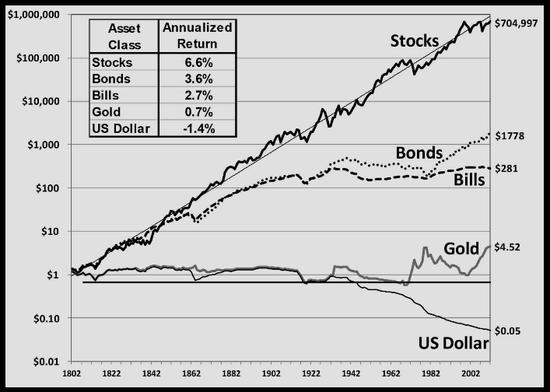
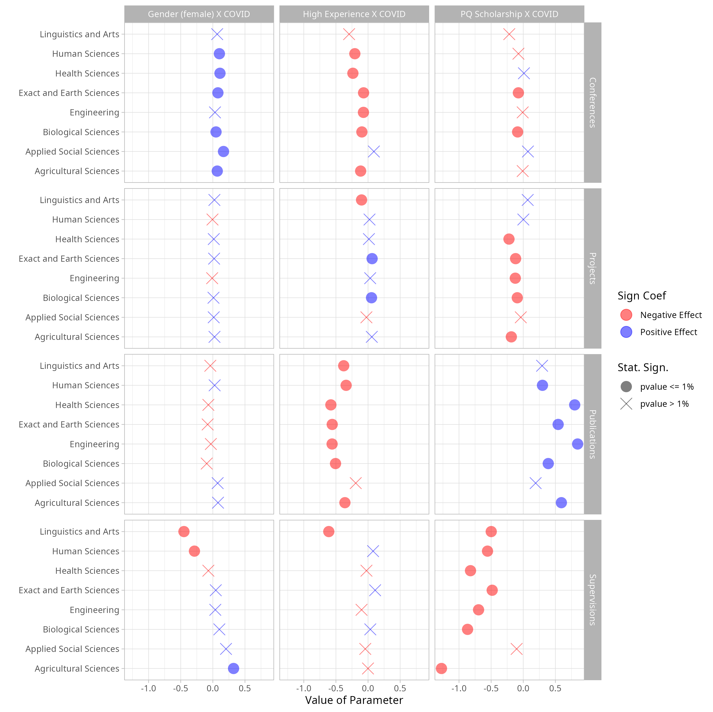
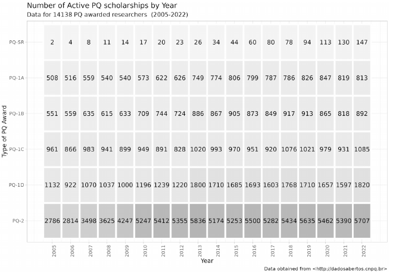
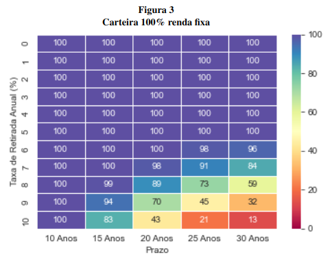
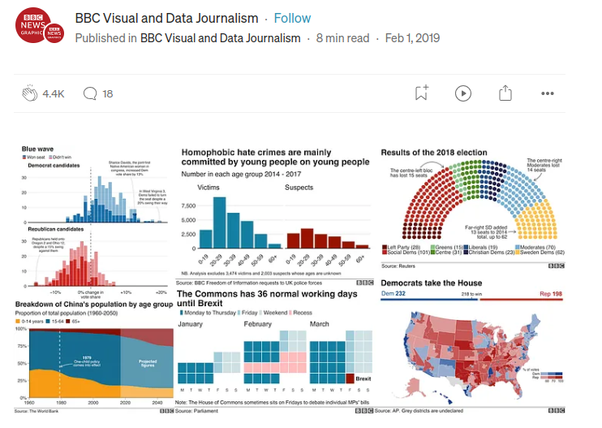

```{r}
#| echo: false
classtools::setup_quarto_slides('content')
```


# Objetivos de aprendizagem

## O que vamos aprender

Ao final desta aula, você será capaz de:

::: {.incremental}
- Explicar os princípios fundamentais de uma boa visualização de dados.
- Identificar erros comuns em gráficos e propor melhorias.
- Construir gráficos com o `ggplot2` a partir da lógica de camadas.
- Aplicar paletas de cores, temas e facetas.
- Exportar figuras para arquivos de imagem com o `ggsave()`.
:::


# Livro {background-image="figs/CAPA-VisualizacaoDadosR-EBOOK.jpg"  background-size="35%"  background-opacity=1 .unlisted}

## Introdução

> Visualização de dados é a arte de transformar medidas em padrões visuais. 

::: {.incremental}
- O objetivo é incrivelmente simples, **apresentar evidências de um evento ou causalidade do mundo real**. 
- Impressões visuais nunca foram tão importantes quanto hoje. Um gráfico apresentado em um relatório técnico ou trabalho acadêmico pode facilmente viralizar em plataformas como Instagram e Facebook. 
- Aprender a construir figuras impactantes é um diferencial no mercado de trabalho.
:::


## O Gráfico do Jeremy Siegel 

* "Investindo em Ações no Longo Prazo: O Guia Indispensável do Investidor do Mercado Financeiro" 

```{r capa-siegel, echo=FALSE, out.width = "75%"}

```

## O gráfico original

```{r siegel, echo=FALSE, out.width = "75%"}

```

## Alguns pontos

Nota-se os seguintes pontos e decisões dos autores:

::: {.incremental}
1) Todos os diferentes investimentos -- dólar, ações, dívida pública americana --- começam com um dólar. 

2) O melhor investimento, ações, possui uma linha mais forte no gráfico. 

3) A escala do eixo vertical é não-linear.

4) O valor final do investimento é apresentado numericamente na direita do gráfico.

5) A tabela no lado esquerdo superior do gráfico mostra o retorno anualizado de cada investimento
:::

# Exemplos Reais

## _The Academic Downturn: the Impact of COVID-19 in the Brazilian Academic Output_



## _The determinants and impact of research grants: The case of Brazilian productivity scholarships_



## _What is the sustainable withdraw rate for Brazil_?




# Princípios de Visualização de Dados {#principios}

## Introdução

> A razão principal da análise de dados é a comunicação de ideias. 

**Princípios de visualização**

::: {.incremental}

- **Independência do elemento gráfico**: Todas informações técnicas, como origem e período de dados, devem ser claramente indicadas no título, subtítulo ou legenda do gráfico.

- **Transmissão de informação**: Use cores, formas, tamanho e transparência para distinguir efeitos e adjetivos (bom/ruim, lucro/prejuízo) dentro dos dados.

- **Manipulação da atenção**: Use e abuse de formas visuais de chamar a atenção. **O melhor gráfico é aquele que não precisa ser explicado**.

- **Herança e reprodutibilidade**: Ao escrever um código de criação de figuras, busque que o mesmo seja facilmente reproduzível no futuro. 
:::

## Um exemplo: visualizando a inflação para o Brasil

```{r inflacao-ruim, echo=FALSE, fig.cap="Gráfico de exemplo para a inflação Brasileira"}
library(ggplot2)
library(dplyr)

# Usamos um arquivo de dados já exportado e versionado, garantindo que os
# slides compilem mesmo sem conexão com a internet. Para baixar os dados
# diretamente da fonte (BCB-SGS, série 433), use:
# df_inflation <- GetBCBData::gbcbd_get_series(433) |>
#   mutate(value = value/100) |>
#   janitor::clean_names()

df_inflation <- vdr::data_import("Chapter02-inflation-BR-2005-2022.csv")

df_1 <- df_inflation |>
  dplyr::filter(ref_date >= as.Date("2015-01-01"))

p_ugly <- ggplot(df_1, aes(x = ref_date, y = value)) +
  geom_col() + 
  labs(title = "Inflação")

p_ugly
```

::: {.incremental}
- Qual o objetivo do gráfico e porque está sendo apresentado? 
- O que os valores do eixo vertical representam exatamente? 
- De onde os dados saíram e como o gráfico pode ser replicado? 
- Mais importante, qual a mensagem transmitida? 
:::

## Uma versão melhorada

```{r inflacao-melhorado, echo=FALSE, fig.cap="Gráfico melhorado para a inflação Brasileira"}
library(stringr)
library(ggtext)
library(dplyr)

build_inflation_plot <- function(df) {
    
  first_month <- format(min(df$ref_date), '%d/%m/%Y')
  last_month <- format(max(df$ref_date), '%d/%m/%Y')
  
  color_max <- 'red'
  color_min <- 'blue'
  
  my_mean <- vdr::format_percent(mean(df$value))
  my_sd <-  vdr::format_percent(sd(df$value))

  df_points <- df |>
    slice(c(which.max(value), which.min(value)) ) |>
    mutate(name = c('max', 'min'))
  
  p <- ggplot(df, aes(x = ref_date, y = value, fill = value)) + 
    geom_col(alpha = 0.75) + #geom_line() + 
    geom_point(data = df_points, aes(color = name), size = 5) + 
    scale_color_manual(values = c(color_max, color_min)) + 
    colorspace::scale_fill_binned_diverging("blue-red", rev=FALSE, mid=mean(df$value )) +
    #scale_fill_grey(start = 0.8, end = 0.2)  + 
    labs(title = str_glue('<span style="font-size:16pt">A **Variabilidade** da Inflação (IPCA) </span>', 
                          '<span style="font-size:10pt">{first_month} - {last_month}</span>'),
         subtitle = str_glue('A média de inflação mensal é {my_mean}, com desvio padrão de {my_sd}', 
                             '<br>',
                             'A inflação mensal variou de um mínimo de ', 
                             '<span style="color:{color_min}"> {vdr::format_percent(min(df$value))} </span>',
                             ', até um máximo de ',
                             '<span style="color:{color_max}"> {vdr::format_percent(max(df$value))} </span>.'),
         x = '',
         y = 'Inflação Mensal',
         caption = str_glue('Dados para índice IPCA mensal amplo',
                            '<br>',
                            'Dados obtidos no BCB-SGS, série 433') ) + 
    scale_y_continuous(labels = scales::percent) + 
    theme_light() + 
    theme(
      axis.text.y = element_markdown(),
      plot.subtitle = element_markdown(),
      plot.caption = element_markdown(),
      plot.title = element_markdown(lineheight = 1.2),
      legend.position = 'none'
    )
  
  return(p)
}

p_pretty <- build_inflation_plot(df_1)

p_pretty
```

## Comparação Visual

```{r comparacao-lado-a-lado, echo=FALSE, fig.cap="Versão original (esquerda) e versão melhorada (direita)", fig.height=4, fig.width=11}
cowplot::plot_grid(
  p_ugly + labs(title = "Versão original"),
  p_pretty,
  nrow = 1
)
```

## Explicação

Comparando a primeira com a segunda versão, vemos as seguintes diferenças:

1) **Elementos textuais** -- o título e o subtítulo já indicam o que estamos analisando no gráfico e qual a mensagem. 

2) **Elementos gráficos** -- uso de cores para distinguir os períodos de alta inflação dos períodos de baixa, reforçando e salientando a variação da inflação entre os meses. 

3) **Reprodutibilidade**. Depois do código montado, uma mudança nos dados não exige mudança no código pois todos os elementos são baseados nos dados de entrada. 


## Erros comuns

::: {.incremental}
- Eixos truncados (começar o eixo _y_ longe do zero para exagerar diferenças).
- Dois eixos verticais com escalas diferentes no mesmo gráfico.
- Gráficos de pizza com muitas categorias.
- Excesso de cores, fontes e elementos decorativos (_chartjunk_).
- Falta de contexto: sem título, unidade ou fonte dos dados.
:::

Veja mais exemplos no [r/dataisugly](https://www.reddit.com/r/dataisugly/).


# Construindo gráficos com o ggplot2

## Introdução

O pacote `r vdr::format_pkg_citation("ggplot2")` é a principal ferramenta de visualização de dados do R.

* Criado por [Hadley Wickham](https://hadley.nz/) e [Winston Chang](https://www.rstudio.com/authors/winston-chang/), ambos cientistas de dados da empresa [**Posit**](https://www.rstudio.com/) (anteriormente chamada de RStudio). 

* Usado por diferentes mídias profissionais (BBC, NY Times, ..) para criar gráficos

* Utiliza uma abordagem voltada a sobreposição de camadas, a chamada "Gramática de Gráficos" (_Grammar of Graphics_)


## Exemplo BBC (_British Broadcast Corporation_)




## A anatomia de um gráfico `ggplot2`

Todo gráfico do `ggplot2` é montado pela combinação de poucos componentes:

- **dados** (`data`): o _dataframe_ de origem;
- **estéticas** (`aes`): o mapeamento de variáveis para canais visuais (`x`, `y`, cor, tamanho...);
- **geometrias** (`geom_*`): como os dados aparecem (linhas, pontos, barras...);
- **escalas** (`scale_*`): como os valores viram posições, cores e tamanhos;
- **facetas** (`facet_*`): a divisão em subgráficos;
- **temas** (`theme_*`): os elementos que não representam dados (fontes, fundos, bordas).

```{r, eval=FALSE}
ggplot(data = df, aes(x = ..., y = ...)) +
  geom_*() +
  scale_*() +
  facet_*() +
  theme_*()
```


## O sistema de camadas do `ggplot2`

- O módulo `r vdr::format_pkg_citation('ggplot2')` funciona a partir da sobreposição de camadas gráficas. 

A primeira camada do gráfico é dada pelo comando `r vdr::format_fct_ref("ggplot2", "ggplot")`:

```{r, layer-00, fig.cap="Canvas vazio criado com comando ggplot()"}
library(ggplot2)

name_file <- "Chapter02-PETR-stock-2015-2022.csv"
df_yf <- vdr::data_import(name_file)

p0 <- ggplot(
  data = df_yf,
  mapping = aes(x = ref_date, y = price_adjusted)
)

print(p0)
```

Com a primeira camada definida, usamos variáveis de datas do R na adição dos elementos textuais do gráfico com o comando `r vdr::format_fct_ref("ggplot2","labs")`: 

```{r, layer-01, fig.cap="Adição de camada de texto"}
min_year <- lubridate::year(min(df_yf$ref_date))
max_year <- lubridate::year(max(df_yf$ref_date))
today <- format(Sys.Date(), "%d/%m/%Y")

this_title <- stringr::str_glue(
  "Preços da Petrobrás ({min_year} - {max_year})"
)
this_subtitle <- "Preços ajustados a eventos corporativos"
this_caption <-  stringr::str_glue(
  "Dados obtidos do Yahoo Finance em {today}"
)

p1 <- p0 +
  labs(title = this_title,
       subtitle = this_subtitle,
       x = "Datas",
       y = "Preços",
       caption = this_caption
  )

print(p1)
```

Agora, adicionamos o miolo do gráfico -- componente gráfico -- como um canal de linha.

```{r petr-linha, fig.cap="Adição da camada de linha"}
p2 <- p1 +
  geom_line()

print(p2)
```

Adicionalmente, além da camada de linhas, podemos também inserir uma camada com **pontos** e mudar o tema do gráfico:

```{r, fig.cap="Adição de camada com pontos e tema suave/light"}
p3 <- p2 +
  geom_point() +
  theme_light()

print(p3)
```

O resultado das adições das camadas:

```{r layer-agg, echo=FALSE, fig.cap="Etapas de construção de uma figura com o ggplot2"}
plot_l <- list(p0, p1, p2, p3)

p <- cowplot::plot_grid(
  plotlist = plot_l,
  nrow = 2,
  ncol = 2,
  hjust = 0,
  labels = vdr::versions_string(length(plot_l))
  )

p
```

## Aplicação com dados reais

Primeiro, vamos carregar os dados financeiros de índices do mercado Brasileiro e internacional, e verificar o formato do _dataframe_:

```{r}
df_yf <- vdr::data_import(
  "Chapter03-bvsp-ftse-sp500-2015-2022.csv"
  )

glimpse(df_yf)
```

Em seguida, vamos criar a primeira camada do gráfico do `ggplot2` e adicionar a camada de linhas, definindo também que os tipos de linhas que devem ser diferentes para cada índice (`color = "ticker"`).

```{r aplic-ex01, fig.cap="Retorno acumulado para diferentes índices"}
p <- ggplot(
  data = df_yf,
  mapping = aes(
    x = ref_date,
    y = cumret_adjusted_prices,
    color = ticker
    )
  ) + 
  geom_line()

p
```

Alternativamente, poderíamos usar os tipos de linhas como diferenciador de índices:

```{r using-linetype, fig.cap="Exemplo de uso de linetype"}
p <- ggplot(
  data = df_yf,
  mapping = aes(
    x = ref_date,
    y = cumret_adjusted_prices,
    linetype = ticker
    )
  ) + 
  geom_line()

p
```


## Paletas de cores {#ggplot2-paletas}

* A melhor forma de lidar com cores no `r vdr::format_pkg_citation("ggplot2")` é através de uma paleta temática de cores pré-estabelecidas. 

* O grande benefício é poder, em uma linha de código, adicionar um efeito de cor que automaticamente se adapte aos dados.

### Tipos de paletas

**sequenciais**: paletas que indicam diferentes intensidades, podendo se utilizar de tom único ou múltiplo;

**divergentes**: paletas que realçam a diferença entre extremos dos dados, tal como máximo e mínimo;

**qualitativas**: paletas para diferenciar grupos nos dados.

## Paleta de cores do `r vdr::format_pkg_citation("colorspace")`

```{r colorspace-palettes, fig.cap="Paletas de cores disponíveis em colorspace"}
#| code-fold: true
colorspace::hcl_palettes(plot = TRUE)
```
## Aplicação de paleta qualitativa

```{r}
#| code-fold: true
p <- ggplot(
  data = df_yf,
  mapping = aes(
    x = ref_date,
    y = cumret_adjusted_prices,
    color = ticker
    )
  ) + 
  geom_line(linewidth = 2)
```

:::: {.columns}

::: {.column width="50%"}
Gráfico base

```{r}
#| code-fold: true
p
```

:::

::: {.column width="50%"}

Paleta qualitativa "Cold"
```{r}
#| code-fold: true
p + colorspace::scale_color_discrete_qualitative('Cold') 
```
:::

::::

## Exercício rápido

> Explore as paletas disponíveis com `colorspace::hcl_palettes(plot = TRUE)` e aplique ao gráfico de índices uma paleta **sequencial** diferente de `'Grays'`.

- Dica: use `colorspace::scale_color_continuous_sequential()`.

## Aplicação de paleta sequencial

```{r}
#| code-fold: true
p <- ggplot(
  data = df_yf,
  mapping = aes(
    x = ref_date,
    y = cumret_adjusted_prices,
    color = cumret_adjusted_prices,
    group = ticker
    )
  ) + 
  geom_line(linewidth = 2)
```

:::: {.columns}

::: {.column width="50%"}
Gráfico base

```{r}
#| code-fold: true
p
```

:::

::: {.column width="50%"}

Paleta sequencial "Grays"
```{r}
#| code-fold: true
p + colorspace::scale_color_continuous_sequential('Grays') 
```
:::

::::

## Acessibilidade e cores

- Cerca de **8% dos homens** têm algum grau de daltonismo.

- Nunca dependa **apenas** da cor para transmitir informação: combine com formas, tipos de linha ou rótulos.

- Prefira paletas seguras para daltonismo, como as da família `viridis` ou as geradas pelo `colorspace`.

```{r acessibilidade-paleta, fig.cap="Exemplo de paleta segura para daltonismo"}
#| code-fold: true
colorspace::demoplot(
  colorspace::sequential_hcl(5, "Viridis"),
  type = "heatmap"
)
```

## Temas {#temas}

> Temas do `r vdr::format_pkg_citation("ggplot2")` são nada mais que configurações pré-definidas que podem ser aplicadas a qualquer gráfico.

Os temas controlam tudo que for editável no gráfico, incluindo:

- tipo e tamanho das fontes do texto;
- cores de fundo;
- posição de títulos e subtítulos;
- uso de formatação das bordas da figura;

## Exemplo de aplicação

```{r}
#| echo: false
# Gráfico base simples, independente do último `p` definido anteriormente
p_tema <- ggplot(
  data = df_yf,
  mapping = aes(x = ref_date, y = cumret_adjusted_prices, color = ticker)
) +
  geom_line() +
  labs(title = "Desempenho de índices",
       x = "Datas",
       y = "Valor acumulado")
```

:::: {.columns}

::: {.column width="50%"}

Tema básico
```{r}
#| code-fold: true
p_tema
```


:::

::: {.column width="50%"}

Tema clássico
```{r}
#| code-fold: true
p_tema + theme_classic()
```
:::

::::


## Painéis e facetas 

> Facetas são subgráficos criados pela divisão dos dados em grupos

```{r}
#| code-fold: true
df_yf <- vdr::data_import(
  "Chapter04-stocks-by-country-2015-2022.csv"
)

p <- ggplot(df_yf, 
            aes(x = ref_date, 
                y = cumret_adjusted_prices, 
                color = ticker)) + 
geom_line() +
labs(title = "Desempenho de ações") +
theme_light() + 
facet_wrap(facets = "country", 
           nrow = 3)

p
```

## Facetas em grade (grids bidimensionais)

* Além de `facet_wrap()`, podemos dividir os dados em duas dimensões com `facet_grid()`.

```{r}
#| code-fold: true
df_yf_filtered <- df_yf |>
  mutate(year = lubridate::year(ref_date)) |>
  filter(year >= 2020)

p <- ggplot(df_yf_filtered, 
            aes(x = ref_date, 
                y = cumret_adjusted_prices, 
                color = ticker)) + 
  geom_line() +
  labs(title = "Desempenho de ações") +
  theme_light() + 
  facet_grid(rows = vars(country), 
             cols = vars(year))

p
```


## Exercício rápido

> Usando o _dataframe_ `df_yf_filtered`, crie um gráfico com `facet_wrap()` apenas para o ano de 2020 e compare o resultado com o de `facet_grid()`.


# Exportando figuras 

## Introdução

* Existem três formatos comumente utilizados
    - _png_ (_Portable Network Graphics_): compacto e equilibrado para qualidade 
    - _jpeg_ (_Joint Photographic Experts Group_): compacto e também equilibrado para qualidade 
    - _eps_ (_Encapsulated PostScript_): não-compacto e focado em qualidade 

* A sugestão é para focos em arquivos .png!

* Sugiro colocar o texto _fig_  no início do arquivo de figura, tal como em _fig-Ibovespa.png_.

* Controle o tamanho **físico** da figura com `width`, `height` e `units` (`"in"`, `"cm"`, `"mm"`).

* Controle a resolução com `dpi` (300 é um bom padrão para impressão).

* Para relatórios e artigos, prefira formatos vetoriais (_pdf_/_svg_), que não perdem qualidade ao serem ampliados.

No `r vdr::format_pkg_citation('ggplot2')`, salvamos figura com o comando `r vdr::format_fct_ref("ggplot2", "ggsave")`:

```{r}
#| code-fold: true
library(ggplot2)

p <- ggplot(data = iris, 
            mapping = aes(y = Species, 
                          x = Sepal.Length)) + 
  geom_point()

f_fig <- tempfile(pattern = "fig-example-", 
                  fileext = '.png')
                  
ggsave(filename = f_fig,
       plot = p, 
       width = 10,
       height = 10,
       units = "cm",
       dpi = 300)
```


# Resumo da aula

## O que vimos

::: {.incremental}
- Bons gráficos nascem de **princípios**: clareza, reprodutibilidade e foco na mensagem.
- O `ggplot2` constrói figuras por **camadas**: dados + estéticas + geometrias + escalas + facetas + temas.
- Paletas de cores e temas dão o acabamento profissional à figura.
- Facetas permitem comparar subgrupos dentro de um mesmo gráfico.
- `ggsave()` exporta a figura com controle de tamanho e resolução.
- Na **aula 08** veremos mapas e programação com o `ggplot2`.
:::


# Tarefa final de aula

## Tarefa 04 (visualização de dados -- parte 01)

> A numeração das tarefas é independente da numeração das aulas. O gabarito desta tarefa está no arquivo `quarto-tarefa-04.qmd`.

01 - O grupo [LatinoMetrics](https://latinometrics.substack.com/) produz e distribui um conteúdo muito interessante de visualização de dados econômicos para a América Latina. Observando o material do [Instagram](https://www.instagram.com/latinometrics/), visualize as seis últimas imagens disponibilizadas na página principal. Observando as figuras como um todo, destaque os elementos comuns na criação das imagens. Isto é, destaque os elementos visuais que foram repetidos entre uma figura e outra.

02 - No Reddit é possível encontrar o grupo [r/dataisugly](https://www.reddit.com/r/dataisugly/), o qual contém inúmeros posts sobre visualizações de dados realizadas da forma errada. Na data de 27/09/2022 foi publicada a seguinte [mensagem](https://www.reddit.com/r/dataisugly/comments/xphz87/polls_for_upcoming_s%C3%A3o_paulo_state_governor/) no fórum. Analise o gráfico e, sem buscar a resposta no fórum, indique qual o problema com o gráfico.

03 - Em 22/09/2022, o grupo [LatinoMetrics](https://latinometrics.substack.com/) publicou uma visualização de dados a respeito da impressão de confiança da população brasileira em relação às diferentes mídias jornalísticas. O conteúdo pode ser acessado no [Instagram](https://www.instagram.com/p/Ciz8mFSrZj7/). Observando a figura, destaque os elementos **textuais** e **gráficos** utilizados pelo autor.

04 - [Statspanda](https://www.instagram.com/statspanda/?hl=en) é outro grupo especializado em produção de conteúdo relacionado a visualização de dados, porém com assuntos muito mais abrangentes que o LatinoMetrics. Em 17/09/2022, o grupo publicou a seguinte figura no [Instagram](https://www.instagram.com/p/CaFZoVpO3gc/?hl=en). Neste caso, quais foram os elementos **gráficos** utilizados pelo autor e como os mesmos se associam a mensagem da figura.

05 - No [Reddit/dataisbeautiful](https://www.reddit.com/r/dataisbeautiful/comments/xoqi8w/revenue_and_budget_comparison_for_every_star_wars/)  é possível encontrar a visualização da receita de todos os filmes da franchise _Star Wars_. Apesar de ser esteticamente interessante, o mesmo poderia ser melhorado. Com base no que aprendeu neste capítulo do livro, analise o gráfico e faça recomendações para  sua melhoria buscando sempre maior claridade e simplicidade.

06 - Em um novo script do R, crie um vetor de valores aleatórios da distribuição Normal com o comando `rnorm(N)`, onde N é igual a 100. Agora, crie um gráfico de pontos onde o eixo _y_ é representado pela série anterior, e o eixo _x_ é simplesmente a contagem dos valores (1..100). Para este gráfico, utilize o _template_ básico do `ggplot2`, isto é, não precisas modificar nenhum elemento textual do gráfico, por enquanto.

07 - Para o gráfico anterior, adicione os seguintes elementos textuais e gráficos:

- título, subtítulo;
- _caption_ com a data e tempo de compilação do gráfico;
- textos nos eixos _x_ e _y_;
- aplique o tema `theme_light`

08 - Para o mesmo gráfico anterior, adicione uma nova coluna chamada `type` no dataframe, a qual pode tomar o valor "A" ou "B". Para isto, podes usar o comando `sample(c("A", "B"), size = N, replace = TRUE)`. Note que o valor de N foi definido anteriormente. Com base no novo dataframe, crie um gráfico de linhas com cores diferentes para cada valor em `type`.

09 - Para o mesmo gráfico anterior, adicione uma camada de linhas no gráfico.

10 - Com base na função `yfR::yf_collection_get`, baixe os dados de preços de ações para a composição atual do índice Ibovespa, com início a cinco anos atrás e término como sendo a data atual. Com base nos dados importados, siga os seguintes passos:

- filtre os dados para manter apenas as 5 ações com maior rentabilidade acumulada no período, e as 5 com menor.
- construa uma figura com os retornos acumulados das 10 ações selecionadas anteriormente, onde o eixo horizontal representa as datas.
- Implemente as seguintes modificações no gráfico:
    - Adicione título, subtítulo e caption e também o texto dos eixos horizontal e vertical;
    - modifique a escala do eixo vertical para percentagens com o comando `scale_y_continuous(labels = scales::percent)`;
    - use o tema `theme_light`;
- exporte a figura resultante para um arquivo de 10 cm (height) x 15 cm (width) chamado "fig-ibov-10-ações.png", localizado na pasta padrão "Documentos" (atalho com `~`).


# Referências {.unlisted}