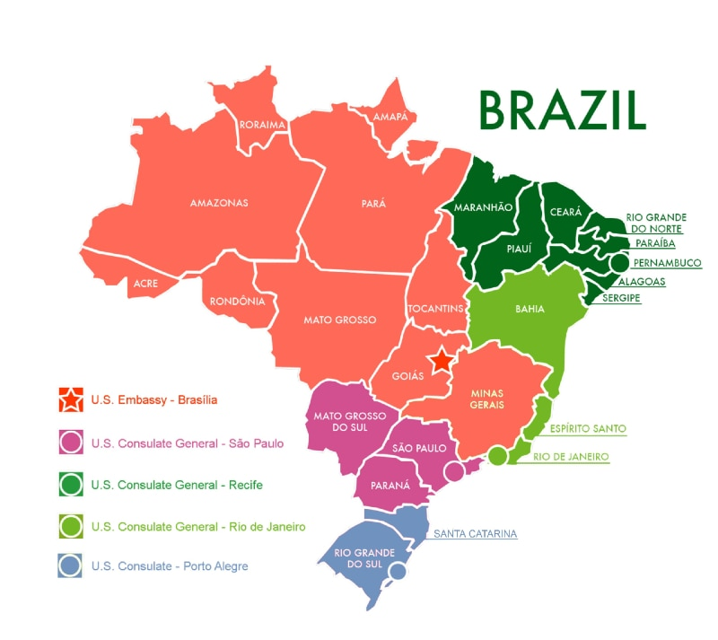

```{r}
#| echo: false
classtools::setup_quarto_slides('content')

gmaps_key <- readr::read_lines("~/GDrive/98-pass-and-bash/.gmaps_api_key.txt")

Sys.setenv("google_api" = gmaps_key)
```


# Mapas com o R

## Introdução

> a representação de dados em mapas é uma das técnicas de visualização de dados mais utilizadas pela mídia jornalística;

-   a abordagem de camadas é intuitiva (uma camada para a representação visual da área geográfica, e outra para os pontos e preenchimentos)

-   R oferece um ecossistema de pacotes baseados no `ggplot2` que facilitam a construção de mapas


## Exemplo de mapa

```{r}
#| echo: false
#| fig-cap: "Localização de consulados e embaixadas americanas no Brasil"

```

## Pacote `r vdr::format_pkg_citation("geobr")`

-   arquivos de dados geográficos contendo o território nacional são disponibilizados no site do [IBGE](https://www.ibge.gov.br/).

-   O pacote `geobr` [@R-geobr] [(IPEA)](https://www.ipea.gov.br/portal/) é uma API para acesso aos dados do IBGE.


## O formato SF (_simple features_)

-   O formato *SF* foi criado pela [*Open Geospatial Consortium*](https://www.ogc.org/) e é eficiente para a representação de mapas geográficos.

-   No R, um mapa SF é um `tibble` com uma coluna especial de **geometria**, que guarda os polígonos (áreas) ou pontos junto com os metadados.

-   O `ggplot2` desenha esses objetos com a camada `geom_sf()`.


## Exemplo `geobr` (1)

```{r}
#| code-fold: true
#| echo: true
#| code-line-numbers: "4-7"
library(dplyr)

data_year <- 2019
br <- geobr::read_country(
  year = data_year, 
  showProgress = FALSE
)

dplyr::glimpse(br)
```

## Exemplo `geobr` (2)

```{r}
#| label: br
#| fig-cap: "Mapa do Brasil"
#| code-fold: true
#| code-line-numbers: "4"
library(ggplot2)

p0 <- ggplot(data = br) + 
  geom_sf() + 
  theme_light()

p0
```

## Exemplo `geobr` -- cidades e capitais

```{r}
#| label: br2
#| fig-cap: "Mapa de cidades e capitais do Brasil"
#| code-fold: true
#| code-line-numbers: "6-10"
df_cities <- vdr::data_import(
  "Chapter07-latlong-cities-brazil.csv"
)

p1 <- p0 + 
  geom_point(data = df_cities,
             mapping = aes(y = latitude, x = longitude),
             size = 0.05, 
             color = "blue",
             alpha = 0.35) + 
  geom_point(data = df_cities |> filter(capital == TRUE),
             mapping = aes(y = latitude, x = longitude),
             size = 1.5,
             color = 'red') +           
  labs(title = "Cidades do Brasil",
       subtitle = "Capitais dos estados em vermelho",
       caption = "Dados do IBGE (2019)")

p1
```


## Exemplo `geobr` -- Rendimento mensal domiciliar


```{r}
#| label: map-ibge
#| code-fold: true

df_ibge <- vdr::data_import(
  "Chapter07-data-ibge.csv"
)

data_year <- 2010
states <- geobr::read_state(code_state = "all", 
                            year = data_year, 
                            showProgress = FALSE) |>
  left_join(df_ibge, by = c("code_state" = "codigo"))

p <- ggplot(data = states, 
            aes(fill = rendimento_mensal_domiciliar)) + 
  geom_sf() + 
  theme_light() + 
  labs(fill = "Rend. Mensal",
       title = "Renda Mensal Domiciliar por Estado",
       caption = "Dados do IBGE (2010)") + 
  colorspace::scale_fill_binned_diverging(
    "Blue-Red", 
    mid = median(states$rendimento_mensal_domiciliar))

p
```


## Pacote `r vdr::format_pkg_citation("ggmap")`

- API online para a importação de mapas do [Google Maps](https://www.google.com.br/maps?hl=pt-BR&tab=wl) e [Stamen Maps](http://maps.stamen.com/). 

- Disponibiliza mapas atualizados do mundo inteiro!

. . .

- **Google maps exige registro de projeto e cartão de crédito!**


## Registrando um projeto no Google

1)  Registre-se no Google através de um email. Caso já tenha uma conta, pule esse passo e faça o login no *browser* de preferência.

2)  Acesse o site <https://console.cloud.google.com/> e clique em "New Project", definindo o nome do projeto e a localização.

3)  Ative o serviço de "Google Maps" para o projeto criado anteriormente. 

4) Recolha a chave na seção "Credentials"


## Usando o API

```{r, eval=FALSE}
library(ggmap)

google_key <- "YOUR_KEY_HERE"

register_google(
  key = google_key, 
  account_type = 'standard'
)
```

```{r, echo=FALSE}
google_key <- Sys.getenv("google_api")

if (google_key == "") stop("Não encontrei a chave do Google Maps (variável de ambiente 'google_api').")

ggmap::register_google(
  key = google_key
)
```

Após o registro da chave, teste a chamada ao API com um comando simples:

```{r}
ggmap::geocode("Porto Alegre RS")
```


## Utilizando `ggmap`

```{r}
#| label: floripa1
#| code-fold: true
#| fig-cap: "Exemplo de mapa para o estado de Santa Catarina"
sc <- ggmap::get_map(
  "state of santa catarina, brazil", 
  maptype = "terrain",
  zoom = 7)

p_sc <- ggmap::ggmap(sc) + 
  labs(
    title = "Estado de Santa Catarina",
    caption = "Dados do Google Maps"
  )

p_sc
```


## Codificação geográfica

- codificação geográfica é a busca de latitude e longitude a partir de um texto (_string_)

```{r}
ea_ufrgs <- ggmap::geocode("Escola de Administração UFRGS")

ea_ufrgs
```

---

Com a latitude e longitude do local em mãos, fica fácil de mostrar no mapa o ponto de interesse:

```{r}
#| label: ea-ufrgs
#| code-fold: true
poa <- ggmap::get_map("Escola de Administração UFRGS", 
                      zoom = 15)

p_ea <- ggmap::ggmap(poa) + 
  labs(
    title = "Cidade de Porto Alegre", 
    subtitle = "Localização Escola de Adm., UFRGS",
    caption = "Dados do Google Maps") + 
  geom_point(data = ea_ufrgs, 
             aes(x = lon, 
                 y = lat),
             size = 5,
             color = "red") + 
  geom_text(data = ea_ufrgs,
            aes(x = lon,
                y = lat, 
                label = "EA-UFRGS"),
            nudge_y = 0.00075,
            color = "blue")

p_ea
```


# Programando com o `ggplot2`

## Programação com o `ggplot2`

> A plataforma R fornece um ambiente computacional completo para automatizar qualquer tarefa de visualização de dados. 

. . .

Aqui aprenderemos:

- Criação e exportação de figuras via funções;
- Teste de temas para figuras;

## Criando figuras via funções

- A saída de `r vdr::format_fct_ref("ggplot2", "ggplot")` é um objeto do R como qualquer outro

- Podemos manipular esse objeto facilmente!

- Imagine o seguinte problema:
    - precisa criar um gráfico do preço do índice SP500 para anos diferentes, onde cada ano terá um gráfico individual, salvo em arquivo separado. 

```{r}
#| echo: false
library(ggplot2)
library(dplyr)
```

## Solução

1) criar função com parâmetros de interesse

2) aplicar função a anos diferentes

```{r}
plot_year <- function(this_year, df_yf) {
  
  df_year <- df_yf |>
    filter(
      lubridate::year(ref_date) == this_year
    )
  
  p <- ggplot(df_year, 
              aes(x = ref_date, 
                  y = price_adjusted)) +
    geom_line() + 
    labs(x = "Ano",
         y = "SP500",
         title = paste0("SP500 no ano de ", this_year),
         caption = "Dados do Yahoo Finance"
    ) + 
    theme_light()
  
  return(p)
}
```

---

Para testar a função, vamos importar os dados do SP500 e criar o gráfico para o ano de 2020:

```{r sp500-2020, fig.cap = "SP500 para o ano 2020"}
df_yf <- vdr::data_import(
  "Chapter04-sp500-1950-2022.csv"
)

p <- plot_year(2020, df_yf)

p
```


--- 

Aplicando a um vetor de anos:

```{r}
years_to_plot <- 2000:2020

l_p <- purrr::map(
  .x = years_to_plot, 
  .f = plot_year,
  df_yf = df_yf
)
```

O primeiro elemento de `l_p` é o gráfico para o ano de 2000:

```{r sp500-2000, fig.cap = "SP500 para o ano 2000"}
#| output-location: column
l_p[[1]]
```


## Iterando com `purrr` (vs. `for`)

- `purrr::map()` aplica uma função a cada elemento de um vetor e devolve uma **lista** com os resultados.

- É equivalente a um laço `for`, porém mais conciso e sem a necessidade de "pré-alocar" a lista:

```{r, eval=FALSE}
# equivalente usando for
l_p <- vector("list", length(years_to_plot))

for (i in seq_along(years_to_plot)) {
  l_p[[i]] <- plot_year(years_to_plot[i], df_yf)
}
```


---

Agora que temos 1) a função que cria o gráfico por ano e 2) um conjunto de anos, podemos melhorar o código adicionando o processo de exportação das figuras.

```{r}
plot_year_and_export <- function(this_year, 
                                 df_yf, 
                                 path_to_save = "figs") {
  
  p <- plot_year(this_year, df_yf)
  
  fs::dir_create(path_to_save)
  
  file_to_save <- fs::path(
    path_to_save,
    paste0("SP500_", this_year, ".png")
  )
  
  ggsave(file_to_save, p,
         width = 10, height = 6, dpi = 300)
  
  return(p)
  
}
```

---

Aplicando a função:

```{r}
years_to_plot <- 2015:2022
dir_out <- fs::path_temp('sp500-by-year')

l_p <- purrr::map(
  .x = years_to_plot, 
  .f = plot_year_and_export,
  path_to_save = dir_out,
  df_yf = df_yf
)

basename(fs::dir_ls(dir_out))
```


## Resultado

```{r grid-by-year, echo = FALSE, fig.cap="Figuras com o índice SP500 por ano", fig.height=12, fig.width=10}
cowplot::plot_grid(plotlist = l_p, nrow = 4)
```


## Testando temas

Como sabemos, módulo `r vdr::format_pkg_citation("ggplot2")` e `r vdr::format_pkg_citation("ggthemes")` oferecem diversos temas incluindo:

- `r vdr::format_fct_ref("ggplot2", "theme_bw")`
- `r vdr::format_fct_ref("ggplot2", "theme_grey")`
- `r vdr::format_fct_ref("ggthemes", "theme_excel")`
- `r vdr::format_fct_ref("ggthemes", "theme_economist")`

---

Primeiro criamos a função com tema:

```{r}
plot_with_theme <- function(this_theme_fct, p) {
  
  p <- p + this_theme_fct()
  
  return(p)
}
```

--- 

E agora testamos para o mesmo gráfico de preços e a função de tema `r vdr::format_fct_ref("ggthemes", "theme_economist")`:

```{r}
#| output-location: column
p <- ggplot(df_yf, 
            aes(x = ref_date, 
                y = price_adjusted)) + 
  geom_line() + 
  labs(x = 'Tempo',
       y = "Valor (escala log10)",
       title = "SP500 (1950 - 2022)") + 
  scale_y_continuous(trans='log10')


p <- plot_with_theme(ggthemes::theme_economist, p)

p
```

---

Agora, vamos criar uma nova função que irá exportar o resultado em arquivos no formato png.

Note que passamos a **própria função de tema** (e não o seu nome como _string_): assim evitamos `eval(parse())` e deixamos o código mais seguro e idiomático.

```{r}
plot_with_theme_and_export <- function(this_theme_fct, 
                                       theme_label, 
                                       p, 
                                       path_to_save) {
  
  p <- plot_with_theme(this_theme_fct, p) 
  
  fs::dir_create(path_to_save)
  
  p <- p + 
    labs(subtitle = paste0("Tema = ", theme_label))
  
  file_to_save <- fs::path(
    path_to_save,
    paste0("SP500-1950-2022_", 
            stringr::str_replace_all(theme_label, 
                                     '::', '_' ),
            ".png")
  )
  
  ggsave(file_to_save, p,
         width = 10, height = 6, dpi = 300)
  
  return(p)
  
}
```

--- 

Aplicação da função:

```{r}
themes <- list(
  "ggplot2::theme_light"      = ggplot2::theme_light,
  "ggplot2::theme_grey"       = ggplot2::theme_grey,
  "ggthemes::theme_excel"     = ggthemes::theme_excel,
  "ggthemes::theme_economist" = ggthemes::theme_economist
)

dir_out <- fs::path_temp("testing-themes")

l_p <- purrr::imap(
  .x = themes,
  .f = function(fct, nm) plot_with_theme_and_export(
    this_theme_fct = fct,
    theme_label = nm,
    p = p,
    path_to_save = dir_out
  )
)

basename(fs::dir_ls(dir_out))
```

---

### Resultado

```{r grid-by-theme, echo=FALSE, fig.cap="Figuras com o índice SP500 por tema de gráfico"}
cowplot::plot_grid(plotlist = l_p, nrow = 4)
```


# Resumo da aula

## O que vimos

::: {.incremental}
- Mapas no R com `geobr` (dados oficiais do IBGE) e `ggmap` (mapas do Google).
- Objetos no formato *SF* são desenhados com a camada `geom_sf()`.
- Figuras do `ggplot2` são objetos: podem ser guardadas em listas e manipuladas.
- `purrr::map()` e `purrr::imap()` aplicam funções a vários elementos e automatizam a produção de figuras.
- Funções com parâmetros permitem testar temas e exportar várias figuras de uma vez.
:::


# Referências {.unlisted}