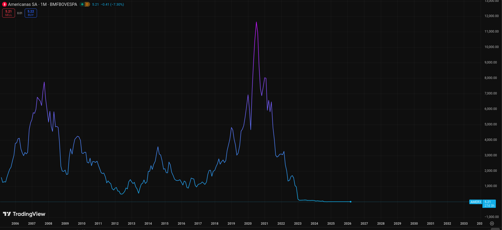
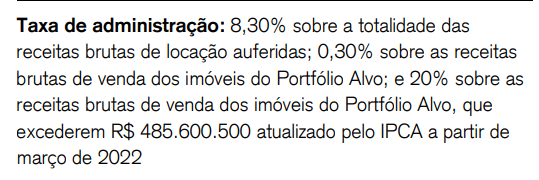
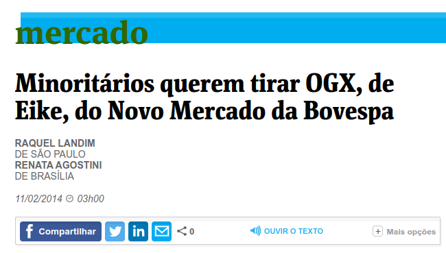
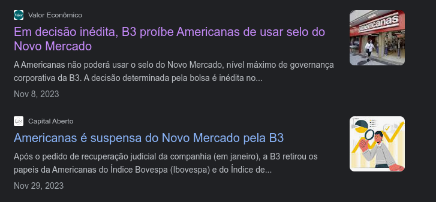

```{r}
classtools::setup_quarto_slides("resources")
```

# Formas de Organização de Negócios no **Brasil**

## Tipos

- MEI (microempreendedor individual)
- Sociedade limitada unipessoal, SLU --  **Antiga EIRELI**
- Sociedade limitada
- Companhia aberta


## MEI - Microempreendedor individual	

- Baixa burocracia
- Faturamento máximo de R$ 81 mil ao ano
- **O proprietário não pode participar de outra empresa como sócio**
- **Somente permitido a contratação de 1 (um) empregado (!)**
- **o patrimônio do sócio e da empresa se confundem, isto é, os bens do proprietário e os do seu negócio são considerados uma coisa só perante a lei.**


## ~~Empresa Individual (EIRELI, pré 2021)~~

```{r}
id <- 1619

df_sal <- GetBCBData::gbcbd_get_series(id)

latest_sal <- df_sal$value[which.max(df_sal$ref.date)]
```

> EIRELI: Empresa Individual de Responsabilidade Limitada

- fácil de criar, com menor regulamentação em relação às demais
- Um único dono e exclusivo: uma empresa individual por pessoa/CPF
- Valor **mínimo** capitalizado pelo dono: 100 vezes o maior salário mínimo (`r classtools::format_cash(latest_sal)`*100=`r classtools::format_cash(latest_sal*100)`)
- Vantagem: O dono leva todo o lucro, patrimônio da empresa separado do patrimônio pessoal do dono
- Desvantagens: valor mínimo a ser capitalizado, vida limitada da empresa (dono morreu, acabou a empresa), dificuldade de transferência de propriedade (só pode ir para outra pessoa)
- **Substituída pela SLU (sociedade limitada unipessoal) em 2021**


## Sociedade Limitada Unipessoal (SLU)

- Substituiu a EIRELI em 2021
- Sociedade de apenas uma pessoa (não precisa de outros sócios)
- **Bens do proprietário são separados dos bens da empresa**
- Não precisa de capital mínimo
- Permite a abertura de mais de uma empresa neste formato pelo mesmo empreendedor


## Sociedade Empresária Limitada (LTDA)

- Empresa **coletiva**, com mais de um sócio
- Lucro é dividido entre os sócios, de acordo com contrato de sociedade
- **Dívidas da empresa são separadas do patrimônio pessoal dos sócios**
- Mais fácil de levantar capital para crescimento


## Companhia Aberta (ou anônima)

- Forma mais **eficiente** de organização, onde a empresa (pessoa jurídica) se separa e é distinta dos seus proprietários 
- A parcela mínima do capital social é negociada abertamente, na bolsa de valores
- Benefícios: 
  - Transparência para controladores/acionistas (demonstrativos financeiros são auditados e atos de gestão são públicos)
  - Facilidade de transferência de propriedade (negociação de cotas da empresa no mercado)
  - Maior facilidade de financiamento (a empresa pode vender suas próprias ações, transparência de demonstrativos financeiros facilitam o uso de empréstimo por parte da empresa)


# O problema de Agência

## Definição

> O problema de agência surge quando uma pessoa ou entidade, chamada de **principal**, contrata outra pessoa ou entidade, chamada de **agente**, para realizar certas tarefas ou tomar decisões em seu nome. O cerne desse problema é que os interesses do principal e do agente podem não estar alinhados, levando a um conflito de interesses. **O conflito surge devido a assimetria de informações entre o agente e o principal**

### Exemplos:

::: {.incremental} 
  - Venda de um carro através de um agente, com pagamento de comissão fixa (e.g. 200 R$)
  - Indústria de fundos ativos, com pagamento de comissão fixa e variável (performance)
  - Benefícios pecuniários por parte de gestores (extravagâncias materiais em nome da empresa)
  - Políticos com interesses divergentes do bem estar da população
:::

# Caso Americanas (2023) {background-image="figs/Lojas-Americanas.png"}

## Introdução

> O caso das Americanas é a maior fraude do mercado brasileiro, envolvendo valores perto de R$ 43 bilhões.

::: {.incremental}
- ocultação de dívidas através de uma operação chamada "risco sacado" (fornecedores)

- Houve conivência da diretoria, falha crítica dos comitês de auditoria e das empresas de auditoria externa (PwC).

- Consequências: Ações da Americanas caíram mais de 90% em janeiro de 2023, resultando em bilhões de reais em perdas para investidores e credores.
:::

## Mecânica da fraude

::: {.incremental}
- A fraude girava em torno de uma operação comum no varejo chamada risco sacado (ou forfaiting).
  - A Americanas compra produtos de um fornecedor (ex: Samsung) e, em vez de pagar a Samsung em 90 dias, um banco antecipa o dinheiro para a Samsung e a Americanas passa a dever ao banco, pagando juros por esse prazo estendido.

- Tecnicamente, quando o banco entra na jogada, a dívida deixa de ser com o "fornecedor" e passa a ser uma dívida bancária. Como tal, ela deveria gerar despesas de juros e aparecer no passivo financeiro, aumentando o endividamento da empresa.
:::

## A Fraude Contábil

- A diretoria da Americanas não registrava essas operações como dívidas bancárias. Eles mantinham os valores na conta de "Fornecedores".

- Adicionalmente, a empresa utilizava uma conta chamada VPC (Verba de Propaganda Cooperada) para inflar o lucro
  - Eles criavam contratos fictícios de publicidade com fornecedores para gerar "créditos" artificiais que abatiam o custo das mercadorias vendidas.

- O resultado prático: O balanço mostrava uma empresa lucrativa e com dívida controlada, enquanto, na realidade, ela estava queimando caixa e acumulando um passivo bilionário oculto.

## O preço das ações




# Caso HGPO11 (Patria Prime Offices, antigo CSHG Prime Offices)

## Sobre o fundo

> HGPO11 é um fundo imobiliário de lajes corporativas com gestão passiva, negociado em bolsa, composto por dois prédios classe AAA em São Paulo

- ótimos imóveis, em ótimas localizações, provendo grande retorno ao investidor no longo prazo (~800% desde IPO em 2010, ~18,5% ao ano)
- desde 2022 vem recebendo propostas de venda:
  - 2022: processo de venda iniciada pela gestão, mas sem interessados
  - 2022: proposta firme de R$ 466,4 milhões (RECUSADA pelos acionistas em assembléia)
  - 2024: [proposta](https://api.mziq.com/mzfilemanager/v2/d/f3b73764-b9be-45fc-aea8-14d8157df389/bb34d2d0-996c-1721-6eb1-783c127375c4?origin=1) de R$ 587,3 Milhões. (**ACEITA** em Julho 2024)
  

## Como o gestor do HGPO11 ganha $??

```{r}

```

Fonte: [relatório gerencial](https://fnet.bmfbovespa.com.br/fnet/publico/exibirDocumento?id=618081&cvm=true)


# Caso WeWork

## Introdução

- Empresa de coworking (aluguel de espaços de trabalhos)
- Startup unicórnio, avaliada privativamente em $47 bilhões, com aporte de fundo japonês SoftBank
- Apesar da avaliação bilionária, a operação deixa a desejar em [lucratividade](https://www.investing.com/equities/wework-income-statement)
- Em Agosto 2024, deu [calote](https://www.nordinvestimentos.com.br/blog/calote-wework-fiis/) em diversos fundos imobiliários no Brasil (RCRB11, VINO11)


## Caso Wework

:::: {.columns}

::: {.column width="60%"}
- WeWork pagava seu CEO, Adam Neumann, próximo de $6M ao ano pela direito de exploração da palavra  "we,", utilizada em uma de suas empresas passadas (depois de muito criticismo, Neumann pagou o dinheiro de volta);
- Neumann comprava imóveis no seu nome pessoal e alugava os mesmos para a wework, onde era CEO;
- O avião da empresa foi indiciado em Israel por encontro de marijuana em caixa de cereal
- Em 24/09/2019, Neumann foi removido como CEO, com um _golden parachute_ avaliado em $1.7 bilhões de dólares.
:::

::: {.column width="40%"}
```{r}
#| fig-cap: "CEO Adam Deumann"
knitr::include_graphics("https://s2-g1.glbimg.com/RO5ZReDGibALWiH1qIT-0eT8-n0=/0x0:624x351/984x0/smart/filters:strip_icc()/i.s3.glbimg.com/v1/AUTH_59edd422c0c84a879bd37670ae4f538a/internal_photos/bs/2022/S/M/UQtPlQTD2m5zLdvGJdcQ/adam1.jpg")
```

:::

::::

## Wework - Youtube




# Caso FTX

## Introdução

:::: {.columns}

::: {.column width="60%"}
- FTX era uma bolsa eletrônica de criptomoedas
- mais de 1 Bi USD em faturamento anual
- Era o exemplo de governança no mundo das criptomoedas
- CEO era visto como um **nerd do bem**
- Investimento da blackrock, e outras empresas tradicionais de investimento em startups
:::

::: {.column width="40%"}
```{r}
#| fig-cap: "CEO Sam Bankman-Fried"

```

:::

::::

## O que deu errado?

> Gestão era "criativa" com o dinheiro depositado pelos clientes
  
::: {.incremental}
- Dinheiro dos depositários da FTX era enviado para uma empresa de investimento (Alameda Research).
- A alameda research usava o recurso para apostar em altas e baixas de criptomoedas, com acesso ao volume de ordens de compra e venda da outra empresa, a FTX
- Uma das criptomoedas transacionada era a própria FTX token, emitida pela FTX
:::


## Curiosidades

::: {.incremental}
- Pai do Sam Bankman-Fried era professor titular de Governança Corporativa e _Compliance_ em Harvard
- A equipe de diretoras da FTX morava nas bahamas, em um relacionamento poliamoroso
- Uso de anfetamina incentivado em vídeos 
- Aparente compras de imóveis para familiares, com recursos financeiros da empresa
- Gisele Bunchem e seu ex-marido investiram em torno de 48M USD
:::

## Outros casos notáveis
- [Theranos](https://www.youtube.com/watch?v=3CccfnRpPtM)
- [Ignite/Dan Balzerian](https://www.youtube.com/watch?v=SuRUfOZ3rT0)

# Implicações do problema de agência

## Custo de Agência

> O custo de agência é aquele custo relacionado à minimização do problema de agência

::: {.incremental}
- Controle burocrático -- _paper trail_
- Criação de órgãos internos fiscalizadores e independentes 
- Contratação de auditores externos 
- Mecanismos de remuneração que diminuem o problema de agência
:::

## Sarbanes-Oxley (SOX)

- A Sarbanes-Oxley (2004) é a lei americana que cria mecanismos de auditoria e segurança nas empresas, aumentando a transparência perante o investidor
- Motivação: escândalos financeiros da Enron, WorldCom, Tyco
- A Sarbanes-Oxley criou custos para as empresas e empresas pequenas saíram da bolsa tradicional
- Empresas Brasileira com ADR devem se conformar ao SOX


## O Novo Mercado e seus níveis diferenciados.

- Com o intuito de atrair novos investidores, a bovespa criou em 2000 níveis diferenciados de governança corporativa:
  1. Novo Mercado
  2. Nível 2
  3. Nível 1
  4. Bovespa Mais 
- Este níveis asseguram maiores seguranças aos acionistas das empresas, definindo regras rígidas para o alistamento das ações

## Regras do Novo Mercado
- O capital deve ser composto apenas por ações ordinárias com votos (e não preferenciais) 
- Direito ao mecanismo _tag along_
- **No caso de de-listagem do Novo Mercado, a empresa deve fazer oferta pública para recomprar ações dos acionistas**
- A divulgação de dados financeiros deve ser trimestral, revisado por auditor independente
- A empresa deve divulgar operações executadas por diretores, executivos e acionistas controladores mensalmente

## OGX e o Novo Mercado

```{r}
#| fig-cap: "[Notícia da Folha de São Paulo](http://www1.folha.uol.com.br/mercado/2014/02/1410329-minoritarios-querem-tirar-ogx-de-eike-do-novo-mercado-da-bovespa.shtml)"


```

## Caso Americanas

```{r}
#| fig-cap: "[Notícia do Valor Econômico](https://valor.globo.com/financas/noticia/2023/11/08/em-deciso-indita-b3-determina-que-americanas-no-poder-usar-selo-do-novo-mercado.ghtml)"


```

# Lições sobre governança corporativa

## Algumas lições

::: {.incremental}
- **Lições para investimentos**
  - Nada é garantido: em algum ponto do tempo, algum investimento "sólido" vai lhe decepcionar;
  - confie na gestão, mas verifique se os incentivos estão alinhados e se a história é confirmada com fatos e números;
  - se está difícil de estudar ou confiar, você sempre tem a opção de não investir;
- **Lições para a vida**
  - contratos e acordos entre pessoas e empresas funcionam a medida que seja bom para ambos os lados;
  - o tempo é um grande sinal da qualidade de um contrato ou acordo.
:::

## Referências {-}