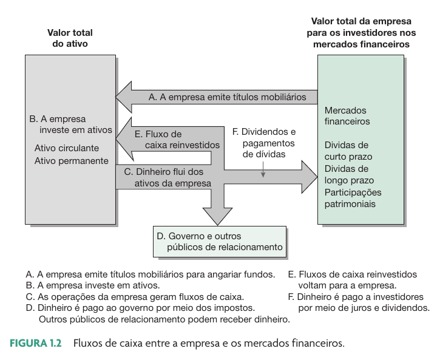
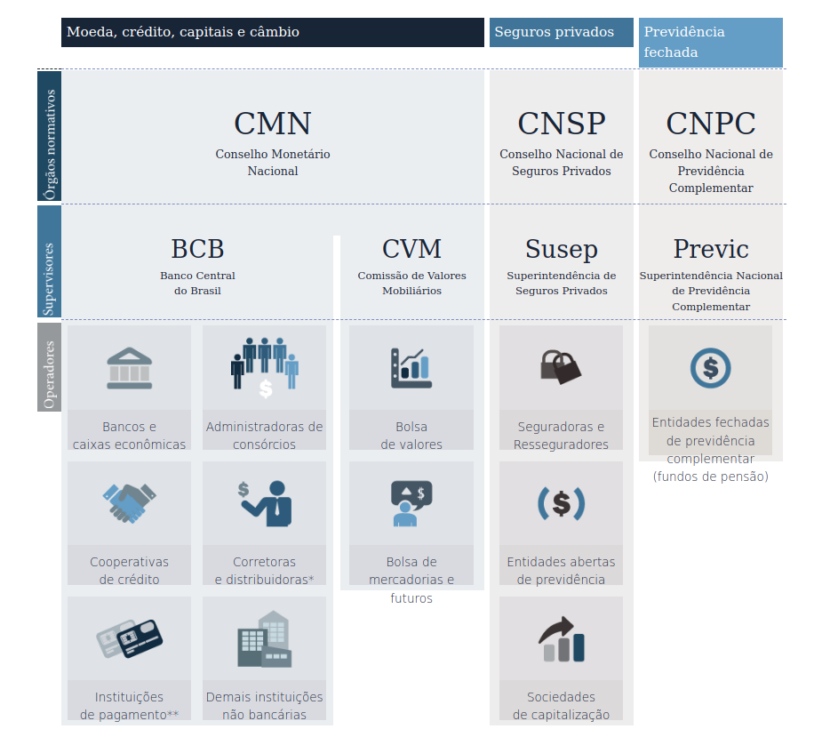

```{r}
classtools::setup_quarto_slides("resources")
```

# Introdução a Mercados Financeiros

## O que é um mercado financeiro?

> O mercado financeiro é onde poupadores encontram tomadores para uma troca de fluxo de caixa no tempo

::: {.incremental}
- Mercado relativo a compra e venda de valores mobiliários (contratos financeiros de troca de fluxos de caixa)

- Funções:
  - Viabilizar a transferência de recursos produtivos (poupador -> deficitário)
  - Possibilitar a transferência de riscos via o desenho de contratos financeiros (mercado de derivativos)

- Existência de um forte mercado financeiro é requisito para o **desenvolvimento econômico** de um país
:::


## As Origens Antigas

As primeiras formas de crédito e dívida surgiram na **Mesopotâmia** por volta de 3.000 a.C.

:::{.incremental}
-   Contratos de empréstimos de grãos e prata eram registrados em [tábuas de argila](https://www.bbc.com/portuguese/geral-40245708).
-   O **Código de Hamurabi** (c. 1754 a.C.) já estabelecia leis para regular taxas de juros e pagamentos.
-   Na Grécia e em Roma, os primeiros "banqueiros" (cambistas) realizavam empréstimos e trocas de moedas.
:::

## {background-image="figs/hammurabi-code.webp"}

<div style="position: absolute; bottom: 0px; left: 15px; color: white; size: 10cm">
  <p>Código de Hamurabi (1754 A.C.)</p>
</div>


## A Semente do Capitalismo Moderno

Durante a Idade Média e o Renascimento, a Itália se tornou o berço do sistema bancário moderno.

-   Os primeiros **bancos** foram fundados em cidades como **Veneza e Gênova** para financiar o comércio marítimo.
-   A **letra de câmbio** foi criada, permitindo que comerciantes realizassem pagamentos em longas distâncias sem transportar moedas fisicamente.
-   Famílias poderosas, como os **Medici em Florença**, criaram redes bancárias por toda a Europa.


## O Nascimento das Bolsas de Valores

O conceito de empresa de capital aberto e bolsa de valores nasceu no século XVII.

-   A **Companhia Holandesa das Índias Orientais (VOC)**, fundada em 1602, foi a primeira empresa a emitir ações para o público geral, permitindo que qualquer pessoa se tornasse sócia.
-   Para negociar essas ações, a **Bolsa de Valores de Amsterdã** foi criada no mesmo ano, tornando-se a primeira bolsa de valores moderna do mundo.
-   Este modelo foi posteriormente replicado em outras grandes cidades, como Londres e Nova York.

## {background-image="figs/The_Amsterdam_Stock_Exchange_Early_17th.jpg"}

<div style="position: absolute; bottom: 50px; left: 50px; color: white; text-shadow: 2px 2px 4px #000;">
  <p>Bolsa de Valores de Amsterdã (1602) </p>
</div>

## [Dividend Day at the Bank of England](https://artsandculture.google.com/asset/dividend-day-at-the-bank-of-england-george-elgar-hicks/cQGYGn6s9klOEw?hl=en) -- George Elgar Hicks (1850) {background-image="figs/boe-dividend-day.png"}


## Mercado financeiro hoje

::: {.incremental}
- Acesso barato, eficiente e democrático ao mercado financeiro
- Contratos digitalizados e padronizados 
- **Relativa** facilidade tributária para investidores
- Futuro: entrada de contratos inteligentes (DREX)
:::


## Benefícios de um mercado financeiro desenvolvido

::: {.incremental}
- Maior oferta (e facilidade de acesso) de capital produtivo para o financiamento de empresas
- Custo do capital mais baixo (maior oferta de dinheiro)
- Mais projetos arriscados (e com VPL positivo) são aceitos e executados (inovação)
- Aumento da estabilidade econômica através do desenho de contratos financeiros de transferência de riscos (contratos derivativos)
- Aumento da governança corporativa e da transparência da gestão das empresas
:::


# O mercado e a empresa

## Fluxos de caixa entre mercado e a empresa

```{r}
#| fig-cap: !expr classtools::cite_ross(19)

```


## Algumas peculiaridades

- Mercados financeiros possuem alta interligação
  - Ex. Ibovespa (mercado de ações) e câmbio (mercado de moedas)
    - Quando o Ibovespa sobe, o dólar cai (e vice versa)
  - Ex. Ibovespa (mercado de ações) e mercado de renda fixa (taxa de juros)
    - Quando a taxa de juros sobe, o mercado de ações desce (e vice versa)

- Confiança no sistema financeiro (lisura) é imprescindível, criando uma necessidade de fortes instituições normativas

## Benefícios para a Empresa

- Pontos positivos:
  - Acesso mais fácil a capital, seja na emissão de dívida ou de novas ações
  - Maior governança e transparência perante a sociedade

- Pontos negativos:
  - Custo de abertura e manutenção da empresa na bolsa
  - Escrutínio público de suas ações e contas


# O mercado e você

## Como o Mercado Financeiro impacta a sua vida?

::: {.incremental}

- Renda ativa e **passiva**

- Provavelmente, a sua maior compra, um **imóvel**, será financiada e o juros pago durante 30+ anos definido pela taxa de juros corrente

- Funcionamento da estrutura pública
  - Governo financia as suas atividades via emissão de dívida pública negociada em mercado secundário

- Tecnologia e conforto pessoal (produtos novos)

:::

## Qual o lado ruim do mercado financeiro?

> O sistema financeiro não é blindado a erros humanos e o comportamento inescrupuloso dos participantes pode criar crises financeiras

- Alguns exemplos:
  - Crise imobiliária norte-americana de 2009 - ativos tóxicos sobre financiamentos imobiliários.
  - Escândalo da Enron e Worldcom (Lei Sarbanes-Oxley/2002)
  - FTX 2022 (criptoativos)  


# Sistema Financeiro Nacional

## Introdução

> O sistema financeiro nacional é o sistema que permite o encontro entre poupadores e tomadores

- Divididos em duas partes, de acordo com sua função:
  - Subsistema Normativo
    - Define e aplica as regras do sistema de intermediação
  - Subsistema de Intermediação
    - É onde o processo de compra e venda de fluxos de caixa ocorre

## SFN - Sistema Financeiro Nacional

```{r}
#| fig-cap: Ilustração do [site do BCB](https://www.bcb.gov.br/pre/composicao/composicao.asp?frame=1)

```


## CMN – Conselho Monetário Nacional (1)
- Órgão governamental de caráter totalmente normativo (não executa nada)
  - Ex. meta de inflação perseguida pelo Banco Central

- Objetivo: Formular a política da moeda e do crédito, objetivando a estabilidade da moeda e o desenvolvimento econômico e social do País

- Integrantes:

```{r}
#| label: tbl-cmn

url <- 'https://www.bcb.gov.br/api/servico/sitebcb/HistoricoDiretoriaColegiados?filtro=Colegiado%20eq%20%27Conselho%20Monet%C3%A1rio%20Nacional%20-%20CMN%27%20and%20StatusMembroColegiado%20eq%20%27Em%20exerc%C3%ADcio%27'

res <- jsonlite::fromJSON(url)$conteudo |>
  dplyr::select(Colegiado, AreaAtuacao, Membro, Posse) |>
  dplyr::mutate(Posse = format(as.Date(Posse), "%d/%m/%Y")) |>
  gt::gt() |>
  gt::tab_header("Composição Atual do CMN",
                 glue::glue("Atualizado em {classtools::format_date(Sys.Date())}")) |>
  gt::tab_footnote(glue::glue("Extraído de <https://www.bcb.gov.br/acessoinformacao/cmn>"))

res
```


## CMN – Conselho Monetário Nacional (2)

- Principais Atribuições:
  - Fixar diretrizes e normas de políticas cambiais
  - Regulamentar, quando necessário, a taxa de juros ou qualquer outra forma de remuneração praticada pelas instituições
  - Regulamentar a constituição e funcionamento das instituições financeiras, bem como zelar por sua liquidez
- Acionar medidas de prevenção ou correção de desequilíbrios econômicos, surtos inflacionários, etc


## Bacen - Banco Central do Brasil (1)

> É o "banco dos bancos", dando solidez e liquidez ao sistema financeiro

- Principal órgão executivo das políticas traçadas pelo CMN

Suas atuações no sistema financeiro nacional:

- Fiscalizador
- Disciplinador
- Gestor (regime especial de intervenção, liquidação ou Regime de Administração Especial Temporário)


## Bacen - Banco Central do Brasil (2)

- Atribuições:
  - Fiscalizar e autorizar as instituições financeiras e quando necessário aplicar as devidas penalidades
  - Realizar e controlar as operações de redesconto e as de empréstimos dentro do âmbito das instituições financeiras bancárias
  - Executar a distribuição de dinheiro e controlar a liquidez do mercado
  - Efetuar o controle do crédito, de capitais estrangeiros e receber os depósitos compulsórios dos bancos
  - Efetuar operações de compra e venda de títulos públicos federais


## CVM – Comissão de Valores Mobiliários

> Órgão normativo e de execução sobre o mercado de valores mobiliários (mercado de ações e debêntures)

Principais funções:

- Incentivar a canalização da poupança para o mercado de ações
- Estimular o funcionamento eficiente das bolsas de valores
- Assegurar a lisura (franqueza, sinceridade) nas operações de compra e venda
- Dar proteção aos investidores de mercado


## Outros Especiais

- BB - Banco do Brasil
  - Banco comercial com controle acionário do governo
  - Agente financeiro das políticas do governo federal
  
- BNDES – Banco Nacional de Desenvolvimento Econômico e Social
  - Principal instrumento de médio e longo prazos da política de financiamento do governo federal
  - Possui participações em empresas privadas (BNDESPar)
  - Objetivo principal: fomentar o desenvolvimento do país por meio de linhas de crédito subsidiadas de longo prazo


## Participantes do mercado financeiro

- Investidores (Clientes)
  - Individuais (pessoas físicas e clubes)
  - Institucionais
  - Estrangeiros
  - Corretoras (Intermediários)

- Formadores de mercado (Agentes especiais)
  - Agentes contratados para aumentar a liquidez de instrumentos financeiros através de operações de compra e venda


## Relatório sobre pessoa física

```{r}
#| fig-cap: fonte [link](https://www.b3.com.br/pt_br/market-data-e-indices/servicos-de-dados/market-data/consultas/mercado-a-vista/perfil-pessoas-fisicas/perfil-pessoa-fisica/)


```


## Referências {-}