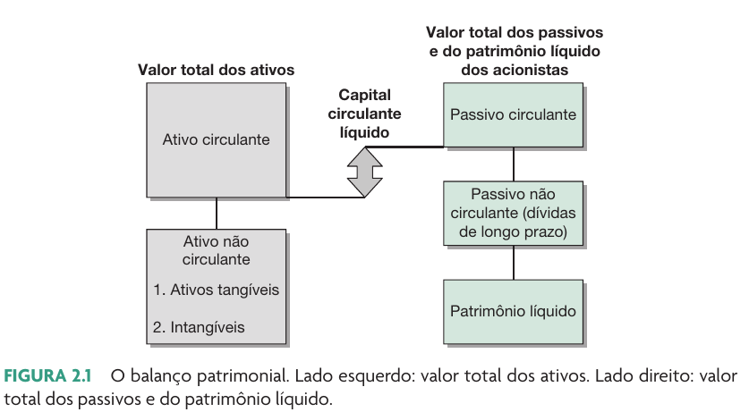
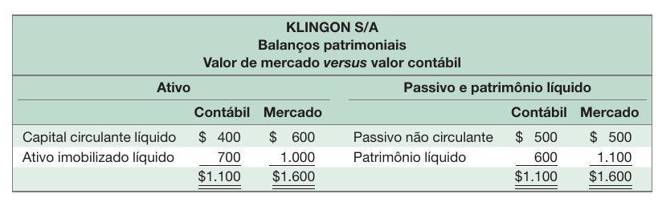
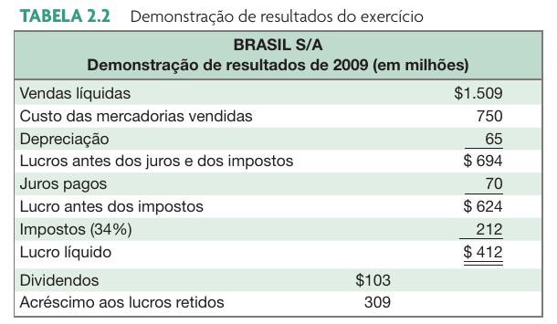
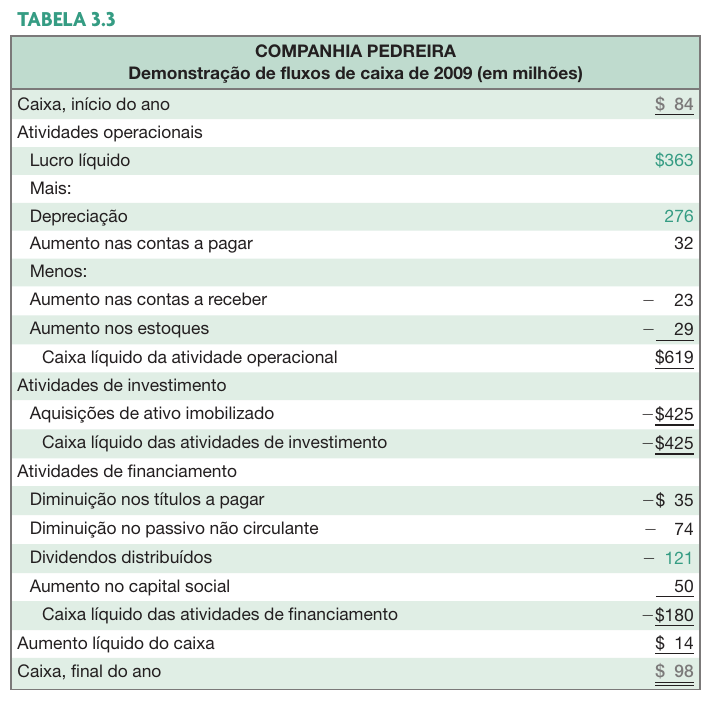
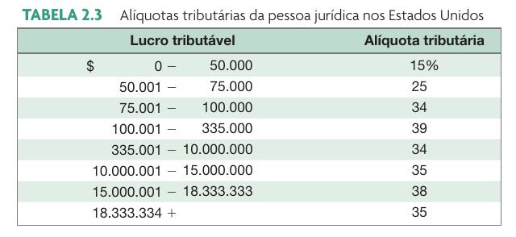

```{r}
classtools::setup_quarto_slides("resources")
```

# Introdução a Demontrações Financeiras

## Por que avaliar DFs?

::: {.incremental}

::: {.columns}

::: {.column width="50%"}

- **Controle Interno**
  - Permite analisar a capacidade de gerar caixa e tomar novas dívidas
  - Avaliação de desempenho: remuneração de executivos e comparação entre divisões da empresa
  - Planejar o futuro: guia para estimar fluxos de caixa futuros
:::

::: {.column width="50%"}

- **Controle externo**
  - Permite análise da qualidade das operações da empresa
  - Permite análise da solvência da empresa
    - análise de crédito
    - análise de fornecimento
:::
:::
:::

<br> 

## Principais documentos

- Balanço Patrimonial (BP)
- Demonstrativo de resultados (DRE)
- Demonstrativo de fluxo de caixa (DFC)
- ~~Demonstração de mutações do patrimônio líquido (DMPL)~~ (NAO VISTO EM AULA)
- ~~Demonstração do Valor Adicionado (DVA)~~ (NAO VISTO EM AULA)

# Balanço Patrimonial (BP)

## Introdução

> O balanço patrimonial é uma fotografia dos ativos e obrigações em determinado momento.

Características:

- Ativos (ou contas) do BP são listados em ordem decrescente de sua liquidez
- Identidade do balanço patrimonial (resultado do método de partidas dobradas):

$$Ativo Total = Passivo Total$$

$$Passivo Total = Obrigações + CapitalDosSócios$$


## Capital Circulante Líquido e a liquidez da empresa

> O CCL mede a capacidade da empresa, no curto prazo, de pagar suas contas.

$$
CCL = AtivoCirculante – PassivoCirculante
$$

- Positivo quando o caixa a ser recebido nos próximos 12 meses excede ao caixa que deverá ser pago nesse período

- Geralmente é positivo em empresas com boa saúde financeira

- Empresas com liquidez têm menor probabilidade de enfrentar problemas financeiros

- Um alto CCL, porém, pode indicar um superinvestimento da empresa em recursos ociosos


## O balanço patrimonial




## Valor de mercado vs. Valor contábil

> O balanço patrimonial informa o valor contábil dos ativos, das obrigações e do capital próprio.

::: {.incremental}
- Valor de mercado é o preço pelo qual ativos, obrigações e capital próprio podem efetivamente ser vendidos.
- Valor de mercado e valor contábil, com frequência, diferem muito. Por que?
- Qual dos dois valores é mais importante para o processo decisório?
:::

## Exemplo 2.2 A Cia Klingon




## Sistema DFP da B3

> A B3 disponibliza todos os demonstrativos anuais das empresas listadas na bolsa em seu sistema DFP (Demonstrativo Financeiros Padronizados)


[Link B3](https://www.b3.com.br/pt_br/produtos-e-servicos/negociacao/renda-variavel/empresas-listadas.htm)

## Pontos importantes em um BP

::: {.columns}

::: {.column width="50%"}
### Ativo

- Proporção de investimento do ativo não circulante/imobilizado (AnC) em relação ao ativo total

- Valor em estoque e tipo de estoque

- Valores em contas a receber

:::

::: {.column width="50%"}
### Passivo

- Proporção de dívidas por tipo (longo/curto)

- Composição do PL (existência de lucros acumulados)

:::
:::

## O caso OGX

> Do IPO recorde à maior Recuperação Judicial da América Latina (2013).

- Captação de R$ 6,7 bilhõe em 2008 (maior abertura de capital do Brasil até então).

- Tese de Investimento: Monetização de ativos pré-operacionais (Exploração & Produção).

- Valuation: Baseado em "recursos prospectivos" (estimativas de óleo) e não em fluxo de caixa descontado de produção real.

- Market Cap: A OGX chegou a valer mais de R$ 75 bilhões em 2010.

- [BP da OGX em 2008](https://www.rad.cvm.gov.br/ENET/frmGerenciaPaginaFRE.aspx?NumeroSequencialDocumento=79329&CodigoTipoInstituicao=1)


# A demonstração de resultados (DRE)

## Introdução

> O DRE é um vídeo das operações da empresa num período específico de tempo.

- Geralmente são apresentadas as receitas e então deduzidas as despesas associadas aos produtos ou serviços e as despesas do período.

- A DRE obedece ao **regime de competência** (e não regime de caixa).


## O regime de competência

> Sob o método de competência, os efeitos financeiros das transações  e  eventos são reconhecidos nos períodos nos quais ocorrem, independentemente de terem sido efetivamente recebidos ou pagos. [@ross]

Exemplo:

- Você vende um produto em dezembro, mas o cliente só paga em janeiro. No regime de competência, a receita será registrada em dezembro, mesmo que o dinheiro só entre em janeiro.

- Você compra um material em dezembro, mas só paga em janeiro. No regime de competência, a despesa será registrada em dezembro, mesmo que o dinheiro só saia em janeiro.

## Princípios do Regime de Competência

> **Princípio da Realização das Receitas**: Uma receita é reconhecida nos livros da empresa quando os produtos ou serviços são transferidos ao cliente.

> **Princípio do Confronto das Despesas com as Receitas e com os Períodos Contábeis**: todas as despesas associáveis a um produto ou serviço são com eles confrontadas; os consumos de ativos (atuais ou futuros) que não puderam ser associados à receita do período nem às dos períodos futuros, devem ser descarregados como despesa do período em que ocorrerem.


## DRE da Brasil S/A




# Demonstração de Fluxos de Caixa (DFC)

## Introdução

> Documento que resume as fontese os usos de caixa, conciliando a variação da conta caixa com os fluxos operacionais, investimento e financiamento.

Variações apresentadas em três grandes categorias:

- Atividades Operacionais: o lucro líquido e outras variações nas contas circulantes
- Atividades de Investimento: as variações nos ativos imobilizados
- Atividades de Financiamento: as variações em empréstimos e dívidas, títulos de dívida a pagar, passivos não circulantes, contas do patrimônio líquido, e dividendos.


## Exemplo de DFC




## Um exercício sobre fluxo de caixa

### Ativo e Passivo 

#### Contas circulantes

2009: AC = 4.400; PC = 1.500

2008: PC = 3.500; PC = 1.200

#### Ativo Imobilizado e Depreciação

2009: Imobilizado = 3.400; 

2008: Imobilizado = 3.100

Despesas de depreciação = 400

#### Passivo Não Circulante e PL (Lucros Retidos não informados)

2009: PNC = 4.000; Capital e reservas = 400

2008: PNC = 3.950; Capital e reservas = 400

## Demonstração de Resultados do Exercício

LAJIR = 2.000; IR = 300

Despesas de juros = 350

Dividendos = 500


## Resposta Exercício

**Com base nas informações anteriores, calcule o FCA**

FCO = 2000 + 400 – 300 = 2100

Gastos de capital =  3400 – 3100 + 400 = 700

Variação no CCL = (4400 – 1500) – (3500 – 1200) = 600

FCA = 2100 – 700 - 600 = 800

FC para os Credores = 350 – (4000 – 3950) = 300

FC para os Acionistas = 500

FCA = 300 + 500 = 800


# Documentos Financeiros na vida real {background-image="figs/background-docs.jpeg" background-opacity=0.35}

## Monark  {background-image="figs/monark.webp" background-opacity=0.35}

- A empresa foi fundada em abril de 1948 com a denominação de Monark Indústria e Comércio Ltda
- Inicialmente, atuava como importadora e montadora. Em 1951 passou a ser fabricante de bicicletas.
- Modelos icônicos: Monark Monareta, Monark Barra Circular, Monark BMX
- Produção anual de mais de 500 mil bicicletas


## Como a Monark ganha dinheiro? {.scrollable}

```{r}
#GetDFPData2::search_company('monark')
CD_CVM <- 1694
my_year <- 2023 #lubridate::year(Sys.Date()) - 1
my_year <- 2024 #lubridate::year(Sys.Date()) - 1

dre <- GetDFPData2::get_dfp_data(CD_CVM, 
                                 first_year = my_year,
                                 last_year = my_year, 
                                 type_docs = "DRE")

bpa <- GetDFPData2::get_dfp_data(CD_CVM, 
                                 first_year = my_year,
                                 last_year = my_year, 
                                 type_docs = "BPA") 

fca <- GetDFPData2::get_dfp_data(CD_CVM, 
                                 first_year = my_year,
                                 last_year = my_year, 
                                 type_docs = "DFC_MI")

dre <- dre$`DF Individual - Demonstração do Resultado`
bpa <- bpa$`DF Individual - Balanço Patrimonial Ativo`
fca <- fca$`DF Individual - Demonstração do Fluxo de Caixa (Método Indireto)`

name_company <- dre$DENOM_CIA[1]
```

:::: {.columns}

::: {.column width="50%"}
```{r}
classtools::make_fin_table(
  classtools::simplify_dfp(bpa, max_levels = 3),
  title = glue::glue("Balanço Patrimonial - {name_company} | Final {my_year} "),
  subtitle = "Valores em Milhares") |>
  gt::tab_options(
    table.font.size = "15px"
  )
```
:::

::: {.column width="50%"}
```{r}
classtools::make_fin_table(
  classtools::simplify_dfp(dre, max_levels = 2),
  title = glue::glue("Demonstrativo de Resultados - {name_company} | Final {my_year} "),
  subtitle = "Valores em Milhares") |>
  gt::tab_options(
    table.font.size = "15px"
  )
```
:::


```{r}
#classtools::make_fin_table(
#  classtools::simplify_dfp(fca, max_levels = 3),
#  title = glue::glue("Demonstrativo de Fluxo de Caixa - {name_company} | Final {my_year} "),
#  subtitle = "Valores em Milhares") |>
#  gt::tab_options(
#    table.font.size = "15px"
#  )
```

::::


# Impostos 

> A única coisa certa quanto a tributos é que eles sempre irão existir e sempre estarão mudando [@ross]


## Alíquota marginal vs. alíquota média

**Alíquota tributária marginal**: a percentagem de impostos paga sobre o próximo real faturado

**Alíquota tributária média**: a conta de tributos dividida pelo lucro tributável

## IR em USA



## IR no Brasil

```{r}
thresh <- 240000

tbl_ir <- tibble::tribble(
  ~"Valor do Lucro Tributável", ~IRPJ, ~CSLL, ~Soma,
  paste0("Menor que ", classtools::format_cash(thresh)), classtools::format_percent(0.15), classtools::format_percent(0.09), classtools::format_percent(0.24),
  paste0("Maior ou igual a ", classtools::format_cash(thresh)), classtools::format_percent(0.25), classtools::format_percent(0.09), classtools::format_percent(0.34)
)

this_year <- lubridate::year(Sys.Date())
tbl_ir |>
  gt::gt() |>
  gt::tab_header(
    title = glue::glue("Alíquotas de Imposto de Renda sobre lucro no Brasil ({this_year})"),
    subtitle = "Tabela válida para pessoa jurídica e apenas impostos federais")
```


## Exemplo: Alíquota marginal  X Alíquota média

```{r}
lucro_tributavel <- 1000000
```


Suponha que sua empresa tenha um lucro tributável de `r classtools::format_cash(lucro_tributavel)`

- Qual é o IR e CSLL devido?
- Qual é a alíquota média?
- Qual é a alíquota marginal?

<br> 

> Se você está avaliando um projeto que vai aumentar o lucro tributável em mais de `r classtools::format_cash(lucro_tributavel/2)`, qual é a alíquota tributária que você deveria utilizar em sua análise?

## Cálculo IR

```{r}
ir_1 <- 0.15
ir_2 <- 0.09
ir_3 <- 0.1

total_ir <- thresh*(ir_1 + ir_2) +(lucro_tributavel-thresh)*(ir_1+ir_2+ir_3)
```

Lubro Tributável: `r classtools::format_cash(lucro_tributavel)`

`r classtools::format_percent(ir_1+ ir_2)` de `r classtools::format_cash(thresh)`: `r classtools::format_cash(thresh*(ir_1 + ir_2))` 

`r classtools::format_percent(ir_1+ ir_2 + ir_3)` de  `r classtools::format_cash(lucro_tributavel-thresh)`: `r classtools::format_cash( (lucro_tributavel-thresh)*(ir_1+ir_2+ir_3))`

Total de IR: `r classtools::format_cash( total_ir)`

<br>

Alíquota marginal = `r classtools::format_percent(ir_1+ ir_2 + ir_3)`

Alíquota média = `r classtools::format_percent(total_ir/lucro_tributavel)`


## Referências {-}