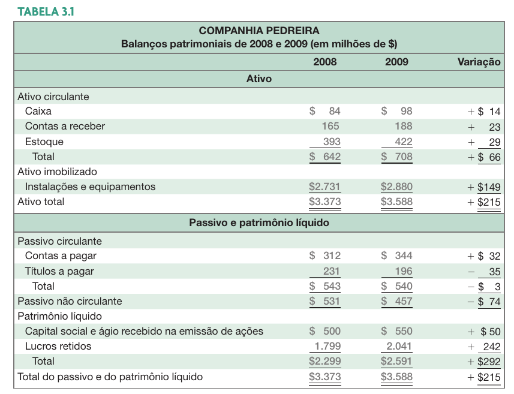
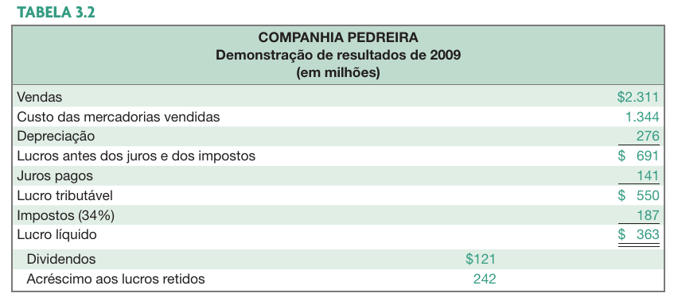
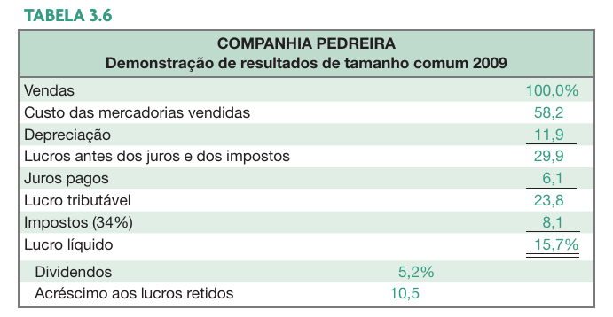
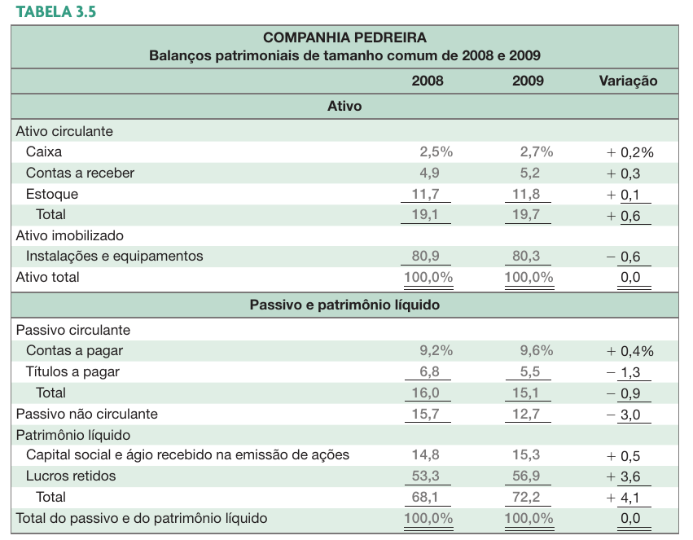
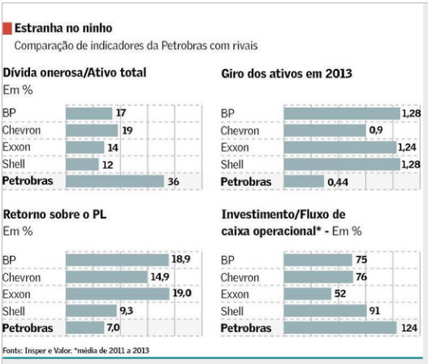

```{r}
classtools::setup_quarto_slides("resources")
```

# Fontes e Usos

## Definições

- Fontes
  - Entradas de caixa - ocorrem quando "vendemos" algo
  - Redução em contas do ativo  (BP): Contas a receber, Estoques, Imobilizado líquido
  - Aumento de obrigações ou na conta de capital próprio
    - Contas a pagar, outros passivos, Patrimonio Líquido
  
- Usos
  - Saídas de caixa - ocorrem quando "compramos" algo
    - Aumento em contas do Ativo: Estoques, Contas a Receber, Equipamentos
  - Redução em obrigações ou na conta de capital
    - Empréstimos de curto prazo, dívidas de longo prazo, Patrimônio Líquido
  

## Demonstrações financeiras uniformes

> A uniformização de demonstrativos financeiros permite a comparação entre resultados obtidos em períodos diferentes, ou entre empresas diferentes. 

::: {.incremental}

- Balanços patrimoniais uniformes
  - Compute como percentuais do Ativo Total

- Demonstrações de resultado uniformes
  - Compute todas as linhas como percentuais das vendas
  - Demonstrações uniformes tornam mais fácil a comparação de informações financeiras, especialmente à medida que a empresa cresce
  - Também são úteis para comparar empresas com tamanhos diferentes, especialmente dentro do mesmo ramo.
:::

## Padronização de Demonstrações Financeiras

::: {.incremental}

- Análise Horizontal
  - Demonstra a evolução das contas ao longo do tempo.
    - Exemplo: O aumento percentual nas vendas de um ano para outro.

- Análise Vertical
  - Demonstra a percentagem das contas em relação à uma conta base.
    - Exemplo: Para determinado ano, o percentual da conta caixa em relação ao ativo total.

:::

## Exemplo de  Balanço Patrimonial {#sec-bp}




## Exemplo de Demonstração de Resultados {#sec-dre}




## Exemplo Padronização Vertical



## Exemplo Padronização Horizontal



# Análise de DFs através de índices

## Motivação

::: {.incremental}

- Excesso de Informações nas DF e necessidade de simplificação
- A padronização permite a análise da situação financeira e econômica (Estrutura, Liquidez, Rentabilidade)

:::

<br> 

::: {.incremental}
- **Tipos de Índices:**	
  - Solvência ou liquidez
  - Solvência a longo prazo (índices de alavancagem)
  - Gestão de ativos (indicadores de giro)
  - Rentabilidade
  - Valor de mercado
:::


## Valores do BP (para cálculos de índices)

Retirados de BP anterior, @sec-bp

```{r}
#| echo: true
# Valores para 2009
AC <- 708
contasareceber <- 188
PC <- 540
estoques <- 422
caixa <- 98
CR <- 188
AnC <- 2880
AT <- 3588
PL <- 2591
PnC <- 457
PT <- AT
CCL <- AC - PC
```


## Valores do DRE (para cálculos de índices)

Retirados de DRE anterior, @sec-dre

```{r}
#| echo: true
# Valores para 2009
vendas <- 2311
CMV <- 1344
despesas <- 0
juros <- 141
LAJIR <- 691
depreciacao <- 276
LL <- 363
```


## Índices de liquidez (1/2) {.incremental}

::: aside
Nota: todos cálculos foram efetivados com informações do BP e DRE do início dos slides
:::


::: {.callout-note}
## Liquidez Corrente
$$LC=\frac{AC}{PC} \Longrightarrow `r AC`/`r PC` = `r AC/PC`$$

:::

. . .

::: {.callout-note}
## Liquidez Seca
$$LS=\frac{AC-Estoques}{PC} \Longrightarrow `r (AC - estoques)/PC`$$
:::

. . .

::: {.callout-note}
## Índice de caixa
$$IC=\frac{Caixa}{PC} \Longrightarrow `r caixa/PC`$$
:::

## Índices de liquidez (2/2) {.incremental}

::: {.callout-note}
## Prazo de cobertura de gastos de curto prazo
$$PCGCP=\frac{AC}{CustosOperacionaisDiarios} \Longrightarrow  \frac{AC}{(CMV+despesas)/365} \Longrightarrow `r AC/((CMV+despesas)/365)`$$
:::


## Calculando índices de solvência a longo prazo {.incremental .scrollable}

::: {.callout-note}
## Endividamento total
$$ET=\frac{AT - PL}{AT}  \Longrightarrow `r (AT-PL)/AT`$$ 
:::

. . .

::: {.callout-note}
## Dívida/PL
$$\frac{PC + PnC}{PL} \Longrightarrow `r (PC+PnC)/PL`$$  
:::

. . .

::: {.callout-note}
## Multiplicador do PL
$$MPL=\frac{AT}{PL} \Longrightarrow `r AT/PL`$$  
:::

. . .

::: {.callout-note}
## Endividamento a longo prazo
$$ELP=\frac{PnC}{PL} \Longrightarrow `r PnC/PL`$$  
:::

## Calculando índices de cobertura {.incremental}

::: {.callout-note}
## Índice de cobertura de juros
$$ICJ=\frac{LAJIR}{Juros} \Longrightarrow `r LAJIR/juros`$$  
:::

. . .

::: {.callout-note}
## Índice de cobertura de caixa
$$ICC=\frac{LAJIR + Depreciação}{Juros} \Longrightarrow `r (LAJIR + depreciacao)/juros`$$  
:::


## Calculando indicadores de estocagem {.incremental}

::: {.callout-note}
## Giro dos estoques
$$GE=\frac{CustoMercadoriaVendida}{estoques} \Longrightarrow `r CMV/estoques`$$  
:::

. . .

::: {.callout-note}
## Prazo Médio de Estocagem
$$PME=\frac{365}{GE} \Longrightarrow `r 365/(CMV/estoques)`$$  
:::


## Indicadores de contas a receber {.incremental}

::: {.callout-note}
## Giro de contas a receber
$$GCR=\frac{vendas}{contasareceber} \Longrightarrow `r vendas/contasareceber`$$  
:::

. . .

::: {.callout-note}
## Prazo Médio de Recebimento
$$PMR=\frac{365}{GCR} \Longrightarrow `r 365/(vendas/contasareceber)`$$  
:::


## Indicadores de giro do Ativo {.incremental}

::: {.callout-note}
## Giro do Ativo
$$GA=\frac{Vendas}{AT} \Longrightarrow `r vendas/AT`$$  
:::

. . .

::: {.callout-note}
## Giro do CCL
$$GCCL=\frac{Vendas}{CCL} \Longrightarrow `r vendas/CCL`$$  
:::

. . .

::: {.callout-note}
## Giro do Imobilizado
$$GI =\frac{Vendas}{ImobilizadoLiquido} \Longrightarrow `r vendas/AnC`$$  
:::


## Indicadores de rentabilidade {.incremental}

::: {.callout-note}
## Margem de lucro
$$ML =\frac{LucroLíquido}{Vendas} \Longrightarrow `r LL/vendas`$$
:::

. . .

::: {.callout-note}
## Retorno do Ativo (ROA)
$$ROA =\frac{LucroLíquido}{AtivoTotal} \Longrightarrow `r LL/AT`$$
:::

. . .

::: {.callout-note}
## Retorno do Patrimônio Líquido (ROE)
$$ROE =\frac{LucroLíquido}{PatrimonioLiquido} \Longrightarrow `r LL/PL`$$  
:::


## Indicadores de valor de mercado {.incremental}

```{r}
preco <- 15.56
n_circulacao <- 200
```

Preço de mercado: `r classtools::format_cash(preco)` por ação

Ações em circulação: `r humanize::count_as_word(n_circulacao)`

. . .

::: {.callout-note}
## Índice Preço/Lucro
$$PL =\frac{PreçoAção}{LucroPorAção} \Longrightarrow `r preco/(LL/n_circulacao)`$$  
:::

. . .

::: {.callout-note}
## Índice valor de mercado / valor contábil (V/VP)
$$VVP =\frac{PreçoAção}{ValorPatrimonialPorAção} \Longrightarrow `r preco/(PL/n_circulacao)`$$  
:::

## Onde achar informações de índices


[https://statusinvest.com.br/](https://statusinvest.com.br)

# O Caso Petrobrás (Valor Econômico – ago 2014)



## Referências {-}
