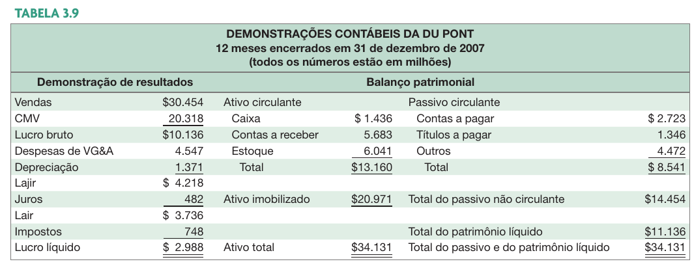
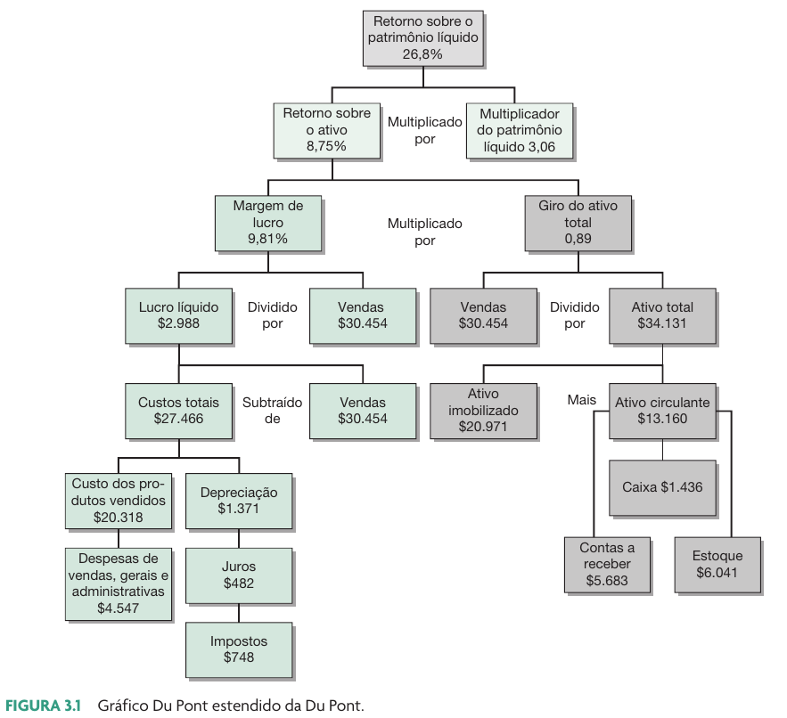

```{r}
#| echo: false
classtools::setup_quarto_slides("resources")
```

# Introdução a análise Dupont

## Pergunta

Dados os vários índices financeiros da aula anterior, caso tivesses que escolher apenas um deles para tomar uma análise sobre compra das ações de uma empresa, qual escolheria?

a) Índice de liquidez geral
b) Índice de liquidez seca
c) Giro do ativo
d) ROA – Retorno sobre ativos
e) ROE – Retorno sobre capital próprio


## A identidade Dupont

> A análise Dupont é uma ferramenta para analisar a rentabilidade de uma empresa.

- A análise DuPont foi criada em 1912 por Donaldson Brown, um engenheiro elétrico que trabalhava na empresa DuPont.
- Idéia básica: decompor o ROE em seus componentes: Margem Líquida, Giro dos Ativos e Alavancagem Financeira (Multiplicador do PL).

. . .

### Importância

- Permite entender melhor os fatores que influenciam a rentabilidade.
- Auxilia na identificação de pontos fortes e fracos da empresa.
- Facilita a comparação entre empresas do mesmo setor.


## Impacto de Dívidas sobre a Rentabilidade

> A alavancagem, uso de capital de terceiros, pode aumentar o ROE da empresa

$$ROE=\frac{LL}{PL}$$ 
$$ROA=\frac{LL}{AT}$$

Portanto:

$$ROE=ROA*\frac{AT}{PL}$$

$$ROE=ROA*\frac{1+Dívida}{PL}$$


## Derivando a identidade Du Pont (1/2)

$$ROE=\frac{LL}{PL}$$
Multiplique por $\frac{AT}{AT}$, reorganize a equação:

$$ROE = \frac{LL}{PL} * \frac{AT}{AT}$$
$$ROE = \frac{LL}{AT} * \frac{AT}{PL} = ROA * MultiplicadordoPL$$

## Derivando a identidade Du Pont (2/2)

Multiplique por $\frac{Vendas}{Vendas}$ e reorganize novamente

$$ROE = \frac{LL}{AT} * \frac{AT}{PL} * \frac{Vendas}{Vendas}$$

$$ROE = \frac{LL}{Vendas} * \frac{Vendas}{AT} * \frac{AT}{PL}$$

$$ROE = ML * GAT * MPL$$
onde: 

ML: Margem de Lucro (lucratividade)

GAT : Giro do Ativo (eficiência)

MPL: Multiplicador do PL (endividamento)


## Usando a identidade Du Pont

$$ROE = ML * GAT * MPL$$

- A Margem de Lucro (ML) é uma **medida de eficiência operacional e comercial**: o quanto a empresa controla seus custos

- O Giro do Ativo Total (GAT) é uma **medida da eficiência** no uso dos ativos da empresa

- O Multiplicador do PL (MPL) é uma **medida de alavancagem** do capital próprio na empresa. 


## Análise Du Pont expandida – Dados da nossa “Du Pont”

```{r}
#| fig-cap:  !expr classtools::cite_ross(73)

```


## Gráfico estendido da Du Pont

```{r}
#| fig-cap:  !expr classtools::cite_ross(74)

```


# Analisando ROEs de empresas Brasileiras


```{r}

get_acc <- function(target, CD_CONTA, VL_CONTA) {
  idx <- which(target == CD_CONTA)
  return(VL_CONTA[idx])
}

do_dupont <- function(id, first_year = 2010) {
  require(ggplot2)
  
  l_dfp <- GetDFPData2::get_dfp_data(id, first_year = first_year,
                                     type_docs = c("DRE", "BPA", "BPP"),
                                     type_format = 'ind')
  
  bpa <- l_dfp$`DF Individual - Balanço Patrimonial Ativo`
  bpp <- l_dfp$`DF Individual - Balanço Patrimonial Passivo`
  dre <- l_dfp$`DF Individual - Demonstração do Resultado`
  
  this_company <- bpa$DENOM_CIA[1]
  
  all_dfp <- dplyr::bind_rows(
    bpa,
    bpp,
    dre
  )
  
  my_tab <- all_dfp |>
    dplyr::group_by(DENOM_CIA, year = lubridate::year(DT_REFER)) |>
    dplyr::summarise(
      PL = get_acc("2.03", CD_CONTA, VL_CONTA),
      LL = get_acc("3.11", CD_CONTA, VL_CONTA),
      vendas = get_acc("3.01", CD_CONTA, VL_CONTA),
      AT = get_acc("1", CD_CONTA, VL_CONTA),
    ) |>
    dplyr::ungroup() |>
    dplyr::mutate(
      ML = LL/vendas,
      GAT = vendas/AT,
      MPL = AT/PL,
      ROE = ML*GAT*MPL
    )
  
  p_ROE <- ggplot(my_tab, 
                aes(x = year, y = ROE)) + 
  geom_col() + 
  theme_light() + 
  scale_y_continuous(labels = scales::percent) + 
  ggrepel::geom_text_repel(aes(label = classtools::format_percent(ROE)),
                           color = "blue") + 
  labs(title = glue::glue("ROE da {this_company}"),
       x = "Ano")
  
  p_ML <- ggplot(my_tab, aes(x = year, y = ML)) +
    geom_point() + 
    geom_line() +
    theme_light() + 
    labs(title = glue::glue("ML da {this_company}")) +
    scale_y_continuous(labels = scales::percent) 
  
  p_GAT <- ggplot(my_tab, aes(x = year, y = GAT)) +
    geom_point() + 
    geom_line() +
    theme_light() + 
    labs(title = glue::glue("GAT da {this_company}")) 
  
  p_MPL <- ggplot(my_tab, aes(x = year, y = MPL)) +
    geom_point() + 
    geom_line() +
    theme_light() + 
    labs(title = glue::glue("MPL da {this_company}")) +
    scale_y_continuous(labels = scales::percent) 
  
  p_all <- cowplot::plot_grid(p_ML, p_GAT, p_MPL, 
                   nrow = 3)
  
  l_p <- list(
    p_ROE = p_ROE,
    p_all = p_all,
    this_company = this_company,
    my_tab = my_tab
  )
  
  return(l_p)
  
  
}
```

## Dados obtidos

```{r}
#| cache: true
#GetDFPData2::search_company("petrobras")
id <- 9512
first_year <- 2010

l_p <- do_dupont(id, first_year)

latest_year <- max(l_p$my_tab$year)
```


- Dados financeiros de `r first_year` até `r latest_year`
- DFs obtidos via sistema DFP, pacote GetDFPData2 do R [@R-GetDFPData2]
- Preços obtidos via yahoo finance

**Dado um ROE variante no tempo, o que impactou a rentabilidade das empresas?**

## Petrobrás (PETR4 & PETR3) {.scrollable}

### Preços ajustados

```{r}
ticker <- "PETR4.SA"
first_date <-  as.Date(paste0(first_year, '-01-01'))
last_date <- as.Date(paste0(latest_year, '-12-31'))

p <- classtools::plot_price(ticker, first_date, last_date)
p
```

### ROE
```{r}
#| cache: true
#GetDFPData2::search_company("petrobras")
l_p$p_ROE
```

### ML, GAT e MPL 


```{r}
l_p$p_all
```


## Magazine Luiza (MGLU3)  {.scrollable}

### Preços ajustados

```{r}
ticker <- "MGLU3.SA"

first_date <-  as.Date(paste0(2015, '-01-01'))
last_date <- as.Date(paste0(2023, '-12-31'))

p <- classtools::plot_price(ticker, first_date, last_date)
p
```

### ROE

```{r}
#| cache: false
#GetDFPData2::search_company("magazine luiza")
id <- 22470

l_p <- do_dupont(id)

l_p$p_ROE
```

### ML, GAT e MPL 


```{r}
l_p$p_all
```


## M. Dias (MDIA3)  {.scrollable}

### Preços ajustados

```{r}
ticker <- "MDIA3.SA"

first_date <-  as.Date(paste0(first_year, '-01-01'))
last_date <- as.Date(paste0(latest_year, '-12-31'))

p <- classtools::plot_price(ticker, first_date, last_date)
p
```

### ROE

```{r}
#| cache: false
#GetDFPData2::search_company("dias")
id <- 20338

l_p <- do_dupont(id)
l_p$p_ROE

```


### ML, GAT e MPL 

```{r}
l_p$p_all
```


## Por que avaliar DFs?

- Usos internos
  - Avaliação de desempenho – remuneração de executivos e comparação entre divisões da empresa
  - Planejar o futuro – guia para estimar fluxos de caixa futuros

- Usos externos
  - Credores
  - Fornecedores
  - Clientes
  - Acionistas

## Comparações

Indicadores não são muito úteis em si mesmos; eles necessitam ser comparados a algo

- Análise de tendência temporal
  - Para ver como o desempenho da empresa está mudando com o passar do tempo
  - Para uso interno e externo

- Análise de comparação com pares
  - Comparação com empresas do mesmo setor
  - Utilizar dados de empresas em bancos de dados codificados (IBGE/CONCLA no Brasil e SIC/NAICS nos EUA)

## Referências {-}  
