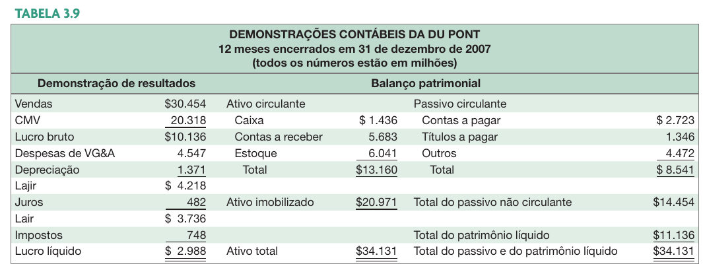
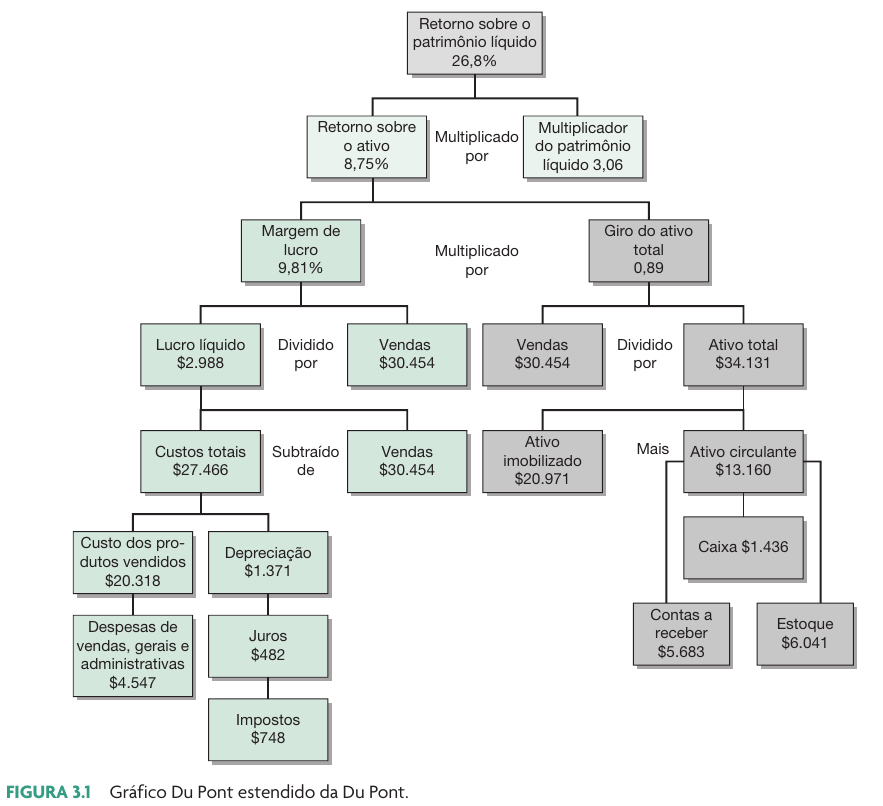

```{r}
#| echo: false
classtools::setup_quarto_slides("resources")
```

# Introdução à Análise DuPont

## Pergunta

Dados os vários índices financeiros da aula anterior, caso tivesses que escolher apenas um deles para tomar uma decisão sobre a compra das ações de uma empresa, qual escolheria?

a) Índice de liquidez geral
b) Índice de liquidez seca
c) Giro do ativo
d) ROA – Retorno sobre ativos
e) **ROE – Retorno sobre capital próprio**

. . .

::: {.callout-note}
### Resposta: e) ROE
O **ROE (Return on Equity)** é a principal medida do retorno gerado para os acionistas. A **Análise DuPont** nos permite "desmontar" o ROE para entender *de onde* vem esse desempenho (lucratividade, eficiência ou alavancagem).
:::


## A Identidade DuPont

> A análise DuPont é uma ferramenta essencial para decompor e analisar a rentabilidade de uma empresa.

- Criada em 1912 por **Donaldson Brown**, engenheiro elétrico na empresa DuPont.
- **Ideia básica**: Decompor o ROE em três pilares fundamentais:
  - **Margem Líquida** (Lucratividade)
  - **Giro dos Ativos** (Eficiência)
  - **Alavancagem Financeira** (Multiplicador do PL)

. . .

### Importância

- Permite entender os fatores determinantes da rentabilidade.
- Auxilia na identificação de pontos fortes e fracos operacionais/financeiros.
- Facilita a comparação direta entre empresas do mesmo setor.


## Árvore de Decomposição DuPont

```{mermaid}
graph TD
    ROE["ROE: Return on Equity"] --> ML["Margem Líquida (ML)"]
    ROE --> GAT["Giro do Ativo (GAT)"]
    ROE --> MPL["Multiplicador do PL (MPL)"]
    
    ML --> LL["Lucro Líquido"]
    ML --> Vendas1["Vendas"]
    
    GAT --> Vendas2["Vendas"]
    GAT --> AT1["Ativo Total"]
    
    MPL --> AT2["Ativo Total"]
    MPL --> PL["Patrimônio Líquido"]

    style ROE fill:#003366,color:#fff,stroke:#001f3f
    style ML fill:#1667c4,color:#fff
    style GAT fill:#27A5A2,color:#fff
    style MPL fill:#E80724,color:#fff
```


## Impacto de Dívidas sobre a Rentabilidade

> A alavancagem (uso de capital de terceiros) pode alavancar o ROE da empresa.

$$\text{ROE} = \frac{\text{Lucro Líquido}}{\text{PL}}$$ 

$$\text{ROA} = \frac{\text{Lucro Líquido}}{\text{Ativo Total}}$$

Portanto:

$$\text{ROE} = \text{ROA} \times \frac{\text{Ativo Total}}{\text{PL}}$$

$$\text{ROE} = \text{ROA} \times \left(1 + \frac{\text{Dívida}}{\text{PL}}\right)$$


## O Efeito Alavancagem: ROIC vs. Custo da Dívida

> O uso de capital de terceiros só beneficia o acionista se a empresa gerar retorno operacional superior ao custo da dívida.

$$\text{ROE} = \text{ROIC} + \left( \text{ROIC} - K_d \right) \times \frac{\text{Dívida}}{\text{PL}}$$

onde $\text{ROIC}$ é o Retorno sobre o Capital Investido e $K_d$ é o Custo da Dívida pós-impostos.

. . .

::: {.callout-warning}
### A Armadilha da Alavancagem Financeira
- **Spread Positivo ($\text{ROIC} > K_d$)**: Alavancagem **cria valor** e expande o ROE.
- **Spread Negativo ($\text{ROIC} < K_d$)**: A dívida **destrói valor** e espreme o ROE.
- Em períodos de **juros elevados (ex: Selic alta)**, o custo da dívida pode superar o ROIC operacional!
:::


## Derivando a Identidade DuPont (1/2)

$$\text{ROE} = \frac{\text{Lucro Líquido}}{\text{PL}}$$

Multiplique por $\frac{\text{Ativo Total}}{\text{Ativo Total}}$ e reorganize a equação:

$$\text{ROE} = \frac{\text{Lucro Líquido}}{\text{PL}} \times \frac{\text{Ativo Total}}{\text{Ativo Total}}$$

$$\text{ROE} = \frac{\text{Lucro Líquido}}{\text{Ativo Total}} \times \frac{\text{Ativo Total}}{\text{PL}} = \text{ROA} \times \text{Multiplicador do PL}$$


## Derivando a Identidade DuPont (2/2)

Multiplique por $\frac{\text{Vendas}}{\text{Vendas}}$ e reorganize novamente:

$$\text{ROE} = \frac{\text{Lucro Líquido}}{\text{Ativo Total}} \times \frac{\text{Ativo Total}}{\text{PL}} \times \frac{\text{Vendas}}{\text{Vendas}}$$

$$\text{ROE} = \frac{\text{Lucro Líquido}}{\text{Vendas}} \times \frac{\text{Vendas}}{\text{Ativo Total}} \times \frac{\text{Ativo Total}}{\text{PL}}$$

$$\text{ROE} = \text{ML} \times \text{GAT} \times \text{MPL}$$

onde:

- **ML**: Margem Líquida (Lucratividade)
- **GAT**: Giro do Ativo Total (Eficiência)
- **MPL**: Multiplicador do PL (Alavancagem)


## Análise DuPont em 5 Etapas (Expandida)

Ao abrir a Margem Líquida nos componentes operacionais, financeiros e tributários, temos a decomposição de **5 fatores**:

$$\text{ROE} = \underbrace{\frac{\text{EBIT}}{\text{Vendas}}}_{\text{Margem Operacional}} \times \underbrace{\frac{\text{Vendas}}{\text{Ativo Total}}}_{\text{Giro do Ativo}} \times \underbrace{\frac{\text{EBT}}{\text{EBIT}}}_{\text{Carga de Juros}} \times \underbrace{\frac{\text{Lucro Líquido}}{\text{EBT}}}_{\text{Carga Tributária}} \times \underbrace{\frac{\text{Ativo Total}}{\text{PL}}}_{\text{Alavancagem}}$$

. . .

### Diagnóstico por Componente:
- **Margem Operacional (EBIT / Vendas)**: Eficiência puramente operacional da atividade principal.
- **Carga de Juros (EBT / EBIT)**: Impacto do custo da dívida (quanto menor, mais juros consomem o EBIT).
- **Carga Tributária (LL / EBT)**: Eficiência no manejo de tributos sobre o lucro (IR/CSLL).


## Usando a Identidade DuPont

$$\text{ROE} = \text{ML} \times \text{GAT} \times \text{MPL}$$

- A **Margem Líquida (ML)** é uma **medida de eficiência operacional e comercial**: o quanto a empresa controla custos e despesas para gerar lucro.

- O **Giro do Ativo Total (GAT)** é uma **medida de eficiência operacional**: a capacidade da empresa de gerar vendas para cada R$ 1,00 investido em ativos.

- O **Multiplicador do PL (MPL)** é uma **medida de alavancagem financeira**: indica o grau de financiamento dos ativos por capital de terceiros.


## Análise DuPont Expandida – Dados da "DuPont"

```{r}
#| fig-cap: !expr classtools::cite_ross(73)

```


## Gráfico Estendido da DuPont

```{r}
#| fig-cap: !expr classtools::cite_ross(74)

```


# Analisando ROEs de Empresas Brasileiras

```{r}
get_acc <- function(target, CD_CONTA, VL_CONTA) {
  idx <- which(target == CD_CONTA)
  if (length(idx) == 0) return(NA_real_)
  return(VL_CONTA[idx[1]])
}

do_dupont <- function(id, first_year = 2015) {
  require(ggplot2)
  
  l_dfp <- GetDFPData2::get_dfp_data(
    id, first_year = first_year,
    type_docs = c("DRE", "BPA", "BPP"),
    type_format = 'ind',
    cache_folder = "~/.cache/GetDFPData2")
  
  bpa <- l_dfp$`DF Individual - Balanço Patrimonial Ativo`
  bpp <- l_dfp$`DF Individual - Balanço Patrimonial Passivo`
  dre <- l_dfp$`DF Individual - Demonstração do Resultado`
  
  this_company <- bpa$DENOM_CIA[1]
  
  all_dfp <- dplyr::bind_rows(
    bpa,
    bpp,
    dre
  )
  
  my_tab <- all_dfp |>
    dplyr::group_by(DENOM_CIA, year = lubridate::year(DT_REFER)) |>
    dplyr::summarise(
      PL = get_acc("2.03", CD_CONTA, VL_CONTA),
      LL = get_acc("3.11", CD_CONTA, VL_CONTA),
      vendas = get_acc("3.01", CD_CONTA, VL_CONTA),
      AT = get_acc("1", CD_CONTA, VL_CONTA),
      .groups = "drop"
    ) |>
    dplyr::mutate(
      ML = LL / vendas,
      GAT = vendas / AT,
      MPL = AT / PL,
      ROE = ML * GAT * MPL
    )
  
  col_main <- "#003366"
  
  p_ROE <- ggplot(my_tab, aes(x = year, y = ROE)) + 
    geom_col(fill = col_main, width = 0.65) + 
    theme_minimal(base_size = 14) + 
    scale_y_continuous(labels = scales::percent_format(accuracy = 1)) + 
    ggrepel::geom_text_repel(aes(label = classtools::format_percent(ROE)),
                             color = "#003366", fontface = "bold", size = 4) + 
    labs(title = glue::glue("ROE: {this_company}"),
         subtitle = "Retorno sobre o Patrimônio Líquido (LL / PL)",
         x = "Ano", y = "ROE")
  
  p_ML <- ggplot(my_tab, aes(x = year, y = ML)) +
    geom_line(color = "#1667c4", linewidth = 1) +
    geom_point(color = "#1667c4", size = 2.5) + 
    theme_minimal(base_size = 11) + 
    labs(title = "Margem Líquida (ML)", subtitle = "LL / Vendas", x = "Ano", y = NULL) +
    scale_y_continuous(labels = scales::percent_format(accuracy = 1))
  
  p_GAT <- ggplot(my_tab, aes(x = year, y = GAT)) +
    geom_line(color = "#27A5A2", linewidth = 1) +
    geom_point(color = "#27A5A2", size = 2.5) + 
    theme_minimal(base_size = 11) + 
    labs(title = "Giro do Ativo (GAT)", subtitle = "Vendas / Ativo Total", x = "Ano", y = NULL) +
    scale_y_continuous(labels = scales::number_format(accuracy = 0.1, suffix = "x"))
  
  p_MPL <- ggplot(my_tab, aes(x = year, y = MPL)) +
    geom_line(color = "#E80724", linewidth = 1) +
    geom_point(color = "#E80724", size = 2.5) + 
    theme_minimal(base_size = 11) + 
    labs(title = "Multiplicador PL (MPL)", subtitle = "Ativo Total / PL", x = "Ano", y = NULL) +
    scale_y_continuous(labels = scales::number_format(accuracy = 0.1, suffix = "x"))
  
  p_all <- cowplot::plot_grid(p_ML, p_GAT, p_MPL, ncol = 3)
  
  l_p <- list(
    p_ROE = p_ROE,
    p_all = p_all,
    this_company = this_company,
    my_tab = my_tab
  )
  
  return(l_p)
}
```

## Dados Obtidos

```{r}
#| cache: true
id <- 9512
first_year <- 2015

l_p <- do_dupont(id, first_year)

latest_year <- max(l_p$my_tab$year)-1
```

- Dados financeiros de `r first_year` até `r latest_year`
- DFs obtidos via sistema DFP (CVM), pacote `GetDFPData2` [@R-GetDFPData2]
- Cotações históricas obtidas via Yahoo Finance

> **Dado um ROE variante no tempo, o que impulsionou a rentabilidade das empresas no Brasil?**


## Petrobras (PETR4 & PETR3)

::: {.panel-tabset}

### Preços Ajustados

```{r}
ticker <- "PETR4.SA"
first_date <- as.Date(paste0(first_year, '-01-01'))
last_date <- as.Date(paste0(latest_year, '-12-31'))

p <- classtools::plot_price(ticker, first_date, last_date)
p
```

### ROE

```{r}
#| cache: true
l_p$p_ROE
```

### Decomposição DuPont (ML, GAT, MPL)

```{r}
l_p$p_all
```

:::


## Magazine Luiza (MGLU3)

::: {.panel-tabset}

### Preços Ajustados

```{r}
ticker <- "MGLU3.SA"

first_date <- as.Date(paste0(2015, '-01-01'))
last_date <- as.Date(paste0(latest_year, '-12-31'))

p <- classtools::plot_price(ticker, first_date, last_date)
p
```

### ROE

```{r}
#| cache: false
id <- 22470

l_p <- do_dupont(id)

l_p$p_ROE
```

### Decomposição DuPont (ML, GAT, MPL)

```{r}
l_p$p_all
```

:::


## M. Dias Branco (MDIA3)

::: {.panel-tabset}

### Preços Ajustados

```{r}
ticker <- "MDIA3.SA"

first_date <- as.Date(paste0(first_year, '-01-01'))
last_date <- as.Date(paste0(latest_year, '-12-31'))

p <- classtools::plot_price(ticker, first_date, last_date)
p
```

### ROE

```{r}
#| cache: false
id <- 20338

l_p <- do_dupont(id)
l_p$p_ROE
```

### Decomposição DuPont (ML, GAT, MPL)

```{r}
l_p$p_all
```

:::


## Ambev (ABEV3)

::: {.panel-tabset}

### Preços Ajustados

```{r}
ticker <- "ABEV3.SA"

first_date <- as.Date(paste0(first_year, '-01-01'))
last_date <- as.Date(paste0(latest_year, '-12-31'))

p <- classtools::plot_price(ticker, first_date, last_date)
p
```

### ROE

```{r}
#| cache: false
id <- 23264

l_p <- do_dupont(id)
l_p$p_ROE
```

### Decomposição DuPont (ML, GAT, MPL)

```{r}
l_p$p_all
```

:::


## Comparação Prática: Modelos de Negócio

| Empresa | Perfil DuPont Predominante | Característica Principal |
|:---|:---|:---|
| **Petrobras** | Alavancagem & Commodities | Alta variação em margens e impacto do custo da dívida |
| **Magalu** | Giro do Ativo ($GAT$) & Varejo | Dependente de volume/giro e sensível à taxa de juros |
| **M. Dias Branco** | Margem Líquida ($ML$) & Baixa Alavancagem | Setor alimentício estável, foco em lucratividade |
| **Ambev** | Altíssima Margem ($ML$) & Baixa Alavancagem | Poder de precificação de marca e estrutura de capital conservadora |

. . .

::: {.callout-tip}
### Insight Didático
Empresas no mesmo mercado podem apresentar ROEs idênticos por caminhos operacionais e financeiros completamente distintos!
:::


# Exercício Prático e Aplicação

## Desafio em Sala: Qual Empresa Escolher?

Considere duas empresas rivais no mesmo setor com o mesmo ROE final de **18%**:

| Indicador | Empresa Alfa | Empresa Beta |
|:---|:---:|:---:|
| **Margem Líquida ($ML$)** | $12\%$ | $3\%$ |
| **Giro do Ativo ($GAT$)** | $0{,}5\text{x}$ | $2{,}0\text{x}$ |
| **Multiplicador do PL ($MPL$)** | $3{,}0\text{x}$ | $3{,}0\text{x}$ |
| **ROE Final** | **$18\%$** | **$18\%$** |

**Perguntas para Discussão**:
1. Qual empresa possui maior eficiência operacional no controle de custos?
2. Qual modelo de negócios tolera melhor uma retração súbita no consumo?

. . .

::: {.callout-note}
### Análise Didática
- **Empresa Alfa**: Modelo focado em **diferenciação e margem** (alta proteção em quedas de vendas).
- **Empresa Beta**: Modelo focado em **giro e volume** (vulnerável a retrações do mercado).
:::


## Referências {-}
