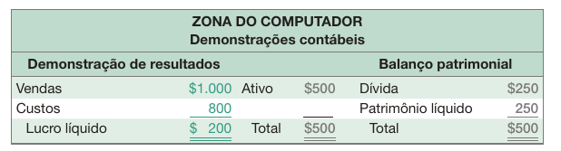
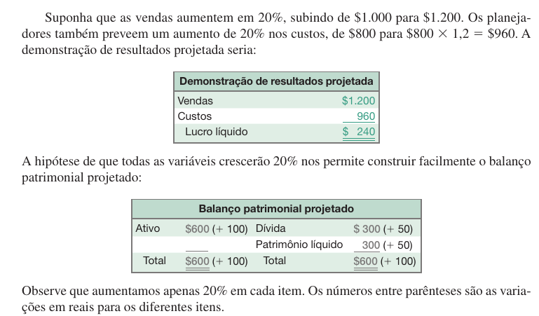
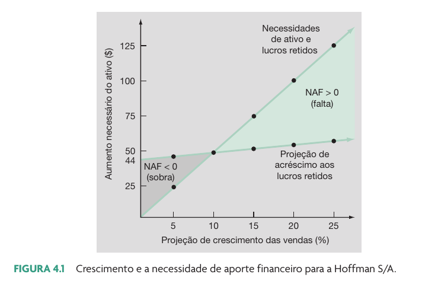

```{r}
classtools::setup_quarto_slides("content")

link_gsheets <- "https://docs.google.com/spreadsheets/d/1Vw3FWYJEtoRpdDSjaFIkTpJTocmv188T/edit?usp=sharing&ouid=103156289155136363092&rtpof=true&sd=true"
```


# Introdução ao planejamento financeiro

## O que é planejamento de longo prazo?

> Planejamento financeiro é uma declaração do que deve ser feito no futuro

- Consequência de um ambiente com incerteza
- Crescimento como objetivo da administração financeira

## Elementos para o planejamento financeiro

::: {.incremental}
- Investimento em novos ativos, determinado pelas decisões de orçamento de capital
- Grau de alavancagem financeira, determinado pelas decisões de estrutura de capital
- Caixa pago aos acionistas, determinado pelas decisões de dividendos
- Exigências de liquidez, determinadas pela decisão de capital de giro
:::


## O papel do planejamento financeiro

::: {.incremental}
- **Examinar interações** - ajudar o gestor a perceber interações entre as decisões
- **Explorar opções** - fornecer um quadro sistemático para a gestão explorar oportunidades
- **Evitar surpresas** - ajudar a gestão a identificar possíveis resultados e a se planejar para eles
- **Assegurar a exeqüibilidade e a consistência interna** - ajudar os gestores a avaliar se os objetivos podem ser realizados e se os vários objetivos (declarados ou não) da organização são consistentes uns com os outros.
:::

## O processo de planejamento financeiro

::: {.incremental}
- **Horizonte de planejamento** - separa as decisões em decisões para o curto prazo (geralmente os próximos 12 meses) e as decisões para o longo prazo (geralmente 2 - 5 anos)
- **Agregação** - combinar decisões de orçamento de capital em um grande projeto
- Cenários e premissas
  - Elabore premissas realistas para variáveis importantes
  - Rode vários cenários em que você varia as conjeturas em valores razoáveis
  - Determine, no mínimo, um cenário para o pior caso, outro para o caso normal e um para o melhor caso 
:::


## Ingredientes de um modelo de planejamento financeiro

::: {.incremental}
- **Premissas econômicas** - premissas explícitas acerca do futuro do ambiente econômico.
- **Previsão de vendas** - muitos fluxos de caixa dependem diretamente do nível das vendas (geralmente estimadas com o uso de uma taxa de crescimento)
- **Demonstrações financeiras projetadas** - montar o plano usando demonstrações financeiras projetadas permite a consistência e facilita a interpretação
- **Necessidade de ativos** - os ativos adicionais que serão exigidos para alcançar as projeções de vendas
- **Necessidades de financiamento** - o valor do financiamento necessário para pagar pelos ativos necessários
- **Variável de fechamento** - definida pelos gestores ao decidir o tipo de financiamento que será utilizado para fechar  o balanço patrimonial.
:::


# Exemplo ZONA DO COMPUTADOR {background-image="figs/loja-computador.jpg" background-opacity=0.25}


## DRE e BP {background-image="figs/loja-computador.jpg" background-opacity=0.25}

```{r}
#| fig-cap: !expr classtools::cite_ross(98)

```


## Premissas {background-image="figs/loja-computador.jpg" background-opacity=0.25}

- Receitas irão crescer a 20% 
- Todos os itens são diretamente ligados às vendas, em nível ótimo.
- Em consequência, todos os demais itens crescerão também a 20%.


## Resultado da Projeção {background-image="figs/loja-computador.jpg" background-opacity=0.25}

```{r}
#| fig-cap: !expr classtools::cite_ross(98)

```

. . .

::: {.callout-important}
## Como conciliar o LL com o PL?

Como pode o lucro líquido ser igual a 240 e o aumento do patrimônio líquido de apenas 50? A resposta é que a Zona do Computador provavelmente terá pago a diferença de 240 - 50  = 190 em dividendos. Nesse caso, os dividendos são a variável de fechamento.
:::


## Exemplo: Balanço Projetado {background-image="figs/loja-computador.jpg" background-opacity=0.25}

- Caso I: **dividendos são a variável de fechamento**
  - Dividendos = 240 (LL) - 50 (aumento no PL) = 190 dividendos a pagar.

- Caso II: **dívida é a variável de fechamento** 
  - não há pagamento de dividendos
  - Lucro é colocado em "lucros acumulados"
    - PL = 250 + 240 = 490
  - Ativo total tem que manterse- em 600. Assim, o novo valor de dívidas deve ser:
    - Dívida = 600- 490 = 110


## A abordagem da percentagem de vendas (1)

> Alguns itens variam diretamente com as vendas, enquanto outros não. 

:::: {.columns}

::: {.column width="50%"}
**DRE**

- Os custos podem variar diretamente com as vendas;
- A depreciação e as despesas com juros podem não variar diretamente com as vendas;
- Dividendos são uma variável de gestão e geralmente não variam diretamente com as vendas;
:::

::: {.column width="50%"}
**Balanço Patrimonial**

- Inicialmente suponha que todos os ativos, inclusive os imobilizados, variam diretamente com as vendas.
- Contas a Pagar, geralmente, irá variar diretamente com as vendas também.
- PnC e capital próprio geralmente não variam diretamente com as vendas
- A variação de lucros não distribuídos que modifica o PL vem da decisão de dividendos.

:::

::::


## Exemplo de cálculo

- Exemplo `r classtools::cite_ross(103)`
  - [link GSheets](`r link_gsheets`)


# Taxas de Crescimento

## Exemplo: Necessidade de Aportes Financeiros

```{r}
# das projeções da planilha
AT <- 3750
PT <- 3185

naf <- AT - PT
```


- A empresa necessita obter financiamento adicional de `r classtools::format_cash(naf)` em dívidas ou em chamada de capital fechar o seu balanço patrimonial
  - Ativo total = Dívida total & PL = `r classtools::format_cash(AT)` - `r classtools::format_cash(PT)` = `r classtools::format_cash(naf)` 

- Escolha a variável de fechamento 
  - Tome empréstimos a curto prazo (Empréstimos PC)
  - Tome empréstimos a longo prazo (PnC)
  - Emita ações (Capital Social e Reservas)
  - Diminua a taxa de distribuição de dividendos, o que aumenta a retenção de lucros


## Crescimento e aportes financeiros

- A baixas taxas de crescimento o financiamento interno (os lucros retidos como “Reservas de Lucros”) pode até exceder a necessidade de investimento em ativos
- Entretanto, à medida que a taxa de crescimento aumenta, o financiamento interno não será suficiente e a empresa terá que buscar o mercado para obter novos financiamentos
- A relação entre o crescimento, o financiamento interno e a necessidade de financiamento fora da operação é uma ferramenta útil para o planejamento de longo prazo


## A taxa de crescimento interna (TCI)

```{r}
library(classtools)

name_company <- "MAR de ROSAS S/A"
LL <- 132
AT <- 3000
PL <- 1800
ROA <- LL/AT
ROE <- LL/PL
b <- 0.5

TCI <- (ROA*b)/(1-ROA*b)
TCS <- (ROE*b)/(1-ROE*b)
```

> A taxa de crescimento interna nos diz a que taxa a empresa pode crescer seus ativos usando apenas os lucros retidos como “Reservas de Lucros” como fonte de financiamento.

$$TCI=\frac{ROA *b}{1 - ROA*b}$$

$b$ - taxa de retenção de lucros

- Usando as informações da MAR DE ROSAS S/A e com $b = `r b`$ e $ROA=`r ROA`$:
$$TCI=`r TCI`$$

O valor de TCI nos diz que a empresa `r name_company`  pode crescer  `r format_percent(TCI)` ao ano, apenas usando os lucros retidos como fonte de financiamento.


## Ilustração Taxa de crescimento interna

```{r}
#| fig-cap: !expr classtools::cite_ross(108)

```


## A taxa de crescimento sustentável (TCS)

> A taxa de crescimento sustentável nos diz a que taxa a empresa pode crescer usando o financiamento de reservas de lucros e novas dívidas, para manter constante a relação entre dívida e capital próprio.

$$TCS=\frac{ROE *b}{1 - ROE*b}$$
$b$ - taxa de retenção de lucros

- Usando as informações da Empório dos Brinquedos S/A e com $b = `r b`$ e $ROE = `r ROE`$:

$$TCS= `r TCS`$$

O valor de TCS nos diz que a empresa `r name_company` pode crescer  `r format_percent(TCS)` ao ano, sempre usando o financiamento de reservas de lucros e novas dívidas, e mantendo  constante a relação entre dívida e capital próprio.


## Determinantes do crescimento (ROE e Dupont)

$$TCS=\frac{ROE*b}{1-ROE*b}$$

$$ROE=ML*GAT*MPL$$

- Margem de lucros (ML) - eficiência da operação
- Giro do ativo total (GAT) - eficiência no uso dos ativos
- Alavancagem financeira (MPL) - escolha do índice ótimo de endividamento
- Política de dividendos - Escolha do quanto pagar aos acionistas versus quanto reinvestir na empresa


## Referências {-}
