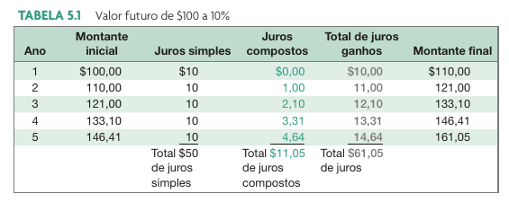
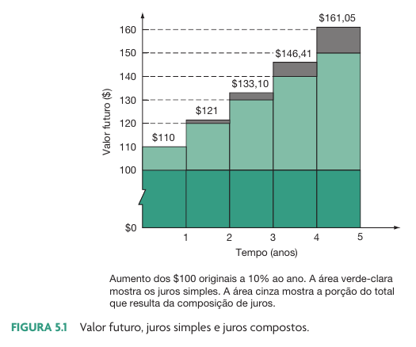

```{r}
l_selic <- classtools::get_selic_rate()
l_poup <-  classtools::get_poupanca_rate()
```

# O valor do dinheiro no tempo

## Introdução

> O Valor do Dinheiro no Tempo (VDT) é um conceito fundamental em finanças que reconhece que o dinheiro disponível hoje vale mais do que a mesma quantia no futuro. 

::: {.incremental}
Isso se deve a diversas razões, como:

- a possibilidade de investir o dinheiro e obter retornos financeiros
- inflação que erode o poder de compra do dinheiro ao longo do tempo
- preferência natural das pessoas por receber o dinheiro agora em vez de esperar no futuro.
:::

## Fatores que Influenciam o VDT

O valor do dinheiro no tempo é influenciado por três fatores principais:

```{r}
l_selic <- classtools::get_selic_rate()

selic_aa <- classtools::format_percent(l_selic$aa)

l_ipca <- classtools::get_ipca_df()

ipca_aa <- classtools::format_percent(l_ipca$aa)

```


::: {.incremental}
Taxa de Juros
: A taxa de juros é o custo de tomar dinheiro emprestado ou o retorno de investir dinheiro. A referência de taxa de juros no Brasil é a SELIC, hoje em `r selic_aa` ao ano.

Inflação
: Representa o aumento de preços de uma cesta de produtos. O principal índice de inflação é o IPCA (Índices de Preços ao Consumidor Amplo). A última variação do IPCA foi de `r classtools::format_percent(l_ipca$am)` ao mês (`r classtools::format_percent(l_ipca$aa)` ao ano)

Tempo (ou horizonte de investimento)
: Quanto mais tempo o dinheiro for investido, maior será o retorno cumulativo e, consequentemente, maior será o valor final.
:::

# Valor Futuro

## Conceito

> O valor futuro é o valor no futuro de um fluxo de caixa hoje

$$VF = VP*(1+r)^T$$

$VF$ - Valor futuro

$VP$ - Valor presente

$r$ - taxa de juros

$T$ - Número de períodos à frente


## Investindo por um período

```{r}
invested <- 1000
my_T_1 <- 1
my_T_2 <- 5
my_T_3 <- 15

vf_1 <- invested*(1+l_poup$aa)^my_T_1
vf_2 <- invested*(1+l_poup$aa)^my_T_2
vf_3 <- invested*(1+l_poup$aa)^my_T_3
```

> Suponhamos que você invista `r classtools::format_cash(invested)` na poupança do Banco do Brasil, a qual paga atualmente `r classtools::format_percent(l_poup$aa)` ao ano. Qual será o valor em poupança após:

- `r my_T_1` anos? 
- `r my_T_2` anos?
- `r my_T_3` anos?

<hr>

. . .

- Em `r my_T_1` ano, você terá `r classtools::format_cash(vf_1)`. Esse valor equivale ao seu valor original de `r classtools::format_cash(invested)` mais `r classtools::format_cash(vf_1 - invested)` de juros que você ganhou. 

- Em `r my_T_2` anos, o investimento terá crescido ao valor de `r classtools::format_cash(vf_2)`

- Em `r my_T_3` ano você terá `r classtools::format_cash(vf_3)`. Esses `r classtools::format_cash(vf_3)` equivalem ao seu valor original de `r classtools::format_cash(invested)` mais `r classtools::format_cash(vf_3 - invested)` de juros que você ganhou. 


## Juros composto e simples

> **Juros composto** é aquela onde juros incide sobre juros. É a forma mais comum no mundo real.

> **Juros simples** é aquele juros que somente incide sobre um valor único.**É praticamente inutilizado hoje em dia, com raras excessões**.
> **Juros simples** é aquele juros que somente incide sobre um valor único. **É praticamente inutilizado hoje em dia, com raras exceções**.

## Exemplo Tabela

```{r}
#| fig-cap: !expr classtools::cite_ross(126)


```

## Exemplo Gráfico

```{r}
#| fig-cap: !expr classtools::cite_ross(127)


```

## O impacto do tipo de juro

```{r}
r <- 0.1
valor_inicial <- 1000
nT <- 50

total_js <- valor_inicial + nT*valor_inicial*r
total_jc <- valor_inicial*(1+r)^nT
```

Valor investimento inicial = `r classtools::format_cash(valor_inicial)`

Taxa de juros = `r classtools::format_percent(r)`

Número de anos = `r nT`

<hr>

**Resultado**:

Valor Futuro (juros simples) = `r classtools::format_cash(total_js)`

Valor Futuro (juros compostos) = `r classtools::format_cash(total_jc)`


## Juros do SP500

```{r}
my_date <- '1950-01-01'
df_sp500 <- yfR::yf_get('^GSPC', my_date)

last_date <- max(df_sp500$ref_date)
invested <- 10000
total_ret <- dplyr::last(df_sp500$price_adjusted)/dplyr::first(df_sp500$price_adjusted) - 1 

get_r_aa <- function(total_ret, first_date, last_date) {
  n_days <- as.numeric(last_date - first_date)
  n_years <- n_days/365
  
  r_aa <- (1+total_ret)^(1/n_years) - 1
  return(r_aa)
}

vf <- invested*total_ret
first_date <- min(df_sp500$ref_date )
n_years <- as.numeric(last_date - first_date)/365
r_aa_sp500 <- get_r_aa(total_ret, first_date, last_date)

fmt_dollar <- function(x) {
  x <- scales::dollar(x, big.mark = ".", decimal.mark = ",")
  return(x)
}
```

> Se um investidor colocasse `r fmt_dollar(invested)` no índice SP500 em `r classtools::format_date(my_date)`, qual seria o valor em `r classtools::format_date(last_date)`, após `r format(n_years, digits = 3)` anos de investimento?

O montante seria de `r fmt_dollar(vf)`, com uma capitalização nominal (com inflação) de `r classtools::format_percent(r_aa_sp500)` ao ano.


## Juros do Ibovespa

```{r}
my_date <- '1995-01-01'
df_ibov <- yfR::yf_get('^BVSP', my_date)

last_date <- max(df_ibov$ref_date)
invested <- 10000
total_ret <- dplyr::last(df_ibov$price_adjusted)/dplyr::first(df_ibov$price_adjusted) - 1 

vf <- invested*total_ret
first_date <- min(df_ibov$ref_date )
n_years <- as.numeric(last_date - first_date)/365

r_aa_ibov <- get_r_aa(total_ret, first_date, last_date)
```

> Se um investidor colocasse `r classtools::format_cash(invested)` no Ibovespa em `r classtools::format_date(my_date)`, qual seria o valor em `r classtools::format_date(last_date)`, após `r format(n_years, digits = 3)` anos de investimento?

O montante seria de `r classtools::format_cash(vf)`, com uma capitalização de `r classtools::format_percent(r_aa_ibov)` ao ano.


## Juros do Tesouro Direto

```{r}
df_td <- GetTDData::td_get("NTN-B Principal", dl_folder = 'td-data')

selected <- "NTN-B Principal 150824"

df_td <- df_td |>
  dplyr::filter(asset_code == selected)

first_date <- min(df_td$ref_date)
last_date <- max(df_td$ref_date)
invested <- 10000
total_ret <- dplyr::last(df_td$price_bid)/dplyr::first(df_td$price_bid) - 1 

vf <- invested*total_ret
first_date <- min(df_td$ref_date )
n_years <- as.numeric(last_date - first_date)/365

r_aa_td <- get_r_aa(total_ret, first_date, last_date)
```

> Se um investidor colocasse `r classtools::format_cash(invested)` no titulo do tesouro direto **`r selected`** na data de lançamento (`r classtools::format_date(first_date)`), qual seria o resultado do investimento em `r classtools::format_date(last_date)`, após `r format(n_years, digits = 3)` anos de investimento?

O montante seria de `r classtools::format_cash(vf)`, com uma capitalização de `r classtools::format_percent(r_aa_td)` ao ano.


## O caso Barsi (o efeito dos juros compostos) {.hidden}

```{r}
anos <- 56
meses <- anos*12
aporte <- 2500
inicial <- 100000
r <- 0.15
r_am <- (1+r)^(1/12) - 1

P <- numeric(meses)
P[1] <- inicial

for (t in 2:meses) {
  P[t] <- P[t-1]*(1+r_am) + aporte
}

classtools::format_cash(P[length(P)])
```

> Luiz Barsi é um dos maiores investidores individuais da bolsa de valores brasileira, conhecido como o "Rei dos Dividendos".

- Começou a investir com 30 anos e hoje tem 86. Ficou 56 anos investindo.

- Se ele investisse 1000 reais a uma taxa de juros real e constante de 10% ao ano, o final dos anos teria `r classtools::format_cash(P[length(P)])`


# Valor presente

## Valor presente de um único período 

> Dada uma taxa de desconto, o valor presente nos diz qual o valor justo hoje, de um valor futuro.

$$VP = \frac{VF}{(1+r)^T}$$

$VP$ - valor presente

$VF$ - valor futuro

$r$ - taxa de juros

$T$ - número de períodos

## Exemplo VP

```{r}
my_T <- 5

debt <- 5000
vp <- debt/(1+l_poup$aa)^my_T
```

> Imagine que daqui a `r my_T` anos terá que pagar uma dívida a vista com valor nominal de `r classtools::format_cash(debt)`. Qual deve ser o valor investido em poupança (r = `r classtools::format_percent(l_poup$aa)` ao ano) hoje para ter esse montante na conta em `r my_T` anos?

. . .

- Ao investir `r classtools::format_cash(vp)` na poupança hoje, em `r my_T` anos terás `r classtools::format_cash(debt)` disponíveis em conta. 


# Retorno em investimentos

## Introdução 

- Todo investimento tem 
  1. Custo de entrada ($FC_0$)
  2. fluxos de caixa positivos no futuro
      - Proventos: dividendos ou cupons ($FC_t$)
      - Venda de ação/título de dívida ($FC_T$)

$$R = \frac{FC_T + \sum ^T _{t=1} FC_t}{FC_0} - 1$$

```{r}
ticker <- "EGIE3"
```

## Fluxo de Caixa (`r ticker`)

```{r}
first_date <- "2018-01-01"

l_p <- classtools::make_cashflow_plot(ticker, "SA", first_date)

l_p$p
```

## O retorno do investidor (`r ticker`)

```{r}
# using yf

#df_yf <-  yfR::yf_get(ticker, first_date)
#df_div <- yfR::yf_get_dividends(ticker, first_date)

#min_date <- min(df_yf$ref_date)
#max_date <- max(df_yf$ref_date)

#price_buy <- dplyr::first(df_yf$price_close)
#price_sell <- dplyr::last(df_yf$price_close)

#sum_div <- sum(df_div$dividend)

#R <- (price_sell + sum_div)/price_buy -1

# using eodhdR2

#df_prices <- eodhdR2::get_prices(ticker, "SA", first_date) |>
#  dplyr::filter(date >= as.Date(first_date))

df_prices <- l_p$df_prices

df_div <- eodhdR2::get_dividends(ticker, "SA")  |>
  dplyr::filter(date >= as.Date(first_date))

df_div <- l_p$df_div

min_date <- min(df_prices$date)
max_date <- max(df_prices$date)

price_buy <- dplyr::first(df_prices$close)
price_sell <- dplyr::last(df_prices$close)

sum_div <- sum(df_div$valor)

R <- (price_sell + sum_div)/price_buy -1

```

> Um investidor que comprou uma ação da `r ticker` em `r classtools::format_date(min_date)` por `r classtools::format_cash(price_buy)` e vendeu em `r classtools::format_date(max_date)` por `r classtools::format_cash(price_sell)` recebeu um total de `r classtools::format_cash(sum_div)` de dividendos no período. Dada estas informações, qual o retorno total do investidor?

$$R = \frac{`r price_sell` + `r sum_div`}{`r price_buy`} - 1$$

O resultado é `r classtools::format_percent(R)`.


# O caso [Betina](https://www.youtube.com/watch?v=guM8PhzVpF8)

```{r}
#| fig-align: center

```

> Oi, meu nome é Betina, tenho 22 anos e um milhão e 42 mil de patrimônio acumulado. Comecei com 19 anos e 1500 R$...” 


## A matemática da Betina não fecha..

```{r}
initial_cash <- 1500
last_cash <- 1000043
my_T <- 3 # years

r_aa <- (last_cash/initial_cash)^(1/my_T) -1 
r_am <- (last_cash/initial_cash)^(1/(my_T*12)) -1 

df_betina <- tibble::tibble(
  Anos = 0:10,
  Valor = classtools::format_cash(initial_cash*(1+r_aa)^Anos)
)
```

O valor de `r classtools::format_cash(initial_cash)` investido por `r my_T` anos transforma-se em `r classtools::format_cash(last_cash)`, o que é equivalente a `r classtools::format_percent(r_am)` ao mês (`r classtools::format_percent(r_aa)`) ao ano). Ao longo de 10 anos, teremos:

```{r}
df_betina |>
  gt::gt() |>
  gt::tab_header("O investimento de Betina")
```


## Referências