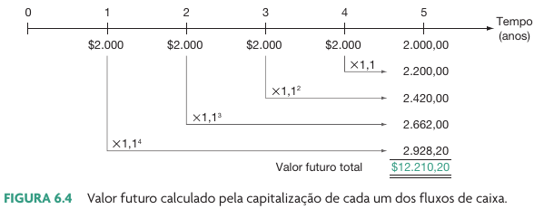

## Objetivos {.unlisted}

```{r}
l_selic <- classtools::get_selic_rate()
l_poup <- classtools::get_poupanca_rate()
```

- Como determinar os valores presente e futuro de investimentos com vários fluxos de caixa.
- Como calcular os pagamentos e as taxas de juros de empréstimos.
- Como empréstimos são amortizados ou completamente pagos.
- Como as taxas de juros são cotadas (da maneira certa e errada).


# Valor presente de múltiplos períodos

## Fórmula VP

$$VP = \sum ^T _{t=1} \frac{VF_t}{(1+r)^t}$$

$VP$ - Valor presente dos múltiplos fluxos de caixa

$VF_t$ - valor futuro do fluxo de caixa no tempo $t$

$r$ - taxa de juros

$T$ - número de períodos

## Exemplo

```{r}

my_T <- 5
fc <- 5000
r <- l_selic$aa

df_fc <- tibble::tibble(
  Tempo = 0:my_T,
  Valor = c(0, seq(1000, 1500, length.out = my_T))
)

```

> Imagine que daqui durante `r my_T` anos irá receber dinheiro a cada ano, conforme tabela abaixo. Assumindo uma taxa de juros de `r classtools::format_percent(r)`, qual o valor presente desses fluxos de caixa?

```{r}
df_fc |>
  gt::gt() |>
  gt::tab_header("Fluxos de caixa")
```

## Solução

```{r}
df_fc <- df_fc |>
  dplyr::mutate(`Valor descontado` = Valor/(1+r)^Tempo,
                `Valor acumulado` = cumsum(`Valor descontado`))

vp <- sum(df_fc$`Valor descontado`)

df_fc |>
  gt::gt() |>
  gt::tab_header("Fluxos de caixa",
                 glue::glue('custo de capital = {classtools::format_percent(r)}'))
```

O valor presente dos fluxos de caixa é `r  classtools::format_cash(vp)`.

## Anuidades

```{r}
cf <- 1000
my_T <- 10

l_out <- classtools::create_cashflow_plot(0, rep(cf, my_T-1), cf)
```


> Uma anuidade é um fluxo de caixa contante e igual para todo o período

Um exemplo é receber `r classtools::format_cash(cf)` por ano, ao longo de `r my_T` anos:

```{r}
l_out$p
```

## Solução

Usando a fórmula anterior e assumindo $FC_t = FC$:

$$VP = \sum ^T _{t=1} \frac{VF}{(1+r)^t}$$

Simplificando a fórmula: 

$$VP = FC \frac{1 - \frac{1}{(1+r)^T}}{r}$$

## Exemplo anuidade

> Imagine que daqui durante `r my_T` anos irá receber dinheiro a cada ano, conforme tabela abaixo. Assumindo uma taxa de juros de `r classtools::format_percent(r)`, qual o valor presente desses fluxos de caixa?


```{r}
my_T <- 5
fc <- 5000
r <- l_selic$aa

df_fc <- tibble::tibble(
  Tempo = 0:my_T,
  Valor = c(0, rep(fc, my_T))
)


df_fc <- df_fc |>
  dplyr::mutate(`Valor descontado` = Valor/(1+r)^Tempo,
                `Valor acumulado` = cumsum(`Valor descontado`))

vp <- sum(df_fc$`Valor descontado`)

df_fc |>
  gt::gt() |>
  gt::tab_header("Fluxos de caixa",
                 glue::glue('custo de capital = {classtools::format_percent(r)}'))
```

O valor presente dos fluxos de caixa é `r  classtools::format_cash(vp)`.

## Perpetuidades

> Perpetuidades são fluxos de caixa constantes e perpétuos (nunca terminam)

Substituindo $T = \inf$ na fórmula do VP, temos:

$$VP = \sum ^{\inf} _{t=1} \frac{VF}{(1+r)^t}$$

Simplificando e levando a equação anterior ao limite onde $t$ aproxima-se de do infinito ($\inf$), temos:

$$VP=\frac{FC}{r}$$


# Valor futuro de múltiplos períodos

## Fórmula $VF$

$$VF_t = \sum ^{T-1} _{t=1} VF_t (1+r)^{T-t}$$

$VF_t$ - valor futuro do fluxo de caixa no tempo $t$

$r$ - taxa de juros

$T$ - número de períodos

## Ilustração

```{r}
#| fig-cap: !expr classtools::cite_ross(150)


```


## Exemplo cálculo

```{r}
my_T <- 10
fc <- 1000
r <- l_poup$am

df_fc <- tibble::tibble(
  Tempo = 0:my_T,
  Valor = c(0, rep(fc, my_T))
)

```

> Imagine que irás depositar `r classtools::format_cash(fc)` por mês na poupança pelos próximos `r my_T` meses. Ao final do `r my_T` período, qual o valor encontrado na conta poupança?

. . .

```{r}
df_fc |>
  gt::gt() |>
  gt::tab_header("Fluxos de caixa")
```

## Solução

```{r}
df_fc <- df_fc |>
  dplyr::mutate(`VF` = Valor*(1+r)^(my_T - Tempo),
                `VF acumulado` = cumsum(VF))

vf <- sum(df_fc$`VF`)

df_fc |>
  gt::gt() |>
  gt::tab_header("Fluxos de caixa",
                 glue::glue('Taxa de juros = {classtools::format_percent(r)}'))
```

O valor futuro dos fluxos de caixa é `r  classtools::format_cash(vf)`.


##  A importância do reinvestimento dos dividendos

- Investimentos renda variável (Ações e FIIs) dão direito ao recebimento de dividendos (parcelas do lucro)

- Esses dividendos variam no valor de acordo com lucro e decisão do payout

- A frequência também não é sempre percebida (empresas decidem quando e como vão pagar)

- Esse dinheiro pode ser gasto ou reinvestido

- O não reinvestimento causa grande impacto no patrimônio

## O caso da EGIE3

```{r}
ticker <- "EGIE3"
first_date <- "2015-01-01"

l_out <- classtools::make_cashflow_plot(ticker, 
                                        'SA',
                                        first_date)

CF <- l_out$CF
total_divs <- sum(CF$CF[2:(nrow(CF)-1)])
P_0 <- -CF$CF[1]
P_T <- CF$CF[nrow(CF)]

ret_investidor <- (total_divs + P_T)/P_0 - 1

l_out$p
```

##  O impacto do não reinvestimento de dividendos

```{r}
require(dplyr)
require(ggplot2)

ticker <- "EGIE3.SA"
first_date <- "2010-01-01"

l_out <- classtools::make_cashflow_plot(ticker, 'SA', first_date)

df_yf <- l_out$df_prices |>
  dplyr::mutate(cumret_close = price_close/first(price_close),
                cumret_adj = adjusted_close/first(adjusted_close))

df_plot <- tibble(
  prices = c(df_yf$cumret_close, df_yf$cumret_adj),
  ref_date = rep(df_yf$ref_date, 2),
  type = c(rep("Sem reinvestimendo de dividendo", nrow(df_yf)),
           rep("Reinvestindo dividendo", nrow(df_yf))
           )
)

p <- ggplot(df_plot, aes(x = ref_date, y = prices, color = type)) + 
  geom_line() + 
  labs(title = paste0("Efeito do reinvestimendo do dividendo (", ticker, ")"),
       x = 'Dias',
       y = "Investimento acumulado",
       color = "Tipo") + 
  scale_y_continuous(labels = classtools::format_percent) + 
  theme_light()

p
```


# Mudança de taxa de retorno

## Mensal para anual

```{r}
selic_aa <- dplyr::last(l_selic$aa)
selic_am <- l_selic$am
```

Dada uma taxa SELIC hoje de `r classtools::format_percent(selic_aa)` ao ano:

:::: {.columns}

::: {.column width="50%"}
**Anual para mensal**

$$r_{am} = (1+r_{aa})^{1/12} - 1$$

Um retorno anual de `r classtools::format_percent(selic_aa)` equivale a `r classtools::format_percent(selic_am)` ao mês. 
:::

::: {.column width="50%"}
**Mensal para anual**

$$r_{aa} = (1+r_{am})^{12} - 1$$

```{r}
r <- 0.2
```


Um retorno mensal de `r classtools::format_percent(selic_am)` equivale a `r classtools::format_percent(selic_aa)` anualmente

:::

::::


# Custo de uma dívida

## CET

> O CET, **Custo Efetivo Total** é a taxa de juros **real** do empréstimo, incluindo **todas as tarifas e comissões cobradas**.

- O CET é utilizado em:
  - financiamento imobiliário
  - financiamentos em geral
  - cartão de crédito

. . .

::: {.callout-caution}
## Cuidado!
Apesar de ser legalmente obrigado a divulgar a taxa CET em qualquer empréstimo, o banco/vendedor geralmente esconde a CET até a assinatura do contrato!
:::

## Exemplo CET

```{r}
debt <- 10000
r_nominal <- l_selic$aa
my_T <- 3

vf <- debt*(1+r_nominal)^my_T
cost_register <- 150
cost_credit <- 500

true_debt <- debt - cost_register - cost_credit
```


> Imagine pegar `r classtools::format_cash(debt)` emprestado no banco a uma taxa nominal de `r classtools::format_percent(r_nominal)` ao ano (SELIC), com pagamento em `r my_T` anos.

. . .

O VF futuro a ser pago no ano `r my_T` é de `r classtools::format_cash(vf)`. Porém, o banco tem os seguintes custos na operação de concessão de empréstimo:

1) taxa fixa de registro de `r classtools::format_cash(cost_register)`
2) custo fixo de análise de crédito de `r classtools::format_cash(cost_credit)`

. . .

> No início da operação, o valor obtido do financiamento será de `r classtools::format_cash(true_debt)`, e não `r classtools::format_cash(debt)`.

## Solução CET

Os fluxos de caixa são:

```{r}
received <- debt - cost_credit - cost_register
l_p <- classtools::create_cashflow_plot(-received, rep(0, my_T-1),
                                        -vf)

l_p$p

cet <- (vf/received)^(1/my_T) - 1
```

Enquanto a taxa de juros nominal era de  `r classtools::format_percent(r_nominal)`, a CET é equivalente a `r classtools::format_percent(cet)`.

# Tipos de empréstimos

## Empréstimos tipo desconto

> O empréstimo tipo desconto é a forma mais simples de empréstimo. O mutuário recebe o dinheiro hoje e o paga em uma única parcela no futuro. 

```{r}
cf_0 <- 750
cf_t <- 0
cf_T <- 1000
my_T <- 5

l_p <- classtools::create_cashflow_plot(cf_0, rep(cf_t, my_T), cf_T)

l_p$p
```

## Cálculo da CET

> Dado um empréstimo de recebimento de `r classtools::format_cash(cf_0)` hoje, com pagamento de `r classtools::format_cash(cf_T)` em `r my_T` anos, qual o custo efetivo da dívida?

. . .

```{r}
cet <- FinCal::irr(l_p$cashflows$CF)
```


Calculando a tir, temos que:

CET = `r classtools::format_percent(cet)`

## Empréstimos com juros constantes

> Empréstimos com juros constantes são aqueles em que o mutuário paga somente juros a cada período e paga todo o principal (o montante original do empréstimo) em algum momento futuro.

```{r}
cf_0 <- -750
cf_t <- -50
cf_T <- -1000
my_T <- 5
custo <- 0

l_p <- classtools::create_cashflow_plot(cf_0-custo, rep(cf_t, my_T), cf_T)

l_p$p

cet <- FinCal::irr(l_p$cashflows$CF)
```

Aplicando a fórmula da TIR, temos que o CET é igual a `r classtools::format_percent(cet)`.


## Empréstimos com pagamento parcelado

> É aquele onde o credor exige do mutuário o pagamento de partes do montante do empréstimo ao longo do período do empréstimo. 

```{r}
cf_0 <- -750
cf_t <- -250
cf_T <- cf_t
my_T <- 5
custo <- 0

l_p <- classtools::create_cashflow_plot(cf_0-custo, rep(cf_t, my_T), cf_T)

l_p$p

cet <- FinCal::irr(l_p$cashflows$CF)
```
Aplicando a fórmula da TIR, temos que o CET é igual a `r classtools::format_percent(cet)`.

# Financiamento Imobiliário

## SAC X PRICE

:::: {.columns}

::: {.column width="50%"}
- **Sistema de Amortização Constante (SAC)**
  - o tomador paga prestações decrescentes. 
  - a dívida é amortizada de forma constante
:::

::: {.column width="50%"}
- **Tabela PRICE**
  - mantém as parcelas constantes
  - geralmente vale para prazos maiores
:::

::::

## [Exemplo](https://portal.loft.com.br/financiamento-price-sac/)

> Imagine que você tenha um financiamento de R$ 100 mil, Custo Efetivo Total (CET) de 8% e 60 meses para pagar. 

- Sua primeira parcela na Tabela PRICE, assim como todas as outras parcelas, custaria R\$ 8.079,79. 
  - Dentro da primeira, a amortização corresponderia a R\$ 79,79. Na última, a R\$ 7.481,29. 
  - Ao final, você teria pago R\$ 484.787,69 ao banco, sendo R\$ 384.787,69 de juros. 

- O mesmo valor e as mesmas condições no Sistema SAC teriam resultado: 
  - primeira parcela de R\$ 9.666,67. Já a última custaria R\$ 1.800. 
  - O valor da amortização se manteria constante em \$1.666,67. O valor total pago seria de R\$ \$344.000, sendo R\$ 244.000 de juros. 


## Referências