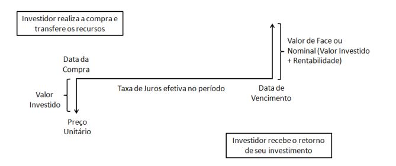
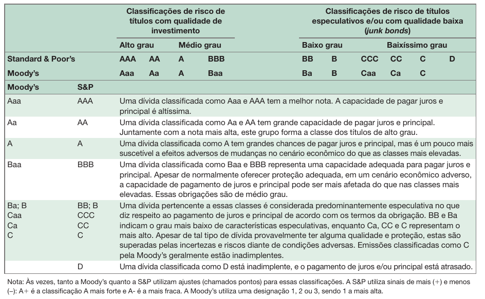
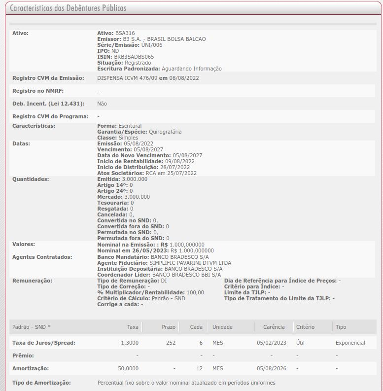

```{r}
#| echo: false
classtools::setup_quarto_slides("resources")
```

# Introdução a contratos de dívidas

## Introdução

```{r}
library(ggplot2)

#df_divida <- GetBCBData::gbcbd_get_series(2054,
 #                                      first.date = Sys.Date()-30)

url <- "https://api.bcb.gov.br/dados/serie/bcdata.sgs.2054/dados?formato=csv"
df_divida <- readr::read_csv2(url)

#total <- classtools::format_cash(dplyr::last(df_divida$value*1000000))
total <- classtools::format_cash(dplyr::last(df_divida$valor*1000000))
last_date <- max(df_divida$data)
```

> Títulos de dívida são contratos financeiros de troca de fluxos de caixa no tempo entre duas partes, o devedor e o credor

::: {.incremental}
- Tipo de contrato mais simples e mais popular 
- Para a empresa, uma dívida possui benefício fiscal e permite que novos lucros não sejam divididos com novos acionistas
  - Os juros, porém, podem deixar a empresa em posição financeira muito ruim

- Importância das dívidas para a Economia:
  - Em `r last_date`, o total da [dívida líquida do setor público](https://dadosabertos.bcb.gov.br/dataset/4505-divida-liquida-do-setor-publico--pib---total---banco-central), incluindo governo federal e estados, é de **`r total`**
:::


## Pergunta {background-image="figs/emprestimo.png" background-opacity=0.25}

> Um amigo _médio_ de vocês pediu para tomar `r classtools::format_cash(2500)` hoje, com pagamento da dívida em um ano.

::: {.incremental}
- Quais os pontos que vocês analisam antes de tomar a dívida?
- Quanto voces cobrariam?
:::

# Componentes de um título de renda fixa

## Quais os elementos do contrato?

<br>

::: {.incremental}
Valor de face
: Valor nominal de pagamento no final/expiração do contrato

Cupom (nominal ou percentual)
: Define os pagamentos intermediários, geralmente semestrais. Para chegar no valor nominal, multiplique o cupom percentual pelo valor de face.

Maturidade
: Data fixa de vencimento do contrato de dívida. Define o tempo da dívida.

**Risco de _default_**  
: Probabilidade de não pagamento da dívida e evento de _default_.
:::


# Tipos de dívidas

## Tipos de títulos (forma de pagamento)

::: {.incremental}
- **Títulos prefixados com (ou sem) pagamento de cupons**
  - O valor de face e os cupoms são pré-definidos
  - Quando cupons não existem, o comprador somente recebe o principal (valor de face).
    - Exemplo: Tesouro Prefixado 2021 (LTN), CDB de banco
    
- **Títulos pós fixados com (ou sem) pagamento de cupons**
  - Valores de face e cupons são vinculados a:
    - Inflação: IPCA (Índice nacional de preços ao consumidor amplo) ou IGP-M,- Índice Geral de preços do mercado
    - Juros: Taxa Selic – Taxa de retorno praticada entre o Banco Central do Brasil e os demais bancos. Exemplo:   Tesouro Selic 2021 (LFT), Tesouro IPCA+ 2019 (NTNB Princ)
:::

## Representação de um Título de Renda Fixa **SEM** Cupons

```{r}
#| fig-cap: "Exemplo de título de dívida sem cupom (fonte: [site TD](https://www.tesourodireto.com.br/titulos/tipos-de-tesouro.htm) )"

```

## Representação de um Título de Renda Fixa **COM** Cupons

```{r}
#| fig-cap: "Exemplo de título de dívida sem cupom (fonte: [site TD](https://www.tesourodireto.com.br/titulos/tipos-de-tesouro.htm) )"
knitr::include_graphics("figs/divida-com-cupom.png")
```

# Tipos de Emissores

## Possíveis emissores de dívidas

::: {.incremental}
:::: {.columns}

::: {.column width="50%"}
- **Título Públicos**
  - LTN - Letras do Tesouro Nacional (Tesouro Prefixado)
  - LFT - Letras Financeiras do Tesouro (Tesouro Selic)
  - NTN-B - Notas do Tesouro Nacional (Tesouro IPCA)
  - NTN-B1 - Renda+
:::

::: {.column width="50%"}
- **Títulos Privados**
  - Debêntures (longo prazo, maior do que 1 ano)
  - Notas promissórias (curto prazo, menores do que 1 ano)
:::

::::
:::

## Risco de uma dívida

> O risco de uma dívida é relativo as chances de não pagamento dos cupons ou valor principal.

::: {.incremental}
- Quanto maior a incerteza, maior o risco
  - O risco dos títulos públicos é sempre menor que o risco de títulos privados
  - O risco aumenta com a duração (maturidade) da dívida

- É prática de mercado cobrar o máximo, o mais antecipado possível (famosa tabela SAC no financiamento imobiliário). 
:::


# Tesouro Direto

## O Sistema do Tesouro Direto

> Sistema criado na parceria entre Bovespa (B3) e Tesouro nacional em 2002 para permitir a compra de títulos de dívida pública para a pessoa física

::: {.incremental}
- Oferece contratos de dívida com **remuneração** e **liquidez** atraentes
- Do ponto de vista do governo é uma nova fonte de obtenção de recursos, além de instrumento de política econômica

- Características:
  - Remuneração (pré-fixado ou pós-fixado)
  - Maturidade (por quanto anos dura o contrato)
  - Periodicidade de pagamentos (semestral ou no final do período de maturidade)
:::

## Preços e yields do Tesouro Direto {.scrollable}

Tabela disponível em <https://www.tesourodireto.com.br/titulos/precos-e-taxas.htm>

```{r}
#| eval: false
df_curr <- GetTDData::td_get_current()

df_curr <- df_curr |>
  dplyr::filter(!stringr::str_detect(name, "Renda+|Educa+|IGPM+")) |>
  dplyr::arrange(name)

tbl <- df_curr |>
  dplyr::rename(Maturidade = maturity,
                Nome = name,
                `Min. Qtd` = min_qtd,
                `Min. Valor` = min_value,
                `Valor Título` = price,
                `Taxa Anual` = annual_ret) |>
  dplyr::select(Nome, Maturidade, `Min. Qtd`, `Min. Valor`,
                `Valor Título`, `Taxa Anual`)

tbl |>
  gt::gt() |>
  gt::tab_header(glue::glue("Preços Atuais de Títulos do Tesouro Direto"),
                 glue::glue("Dados retirados do site em {Sys.Date()}")) |>
  gt::fmt_percent(`Taxa Anual`) |>
  gt::tab_style(
                style = gt::cell_text(weight = "bold"),
                locations = gt::cells_column_labels()
        )

```


## Preços do Tesouro Prefixado sem cupom

```{r}
library(glue)
library(GetTDData)
library(ggplot2)
library(lubridate)
library(tidyverse)

asset_codes <- 'LTN'
cache_folder <- "td-cache"

min_date <- as.Date("2010-01-01")

df <- td_get(asset_codes,
             dl_folder = cache_folder) 

df <- df |>
  dplyr::filter(
    ref_date >= min_date
    )

min_year <- min(year(df$ref_date))
max_year <- max(year(df$ref_date))

my_size <- 1

p_yields <-
  ggplot(data = df, aes(x = ref_date, y = yield_bid,
                        color = asset_code)) +
  geom_line(size = my_size) +
  labs(y = 'Retorno Préfixados', x = 'Data',
       title = glue('Retornos Pré-fixados para {n_distinct(df$asset_code)} {asset_codes}'),
       subtitle = glue('Dados entre {min_year} e {max_year}'),
       caption = glue('Dados obtidos junto ao Tesouro Nacional em {Sys.time()}'),
       legend = '') +
  theme_bw() +
  scale_color_discrete(name = 'Título TD') 

p_prices <- ggplot(data = df, aes(x = ref_date,
                           y = price_bid,
                           color = asset_code)) +
  geom_line(size = my_size) +
  labs(y = glue('Preços de {asset_codes}'),
       x = 'Data',
       title = glue('Preços para {n_distinct(df$asset_code)} {asset_codes}'),
       subtitle = glue('Dados entre {min_year} e {max_year}'),
       caption = glue('Dados obtidos junto ao Tesouro Nacional em {Sys.time()}')) +
  theme_bw() +
  scale_color_discrete(name = 'Título TD') 

```

```{r}
p_prices
```


## Taxas Anuais do Tesouro Prefixado sem cupons

```{r}
p_yields
```


## Taxas do Tesouro X SELIc

```{r}
fist_date <- min(df$ref_date)
df_selic <- GetBCBData::gbcbd_get_series(
  c("SELIC" = 1178),
  first.date = fist_date
)

p_yields <-
  ggplot(data = df, aes(x = ref_date, y = yield_bid,
                        color = asset_code)) +
  geom_line(size = my_size, alpha = 0.25) +
  geom_line(data = df_selic, aes(x = ref.date, y = value/100, color = "SELIC"), size =2, alpha = 1 ) +
  labs(y = 'Retorno Préfixados', x = 'Data',
       title = glue('Retornos Pré-fixados para {n_distinct(df$asset_code)} {asset_codes}'),
       subtitle = glue('Dados entre {min_year} e {max_year}'),
       caption = glue('Dados obtidos junto ao Tesouro Nacional em {Sys.time()}'),
       legend = '') +
  theme_bw() +
  scale_color_discrete(name = 'Título TD') 

p_yields 
```


## Performance do Tesouro Direto

```{r}
asset_codes <- c('LFT', 'LTN', 'NTN-B Principal')

min_year <- 2005
max_year <- lubridate::year(Sys.Date())

df <- td_get(asset_codes,
             min_year, 
             max_year,
             dl_folder = cache_folder)


#df <- dplyr::filter(df, ref_date > as.Date('2012-01-01'))

tab_perf <- df %>%
  group_by(asset_code) %>%
  summarise(first_date = min(ref_date),
            last_date = max(ref_date),
    n_years = (last_date - first_date)[[1]]/365,
            total_return = price_bid[which.max(ref_date)]/
              price_bid[which.min(ref_date)] - 1,
            yearly_return = (1+total_return)^(1/n_years) -1) %>%
  filter(n_years >= 3) %>%
  arrange(desc(yearly_return)) %>%
  mutate(total_return = scales::percent(total_return),
         yearly_return = scales::percent(yearly_return)) |>
  select(-n_years, -last_date)

```

:::: {.columns}

::: {.column width="50%"}
```{r}
tab_perf |>
  dplyr::slice_head(n = 10) |>
  gt::gt() |>
  gt::tab_header(gt::md("10 **Melhores** Retornos do Tesouro Direto"), 
                 glue("Dados entre {min_year} e {max_year}"))
```


:::

::: {.column width="50%"}
```{r}
tab_perf |>
  dplyr::slice_tail(n = 10) |>
  gt::gt() |>
  gt::tab_header(gt::md("10 **Piores** Retornos do Tesouro Direto"), 
                 glue("Dados entre {min_year} e {max_year}"))
```
:::

::::


# Debêntures

## O Mercado de Debêntures

- Uma empresa pode obter dinheiro para financiar suas operações através da emissão de dívidas chamadas debêntures

- O mercado secundário de debêntures no Brasil ainda é pouco líquido

- Quem comprar um volume alto de debêntures, provavelmente terá que ficar com o título até sua maturidade

- O risco das debêntures é sempre maior que o risco de títulos públicos, portanto elas oferecem melhor retorno

## Componentes de uma Debênture

- Termos da obrigação (preço, prazo, etc)
- Garantia (em caso de default)
- Preferência (em caso de default)
- Cláusula de resgate antecipado
- Cláusulas protetoras (e.g. Empresa emissora de debênture não pode tomar mais de X emprestado dentro de 5 anos)

## Risco das Obrigações

- Classificações de acordo com os quatros C:
  - Caráter
  - Capacidade
  - Colaterais 
  - Covenants (termos e condições)

- Classificações (agências Moodys and S&P)
  - AAA/Aaa
  - AA
  - A
  - BBB
  - BB
  - CC

## Quadro de classificação

```{r}
#| fig-cap: !expr classtools::cite_ross(209)


```

## Exemplo de Debênture

```{r}
#| fig-cap: "Extraído de [www.debentures.com.br](http://www.debentures.com.br/exploreosnd/consultaadados/emissoesdedebentures/caracteristicas_d.asp?tip_deb=publicas&selecao=BSA316)"


```

[Lista de Debêntures disponíveis](https://www.b3.com.br/pt_br/produtos-e-servicos/negociacao/renda-fixa/debentures/debentures-listados/)

## Referências
