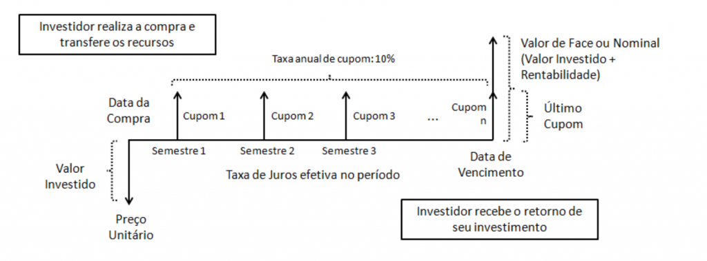
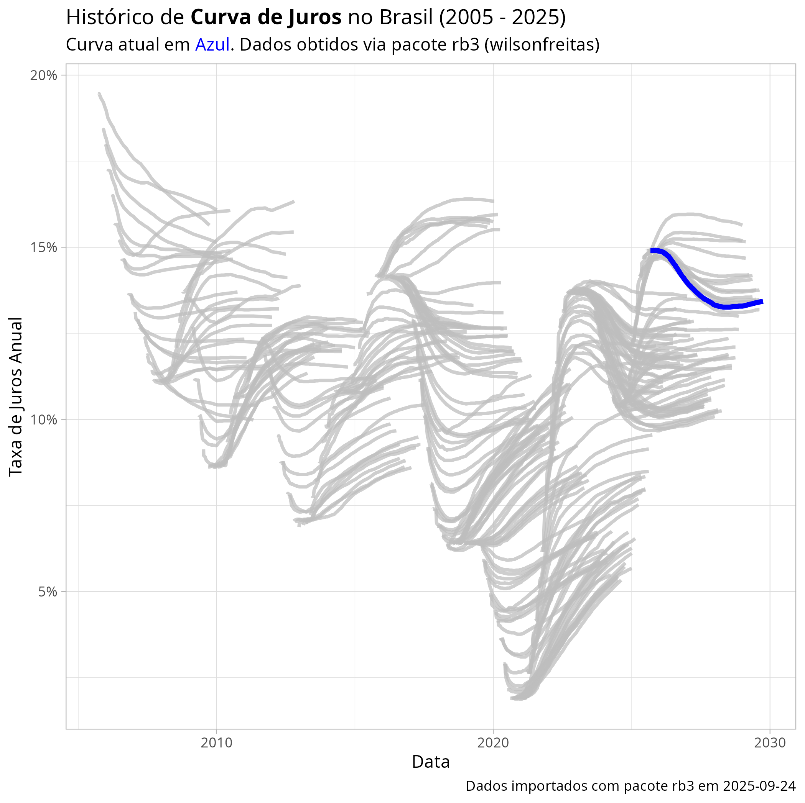

```{r}
#| echo: false
classtools::setup_quarto_slides("resources")
```

# Precificação de dívidas

## Introdução

> Títulos de dívida são nada mais que fluxos de caixa ao longo do tempo. 

- Conceitos de matemática financeira (TIR, VP, VF) são aplicáveis
- Componentes de uma dívida negociável no mercado:
  - Componente fixo: Maturidade e cronograma de pagamentos
  - Componentes variáveis: risco e remuneração (yield/retorno)

Todos cálculos disponíveis no [GSheet](https://docs.google.com/spreadsheets/d/12pu98nVWtEQJaEL03m-42M5HfTPTAPn6L-cEsuZU9qc/edit?usp=sharing).


## Representação de um Título de Renda Fixa com coupons

```{r}
#| fig-cap: "Exemplo de título de dívida sem cupom [(fonte)](https://www.tesourodireto.com.br/titulos/tipos-de-tesouro.htm)"


```


## Precificação de um título de dívida

$$VP = \sum ^T _{i=1} \frac{C}{(1+r)^i} + \frac{F}{(1+r)^T}  $$
onde:

$VP$ -  Valor do título hoje (tempo 0)

$T$ - Número de anos (ou intervalos de tempo)

$C$ - Cupom pago por intervalo

$r$ - Taxa de juros

$F$ - Valor de face (pago na data de vencimento da dívida)


# Marcação a Mercado

## O que é a marcação a mercado? {background-image="figs/pulling-hair-out.jpg" background-opacity=0.35}

> "**Professor, comprei uma LTN 2025 em fevereiro de 2020. Fui ver o valor de resgate hoje e estou com prejuízo. O que aconteceu?"**.

. . .

```{r}
#| cache: true
my_ltn <- 'LTN 010125'
min_year <- 2015
asset_codes <- 'LTN'

df <- GetTDData::td_get(asset_codes,
             min_year,
             dl_folder = 'td-cache/')
```

### `r my_ltn`: título pré-fixado sem pagamento de cupom

```{r}
library(glue)
library(ggplot2)
library(lubridate)
library(tidyverse)

min_trade_date <- as.Date("2020-03-01")
max_trade_date <- as.Date("2020-03-20")

df_temp <- df |>
  filter(asset_code == my_ltn,
         ref_date >= min_trade_date,
         ref_date <= max_trade_date)

#df <- dplyr::filter(df, ref_date > as.Date('2012-01-01'))

p <- ggplot(data = df_temp, aes(x = ref_date,
                           y = price_bid)) +
  geom_line() +
  labs(y = 'Preços',
       x = 'Data',
       title = glue('Marcação a Mercado para {my_ltn}'),
       subtitle = glue('Dados entre {min_trade_date} e {max_trade_date}'),
       caption = glue('Dados obtidos junto ao Tesouro Nacional em {Sys.time()}')) +
  theme_bw() +
  ylim(c(650, 800))


print(p)
```

## A história termina bem..

```{r}
library(glue)
library(GetTDData)
library(ggplot2)
library(lubridate)
library(tidyverse)

asset_codes <- 'LTN'
min_year <- 2015
min_date <- as.Date("2020-02-01")
max_date <- as.Date("2025-01-01")

df_temp <- df |>
  filter(asset_code == my_ltn,
         ref_date >= min_date,
         ref_date <= max_date)

#df <- dplyr::filter(df, ref_date > as.Date('2012-01-01'))

p <- ggplot(data = df_temp, aes(x = ref_date,
                           y = price_bid)) +
  geom_line() +
  labs(y = 'Preços',
       x = 'Data',
       title = glue('Marcação a Mercado para {my_ltn}'),
       subtitle = glue('Dados entre {min_date} e {max_date}'),
       caption = glue('Dados obtidos junto ao Tesouro Nacional em {Sys.Date()}')) +
  theme_bw() +
  geom_rect(aes(xmin = min_trade_date, 
                xmax = max_trade_date, 
                ymin = 500, ymax = 1000), 
            fill = "blue", 
            alpha = 0.002) +
  ylim(c(500, 1000))

print(p)
```


```{r}
my_ltn <- 'LTN 010122'
```


## Explicação

> Marcação a Mercado é a _precificação diária_ do seu investimento, isto é, a atualização frequente do preço de um ativo financeiro para o valor que o mercado está disposto a pagar.

- Os preços no Tesouro Direto variam pois: 
  - Os juros (e preços) oferecidos no mercado refletem uma expectativa geral dos participantes
  - Investidores possuem diferentes opiniões sobre risco
    - Caso eles achem que a remuneração oferecida em um título de dívida está alta, eles compram o título e puxam o preço para cima
    - Quando o preço aumenta, a remuneração oferecida diminui


## Retorno até vencimento (YTM) ou Taxa Interna de Retorno (TIR)

> A YTM (_Yield To Maturity_) representa o juros implícito do contrato. Em outras palavras, é a taxa de juros que faz com que o valor presente do contrato seja igual ao valor do título no mercado.

- Formas de cálculo
  - HP12C
  - Manual (tentativa e erro)
  - Gsheets
  
[Vai GSheets](https://docs.google.com/spreadsheets/d/12pu98nVWtEQJaEL03m-42M5HfTPTAPn6L-cEsuZU9qc/edit?usp=sharing)


## Exemplo do Tesouro Direto {.hidden}

```{r}
#| eval: false

df_td <- GetTDData::td_get_current() |>
  dplyr::filter(
    stringr::str_detect(name, "Tesouro Prefixado 2"))

df_td |> 
  dplyr::select(name, price, annual_ret) |>
  gt::gt() |>
  gt::cols_label(
    .list = list(name = "Nome",
    "price" = "Preço",
    annual_ret = "TIR anual")
  ) |>
  gt::fmt_percent("annual_ret") |>
  gt::tab_header(
    "Preços e Yields (TIR) de Títulos Prefixados",
    glue::glue(
      "Dados Retirados em {Sys.Date()}"
    )
  )

```


## Efeito dos Juros e Maturidades sobre Preços

> Quanto maior é o vencimento de uma dívida, mais sensível o preço desta a mudanças na taxa de juros da economia (SELIC)

```{r}
library(ggplot2)
library(glue)

vf <- 1000
coupom <- 0 #0.1*VF
r_vec <- seq(0.01, 0.3, by = 0.005)

n_vec <- c(1, 2, 5, 10, 25, 50)


calculate_price <- function(n, r) {
  
  cash_flow <- numeric(length = n+1)
  cash_flow[1] <- 0
  cash_flow[2:(n+1)] <- coupom
  cash_flow[n+1] <- cash_flow[n+1] + vf
  
  #vp <- FinCal::pv.uneven(r, cash_flow)
  vp <- sum( cash_flow/((1+r)^(0:n)) )
  
  out <- tibble::tibble(
    vp, n, r
  )
  
  return(out)
  
}

df_grid <- tidyr::expand_grid(
  r = r_vec, n = n_vec
)

results <- purrr::pmap_df(
  .l = as.list(df_grid),
  calculate_price
)

p <- ggplot(results,
            aes(x = r, y = vp, color = factor(n))) + 
  geom_line(linewidth = 2) + 
  labs(title = "Efeito da taxa de juros sobre diferentes maturidades",
       subtitle = glue("Título pré-fixado sem cupom, valor de face = {classtools::format_cash(vf)}"),
       x = "YTM/TIR",
       y = "Preço justo do título (VP)",
       color = "Prazo de vencimento") + 
  theme_light()
       
p
```

- A medida que os juros mudam (eixo x), os títulos com vencimento maior são mais afetados e apresentam maior variação de preço


# O impacto do Risco

## Introdução

> Quanto maior o risco de calote de uma dívida, maior deve ser o yield

- Risco de Default = Risco de calote (devedor não pagar)

- O risco é difícil de medir e está intrinsecamente relacionado ao produto e estrutura da dívida


## Taxa de mercado para aquisição de veículos

[Link]( https://www.bcb.gov.br/estatisticas/reporttxjuros?codigoSegmento=1&codigoModalidade=401101)

```{r}
#| eval: true

# dados do bcb (extraído do api da página)
# https://www.bcb.gov.br/estatisticas/reporttxjuros?codigoSegmento=1&codigoModalidade=401101

url <- "https://www.bcb.gov.br/api/servico/sitebcb/historicotaxajurosdiario/TodosCampos?filtro=codigoSegmento%20eq%20%271%27%20and%20codigoModalidade%20eq%20%27401101%27%20and%20InicioPeriodo%20eq%20%272023-05-09%27"

df_taxas_auto <- jsonlite::fromJSON(url)[[1]]

my_parse_number <- function(x) { 
  x <- readr::parse_number(x, 
                           locale = readr::locale(decimal_mark = ","))
  return(x)
}

tbl <- df_taxas_auto |>
  dplyr::mutate(`Instituição` = InstituicaoFinanceira,
                Juros_AA = my_parse_number(TaxaJurosAoAno)/100) |>
  dplyr::select(`Instituição`, Juros_AA) |>
  dplyr::arrange(desc(Juros_AA))

```

:::: {.columns}

::: {.column width="50%"}
```{r}
#| eval: true

tbl |>
  dplyr::slice_head(n = 10) |>
  gt::gt() |>
  gt::tab_header(
    title = gt::md("10 **Maiores** Taxas de Financialmento | Automóveis (Pessoa Física)"),
    subtitle = glue::glue("Dados obtidos em {Sys.time()}")
  ) |>
  gt::fmt_percent(Juros_AA)
```

:::

::: {.column width="50%"}
```{r}
#| eval: true

tbl |>
  slice_tail(n = 10) |>
  arrange(Juros_AA) |>
  gt::gt() |>
  gt::tab_header(
    title = gt::md("10 **Menores** Taxas de Financialmento | Automóveis (Pessoa Física)"),
    subtitle = glue("Dados obtidos em {Sys.time()}")
  ) |>
  gt::fmt_percent(Juros_AA)
```
:::

::::

Fonte: [Banco Central](https://www.bcb.gov.br/estatisticas/reporttxjuros?codigoSegmento=1&codigoModalidade=401101) (`r classtools::format_date(Sys.Date())`)

Média de todas as taxas: `r classtools::format_percent(mean(tbl$Juros_AA))` ao ano 

## Taxas de mercado para financiamento imobiliário {.scrollable}

```{r}
#| eval: true

require(dplyr)
# dados do bcb (extraído do api da página)
# https://www.bcb.gov.br/estatisticas/reporttxjuros?codigoSegmento=1&codigoModalidade=903101

url <- "https://www.bcb.gov.br/conteudo/txcred/Documents/taxascredito.xls"
f <- fs::file_temp(ext = '.xls')
download.file(url, f)

df_raw <- readxl::read_excel(f, skip = 5, 
                         sheet = "PF-TaxasMensais",
                         col_names = c("MODALIDADE",
                                       'idx',
                                       "Instituição",
                                       "Juros_AA",
                                       "x"))

to_keep <- c(
  "FINANCIAMENTO IMOBILIÁRIO COM TAXAS DE MERCADO - PRÉ-FIXADO",
  "FINANCIAMENTO IMOBILIÁRIO COM TAXAS DE MERCADO - PÓS-FIXADO REFERENCIADO EM TR",
  "FINANCIAMENTO IMOBILIÁRIO COM TAXAS REGULADAS - PRÉ-FIXADO",
  "FINANCIAMENTO IMOBILIÁRIO COM TAXAS REGULADAS - PRÉ-FIXADO",
  "FINANCIAMENTO IMOBILIÁRIO COM TAXAS REGULADAS - PÓS-FIXADO REFERENCIADO EM TR"
  )

to_keep <- c(
  "FINANCIAMENTO IMOBILIÁRIO COM TAXAS DE MERCADO - PREFIXADO",
  "FINANCIAMENTO IMOBILIÁRIO COM TAXAS REGULADAS - PREFIXADO"
)

df_taxas_imovel <- df_raw |>
  tidyr::fill(MODALIDADE, .direction = 'down') |>
   filter(MODALIDADE %in% to_keep ) |>
  tidyr::drop_na(Juros_AA) |>
  filter(Juros_AA != 0) |>
  slice(2:n()) |>
  select(MODALIDADE, `Instituição`, Juros_AA) |>
  mutate(Juros_AA = as.numeric(Juros_AA)/100) |>
  arrange(Juros_AA)
  

```

```{r}
#| eval: true

df_taxas_imovel |>
  gt::gt() |>
  gt::tab_header(
    title = "Taxas de Financiamento | Imóveis (Pessoa Física)",
    subtitle = gt::html(glue::glue(
      "Dados obtidos em {Sys.time()} <br> * Juros da CAIXA é subsidiado pelo governo"))
  ) |>
  gt::fmt_percent(Juros_AA)
```


Fonte: [Banco Central](https://www.bcb.gov.br/estatisticas/reporttxjurosmensal?codigoSegmento=1&codigoModalidade=903201) (`r classtools::format_date(Sys.Date())`)

Média de todas as taxas: `r classtools::format_percent(mean(df_taxas_imovel$Juros_AA))` ao ano 


# Inflação 

## Efeitos da Inflação

> Inflação é o aumento contínuo e generalizado dos preços de bens e serviços em uma economia durante um período de tempo. Ela significa que, com a mesma quantidade de dinheiro, você pode comprar menos produtos do que antes.

- Causas da inflação
  - Aumento na oferta de moeda
  - Aumento de demanda por produtos, sem aumento na oferta
  - Efeito antecipatório dos agente econômicos

- Efeito degradante sobre a remuneração líquida de um título de dívida


## Inflação no Brasil (IPCA)

```{r}
#| cache: false
library(ggplot2)
library(glue)

min_date <- "1995-01-01"

id <- c(ipca = 433)
df_ipca <- GetBCBData::gbcbd_get_series(id, first.date = min_date)
mean_ipca <- mean(df_ipca$value/100)

first_date <- min(df_ipca$ref.date)
last_date <- max(df_ipca$ref.date)

mean_aa <- classtools::format_percent(
  (1+mean_ipca)^(12) - 1
)

p <- ggplot(df_ipca, aes(x = ref.date, y = value/100)) + 
  geom_col() + 
  scale_y_continuous(labels = classtools::format_percent) + 
  theme_light() + 
  labs(title = glue(
    "Inflação Histórica no Brasil ({first_date} -> {last_date})"
    ),
       subtitle = glue(
         "Média histórica = {classtools::format_percent(mean_ipca)} ({mean_aa} ao ano) "
         ),
       y = "Variação do IPCA (mensal)",
       x = "Anos",
       caption = "Dados do sistema SGS-BCB") + 
  geom_hline(yintercept = mean(df_ipca$value/100)) 

p
```


## Inflação (IPCA) e Taxas de Juros (SELIC)

```{r}
#| cache: false
library(ggplot2)
library(glue)
library(dplyr)

min_date <- "2000-01-01"

id <- c(ipca = 433)
df_ipca <- GetBCBData::gbcbd_get_series(
  id, 
  first.date = min_date,
  cache.path = "gbcb-cache"
  ) |>
  dplyr::mutate(
    year = lubridate::year(ref.date)
    ) |>
  dplyr::group_by(year) |>
  dplyr::reframe(r_aa = dplyr::last(cumprod(1+value/100) - 1)) |>
  mutate(series = "IPCA")

id <- c(selic = 432)
df_selic <- GetBCBData::gbcbd_get_series(id, first.date = min_date,
cache.path = "gbcb-cache") |>
  mutate(year = lubridate::year(ref.date)) |>
  group_by(year) |>
  reframe(r_aa = last(value/100)) |>
  mutate(series = "SELIC")

first_date <- min(df_ipca$year)
last_date <- max(df_ipca$year)

df_both <- df_ipca |>
  bind_rows(df_selic)

p <- ggplot(df_both, aes(x = year, y = r_aa, color = series)) + 
  geom_line(linewidth = 2) + 
  scale_y_continuous(labels = classtools::format_percent) + 
  theme_light() + 
  labs(title = glue(
    "Inflação Histórica no Brasil ({first_date} -> {last_date})"
    ),
    y = "Variação do IPCA (mensal)",
       x = "Anos",
       caption = "Dados do sistema SGS-BCB") 

p
```


## Efeito da inflação sobre o poder de compra 

::: {.callout-note}
## Fórmula de Fisher [@fisher1907rate]

$$(1+R) = (1+r)(1+h)$$

onde:

$R$ - Retorno nomimal

$h$ - Valor percentual da inflação

$r$ - Retorno real
:::


## Exemplo 01

```{r}
R <- 0.1
h <- 0.06

r <- (1+R)/(1+h) - 1
```


> Um determinado título rendeu `r classtools::format_percent(R)` ao longo de um ano, enquanto a inflação no período foi de `r classtools::format_percent(h)`. Calcule a taxa real de retorno anual.

$$
r = \frac{1+R}{1+h} - 1 = \frac{1+`r R`}{1+`r h`} - 1 = `r r`
$$
A taxa real de retorno foi de `r classtools::format_percent(r)` ao ano.


## Exemplo 02 -  A performance do índice Ibovespa

```{r}
require(dplyr)

df_ibov <- yfR::yf_get("^BVSP", '1995-01-01')

first_date <- min(df_ibov$ref_date)
last_date <- max(df_ibov$ref_date)

total_return <- dplyr::last(df_ibov$price_adjusted)/dplyr::first(df_ibov$price_adjusted) - 1
n_years <- as.numeric( (last_date - first_date)[[1]]/365)
ret_aa <- (1+total_return)^(1/n_years) - 1

id <- c(ipca = 433)
df_ipca <- GetBCBData::gbcbd_get_series(id, first_date) |>
  mutate(value = value/100,
         cumvalue = cumprod(1+value)) 

total_inflation <- dplyr::last(df_ipca$cumvalue)/dplyr::first(df_ipca$cumvalue) - 1
infl_aa <- (1+total_inflation)^(1/n_years) - 1
```

> Entre `r classtools::format_date(first_date)` e `r classtools::format_date(last_date)` (`r floor(n_years)` anos), o índice ibovespa rendeu um total de `r classtools::format_percent(total_return)`, equivalente a `r classtools::format_percent(ret_aa)` ao ano. Para o mesmo período, o principal índice de inflação (IPCA) teve uma variação total de `r classtools::format_percent(total_inflation)` (`r classtools::format_percent(infl_aa)` ao ano).

Dadas estas informações, qual o retorno real total do índice ibovespa e o retorno real anual?

. . .

$$
r_{total} =  \frac{1+`r total_return`}{1+`r total_inflation`} - 1 = \text{`r classtools::format_percent((1+ total_return)/(1+total_inflation) - 1)`}
$$

$$
r_{aa} = \frac{1+R}{1+h} - 1 =  \frac{1+`r ret_aa`}{1+`r infl_aa`} - 1 = \text{`r classtools::format_percent((1+ ret_aa)/(1+infl_aa) - 1)`}
$$


# Estrutura a Termo das Taxas de Juros Nominais

## Introdução 

:::: {.columns}

::: {.column width="40%"}
> A estrutura a termo demonstra o valor do dinheiro em diferentes prazos de vencimento
Maturidades maiores usualmente oferecem maiores remunerações
:::

::: {.column width="60%"}

```{r}
N <- 6
par <- 0.15
R_0 <- 0.01

df_plot <- tibble(
  Maturidade = 1:N,
  R = R_0 + log10(Maturidade)*par
)

p <- ggplot(df_plot, aes(
  x = Maturidade,
  y = R)) + 
  geom_line(linewidth = 1) + 
  ylim(c(0, max(df_plot$R) + 0.015)) + 
  labs(title = "Exemplo de curva de juros",
       x = "Maturidade (Anos)",
       y = "Juros Nominal") + 
  theme_light() + 
  scale_y_continuous(labels = classtools::format_percent)

p
```
:::

::::

. . .

- Quanto maior o tempo da dívida, maior o risco e maior os juros cobrados em uma dívida
- Quanto maior o tempo, menos pessoas dispostas a alocar recurso no investimento

## Explicações sobre a curvatura da curva de juros {visibility="hidden"}

- Teoria da preferência por liquidez e risco
  - Quanto maior a maturidade da dívida, maior o risco e menor a liquidez para o comprador (assumindo que ele não possa vender antes da maturidade)
  - Este maior risco e menor liquidez deve oferecer um prêmio aos investidores, o que resulta em taxas anuais maiores, quanto maior a maturidade

- Teoria da segmentação da clientela
  - A baixa demanda por maiores maturidades acaba diminuindo o preço os ativos e aumentando os juros em função da maturidade


## A dinâmica da Estrutura a Termo no Brasil

```{r}
#| eval: false
#| cache: true

library(rb3)
library(glue)
library(stringr)
library(dplyr)
library(ggplot2)

df_yc <- yc_mget(
  first_date = Sys.Date() - 365 * 20,
  last_date = Sys.Date(),
  by = 60
) |>
  filter(cur_days < 1500)

p <- ggplot(
  df_yc,
  aes(
    x = forward_date,
    y = r_252,
    group = refdate,
    color = factor(refdate)
  )
) +
  geom_line(linewidth = 1) +
  labs(
    title = glue("Histórico de Curva de Juros no Brasil ({min(lubridate::year(df_yc$refdate))} - {max(lubridate::year(df_yc$refdate))})"),
    subtitle = "Datas mais próximas com cor mais saliente",
    caption = str_glue("Dados importados com módulo rb3 em {classtools::format_date(Sys.Date())}"),
    x = "Data Futura",
    y = "Taxa de Juros Anual",
    color = "Data de Referência"
  ) +
  theme_light() +
  scale_y_continuous(labels = scales::percent) + 
  colorspace::scale_color_discrete_sequential() + 
  theme(legend.position = "none")

p
```




## Referências {.unlisted}
