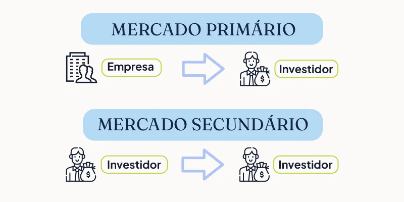

```{r}
#| echo: false
classtools::setup_quarto_slides('content')
```

# Introdução a contratos de sociedade

## Conceito

> Uma ação representa a menor parcela do capital próprio de uma sociedade por ações

::: {.incremental}
- Vantagens:
  - Para o investidor: vira sócio da empresa e tem direito ao lucro obtido a cada exercício e a voto no conselho, entre outras coisas
  - Para a empresa: fonte de novo capital e novos sócios para compartilhar risco

- O preços das ações oscilam de acordo com novas informações que chegam ao mercado

- A precificação de ações é muito mais complicada que precificação de títulos de dívida devido à incerteza do lucro futuro das empresas

:::


## Quanto você pagaria por 10% da renda vitalícia de um pessoa de 25 anos, recém-formada da UFRGS? {background-image="figs/estudante.png" background-opacity=0.25}

## Quanto você pagaria por 10% da renda vitalícia de um estudante desligado da Harvard após 2 anos de curso em 1975? {background-image="figs/thinking-face.gif" background-opacity=0.5}

## <span style="color:white;">Bill Gates</span> {background-image="figs/bill-gates.jpeg"}

::: aside
<span style="color:white;">Patrimônio estimado: 129.900.000.000,00 USD</span>
:::


## Porque os preços das Ações mudam ?

::: {.incremental}
> O preço de uma ação é simplesmente a soma do lucro esperado futuro, descontado para o presente

- Os fluxos de caixa das empresas são baseados em expectativas individuais
- As expectativas individuais de lucros futuros são construídas a partir das informações disponíveis:
  - Exemplo: Preços passados e demonstrativos financeiros
  - Notícias -- ou novas informações -- a respeito da empresa (e economia)  mudam as expectativas dos agentes e consequentemente os preços das ações

- O preço atual de uma ação é o efeito da soma das expectativas dos agentes de mercado (investidores)
:::

## Exemplo META/Facebook


Origem: [Bastter](https://bastter.com/mercado/basttergram/)


# Fluxos do dinheiro {background-image="figs/investidor.jpg" background-opacity=0.5}

## Principais Fluxos de Caixa para o  Investidor {background-image="figs/investidor.jpg" background-opacity=0.25}

::: {.incremental}
- **Proventos em dinheiro**
  - Dividendos
    - Geralmente acima de 25% do lucro líquido do exercício
    - Não deduzível para cálculo do IR da empresa
    - Isento IR para pessoa física (acionista) se renda total ABAIXO de 50k por mês
  - Juros sobre o Capital Próprio (JSCP)
    - Lei 9249 (1995) – Compensação da correção monetária dos Balanços
Deduzível para cálculo de IR da empresa, incide IR para o investidor
    - Teto definido pela TJLP (Taxa de juros de longo prazo) multiplicada pelo PL

- **Venda da Ação**
  - Incide imposto de ganho de capital - na pessoa física, existe uma isenção para uma soma de vendas mensais menores que 20.000R$

:::


## Fluxos de caixa na compra de TAEE11 (Taesa) {background-image="figs/investidor.jpg" background-opacity=0.25}

```{r}
ticker <- "TAEE11"
exchange <- "SA"
first_date <-  Sys.Date() - 8*365
last_date <- Sys.Date()

l_plot <- classtools::make_cashflow_plot(ticker,exchange,first_date, last_date)
l_plot$p
```

## Fluxos de caixa na compra de FIIB11 (FII Industrial do Brasil) {background-image="figs/investidor.jpg" background-opacity=0.25}

```{r}
ticker <- "FIIB11"
exchange <- "SA"
first_date <-  Sys.Date() - 8*365
last_date <- Sys.Date()

l_plot <- classtools::make_cashflow_plot(ticker,exchange,first_date, last_date)
l_plot$p
```


## Fluxos de caixa na compra de WEGE3 (WEGE SA) {background-image="figs/investidor.jpg" background-opacity=0.25}

```{r}
ticker <- "WEGE3"
exchange <- "SA"
first_date <-  Sys.Date() - 10*365
last_date <- Sys.Date()

l_plot <- classtools::make_cashflow_plot(ticker, exchange, first_date, last_date)
l_plot$p
```

## Fluxos de caixa na compra de M. Dias (MDIA3) {background-image="figs/investidor.jpg" background-opacity=0.25}

```{r}
ticker <- "MDIA3"
exchange <- "SA"
first_date <-  Sys.Date() - 15*365
last_date <- Sys.Date()

l_plot <- classtools::make_cashflow_plot(ticker, exchange, first_date, last_date)
l_plot$p
```

## Outros direitos do acionista {background-image="figs/investidor.jpg" background-opacity=0.5}

::: {.incremental}
- **Subscrição**
  - Direito dos acionista na aquisição de novas ações (ou debêntures) com preço e prazo determinado
- **Bonificação**
  - Distribuição gratuita de novas ações aos acionistas, utilizando recursos próprios da empresa (reservas e/ou lucros)
- **Desdobramento ou _split_**
  - Diluição do número de ações no mercado (ex: 1 -> 2)
  - geralmente uma boa notícia
- **Agrupamento ou _inplit_**
  - Condensação do número de ações (ex: 2 -> 1)
  - geralmente uma má notícia
:::

# Tipos de Ações

:::: {.columns}

::: {.column width="50%"}
**Ações Ordinárias (ON)**

::: {.incremental}
- Sem preferência nos pagamentos de dividendos
- Sem preferência no caso de falência da empresa
- Direito de voto em assembléia  e tag along
- **Geralmente** são mais valiosas que ações preferenciais
:::

:::

::: {.column width="50%"}
**Ações Preferenciais (PN)**

::: {.incremental}
- Preferência no pagamento de dividendos (dividendos pagos são maiores que para as ordinárias)
- Preferência para ressarcimento no caso de falência
- Não dão direito a voto em assembleia, porém tem direito de tag along
:::

:::

::::

## O caso GERDAU

```{r}
library(ggplot2)

df_yf <- yfR::yf_get(c("GGBR3.SA", "GGBR4.SA"),
                     '2015-01-01')

p <- ggplot(df_yf, aes(x=ref_date, y = price_adjusted, color = ticker)) + 
  geom_line() + 
  labs(title = "Preços das ações da GERDAU",
       x = 'Data',
       y = "Preços ajustados") + 
  theme_light()

p
```

## Controle Atual da GERDAU

```{r}
#| eval: false

library(dplyr)
#GetFREData::search_company('gerdau')

# 20250411 sqlite data is messy, cant figure it out easily
f_sqlite <- "~/GDrive/99-backups/02-work/02-research/01-databases/FRE/20250410_fre-data.sqlite"

con <- RSQLite::dbConnect(RSQLite::SQLite(), f_sqlite)

RSQLite::dbListTables(con)

pos_ac <- RSQLite::dbReadTable(con, "fre_cia_aberta_posicao_acionaria_classe_acao")

cnpj <- "92.690.783/0001-09"

company <- pos_ac |>
  dplyr::filter(
    cnpj_companhia == cnpj,
    data_referencia == "2024-12-31"
  ) |>
  dplyr::select(acionista, percentual_acao_ordinaria_circulacao, percentual_acao_preferencial_circulacao) |>
  unique()

df_stockholders |>
  select(type.register, name.stockholder, perc.ord.shares, perc.pref.shares) |>
  gt::gt() |>
  gt::tab_header(glue::glue("Controle Acionário da GERDAU ({this_year})"),
                 glue::glue("Informações extraídas do FRE doc {id_doc} v{versao}")) |>
  gt::cols_label(type.register = "Registro", 
                 name.stockholder = "Nome", 
                 perc.ord.shares = "% ações ordinárias",
                 perc.pref.shares = "% ações preferenciais") |>
  gt::tab_style(
    style = list(
      gt::cell_fill(color = "#F9E3D6"),
      gt::cell_text(style = "italic")
      ),
    locations = gt::cells_body(
      rows = 3
    )
  )
```

](figs/controle-gerdau.png)


## Explicações

::: {.incremental}
- A diferença de preços entre uma ação ordinária e preferencial é uma função de:
  - Valor do controle da empresa
  - Estrutura do controle da empresa
  - Histórico de pagamento de proventos (dividendos) pela empresa
:::

# Segmentos do Mercado 

## Mercado primário e secundário

::: {.incremental}

:::: {.columns}
::: {.column width="50%"}
- **Mercado Primário**
  - Ponto inicial de emissão de ações por parte de uma empresa
  - Caracteriza-se como uma oferta pública onde o dinheiro captado vai direto para o caixa da empresa
  - Geralmente participam apenas instituições financeiras. Porém, algumas corretoras permitem ao investidor comum participar também.
  

:::

::: {.column width="50%"}
- **Mercado Secundário**
  - As ações já emitidas no mercado primário são comercializadas através das bolsas de valores
  - A empresa ainda se beneficia da alta dos preços pois geralmente uma parcela das ações são mantidas em tesouraria
:::

::::

:::

## Ilustração

```{r}

```


# A bolsa Brasileira (B3)

## Sobre a B3

> A B3 é instituição privada resultante da fusão da Bovespa com a BMF em 2008, e fusão com CETIP em março 2017 
Principal instituição brasileira de intermediação para operações do mercado de capitais

- Desenvolve, implanta e provê sistemas para a negociação  de instrumentos financeiros entre:
  - Ações
  - Mercadoria e futuro
  - Derivativos 
  - Títulos de renda fixa
  - A própria B3 (antiga BM&Fbovespa) é negociada em bolsa (B3SA3)

- Percentual de participação de cada [tipo de investidor](https://arquivos.b3.com.br/bdi/tabelas/12-04-2024?classification=aeaccfe3-e492-40c4-9359-f9d6d2ef3ed9&table=SharesInvesVolumMonthly&lang=pt-BR)


## Referências