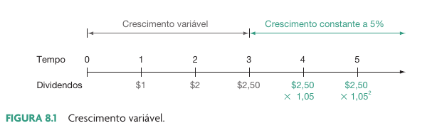
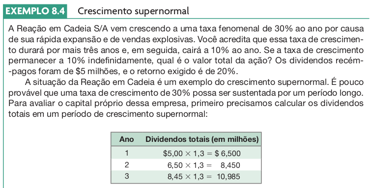
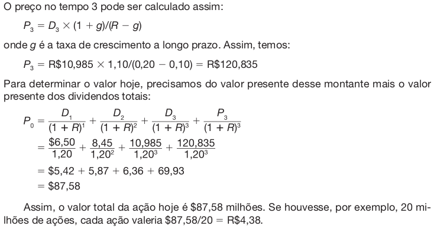

```{r}
#| echo: false
classtools::setup_quarto_slides("content")
```

# Introdução a valoração de ações

## Fluxos de caixa na compra de ações (situação mais comum)

::: incremental
> Uma ação é a menor parte do capital social da empresa, dando direito
> ao recebimento de parte do lucro da empresa em cada exercício futuro.

-   Contrato é comprado pelo preço $P_0$
-   Ao longo da vida do contrato, proventos na forma de dividendos são
    pagos ao acionista
-   Contrato pode ser vendido ao preço $P_T$
-   último dividendo $DIV_T$ é pago no tempo $T$
:::

## Ilustração fluxos de caixa de ações

```{r}
library(ggplot2)

ticker <- "ABCD3"
this_year <- lubridate::year(Sys.Date())
base_div <- 15
my_T <- 8
divs <- rep(base_div, my_T-1)
first_price <- 85
last_price <- 120


CF <- c(-first_price, 
        divs, 
        last_price + base_div)

l_p <- classtools::create_cashflow_plot(first_price,
                                 divs,
                                 last_price + base_div)
p <- l_p$p + 
  labs(title = "Fluxos de caixa na compra de 1 ação",
         subtitle = glue::glue(
           paste0("Preço hoje: {first_price} | Preço venda: {last_price} | Dividendo: {base_div}")))

# cashflow_year <- tibble::tibble(
#   CF = CF,
#   year = this_year:(this_year+length(CF)-1),
#   direction = ifelse(CF >0, "positivo", 'negativo')
# )

p
```


## Fluxos de caixa na compra de GGBR4 (Gerdau)

```{r}
ticker <- "GGBR4"
exchange <- "SA"
first_date <-  Sys.Date() - 8*365
last_date <- Sys.Date()

l_plot <- classtools::make_cashflow_plot(ticker,exchange,first_date, last_date)
l_plot$p
```

## Por que precificar uma ação?

-   Estimar super ou sub precificação do mercado ao preço justo
    -   eficiência do mercado financeiro
    -   estratégias de negociação
-   Estipular preço de contratos customizados (e.g. bonus de diretores)

## Precificação de um contrato de ação

```{r}
r <- classtools::get_selic_rate()$aa
CF <- CF
P_0 <- -FinCal::pv.uneven(r, CF[2:length(CF)])
```

A fórmula do valor presente (PV) nos diz que:

$$VP = \sum _{t=1} ^{T} \frac{FC}{(1+r)^t} + \frac{VF}{(1+r)^T}$$

. . .

Substituindo os símbolos para ação ($D$ = dividendos, $P_0$ = preço de
compra e $P_T$ = preço de venda), temos:

$$P_0 = \sum _{t=1} ^{T} \frac{D}{(1+r)^t} + \frac{P_T}{(1+r)^T}$$ 

. . .

Para o exemplo anterior, e assumindo que $r = `r r`$:

$$VP = \sum _{t=1} ^{`r my_T`} \frac{`r base_div`}{(1+`r r`)^t} + \frac{`r last_price`}{(1+`r r`)^`r my_T`}  = `r P_0`$$


# Modelo de Gordon -- [@gordon1956capital]

## Premissas

::: incremental
-   Ações são mantidas até o infinito, com o pagamento periódico dos
    proventos (dividendos)
-   O valor nominal dos dividendos são conhecidos e:
    -   **Versão 01**: Constantes
    -   **Versão 02**: Variáveis, com uma taxa de crescimento conhecida
    -   **Versão 03**: taxa de crescimento variável
-   O valor do preço da ação no futuro é desconhecido
:::

## Derivação Versão 01 (dividendos constantes)

-   a ação paga o valor $DIV$ em cada período, incluindo o último.
-   A ação é vendida no tempo $T$, e o valor da venda é $P_T$ por ação.

. . .

<hr>

A fórmula de valor presente nos diz que:

$$P_0 = \sum _{t=1} ^{T} \frac{DIV}{(1+r)^t} + \frac{P_T}{(1+r)^T}$$
Porém, no modelo de Gordon, $T = \inf$, portanto
$\frac{P_T}{(1+r)^T} = 0$. Sabendo que
$\sum _{t=1} ^T \frac{DIV}{(1+r)^t} = \frac{DIV}{r}$ e reorganizando
temos:

$$P_0 =\frac{DIV}{r}$$

## Derivação Versão 02 (dividendos crescentes)

-   a ação paga o valor $DIV_t$ em cada período, incluindo o último.
    Este dividendo cresce a uma taxa $g$.
-   A ação é vendida no tempo $T$, e o valor da venda é $P_T$ por ação.

. . .

<hr>

A fórmula de valor presente nos diz que:

$$P_0 = \sum _{t=1} ^T \frac{DIV_0(1+g)^t}{(1+r)^t} + \frac{P_T}{(1+r)^T}$$
Porém, no modelo de Gordon, $T = \inf$, portanto
$\frac{P_T}{(1+r)^T} = 0$. Sabendo que
$\sum _{t=1} ^T \frac{DIV_0(1+g)^t}{(1+r)^t} = \frac{DIV_0(1+g)}{r-g}$ e
reorganizando temos:

$$P_0 = \frac{DIV_0(1+g)}{r-g}$$

## Exemplo

```{r}
div <- 10
r <- 0.12
g <- 0.05
```

> Uma empresa paga hoje dividendos de `r classtools::format_cash(div)`.
> Considerando um custo de capital de `r classtools::format_percent(r)`
> e uma taxa de crescimento de dividendos de
> `r classtools::format_percent(g)`, qual o preço da ação hoje?

$$P_0 = \frac{DIV_0(1+g)}{r-g}$$
$$P_0 = \frac{`r div`*(1+`r g`)}{`r r`-`r g`}$$
$$P_0 = `r div*(1+g)/(r-g)`$$

## Derivação Versão 03 (dividendos variáveis)

-   flexibiliza o crescimento dos dividendos. Podemos ter uma época de
    grande crescimento, e outra de estabilidade.
-   A ação é vendida no tempo $T$, e o valor da venda é $P_T$ por ação.

```{r}
#| fig-cap: !expr classtools::cite_ross(243)


```

## Exemplo (1/2)

```{r}
#| fig-cap: !expr classtools::cite_ross(243)


```

## Exemplo (2/2)

```{r}
#| fig-cap: !expr classtools::cite_ross(243)


```


## Extraindo Informações do Modelo de Gordon

::: incremental
-   Preços de ações são facilmente obtidos no mercado secundário
-   Informações de dividendos pagos historicamente são públicas
    -   permite o cálculo da taxa de crescimento dos dividendos
-   Com base nisso, podemos calcular o valor de $r$, o qual representa a
    **taxa exigida de retorno** do mercado financeiro.
    -   a taxa exigida pode ser usada como custo de capital em projetos
        da empresa
:::


## Matemática

Para a versão 02 de Gordon, temos:

$$P_0 = \frac{DIV_0(1+g)}{r-g}$$

Isolando o $r$:

$$r = \frac{DIV_0(1+g)}{P_0}+g $$

$$r =  \frac{DIV_1}{P_0}+g$$

Isto é, sabendo preço da ação hoje $P_0$, o custo de capital dos
investidores pode ser extraído através da fórmula anterior


## Exemplo EGIE3.SA

```{r}
ticker <- "EGIE3.SA"
ticker <- "EGIE3"
first_date <- '2018-01-01'
last_date <- Sys.Date()

l_out <- classtools::make_cashflow_plot(
    ticker, 
    "SA",
    first_date, last_date)

df_cf <- l_out$CF
P0 <- dplyr::last(l_out$df_prices$price_close)
last_date <- max(l_out$df_prices$ref_date)

div <- df_cf$CF[2:(nrow(df_cf)-1)]
last_div <- div[length(div)]
g <- mean(div/dplyr::lag(div) -1, na.rm=TRUE)

r <- last_div*(1+g)/P0 + g
```

-   Em `r classtools::format_date(last_date)` a ação `r ticker` estava
    cotada a `r classtools::format_cash(P0)`
-   No seu histórico de dividendos, entre
    `r classtools::format_date(first_date)` e
    `r classtools::format_date(last_date)`, vemos uma taxa de
    crescimento anual de `r classtools::format_percent(g)`

. . .

Assim, temos:

$P_0 = `r P0`$

$g = `r g`$

Aplicando a fórmula:

$r = \frac{DIV_0(1+g)}{P_0} + g$

$r = `r r`$

Isso quer dizer que os investidores usam uma taxa de custo de capital de
`r classtools::format_percent(r)` ao ano para precificar os fluxos de
caixa da empresa com ticker `r ticker`

# Críticas ao modelo de Gordon

## Críticas

::: incremental
-   Tempo infinito?
    -   A imensa maioria dos investidores têm interesse em vender a ação
        antes de morrer!!
    -   A empresa não pode entrar em processo de falência ?
        -   Exemplo: Varig
-   Dividendos crescentes?
    -   Empresa não dá prejuízo, nunca?
    -   Considere 2 empresas concorrentes, as mesmas teriam dividendos
        crescentes sempre?
:::

# A precificação na prática

## Como funciona a precificação na prática?

::: incremental
-   Análise Fundamentalista / Valuation
    -   Análise de balanços e informações financeiras
    -   Construção de cenários econômicos e projeções de lucro
-   Análise Técnica (ou Grafista)
    -   Análise da história dos ativos (preços e volumes negociados)
    -   Identificação de padrões de tendência (subida ou descida das
        ações) com base apenas em gráficos
:::

## Referências {.unlisted}
