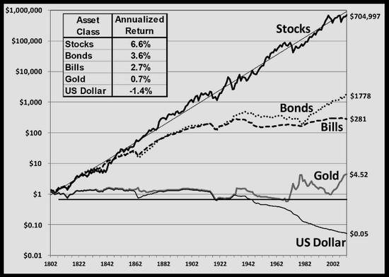

```{r}
#| echo: false
classtools::setup_quarto_slides()
```

# Introdução

## 

<br> 

**Imagine uma vida onde:**

::: {.incremental}
- você define a sua agenda e as suas atividades;

- você trabalha com o que gosta, independente da renda;

- liberdade para dizer não, quando quiser;

- tem uma verba mensal para gastar com excentricidades e experiências;

- sem preocupação com a sua aposentadoria;

:::


## A independência

> _I did not intend to get rich. I just wanted to get independent._ Charlie Munger (1924 - 2023)

::: {.incremental}
- A independência pessoal deveria ser um propósito de vida, e a única maneira de atingir é via renda passiva

- A renda passiva acontece quando se tem negócios que geram fluxo de caixa, sem esforço adicional ou com mínimo esforço

- Ser sócio de empresas é a forma mais fácil de ter renda aproximadamente passiva

- Fácil na teoria, difícil na prática

- Um problema mais comportamental do que técnico
:::


# Alguns exemplos ilustres

## Ronald James Read (1921 - 2014) {background-image="figs/Ronald_Read_philanthropist.jpg" background-opacity=1}

## História  {background-image="figs/Ronald_Read_philanthropist.jpg" background-opacity=0.25}

::: {.incremental}
- Ronald James Read (1921-2014) foi um **frentista**, **zelador**, e **filantropo** americano

- Após voltar da Segunda Guerra Mundial, trabalhou como frentista e mecânico por cerca de 25 anos. 

- A vida de Read era marcada pela **frugalidade**:  roupas gastas e carros de segunda mão. 

- Read investia consistentemente em empresas de primeira linha (blue-chips) que pagavam dividendos, como Procter & Gamble, JPMorgan Chase, General Electric e Johnson & Johnson. 

- Após sua morte, em 2014, aos 92 anos, de um total de 8M USD, ele doou 6M USD do seu patrimônio
:::

## Luiz Barsi Filho  {background-image="figs/cropped-luiz-barsi.jpg" background-opacity=1}

## História {background-image="figs/cropped-luiz-barsi.jpg" background-opacity=0.25}

::: {.incremental}
- Filho de imigrantes espanhóis, Barsi teve uma origem modesta no bairro do Brás, em São Paulo. 

- Após a morte prematura de seu pai, começou a trabalhar desde cedo como engraxate e vendedor de balas

- Trabalhou em uma corretora de valores e também atuou como jornalista econômico no "Diário Popular.

- Atualmente, Luiz Barsi possui um patrimonio estimado em 6 bi (BRL), e continua a ser um investidor ativo e um grande defensor da educação financeira no Brasil. 
:::

## Por que não temos tantos outros Luis Barsi?

::: {.incremental}

- poucos conseguem investir por tanto tempo
  - exige um esforço enorme em contenção de consumo, principalmente nos primeiros anos de acumulação

- o paradoxo de investir no longo prazo é que deves almejar mais renda futura, mas sem almejar mais gastos

- geralmente, quem quer maior renda atual, almeja maior consumo..
:::

# A Matemática da independência

## Premissas

> Uma pessoa normal tem uma renda total composta por renda ativa e renda passiva, e gastos periódicos para viver

Matematicamento, podemos representar o problema como:

$$
RendaTotal _{t} = RendaAtiva _{t} + RendaPassiva _{t}
$$

$$
RendaPassiva = Juros _{t}*TotalInvestido_{t}
$$
<br> <br>

$$
AporteMensal _{t} = RendaTotal _{t} - Gastos _{t}
$$

$$
TotalInvestido_{t} = TotalInvestido_{t-1} + AporteMensal _{t}
$$


## A independência

Uma pessoa é **independente** quando $RendaPassiva _{t} > Gastos _{t}$. Se isso é verdade, então:

$$
RendaAtiva _{t} = 0
$$

$$
RendaTotal _{t} = RendaPassiva _{t}
$$

Dado que $RendaTotal _{t} > Gastos _{t}$:

$$
AporteMensal _{t} > 0
$$

Isto é, uma pessoa com independência financeira **não precisa mais trabalhar** para suportar os seus gastos, e **continua investindo** o que resta da renda passiva após o pagamento de seus boletos.


## Como chegar lá?

```{r}
r <- 0.08 #seq(0, 0.25, by = 0.15)
salario = 60000
```

Em uma simulação simples, vamos assumir que:

<hr>

Salário anual = `r classtools::format_cash(salario)` (`r classtools::format_cash(salario/12)` ao mês)

<br> 

Taxa de juros real anual ($Juros$) = `r classtools::format_percent(r)`

<hr>

Podemos verificar a renda passiva ao longo do tempo em relação aos custos totais.

Lembre que a independência é atingida quando renda passiva é maior que os gastos.


## 

```{r}
library(ggplot2)

b_vec <- seq(0, 0.80, by = 0.1)
b_vec <- c(0, 0.1, 0.25, 0.5, 0.75)
nT <- 50

get_value_pi <- function (r,salario, b, nT) {

  gastos <- salario*(1-b)
  
  v_port <- numeric(nT)
  v_port[1] <- 0

  renda_passiva <- numeric(nT)
  renda_passiva[1] <- 0

  for (i in 2:nT) {

    aporte <- salario*b
    renda_passiva[i] <- v_port[i-1]*r

    v_port[i] <- v_port[i-1] + aporte + renda_passiva[i]

  }

  idx <- which(renda_passiva > gastos)

  if (is.na(idx[1])) {
    idx = NA
  }

  df_out <- tibble::tibble(
    salario,
    b,
    r,
    renda_passiva,
    v_port,
    gastos,
    ano = 1:nT,
    ano_if = idx[1]
  )

  return(df_out)

}

get_plot_df <- function(r, b_vec) {
  df_grid <- tidyr::expand_grid(
    r = r,
    b = b_vec
    )

  l_args = as.list(df_grid)

  l_out <- purrr::pmap(l_args, get_value_pi, salario = salario, nT = nT)

  df_plot <- l_out |>
    purrr::list_rbind() |>
    dplyr::mutate(
      b_str = glue::glue(
        "Taxa Poupança = {classtools::format_percent(b)}"
      ))

  return(df_plot)

}

df_plot <- get_plot_df(r, b_vec)

p <- ggplot(df_plot, 
  aes(x = ano, y = renda_passiva)) + 
  geom_line(linewidth = 1, color = "blue") + 
  facet_wrap(~ b_str, nrow = 1) + 
  geom_hline(
    aes(yintercept = gastos), 
    color = "red", 
    linetype = "dashed",
    linewidth = 1) + 
  labs(
    title = "Taxa de Poupança, Renda Passiva e Custo Anual",
    subtitle = "Linha vermelha é o Custo Anual",
    x = "Ano",
    y = "Renda Passiva Anual"
 ) + 
  scale_y_continuous(labels = classtools::format_cash) + 
  ylim(c(0, salario*1.5)) +
  theme_light()

print(p)

```

## 

```{r}
b_vec <- seq(0, 0.90, by = 0.1)
nT <- 60

df_plot <- get_plot_df(r, b_vec)

agg <- df_plot |>
  dplyr::group_by(b, ano_if) |>
  dplyr::slice_head(n = 1)

p <- ggplot(agg, 
  aes(x = b, y = ano_if)) + 
  geom_line() +
  geom_point(size = 4) + 
  geom_text(
    aes(
      label = paste0(ano_if, " anos"), 
      x = b + 0.05, 
      y = ano_if)) + 
  labs(
    title = "Taxa de Poupança e Tempo para Independência",
    subtitle = paste0("Assume taxa de juros de ", classtools::format_percent(r), " ao ano"),
    x = "Taxa de Poupança",
    y = "Tempo necessário para independência"
  ) + 
  theme_light() + 
  scale_x_continuous(
    labels = classtools::format_percent, 
    breaks = b_vec)


print(p)

```

## 

```{r}

min_tp <- 0.1
max_tp <- 0.4
max_time <- 32

p_sweet_spot <- p + 
  geom_rect(
    xmin = min_tp, xmax = max_tp,
    ymin = 0, ymax = max_time,
    fill = "gray",
    color = "gray", alpha = 0.05) + 
  geom_text(
    label = "O ponto ótimo!",
    x = 0.4,
    y = 30,
    size = 8,
    color = "blue"
  )

p_sweet_spot

```


## O que aprendemos

::: {.incremental}
- quanto maior a taxa de poupança, menos gastos e menor a renda passiva necessária para a independência

- uma vida mais simples, com menos gastos, tem mais chances de se tornar independente

- é possível se aposentar em 5 anos com  uma taxa de poupança de 80%, mas cuidado com os excessos!!

- mesmo poupando por 32 anos a uma taxa de poupança de 10%, ainda é melhor que os sistemas de aposentadoria publico e privado
:::


## A psicologia do dinheiro 

Algumas lições de @housel2025arte e @housel2021psicologia:

::: {.incremental}

1. Em finanças pessoais, **comportamento** é mais importante do que inteligência

1. Na escolha entre consumo e poupança, **minimize o seu arrependimento futuro**

1. Sua avaliação **intrínsica** de valor é mais importante do que a avaliação extrínsica

1. Uma vida **simples** é uma vida virtuosa e mais feliz. É fundamental saber o que é "suficiente" para você. 

1. A verdadeira riqueza é o que você **não vê** não vida das pessoas

1. Paciência e o poder dos juros compostos

:::

## Livros do Morgan Rousel

::: {.columns}

::: {.column}


:::

::: {.column}

:::


:::


# Por que renda variável?

> A renda variável é onde estão os maiores ganhos financeiros, geralmente acima da inflação. Porém, tem mais risco que renda fixa..



## How often bonds beats stocks?


# Dicas para iniciantes

## Como começar?

::: {.incremental}
1. **obrigatoriamente**, uma parcela do seu salário tem que sobrar..

1. defina pesos para cada classe de ativo. Sugestão, comece com 75% RF 25% RV e faça uma lista de investimentos que gostaria de fazer

1. abra conta em em corretora, de preferência uma grande e conhecida

1. mande dinheiro para a corretora via TED (ou pix se tiver conta digital vinculada a corretora)

1. junte o dinheiro do passo anterior com a renda passiva e compre ações/fundos na bolsa ou títulos renda fixa via home broker 

1. repita passos anteriores até se tornar independente..
:::


## Como selecionar investimentos?

::: {.incremental}
- comece pelo simples, renda fixa em Tesouro Direto
- aos poucos, aporte em renda variável:
  - critério principal é qualidade do negócio (e não somente renda/dividendos)
  - priorize ativos que gerem renda via dividendos ou rendimentos
- não tenha investimento individual maior do que 5% a 10% da carteira (mínimo de ativos será 20/10)
:::

## Outras sugestões

::: {.incremental}
- Na RV (renda variável), comece com fundos imobiliários (menos volátil e mais simples de entender)
- Foque em **qualidade**, e não preço/yield!
- tenha paciência. **O processo é lento** e demora uns 5-8 anos para ver o resultado em renda passiva
- Faça **aportes frequentes** para diluir o preço de compra (estratégia DCA - _dollar cost average_)
- Aceite que o mais importante é se **manter no jogo**, não ganhar mais que o ibovespa ou IFIX
- Não tente prever o futuro (ninguém consegue)
- aproveite, a renda passiva é sua, para ser **feliz**..
- **Esteja disposto a errar, estudar e aprender**
:::

## Referências
