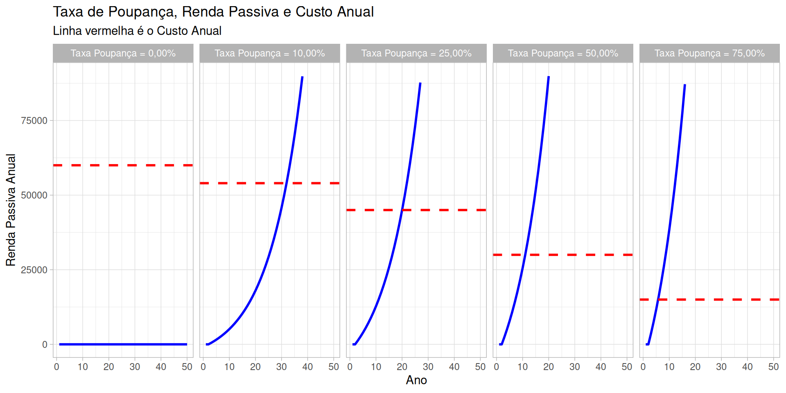
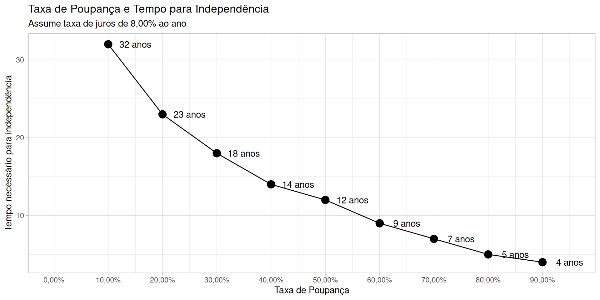
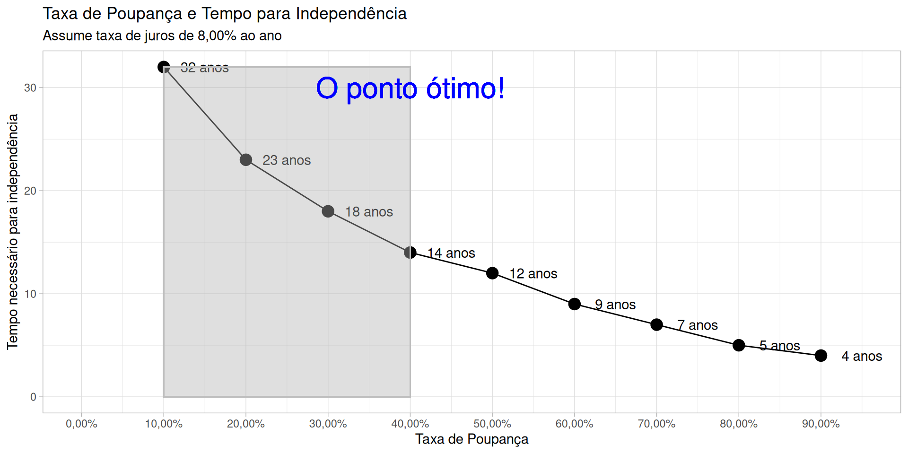
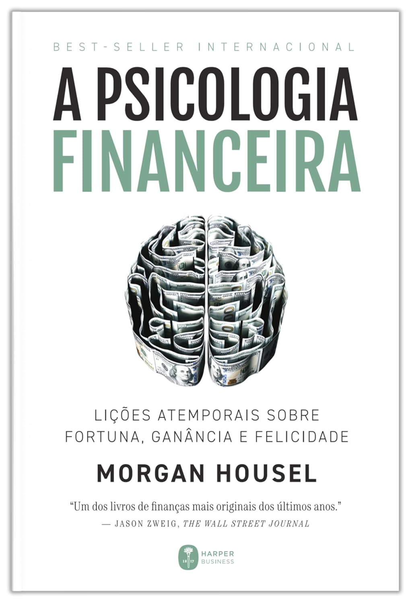
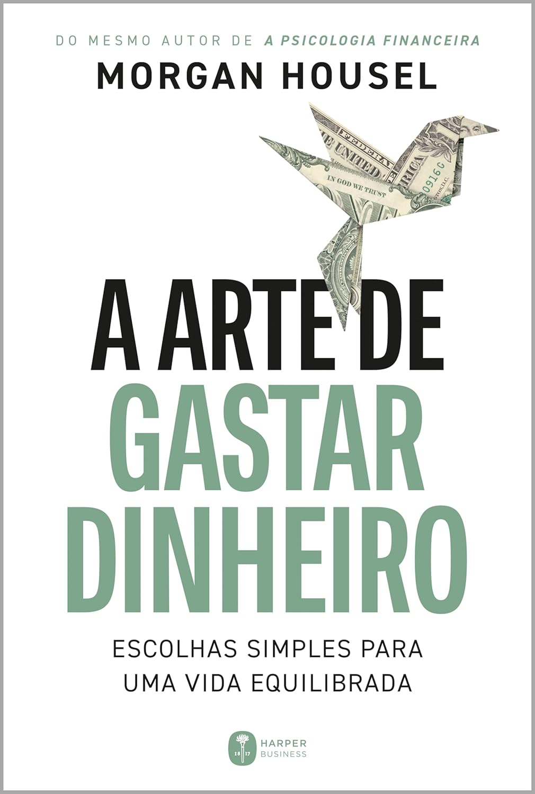
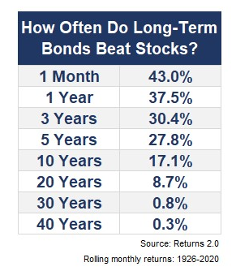

```{r}
#| echo: false
classtools::setup_quarto_slides('content')
```

# Introdução

## 

<br>

**Imagine uma vida onde:**

::: {.incremental}
- você define a sua agenda e as suas atividades;
- você trabalha com o que gosta, independente da renda;
- liberdade para dizer não, quando quiser;
- tem uma verba mensal para gastar com excentricidades e experiências;
- sem preocupação com a sua aposentadoria;
:::

## A independência

> *I did not intend to get rich. I just wanted to get independent.* Charlie Munger (1924 - 2023)

::: {.incremental}
- A independência pessoal deveria ser um propósito de vida, e a única maneira de atingir é via renda passiva
- A renda passiva acontece quando se tem negócios que geram fluxo de caixa, sem esforço adicional ou com mínimo esforço
- Ser sócio de empresas é a forma mais fácil de ter renda aproximadamente passiva
- Fácil na teoria, difícil na prática
- Um problema mais comportamental do que técnico
:::


# Alguns exemplos ilustres

## Ronald James Read (1921 - 2014) {background-image="figs/Ronald_Read_philanthropist.jpg" background-opacity=1}

## História {background-image="figs/Ronald_Read_philanthropist.jpg" background-opacity=0.2}

Ronald James Read (1921-2014) foi um **frentista**, **zelador**, e **filantropo** americano.

::: {.incremental}
- Após voltar da Segunda Guerra Mundial, trabalhou como frentista e mecânico por cerca de 25 anos.
- A vida de Read era marcada pela **frugalidade**: roupas gastas e carros de segunda mão.
- Read investia consistentemente em empresas de primeira linha (blue-chips) que pagavam dividendos, como Procter & Gamble, JPMorgan Chase, General Electric e Johnson & Johnson.
- Após sua morte, em 2014, aos 92 anos, de um total de 8M USD, ele doou 6M USD do seu patrimônio.
:::

## Luiz Barsi Filho {background-image="figs/cropped-luiz-barsi.jpg" background-opacity=1}

## História {background-image="figs/cropped-luiz-barsi.jpg" background-opacity=0.2}

::: {.incremental}
- Filho de imigrantes espanhóis, Barsi teve uma origem modesta no bairro do Brás, em São Paulo.
- Após a morte prematura de seu pai, começou a trabalhar desde cedo como engraxate e vendedor de balas.
- Trabalhou em uma corretora de valores e também atuou como jornalista econômico no “Diário Popular”.
- Atualmente, Luiz Barsi possui um patrimonio estimado em 6 bi (BRL), e continua a ser um investidor ativo e um grande defensor da educação financeira no Brasil.
:::

## Por que não temos tantos outros Luis Barsi?

::: {.incremental}
- Poucos conseguem investir por tanto tempo
  - exige um esforço enorme em contenção de consumo, principalmente nos primeiros anos de acumulação
- O paradoxo de investir no longo prazo é que deves almejar mais renda futura, mas sem almejar mais gastos
- Geralmente, quem quer maior renda atual, almeja maior consumo...
:::


# A Matemática da independência

## Premissas

> Uma pessoa normal tem uma renda total composta por renda ativa e renda passiva, e gastos periódicos para viver

Matematicamente, podemos representar o problema como:

$$
RendaTotal _{t} = RendaAtiva _{t} + RendaPassiva _{t}
$$

$$
RendaPassiva = Juros _{t}*TotalInvestido_{t}
$$

<br> <br>

$$
AporteMensal _{t} = RendaTotal _{t} - Gastos _{t}
$$

$$
TotalInvestido_{t} = TotalInvestido_{t-1} + AporteMensal _{t}
$$

## A independência

Uma pessoa é **independente** quando $RendaPassiva _{t} > Gastos _{t}$. Se isso é verdade, então:

$$
RendaAtiva _{t} = 0
$$

$$
RendaTotal _{t} = RendaPassiva _{t}
$$

Dado que $RendaTotal _{t} > Gastos _{t}$:

$$
AporteMensal _{t} > 0
$$

Isto é, uma pessoa com independência financeira **não precisa mais trabalhar** para suportar os seus gastos, e **continua investindo** o que resta da renda passiva após o pagamento de seus boletos.

## Como chegar lá?

Em uma simulação simples, vamos assumir que:

---

Salário anual = R$ 60.000 (R$ 5.000 ao mês)

<br>

Taxa de juros real anual ($Juros$) = 8,00%

---

Podemos verificar a renda passiva ao longo do tempo em relação aos custos totais.

Lembre que a independência é atingida quando renda passiva é maior que os gastos.

## 

{fig-align="center"}

## 

{fig-align="center"}

## 

{fig-align="center"}

## O que aprendemos

::: {.incremental}
- Quanto maior a taxa de poupança, menos gastos e menor a renda passiva necessária para a independência
- Uma vida mais simples, com menos gastos, tem mais chances de se tornar independente
- É possível se aposentar em 5 anos com uma taxa de poupança de 80%, mas cuidado com os excessos!!
- Mesmo poupando por 32 anos a uma taxa de poupança de 10%, ainda é melhor que os sistemas de aposentadoria publico e privado
:::

## A psicologia do dinheiro

Algumas lições de *Morgan Housel*:

::: {.incremental}
- Em finanças pessoais, **comportamento** é mais importante do que inteligência
- Na escolha entre consumo e poupança, **minimize o seu arrependimento futuro**
- Sua avaliação **intrínsica** de valor é mais importante do que a avaliação extrínsica
- Uma vida **simples** é uma vida virtuosa e mais feliz. É fundamental saber o que é “suficiente” para você.
- A verdadeira riqueza é o que você **não vê** na vida das pessoas
- Paciência e o poder dos juros compostos
:::

## Livros do Morgan Housel

::: {layout-nw="[1,1]"}
{width="45%" fig-align="center"}
{width="45%" fig-align="center"}
:::


# Por que renda variável?

A renda variável é onde estão os maiores ganhos financeiros, geralmente acima da inflação. Porém, tem mais risco que renda fixa..

## How often bonds beats stocks?

{fig-align="center"}

[Link para o artigo](https://awealthofcommonsense.com/2020/06/how-often-do-long-term-bonds-beat-stocks/)


# Dicas para iniciantes

## Como começar?

::: {.incremental}
- **Obrigatoriamente**, uma parcela do seu salário tem que sobrar..
- Defina pesos para cada classe de ativo. Sugestão, comece com 75% RF 25% RV e faça uma lista de investimentos que gostaria de fazer
- Abra conta em corretora, de preferência uma grande e conhecida
- Mande dinheiro para a corretora via TED (ou pix se tiver conta digital vinculada a corretora)
- Junte o dinheiro do passo anterior com a renda passiva e compre ações/fundos na bolsa ou títulos renda fixa via home broker
- Repita passos anteriores até se tornar independente..
:::

## Como selecionar investimentos?

::: {.incremental}
- Comece pelo simples, renda fixa em Tesouro Direto
- Aos poucos, aporte em renda variável:
  - Critério principal é qualidade do negócio (e não somente renda/dividendos)
  - Priorize ativos que gerem renda via dividendos ou rendimentos
  - Não tenha investimento individual maior do que 5% a 10% da carteira (mínimo de ativos será 20/10)
:::

## Outras sugestões

::: {.incremental}
- Na RV (renda variável), comece com fundos imobiliários (menos volátil e mais simples de entender)
- Foque em **qualidade**, e não preço/yield!
- Tenha paciência. **O processo é lento** e demora uns 5-8 anos para ver o resultado em renda passiva
- Faça **aportes frequentes** para diluir o preço de compra (estratégia DCA - *dollar cost average*)
- Aceite que o mais importante é se **manter no jogo**, não ganhar mais que o ibovespa ou IFIX
- Não tente prever o futuro (ninguém consegue)
- Aproveite, a renda passiva é sua, para ser **feliz**..
- **Esteja disposto a errar, estudar e aprender**
:::

## Referências

*A Psicologia Financeira: Lições Atemporais Sobre Fortuna, Ganância e Felicidade*

*A Arte de Gastar Dinheiro: Escolhas Simples Para Uma Vida Equilibrada*
