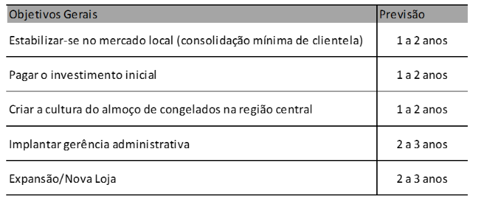
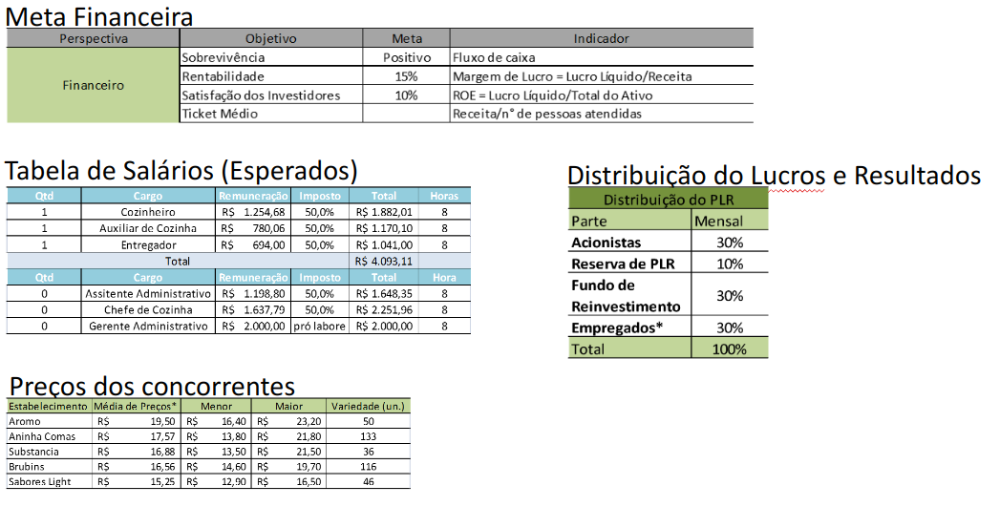
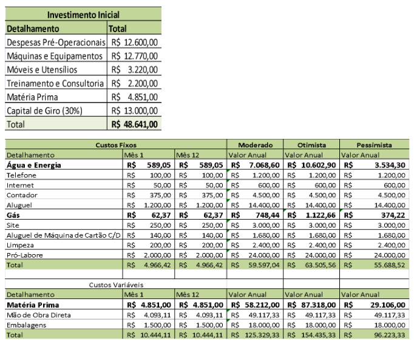
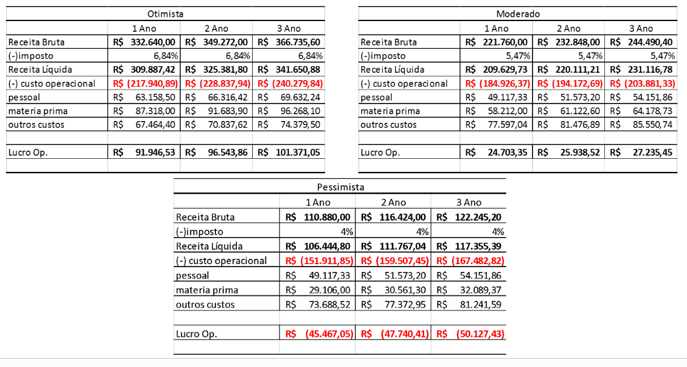
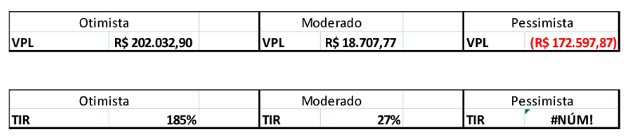

```{r}
link_gsheets <- "https://docs.google.com/spreadsheets/d/1mAud4F9z2bngr_i6GS-IggAt4dQMUhKDi8J9qTMh3kI/edit?usp=sharing"
```

## Introdução ao orçamento de capital

## Orçamento de Capital: A Base das Decisões Estratégicas

* **Definição:** Processo de planejamento e gestão dos investimentos de longo prazo de uma empresa.
* **Objetivo Principal:** Identificar e selecionar projetos que agreguem valor à empresa, ou seja, aqueles cujo valor presente dos fluxos de caixa futuros excede o custo inicial.
* **Importância:** Decisões de orçamento de capital definem o rumo futuro da empresa, sua capacidade produtiva e competitividade.

# Como montar um projeto

## Princípios para a construção de fluxos de caixa

::: {.callout-tip}
## Fluxos de caixa incrementais
Os fluxos de caixa incrementais para a avaliação de um projeto consistem em cada
uma e em todas as mudanças nos fluxos de caixa futuros da empresa que são consequências diretas da aceitação do projeto.
:::

::: {.callout-tip}
## Relevância dos fluxos de caixa
Leva-se em conta apenas aqueles eventos que implicam uma mudança nos fluxos de caixa futuros da empresa, e que sejam consequência direta da execução do projeto
:::

::: {.callout-tip}
## Princípio da independência
Um projeto em si é independente da empresa, pagando imposto e tendo gastos com depreciação

- O projeto como uma empresa em si, 
- Fluxos de caixa não decorrentes do projeto são irrelevantes
:::


## Fluxos de caixa Incrementais

::: {.incremental}
- **Não entram no cálculo dos fluxos de caixa**
  - _Custos Irrecuperáveis (ou já pagos)_
      - Exemplo: Gastos com pesquisa de mercado já realizada.
  - _Custos de Financiamento_
      - Exemplo: tomada de juros a longo prazo para financiar projeto (a forma do financiamento do projeto é irrelevante para determinar isoladamente sua viabilidade)

- **Entram no cálculo dos fluxos de caixa**
  - Efeitos da oportunidade (fluxos de caixa do projeto)
    - Efeitos Colaterais (ex. efeito canibal)
    - Capital de Giro Líquido (ex. capital de giro para a venda de produtos)
:::

## Exemplo do cálculo do FC de um projeto (1)

[Link gsheets](`r link_gsheets`)

```{r}
fc_0 <- 90000
my_T <- 3

r <- 0.2
ir <- 0.34
invest_CGL <- 20000
```


# Lidando com a Incerteza

## Avaliação das Estimativas de VPL

> _Garbage in, garbage out_: se os fluxos de caixa do projeto estão equivocados, o resultado não é confiável!!

- O VPL calculado é uma estimativa baseada em projeções.
    - Possibilidade 1: O projeto realmente tem VPL positivo.
    - Possibilidade 2: O VPL parece positivo devido a erros nas projeções (otimismo excessivo).

- **Risco de Previsão:** A possibilidade de tomar uma decisão incorreta devido a erros nos fluxos de caixa projetados.
- **Fontes de Valor:** É crucial identificar *por que* um projeto teria um VPL positivo.
    - Vantagem competitiva, inovação, eficiência, nicho de mercado, etc.
    - A concorrência tende a eliminar VPLs positivos rapidamente.

## Ferramentas para lidar com a incerteza

:::: {.columns}

::: {.column width="50%"}
### Análise de Cenários 

- Adição de erros às estimativas através da observação de fatores primários, sujeitos a incerteza
  - Cenário Otimista
  - Cenário Moderado
  - Cenário Pessimista

[Exemplo GSheets](`r link_gsheets`)

:::

::: {.column width="50%"}

### Análise de Sensibilidade 
  - Análise de cenários, porém com foco em uma das variáveis

[Exemplo GSheets](`r link_gsheets`)

:::

::::

# Caso Prático: Uma empresa de congelados em Porto Alegre

## TCC defendido por aluno em 2013-1

- Objetivo: analisar a atratividade financeira de empreender uma empresa de congelados

- Objetivos gerais da empresa:

```{r}

```

## Dados da análise Geral

```{r}

```

## Dados da Análise Financeira

```{r}

```

## Resultado Final

```{r}

```

## VPL e TIR

```{r}

```

## Referências
