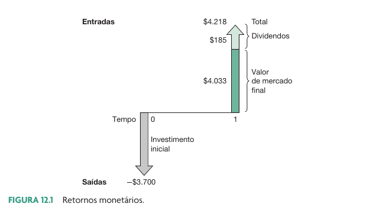
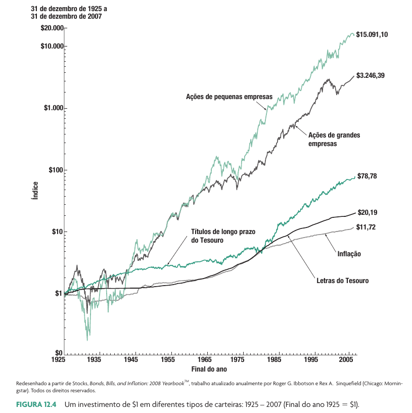
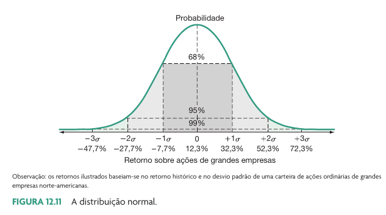

```{r}
link_gsheets <- "https://docs.google.com/spreadsheets/d/13FjszjYGPnDm3AUqkxQI7SF7Bm9W-BYn6LdSJNa4jKc/edit?usp=sharing"
```

# Cálculo do retorno do investidor

## Como o investidor ganha dinheiro?

- Um investidor de ações ganha dinheiro com:
  1) valorização das ações
  2) dividendos e outros proventos em dinheiro
  
```{r}
#| fig-cap: !expr classtools::cite_ross(391)

```

## Cálculo do Retorno

$$R = \frac{\sum ^N _{i=1} D_i + P_T}{P_0} - 1$$
$R$ - Retorno nominal total do investidor

$D _i$ - Dividendo pago no ano $i$

$P_T$ - Preço de venda no tempo $t=T$

$P_0$ - Preço de compra no tempo $t=0$

```{r}
ticker <- "TAEE11"
```

## O caso da `r ticker`

```{r}
#ticker <- "TAEE11"
first_date <- "2015-01-01"

l_out <- classtools::make_cashflow_plot(ticker, 
                                        'SA',
                                        first_date)

CF <- l_out$CF
total_divs <- sum(CF$CF[2:(nrow(CF)-1)])
P_0 <- -CF$CF[1]
P_T <- CF$CF[nrow(CF)]

ret_investidor <- (total_divs + P_T)/P_0 - 1

l_out$p
```

No início de `r min(CF$year)`, um investidor da `r ticker` pagou `r classtools::format_cash(P_0)` por uma ação da empresa. Ao longo dos anos, recebeu `r classtools::format_cash(total_divs)` em dividendos. No ano `r max(CF$year)`, a ação foi vendida por `r classtools::format_cash(P_T)`. O retorno total (nominal) do investidor foi de `r classtools::format_percent(ret_investidor)`.

##  A importância do reinvestimento dos dividendos

```{r}
require(dplyr)
require(ggplot2)

#ticker <- "EGIE3.SA"
first_date <- "2015-01-01"

l_out <- classtools::make_cashflow_plot(ticker, 'SA', first_date)

df_yf <- l_out$df_prices |>
  dplyr::mutate(cumret_close = price_close/first(price_close),
                cumret_adj = adjusted_close/first(adjusted_close))

df_plot <- tibble(
  prices = c(df_yf$cumret_close, df_yf$cumret_adj),
  ref_date = rep(df_yf$ref_date, 2),
  type = c(rep("Sem reinvestimendo de dividendo", nrow(df_yf)),
           rep("Reinvestindo dividendo", nrow(df_yf))
           )
)

p <- ggplot(df_plot, aes(x = ref_date, y = prices, color = type)) + 
  geom_line() + 
  labs(title = paste0("Efeito do reinvestimendo do dividendo (", ticker, ")"),
       x = 'Dias',
       y = "Investimento acumulado",
       color = "Tipo") + 
  scale_y_continuous(labels = classtools::format_percent) + 
  theme_light()

p
```


# Um pouco de história do mercado de capitais brasileiro

## Retornos históricos

- Vamos olhar o desempenho financeiro de três investimentos:
  - Ibovespa (^BVSP) - carteira teórica do mercado de ações
  - CDI (certificado de depósito interbancário)
  - NTN-B Principal 150824 (Tesouro Direto)

## Histórico de Retornos Anuais

```{r}
library(dplyr)
library(ggplot2)

first_date <- '2005-01-01'
df_ibov <- yfR::yf_get("^BVSP", first_date) |>
  mutate(year = lubridate::year(ref_date),
         invest_name = "IBOV",
         invest_value = cumret_adjusted_prices) 
  
df_cdi <- GetBCBData::gbcbd_get_series(c(cdi = 12), first_date) |>
  filter(ref.date >= first_date) |>
  mutate(cumvalue = cumprod(1+value/100),
         year = lubridate::year(ref.date),
         ref_date = ref.date,
         invest_name = "CDI",
         invest_value = cumvalue)  

selected <- "NTN-B Principal 150824"
df_td <- GetTDData::td_get("NTN-B Principal", 
                           lubridate::year(first_date), 
                           dl_folder = 'dl-td') |>
  filter(asset_code == selected,
         ref_date >= first_date) |>
  mutate(year = lubridate::year(ref_date),
         invest_name = selected,
         invest_value = price_bid/price_bid[1])

all_invest <- df_ibov |>
  bind_rows(df_cdi) |>
  bind_rows(df_td) |>
  select(ref_date, year, invest_name, invest_value) |>
  filter(ref_date <= as.Date("2024-08-01"))

tab_perf <- all_invest |>
  group_by(year, invest_name) |>
  summarise(ret = last(invest_value)/first(invest_value) -1) |>
  ungroup() |>
  mutate(Retorno = if_else(ret >=0, "Positivo", "Negativo" ))

p <- ggplot(tab_perf, aes(x = year, y = ret, fill = Retorno)) +
  geom_col(alpha = 0.75) + 
  facet_wrap(~invest_name, nrow = 1) + 
  #geom_text(aes(label = scales::percent(ret), 
   #             x = year, y = ret)) + 
  labs(title = "Retornos Anuals de Diferentes Investimentos",
       x = "Ano",
       y = "Retorno Anual") + 
  theme_light() + 
  scale_y_continuous(labels = classtools::format_percent) 

p
```

## Retornos acumulados para cada alternativa

```{r}
p <- ggplot(all_invest, aes(x = ref_date, y = invest_value,
                            color = invest_name)) + 
  geom_line(linewidth = 2) + 
  labs(title = "Retornos Acumulados de Diferentes Investimentos",
       x = "Ano",
       y = "Retorno Diario Acumulado",
       color = "Investimento") + 
  theme_light() + 
  scale_y_continuous(labels = classtools::format_percent)  

p
```

## Desempenho do SP500 (USA)

```{r}
#| fig-cap: !expr classtools::cite_ross(395)


```

## Por que o Ibovespa é tão ruim no longo prazo?

```{r}
library(rb3)
library(ggplot2)
library(dplyr)

n_w <- 25

# Download theoretical portfolio data
fetch_marketdata("b3-indexes-theoretical-portfolio", index = c("IBOV"))

theoretical <- indexes_theoretical_portfolio_get() |>
  collect()

# doesnt run... (see other fct for ibov comp?)
ibov_comp <- theoretical |>
  mutate(main_symbol = stringr::str_sub(symbol, 1, 4)) |>
  group_by(main_symbol) |>
  summarise(sum_weight = sum(weight)) |>
  ungroup() |>
  arrange(desc(sum_weight)) |>
  slice_head(n = n_w)

my_date <- classtools::format_date(Sys.Date())

p <- ggplot(ibov_comp, aes(x = forcats::fct_reorder(main_symbol, sum_weight),
                           y = sum_weight)) + 
  geom_col() + 
  coord_flip() + 
  labs(title = glue::glue("Os {n_w} maiores pesos do Ibovespa"),
       subtitle = glue::glue("Dados para {my_date}\nPesos de ações pref. e ord. são somados"),
       x = "Pesos",
       y = "Ticker") + 
  scale_y_continuous(labels = classtools::format_percent) + 
  theme_light()

p
```


## Riscos históricos

```{r}
by_year <- all_invest |>
  group_by(invest_name, year) |>
  summarise(ret = last(invest_value)/first(invest_value) - 1) 

tab <- by_year |>
  group_by(invest_name) |>
  summarise(ret_largest = max(ret),
            ret_smallest = min(ret))

tab |>
  gt::gt() |>
  gt::tab_header("Maiores e menores retornos") |>
  gt::cols_label(ret_largest = "Melhor Retorno Anual",
                 ret_smallest = "Pior Retorno Anual",
                 invest_name = "Investimento") |>
  gt::fmt_percent(columns = c("ret_largest", 'ret_smallest'))
# |>
#   gt::data_color(columns = c("ret_largest", 'ret_smallest'),
#                  method = "auto")
```


# Estatística + Finanças = Teoria de Carteiras

## Distribuições Normais

- Distribuição em formato de curva popularmente usada em estatística e finanças
- Uma das distribuições mais fáceis de se trabalhar
  - É completamente definida por dois parâmetros: a **média** e o **desvio padrão**
- Aplicação direta em financas e investimentos 

## Formato da distribuição Normal

```{r}
#| fig-cap: !expr classtools::cite_ross(407)


```

## Exemplos de Distribuições Normais

```{r}
mean_vec <- c(-0.25, 0, 0.25)
sd_vec <- c(0.1, 0.15, 0.5)
n_sim <- 10000

grid <- tidyr::expand_grid(ret_mean = mean_vec, ret_sd = sd_vec) |>
  mutate()

simulate_vec <- function(my_mean, my_sd) {
  rnd <- rnorm(n_sim, my_mean, my_sd) 
  
  df_out <- tibble(
    ret = rnd,
    ret_mean = my_mean,
    ret_sd = my_sd,
    label_mean = glue::glue("Retorno médio de {ret_mean}"),
    label_sd = glue::glue("Desvio Padrão de {ret_sd}"),
    Sinal = if_else(ret > 0, "Retorno Positivo", "Retorno Negativo")
  )
  
  return(df_out)
}

df_res <- purrr::map2_df(grid$ret_mean, grid$ret_sd, simulate_vec)

p <- ggplot(df_res, aes(x = ret, fill = Sinal)) + 
  geom_histogram(bins = 50) + 
  facet_grid(label_mean ~ label_sd) + 
  labs(title = "Simulações de Retornos",
       x = "Retorno",
       y = "Frequência") + 
  theme_light()

p
```

## Definição de Retorno Esperado

> O retorno esperado representa o retorno que um investidor espera ganhar no futuro quando no investimento em uma determinada ação

- Deve ficar claro que:
  - O retorno esperado é uma expectativa. Existe incerteza quanto ao retorno efetivo que o investidor terá
  - O retorno esperado é sempre relativo a um período de tempo
  - O retorno esperado deve ser positivamente relacionado com o risco

. . .

**Como calcular tal medida de forma objetiva?**

## Questão #1

Escolha dentre as alternativas abaixo, qual a melhor medida objetiva para calcular retorno anual esperado de uma ação:

a) Realizar um pesquisa com base em analistas de bancos de investimentos e tirar uma média das respostas
b) Realizar um pool no facebook e tirar a média dos resultados
c) Perguntar ao CEO da empresa
d) Calcular como R= SELIC + 5%
e) Tirar uma média dos retornos anuais passados da ação

## Cálculo do Retorno Esperado

> O retorno esperado é uma média simples do retorno histórico do investimento nas ações

$$E(R _t) = E(\frac{P_t - P_{t-1}}{P_t}) $$
$$E(R _t) = \frac{\sum ^T _t R_t}{T} $$

## Cálculo do Risco

> O risco nada mais é do que a possibilidade de perda financeira. Quanto maior a possível perda financeira, maior o risco

- A existência do risco é devido:
  - Fluxos de caixa da empresa (e dividendos) são incertos
  - Notícias aleatórias afetam o preço da ação
  - O risco é intrinsicamente relacionado ao retorno esperado
  - Se um investimento qualquer oferece retorno esperado maior que a taxa livre de risco, então este investimento é necessariamente com risco

. . .

**Como quantificar o risco?**

## Pergunta #2

Dada uma ação qualquer, qual a melhor maneira objetiva de calcular o risco?

a) Pedir para uma série de analistas votar entre 0 e 10 o risco da ação e tirar a média dos resultados
b) Mandar um questionário para todos os investidores do Brasil perguntando qual o risco de cada ação
c) Verificar qual foi a média das perdas (retornos negativos) da ação nos últimos anos
d) Calcular o desvio padrão dos retornos passados da ação

## Definição Quantitativa de Risco

> O risco é definido como o desvio padrão dos retornos passados dos ativos

- O desvio padrão é uma medida estatística de variação
  - Quanto maior o desvio padrão, maior a variabilidade dos retornos em torno do retorno esperado e consequentemente maior a possibilidade de perdas altas de capital


## Risco e Desvio Padrão

> O Desvio Padrão de uma ação mede a variabilidade dos retornos do título. Quanto maior o desvio padrão, maior a chance de um retorno negativo extremo e maior o risco.

$$\sigma ^2 _{R_t} = E(R_t - E(R_t))^2 $$
$$\sigma ^2 _{R_t} = \frac{\sum ^T _{t=1} (R_t - E(R_t))^2}{T-1}$$

$$\sigma _{R_t} = \sqrt{\sigma ^2 _{R_t}}$$

## Exemplo Cálculo Desvio Padrão

[Link GSheets](`r link_gsheets`)

## Retornos e Riscos Esperados para o Mercado Brasileiro

```{r}
tbl <- tab_perf |>
  group_by(invest_name) |>
  summarise(ret_mean = mean(ret),
            ret_sd = sd(ret)) |>
  ungroup()

tbl |>
  gt::gt() |>
  gt::tab_header("Risco e Retorno para diferentes investimentos") |>
  gt::cols_label(invest_name = "Investimento",
                 ret_mean = "Retorno Médio",
                 ret_sd = "Risco (Desv. Pad.)") |>
  gt::fmt_percent(columns = c("ret_sd", "ret_mean"))
```

## Representação Gráfica 

```{r}
p <- ggplot(tbl, aes(x = ret_sd, y = ret_mean) ) + 
  geom_point(size = 2 ) + 
  ggrepel::geom_text_repel(aes(label = invest_name)) + 
  labs(title = "Risco e Retorno Esperado para diferentes investimentos",
       x = "Risco (Desvio Padrão)",
       y = "Retorno Esperado") + 
  theme_light() +
  scale_y_continuous(labels = classtools::format_percent,
                     limits = c(0.05, max(tbl$ret_mean) + 0.05)) + 
  scale_x_continuous(labels = classtools::format_percent,
                     limits = c(0, max(tbl$ret_sd)))

p
```

## Referências