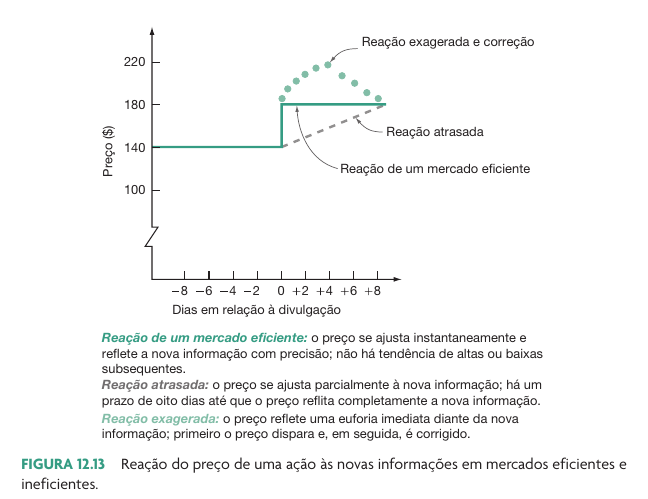
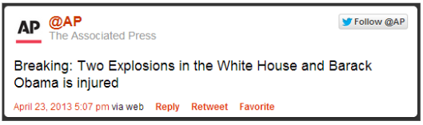
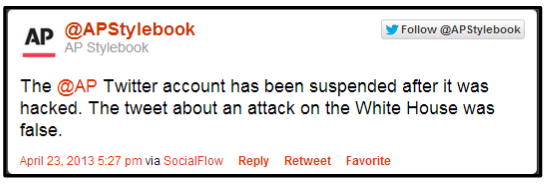
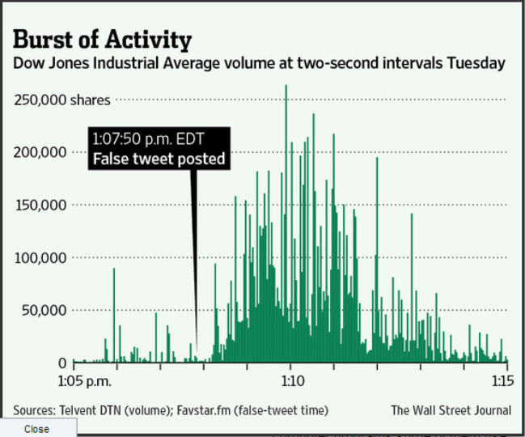
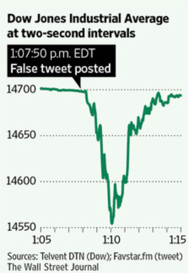
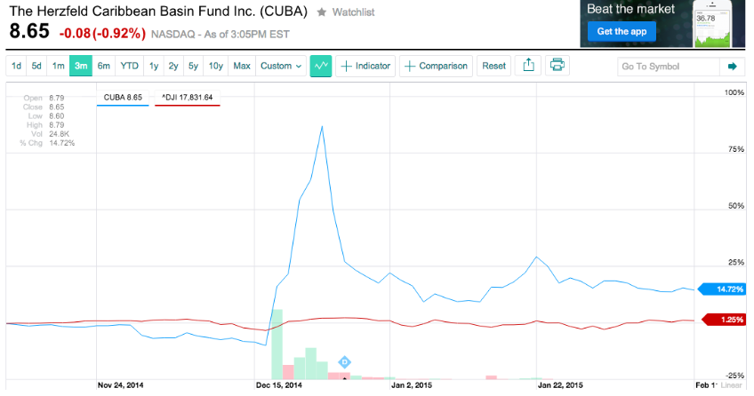
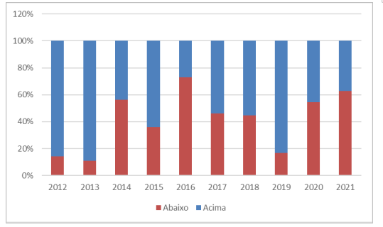
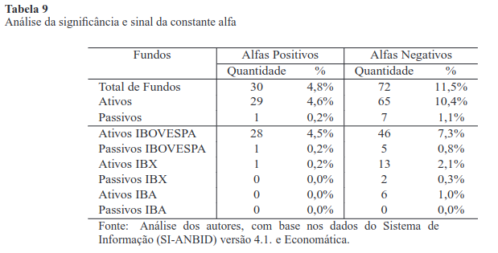

# Introdução a Teoria de Mercados Eficientes (TME)

## Introdução

::: {.incremental}
- Das aula anteriores
  - Analistas fundamentalistas e técnicos (grafistas) buscam  oportunidades presentes no mercado financeiro
- A teoria de eficiência de mercado prediz como a informação é embutida nos preços das ações
  - Este é o resultado de analistas técnicos e fundamentalistas analisando a mesma informação
- Principais trabalhos:
  - @bachelier1900theorie -- "Théorie de La Spéculation."
  - @cowles1933can -- "Can Stock Market Forecasters Forecast"
  - @fama1960efficient -- "Efficient Market Hypothesis"
:::

## O que são mercados "eficientes"

::: {.incremental}
- Imaginemos um mercado em que:
  - Há um número amplo de investidores (racionais ou irracionais);
  - Todos estão em concorrência ativa e pesquisando novas informações;
  - Todos possuem as mesmas informações;
  - Analistas fundamentalistas estimam fluxos de caixa futuros com fins de precificação;
  - Analistas técnicos procuram padrões nos preços e volumes
  - Qualquer nova informação é atualizada apropriadamente;
:::  

## Mercados eficientes

> "Se essas características estão presentes em um mercado, os preços praticados refletem integralmente a informação disponível aos investidores." [@fama1960efficient]

"Os preços de mercado são, na grande maioria das vezes, corretos!"

::: {.incremental}
- Na HEM (hipótese de eficiência de mercado) define-se que os preços de mercado podem não ser iguais aos preços justos
- Porém, tal diferença deve ser puramente aleatória (admite-se uma variação em torno do preço justo)
- Isto é, a probabilidade de achar uma ação subvalorizada é igual a probabilidade de achar uma ação supervalorizada, a qual é igual a 50%
:::

## Ilustração

- Dia 1: Empresa X está avaliando internamente um projeto com VPL substancialmente positivo;
  - mercado desconhece essa informação, 
  - VPL do projeto = 40$
  
- Dia 2: Projeto é divulgado ao mercado 
  - Informação se torna pública,
  - Mercado interpreta essa informação,
  - Preço reflete instantaneamente;

## Resultado

```{r}
#| fig-cap: !expr classtools::cite_ross(414)


```


# Formas de Eficiência

## Formas de eficiência de mercado:

::: {.incremental}
- **Forma forte**: toda informação está precificada;
  - Não há informação privilegiada;
- **Semi-forte**: toda informação pública de demonstrativos financeiros (incluindo preços e volumes) está precificada;
  - Análise fundamentalista não forneceria retornos anormais;
- **Forma fraca**: toda informação pública de preços e volumes negociados está precificada;
  - Análise técnica não ofereceria retornos anormais;
:::

## Implicações práticas 

::: {.incremental}
- Investidores levam exatamente aquilo pelo que pagaram (o preço é justo);
- Quanto mais investidores, maior concorrência, mais eficiente é o mercado;
- Quanto mais ampla é a divulgação das informações, mais eficiente é o mercado;
- Só vale a pena buscar empresas mal precificadas se investidor tiver um talento acima da média;
- Em geral, informações não públicas relevantes são difíceis e caras de serem obtidas;
- **There is no free lunch!**
:::

## Uma piada {background-image="figs/two-economists.jpeg" background-opacity=0.25}

Dois economistas caminham na rua e encontram uma nota de 100 R\$ no chão. Um deles diz: “não se ocupe em baixar para pegar o dinheiro, se fosse uma nota de 100 R\$ verdadeira, ela já teria sido pega por outra pessoa.

## Evidências da TME 

::: {.incremental}
- Informação é dissipada muito rapidamente;
- Há evidências de informação privilegiada;
- Existem investidores com informações secretas que compram e vendem com base nisso
- Há evidências de pessoas com capacidade extraordinária em avaliação de empresas, porém estas são extremamente raras
  - Ex. Warren Buffet, Charlie Munger, entre vários outros
- Mercados não se comportam 100% de forma racional!
:::

## Rapidez no processamento de informação (1/2)

No dia 23 de abril 2013, as 01:07 (EDT) um twitter foi divulgado pela Associated Press:

```{r}

```

## Rapidez no processamento de informação (2/2)

Porém, a conta havia sido hackeada e o tweet era falso

```{r}

```


## Resultado (Volume Negociado)

```{r}

```

## Resultado (Preço)

```{r}

```

Em torno de 200 bilhões de dólares sumiram do mercado em menos de 2 minutos
Preços se recuperam logo após episódio

## Mercados são irracionais

- Seres humanos muitas vezes não reagem de forma racional conforme esperado
- Alguns efeitos:
  - Autoconfiança exagerada e ganância exagerada
  - Comportamento de manada
  - Indisponibilidade em assumir erros
  - Baixo conhecimento financeiro

##  {background-image="figs/irracionality.png" background-size="contain" }

# O caso de CUBA

## CUBA

::: {.incremental}
- No mercado americano existe um fundo transacionado em bolsa com ticker igual a CUBA
- Este fundo tem ações do mercado americano, com nenhuma relação ao país de Cuba
- No dia 17/12/2014 Obama declarou a reestruturação das relações internacionais com o país Cuba
  - Situação em 24/12/2014: 
  - Valor dos ativos do fundo =  $8,27 por ação (quota)
  - Valor da ação no Mercado: $14,27
:::

## O Impacto no preço e volume

```{r}
#| fig-cap: O caso CUBA
#| fig-link: http://www.forbes.com/sites/timworstall/2014/12/24/cuba-shows-that-the-efficient-markets-hypothesis-is-wrong/

```


# Evidências da TME no Brasil

## Evidências Acadêmica para o Mercado Brasileiro (1)

A figura abaixo mostra  percentualmente quantos fundos ganharam ou perderam do índice Ibovespa em termos de valor de Índice Sharpe (retorno/risco) em cada ano 



::: aside
Garcia, Filipe. 2022. “"Análise de Desempenho de Fundos de Investimentos Em Ações Ativos e Índice Ibovespa".” TCC Administração de Empresas.
:::

## Evidências Acadêmica para o Mercado Brasileiro (2)

Descrição: 626 fundos entro o período de 1996 e 2006 foram analisados e sua performance foi comparada ao Ibovespa (fonte: @castro2009performance)

```{r}

```


## Referências