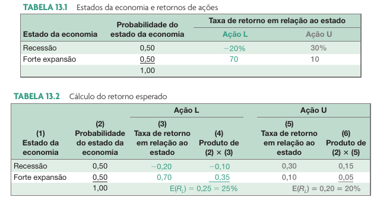

## Visão geral da aula

```{r, cache=FALSE}
library(classtools)
link_gsheets <- ""
```

- Como calcular retornos esperados.
- O impacto da diversificação.
- O princípio do risco sistemático.
- A linha do mercado de títulos e a ponderação entre risco e retorno.

# Retorno Esperado

## Conceito 

> O retorno esperado é a expectativa de ganho futuro no investimento de uma ação

. . .

- Considere duas ações, L e U, que têm as seguintes características: 
  - a ação L tem uma expectativa de retorno de 25% no próximo ano
  - a ação U tem uma expectativa de retorno de 20% no mesmo período.
  
Em uma situação como essa, se todos os investidores concordarem quanto aos retornos
esperados, por que alguém manteria a ação U? 

## Retornos esperados e probabilidades

```{r}
#| fig-cap: !expr classtools::cite_ross(426)


```

# Variância (ou desvio padrão)

TODO: 

## Introdução 

- Retorno esperado e risco são positivamente relacionados
  - Um investimento com risco deve necessariamente oferecer um retorno esperado maior que a taxa livre de risco
  - A diferença é chamada de prêmio por risco

- Como quantificar ambos para ações?
  - Análise objetiva/científica/acadêmica da rentabilidade futura e risco dos ativos
  - Solução: análise estatística do comportamento histórico dos ativos

## Referências