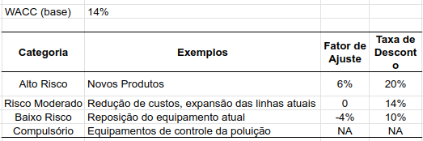

# Introdução ao custo de capital

```{r}
link_sheets <- "https://docs.google.com/spreadsheets/d/1NxzxCR6cSV9g0j-rxyiDMsVge4bbyOlwresr0Kf6FEI/edit?usp=sharing"
```


## Custo do Capital

> Custo do Capital (ou taxa de desconto): Remuneração mínima para os projetos da empresa 

::: {.incremental}
- Das aulas anteriores:
  - Projeto é analisado olhando para o VPL do mesmo, dada arbitrariamente uma taxa de custo de capital (geralmente e erroneamente uma taxa livre de risco)
  - A incerteza pode ser analisada via cenários e análise de sensibilidade
  
- O custo de capital da empresa vai ser formado por:
  - Custo do capital próprio
  - Custo do capital de terceiro
:::

## Pergunta #1

> Você emprestou 1000 R$ para seu amigo, cobrando 15% de juros anuais. Seu amigo irá utilizar esse capital para investir em um projeto de 1000 R$. Qual o custo de capital (mínima remuneração) que **seu amigo** deve utilizar para calcular o VPL do projeto?


a) Retorno anual da poupança
b) Retorno anual do CDB pós fixado
c) 15%
d) Retorno anual médio do Ibovespa
e) Nenhuma das anteriores

## Pergunta #2

> O mesmo amigo anterior pegou emprestado 1000 R$ contigo e 500 R$ com outra pessoa. Você e essa outra pessoa querem 10% e 20% de juros, respectivamente. Qual o custo de capital para o seu amigo devedor?

a) Retorno anual da poupança
b) 10%
c) 20%
d) 13,33%
e) Retorno anual médio do Ibovespa

## Pergunta #3

> O mesmo amigo anterior pegou emprestado 500 R$ contigo e 500 R$ com outra pessoa. Enquanto você ainda quer os 10% de juros, essa outra pessoa pediu 50% dos lucros obtidos nos projetos. Qual o custo de capital para o seu amigo devedor?

a) Retorno anual da poupança
b) 10%
c) 15%
d) Retorno anual médio do Ibovespa
e) Impossível de dizer sem maiores informações


# Como Calcular o Custo de Capital de uma Empresa

## Fatores determinantes do custo de capital de uma empresa

::: {.incremental}
- Taxa livre de risco
- Risco do negócio (maior o risco, maior o custo do capital de terceiros e próprio)
- Estrutura do capital da empresa
  - Proporção de Capital Próprio
    - Capital que dá direito sobre os fluxos de caixa dos projetos da empresa 
  - Proporção de Capital de terceiros
    - Capital que remunera de forma fixa o detentor das dívidas da empresa
:::


## Custo total do capital da empresa

::: {.incremental}
- Custo do capital próprio
  - Abordagens:
    - Modelo de crescimento de dividendos (Gordon)
    - Linha do mercado de títulos (CAPM)
- Custo do capital de terceiro
  - Abordagem: cálculo do YTM (TIR) da dívida
:::


# Cálculo do custo do capital próprio

## Modelo de crescimento de dividendos [@gordon1956capital]

- Premissas:
  - Tempo infinito (ação nunca é vendida)
  - Dividendos crescentes de forma constante

$$r = \frac{DIV_0(1+g)}{P_0}+g$$
Onde: 

$DIV_0$ - Dividendo pago na data $t=0$

$g$ - taxa de crescimento dos dividendos

$P_0$ - preço atual da ação

## Exemplo

```{r}
P_0 <- 120
DIV_0 <- 12
g <- 0.025

r <- (DIV_0*(1+g))/P_0 + g
```

> As ações de uma empresa possuem um preço hoje de `r classtools::format_cash(P_0)`, um dividendo hoje de `r classtools::format_cash(DIV_0)` e uma taxa de crescimento de dividendos de `r classtools::format_percent(g)`. Qual o custo do capital próprio da empresa?

$$r = \frac{DIV_0(1+g)}{P_0}+g$$
$$r = \frac{`r DIV_0`(1+`r g`)}{`r P_0`}+`r g` = `r r`$$

O custo de capital próprio é de `r classtools::format_percent(r)`

## Cálculo de g

> Como calcular a taxa de crescimento dos dividendos (g) ?

```{r}
N <- 5
raw_tbl <- tibble::tibble(
  Ano = lubridate::year(Sys.Date()) + 0:(N-1),
  Dividendo = seq(1, 2, length.out = N) + rnorm(N, 0, sd = 0.05)
)
```

```{r}
raw_tbl_2 <- raw_tbl |>
  dplyr::mutate(`Variação %` = Dividendo/dplyr::lag(Dividendo) - 1)

raw_tbl_2 |>
  dplyr::mutate(`Variação %` = Dividendo/dplyr::lag(Dividendo) - 1) |>
    gt::gt() |>
  gt::fmt_currency(Dividendo, currency = "BRL") |>
  gt::fmt_percent(`Variação %`)

g <- mean(raw_tbl_2[['Variação %']], na.rm = TRUE)
```

O valor de $g$ é a média da variação percentual do dividendos entre os anos: `r classtools::format_percent(g)`

## Vantagens e desvantagens 

- Vantagens
  - Simplicidade
- Desvantagens
  - Implementável apenas para empresas que pagam dividendos
  - Premissa de dividendo crescente
  - Efeito do risco sobre custo do capital é pouco explícito

## Abordagem da SML (LMT)

> Baseado no modelo CAPM, projetando um equilíbrio entre risco e retorno 

$$r = R_f + \beta (R_M - R_f)$$

Onde:

$r$ - custo do capital próprio da empresa

$R_f$ - taxa livre de risco da economia

$\beta$ - coeficiente beta (risco sistêmico da empresa)

$R_M$ - Retorno esperado da carteira de mercado (Ibovespa)


# Alguns custos de capitais atuais

## Custo de capital de empresas da B3

```{r}
library(dplyr)

tickers <- c("PETR3.SA", "EGIE3.SA", 'ITSA3.SA', "SAPR3.SA", "GRND3.SA")
selic <- classtools::get_selic_rate()$aa
selic <- 0.075 # selic is too high!
first_date <- Sys.Date() - 10*365

df_ibov <- yfR::yf_get("^BVSP", first_date, freq_data = 'yearly') |>
  rename(ret_ibov = ret_adjusted_prices) |>
  select(ref_date, ret_ibov)

df_yf <- yfR::yf_get(tickers, first_date, freq_data = 'yearly') |>
  left_join(df_ibov, by = 'ref_date')

estimate_single_beta <- function(df_in) {
  
  my_lm <- lm(data = df_in, formula = "ret_adjusted_prices ~ ret_ibov")
  my_beta <- coef(my_lm)[2]
  
  tib_out <- tibble(
    ticker = df_in$ticker[1],
    beta = my_beta
  )
  return(tib_out)
}

my_betas <- purrr::map_df(split(df_yf, df_yf$ticker), estimate_single_beta)

tbl <- tibble(
  ticker = tickers,
  beta = my_betas$beta,
  R_f = selic,
  R_M = mean(df_ibov$ret_ibov, na.rm = TRUE),
  R = R_f + beta*(R_M - R_f)
)

tbl |>
  dplyr::arrange(beta) |>
  gt::gt() |>
  gt::cols_label(.list = list("R_f" = gt::md("R_f"))) |>
  gt::tab_header("Custo de Capital de várias empresas",
                  glue::glue("Dados atualizados em {Sys.Date()}")) |>
  gt::fmt_percent(columns = c("R_f", "R_M", "R")) |>
  gt::fmt_number("beta", decimals = 2)
```


## Vantagens e desvantagens 

- Vantagens
  - Ajuste por risco
  - Fácil implementação, desde que a empresa é listada em bolsa
- Desvantagens
  - Empresa tem que estar listada no mercado acionário


# Custo do capital de terceiros

## Cálculo do custo de capital de terceiros

> Custo do capital de terceiros = retorno exigido pelos credores da empresa

- Taxa a ser paga na obtenção de crédito
  - Facilmente obtido ao analisar as dívidas correntes da empresa, em relação ao total pago em juros
- No caso de múltiplas dívidas, com taxas diferentes, uma média ponderada pode ser utilizada

## Exemplo

```{r}
my_T <- 10
VF <- 100
cupom <- 0.07
P_0 <- 96
```


> Exemplo: uma empresa emite um título de renda fixa com prazo de `r my_T` anos, valor de face igual a `r classtools::format_cash(VF)`, cupom de `r classtools::format_percent(cupom)` e o preço hoje é de `r classtools::format_cash(P_0)`. Qual o custo do capital de terceiros?

```{r}
#| fig-align: center
l_p <- classtools::create_cashflow_plot(
  P_0,
  c(rep(cupom*VF, my_T-1) ),
  VF + cupom*VF)

l_p$p

CF <- l_p$cashflows

my_irr <- FinCal::irr(CF$CF)
```

TIR do título (YTM) = `r classtools::format_percent(my_irr)`

Custo do capital = `r classtools::format_percent(my_irr)`


# Custo do capital da empresa (WACC)

## Conceito

> WACC (_Weighted Average Cost of Capital_): Média ponderada dos custos de capital próprio e capital de terceiros da empresa

- Pesos dados pela participação no valor total da empresa:

$$PESO_{CP} = \frac{TotalCP}{TotalCP + TotalCT}$$
$$PESO_{CT} = \frac{TotalCT}{TotalCP + TotalCT}$$

Onde:

$TotalCP$ - Total de capital próprio na empresa

$TotalCT$ - Total de capital de terceiros na empresa

## Efeito do imposto sobre Capital de terceiros

> O valor pago pelo capital de terceiros é abatido do imposto.

$$R_{CT} ^{efetiva} = R_{CT} ^{nominal}(1-T_C)$$
Onde:

$R_{CT} ^{efetiva}$ - Custo efetivo do capital de terceiros

$R_{CT} ^{nominal}$ - Custo nominal do capital de terceiros (TIR da dívida)

$T_C$ - Alíquota de imposto sobre lucro tributável

## Exemplo Efeito dos Impostos

](figs/efeito-imposto.png)


## Fórmula WACC

$$WACC = PESO_{CP}*R_{CP} + PESO_{CT}*R_{CT}*(1-T_C)$$

Onde:

$PESO_{CP}$ - \% de capital próprio na empresa

$PESO_{CT}$ - \% de capital de terceiros na empresa

$R_{CP}$ - Custo do capital próprio da empresa

$R_{CT}$ - Custo nominal do capital de terceiros da empresa

$T_C$ - Alíquota de imposto sobre lucro tributável


## Cálculo do WACC para Engie

](figs/wacc-engie.png)


# Problemas com o WACC

## Alguns problemas com o WACC

- WACC só é aplicado se o projeto possuir risco semelhante ao da empresa
- Assume-se que os betas dos projetos são iguais ao beta da empresa
- Possibilidade de aceitar/rejeitar projetos de forma equivocada caso o beta do projeto não for igual ao beta da empresa

## WACC para empresas não negociadas em Bolsa

- Abordagem Objetiva (ou aposta simples):
  - Verificar custos de capital de empresas com riscos semelhantes ao projeto
    - Exemplo: telefonia, setor financeiro
- Abordagem Subjetiva
  - Elencar riscos de forma subjetiva e criar fatores de ajuste sobre o WACC da empresa

## Exemplo Abordagem Subjetiva

```{r}

```

## Referências
