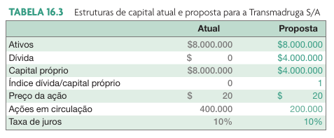
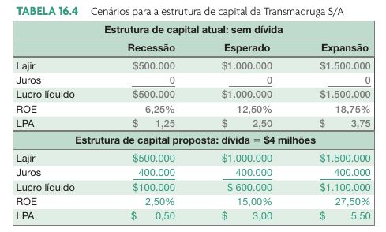
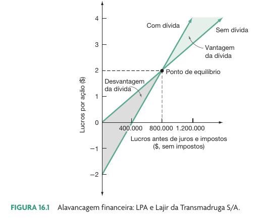
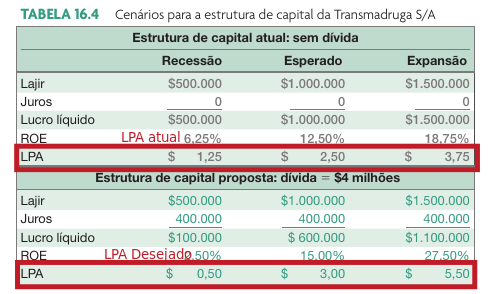
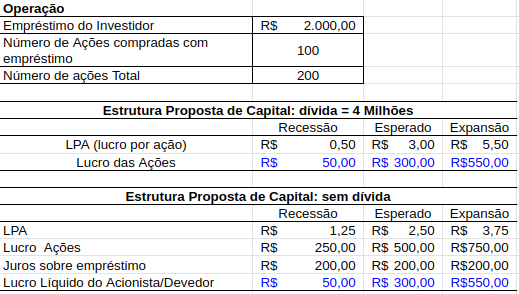
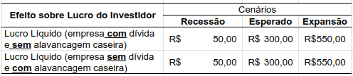
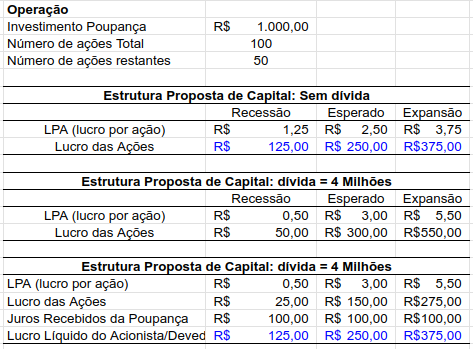
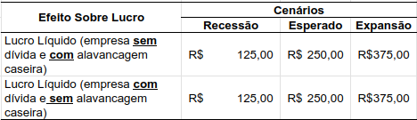

# Alavancagem financeira e política de estrutura de capital

```{r}
link_sheets <- "https://docs.google.com/spreadsheets/d/1VJ3NzCemWxtj1Z-u9wbdLW4BCZ3Foz2TKx7t6kvWZVc/edit?usp=sharing"
```

## Introdução

```{r}
# 20240718: Old code using Getdfpdata2, new code uses eodhd

# library(dplyr)
# 
# #raw_passivo <- readr::read_csv('data/20230404_DFP-data/DF Consolidado - Balanço Patrimonial Passivo.csv')
# 
# selected <- readr::read_csv('data/20230404_DFP-data/DF Consolidado - Balanço Patrimonial Passivo.csv') |>
#   filter(DS_CONTA %in% c("Passivo Total", "Passivo Circulante", "Passivo Não Circulante", "Patrimônio Líquido Consolidado"))
# 
# df_endiv <- selected |>
#   group_by(DENOM_CIA, DT_REFER) |>
#   reframe(
#     passivo_total = VL_CONTA[DS_CONTA == "Passivo Circulante"]+ VL_CONTA[DS_CONTA == "Passivo Não Circulante"] +VL_CONTA[DS_CONTA == "Patrimônio Líquido Consolidado"], 
#     divida_total = VL_CONTA[DS_CONTA == "Passivo Circulante"]+ VL_CONTA[DS_CONTA == "Passivo Não Circulante"],
#     indice_endiv = divida_total/passivo_total) |>
#   ungroup() |>
#   filter(DT_REFER == max(DT_REFER),
#          indice_endiv <= 1)
# 
# this_year <- lubridate::year(max(df_endiv$DT_REFER))
# 
# mean_endiv <- mean(df_endiv$indice_endiv, na.rm = TRUE)

```

```{r}
library(dplyr)

f_sql <- "~/GDrive/99-backups/02-work/02-research/01-databases/eodhd/sqlite-files/20250328_eodhd_data_Brazil.sqlite"

max_date <- as.Date("2023-12-31")
min_date <- as.Date("2001-01-01")

con <- RSQLite::dbConnect(
  RSQLite::SQLite(),
  f_sql
  )

df_fin <- RSQLite::dbReadTable(con, 'yearly') 

RSQLite::dbDisconnect(con)

df_fin <- df_fin |>
  filter(date <= max_date,
         date >= min_date,
         name %in% c("totalAssets", "totalLiab"),
         currency_symbol == "BRL") |>
  mutate(date = as.Date(date)) 
  

df_endiv_last_year <- df_fin |>
  group_by(company_name, date) |>
  reframe(
    passivo_total = value[name == "totalAssets"], 
    divida_total = value[name == "totalLiab"],
    indice_endiv = divida_total/passivo_total) |>
  ungroup() |>
  filter(date == max(date),
         indice_endiv <= 1) |>
  unique()

this_year <- lubridate::year(max(df_endiv_last_year$date))

mean_endiv <- mean(df_endiv_last_year$indice_endiv, na.rm = TRUE)

```


::: {.incremental}
- Para o ano de `r this_year`, **a média do índice de endividamento de todas as `r dplyr::n_distinct(df_endiv_last_year$company_name)` empresas negociadas na bolsa do Brasil é `r classtools::format_percent(mean_endiv)`**
  - Isto indica que apenas `r classtools::format_percent(1-mean_endiv)` do dinheiro nos ativos da empresa é de capital próprio dos sócios
- A empresa é livre para estruturar a origem de seu financiamento de longo prazo
  - Quais os efeitos de uma mudança na estrutura de capital de uma empresa?
  - **Qual seria o nível ótimo de endividamento?**
- Premissa básica do capítulo: capital total (ou passivo total) sempre se mantém constante em valor nominal:
  - Exemplo: aumento do endividamento dá-se através da recompra de ação ou então uma emissão de ações para pagamento da dívida
:::

## Pergunta #1 

> Do ponto de vista de resultado financeiro da empresa, o que podemos esperar de impacto quando aumentamos a participação de capital de terceiro na empresa?

::: {.incremental}
- Risco de negócio aumenta ou diminui?
- Lucro tributável (LAJIR) aumenta ou diminui?
- O pagamento de imposto aumenta ou diminui?
:::

## Pergunta #2

> Se vocês fossem acionistas da empresa, qual seria o efeito da mudança da estrutura de capital (ex. aumento endividamento) em relação ao LPA (lucro por ação)? **Lembrem que o capital total sem mantém constante (não entra novo dinheiro na empresa)**

- Lucro por ação (LPA) aumenta, diminui ou não se altera?


# Efeito da Alavancagem Financeira

## Qual o efeito da alavancagem financeira da empresa sobre a remuneração do acionista?

- Premissas:
  - Sem fricções de mercado:
  - custos de transação iguais a zero
  - Juros iguais para devedor e credor (tanto empresa quanto pessoa física) 
  - Impostos inexistentes

## O efeito da alavancagem 

- Transmadruga S/A:
  - Valor de mercado: 8 Milhões USD
  - Número de ações: 400.000
  - Preço da Ação: \$20
  - Taxa de juros no mercado = 10%

**Proposta: alavancar a empresa em 50% através da compra de 200.000 ações no mercado com um empréstimo.**

> Lembrem que o capital total da empresa se mantém constante 

## Resultado (1)

```{r}
#| fig-cap: !expr classtools::cite_ross(543)

```

## Resultado (2)

```{r}
#| fig-cap: !expr classtools::cite_ross(544)

```

## Efeito da Dívida sobre LPA

```{r}
#| fig-cap: !expr classtools::cite_ross(544)

```

## Conclusões

::: {.incremental}
- Os acionistas estarão expostos a maior risco na nova estrutura de capital, uma vez que o LPA será mais sensível à alterações do LAJI em cada cenário
- Devido ao impacto da alavancagem financeira sobre o retorno esperado e risco, a estrutura do capital é uma consideração importante para o valor da empresa 
  - Imagine 2 empresas, uma alavancada e outra não. Aquela que tiver alavancada oferece mais risco e retorno esperado para o investidor, portanto deve ter preço da ação menor que  a empresa não-alavancada
  - <span style="color:red;">**Só que não..**</span>
:::


# Alavancagem Caseira

## Conceito

> Alavancagem caseira = tomada (ou concessão) de empréstimo e investimentos por parte do investidor

- Mesma taxa de juros da empresa (premissa de mercado em equilíbrio)
- Empresa negociada abertamente na bolsa, com bastante liquidez (nenhum impacto no preço)
- Uma alavancagem caseira pode replicar valores de lucro por ação para qualquer estrutura de capital da empresa

## 1º Caso: empresa financiada somente com capital próprio

> Considere um investidor com 100 ações da empresa não alavancada, cujo objetivo fosse atingir o mesmo lucro líquido no caso de uma empresa alavancada

```{r}

```

## Passos do Investidor:

1. Tomar 2.000 R$ emprestado a 10%
1. Comprar 100 ações (2.000 R$) da empresa

## Efeito da Alavancagem Caseira (1)

```{r}

```

[Link Planilha Aula](`r link_sheets`)

## Resultado Alavancagem Caseira (1)

```{r}

```

[Link Planilha Aula](`r link_sheets`)


## 2º Caso: empresa financiada com capital de terceiro

> Considere um investidor com 100 ações da empresa alavancada, cujo objetivo fosse atingir o mesmo lucro líquido no caso de uma empresa não-alavancada

- Passos do Investidor:
  1. Vender a descoberto 50 ações a 20 R$ cada
  1. Colocar dinheiro proveniente da venda para render juros de 10%


## Efeito da Alavancagem Caseira (2)

```{r}

```

[Link Planilha Aula](`r link_sheets`)

## Resultado Alavancagem Caseira (2)

```{r}

```

[Link Planilha Aula](`r link_sheets`)

## Consequências

::: {.incremental}
- Um investidor, através da alavancagem caseira, **consegue qualquer perfil de LPA** (lucro por ação) através do uso de instrumentos financeiros (compra/venda da ação e concessão/tomada de empréstimos no mercado)
- Alavancagem caseira e bolsa de valores
  - Imagine  duas empresa negociadas em bolsa, iguais em tudo exceto o nível de endividamento.
  - Por forças de mercado, os preços das ações das duas empresas teriam que ser o mesmo valor!
:::

## Exemplo duas empresas iguais (A e B)

::: {.incremental}
- Empresas A – Alavancada (80 % capital próprio)
  - Preço da ação= 10 R$
- Empresa B – Não Alavancada (100 % capital próprio)
  - Preço da ação= 15 R$

- Considere um investidor que quisesse o perfil de risco/retorno da ação B
  - Opções do investidor:
    - Comprar B (com preço maior)
    - Comprar A (com preço menor) e fazer alavancagem caseira

- **O que aconteceria com os preços de A e B? **
  - Eventualmente convergiriam para o mesmo preço!
:::


# Proposições de M&M [@modigliani1958cost]

## Proposição I de M&M (sem impostos)

> O valor da empresa alavancada é igual ao valor da empresa não alavancada. 

No equilíbrio, e para um mundo **sem impostos**, o nível de endividamento da empresa é irrelevante em relação ao valor da mesma.

## Efeito da estrutura do capital sobre o WACC (sem impostos)

- O WACC é utilizado para descontar os fluxos de caixa futuros da empresa
  - Se o WACC aumentar então o preço da ação diminui
- Se o valor da empresa não muda com o endividamento (proposição I (sem impostos) de MM), então o custo do capital da empresa (WACC) também não pode mudar:
- Consequência: **Proposição II de M&M**

## Proposição II de M&M (sem impostos)

> O custo de capital próprio de uma empresa é linearmente dependente de sua estrutura de capital

- Compensação pelo aumento no risco financeiro em função do aumento do endividamento
- Risco do capital próprio = Risco operacional	+ risco financeiro

## Visualização Gráfica (M&M sem impostos)

```{r}
#| fig-cap: !expr classtools::cite_ross(548)

knitr::include_graphics("figs/MM_fig01.png")
```

## Referências {.unlisted}
