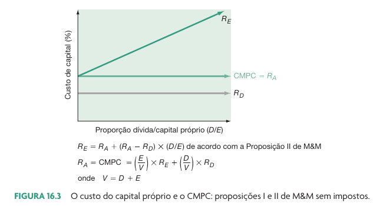
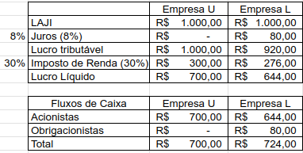
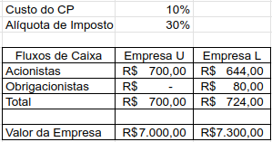
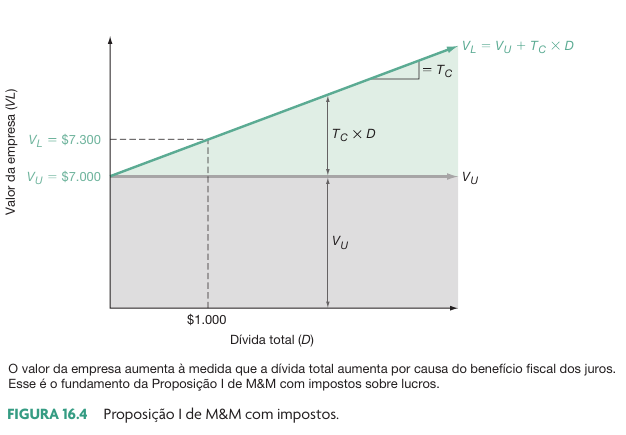
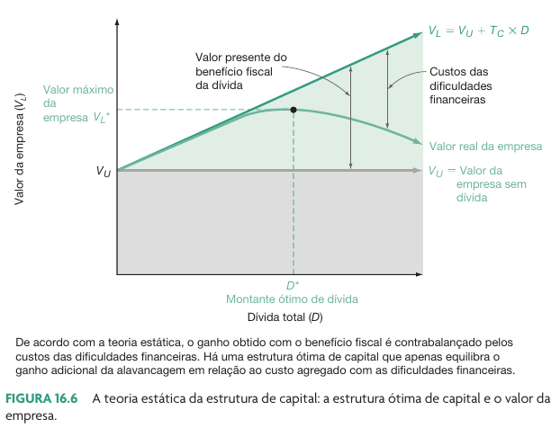
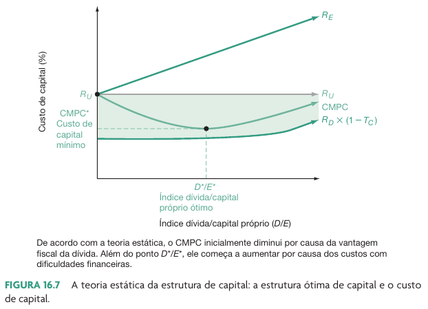
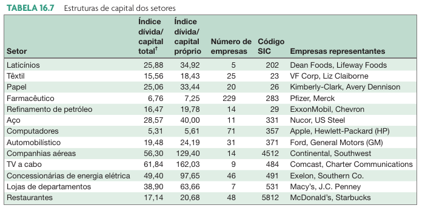

# Alavancagem financeira e política de estrutura de capital

```{r}
link_sheets <- "https://docs.google.com/spreadsheets/d/1bm96H1c11BYZChhmI9mfIpQIhEfEFuBJjocPspfW-o0/edit?usp=sharing"
```

## Introdução

- Da aula anterior, o trabalho de @modigliani1958cost diz:

> Proposição I de MM diz que o valor da empresa é independente da forma como a empresa é financiada

- Tal conclusão é atingida devido a possibilidade de alavancagem caseira por parte do investidor
**Assume explicitamente a não existência de impostos**

> Proposição II de MM sem impostos: o custo do capital do acionista aumenta na medida que aumenta a participação de capital de terceiro na empresa

## Visualização Gráfica (M&M sem impostos)

```{r}
#| fig-cap: !expr classtools::cite_ross(548)


```

# O efeito do Imposto de Renda

## Introdução 

> Capital de terceiro, apesar de oneroso, possui benefícios pois os juros são deduzidos dentro do cálculo do imposto de renda

- Quando adicionamos o IR na análise, as conclusões sobre estrutura de capital mudam
  - Imagine duas empresas iguais, exceto da participação de capital de terceiros em sua estrutura
    - Empresa U – Sem dívidas 
    - Empresa L – Com dívidas

## Efeitos do imposto de renda sobre o fluxo de caixa

```{r}
#| fig-cap: !expr classtools::cite_ross(551)

```

## Qual o Valor de uma empresa?

- Assuma que empresas U e L irão gerar os mesmos fluxos de caixa infinitamente
- Valor de uma empresa é a soma dos fluxos de caixa descontados para a data zero.
- Se assumirmos que a empresa existirá por um tempo infinito, esses fluxos de caixa viram perpetuidades.

$$V = \sum ^{inf} _t \frac{FC}{(1+r)^t} = \frac{FC}{r} $$

## Valores das empresas L e U

$$V_U = \sum ^{\inf} _t \frac{FC}{(1+r)^t} = \frac{FC}{r} $$
$$V_L = \sum ^{\inf} _t \frac{FC}{(1+r)^t} + \sum ^{\inf} _t \frac{T_cDR_d}{(1+r_D)^t} = \frac{FC}{r} + T_C D$$

$$V_L = V_U + T_C D$$

Onde:

$V_U$ - Valor da empresa sem dívidas

$V_L$ - Valor da empresa sem dívidas

$T_C$ - Alíquota de imposto

$D$ - Valor da dívida

$R_D$ - Custo do capital de terceiros

## Exemplo

```{r}

```

## Visualização Gráfica

```{r}
#| fig-cap: !expr classtools::cite_ross(552)


```

## Impacto do endividamento no WACC	

A equação do WACC é dada por:

$$WACC = (E/V)R_E + (D/V) R_D (1-T_C)$$

- Anteriormente vimos que se aumentarmos o endividamento da empresa, o custo do capital próprio aumenta. 
- Porém, o WACC final fica menor devido ao benefício fiscal. 
- Concluindo, ao aumentarmos o endividamento de uma empresa que paga impostos, o custo de capital desta (WACC) fica menor.

# Proposição I de M&M com impostos

## Proposição I de M&M com impostos [@modigliani1958cost]

> O aumento de capital de terceiro é vantajoso para a empresa. Quanto maior a participação de capital de terceiro, maior o valor da empresa e menor o seu custo de capital (WACC)”

## Se isso é verdade, por que as empresas não financiam todo o capital com recursos de terceiro? {background-image="figs/thinking-face.gif" background-opacity=0.55} 

## Risco de Falência

::: {.incremental}
- Juros sobre capital de terceiro são pagos de forma independente da economia
  - O aumento do capital de terceiros aumenta o risco de falência
- O processo de falência não é gratuito e cria um custo esperado (ponderado pela chance de falência):
  - Venda de ativos com desconto
  - Pagamento de trâmite judicial
    - Ex: Enron pagou 1 bilhão de dólares referente a advogados, contadores, e consultores no seu processo de falência
  - O aumento do endividamento da empresa cria um custo indireto	
:::

# Teoria Estática da estrutura de capital

## Definição

::: {.incremental}
- O uso de capital de terceiro tem o benefício fiscal, porém o malefício respectivo a existência de custos de dificuldades financeiras
- Financeiramente podemos enxergar que existe um **ponto ótimo de endividamento**
- A empresa toma emprestado até o ponto em que o benefício do endividamento é igual ao custo esperado da falência.
  - Nesse ponto a empresa atinge seu valor máximo
:::

## Teoria estática e o valor da empresa

```{r}
#| fig-cap: !expr classtools::cite_ross(559)


```

## Teoria Estática e o WACC

```{r}
#| fig-cap: !expr classtools::cite_ross(559)


```

## Alguns comentário

::: {.incremental}
- Impostos
  - Benefícios fiscais serão maiores para aquelas que apresentarem LAJIR suficiente para cobrir os juros (regime do lucro real)
  
- Dificuldades financeiras	
  - Empresas com LAJIR volátil devem evitar pegar dinheiro de dívidas
  - Empresas grandes e estáveis devem utilizar mais capital de terceiro que empresas pequenas e instáveis
:::

# Teoria da financiamento interno e a ordem hierárquica

## Conceito

::: {.incremental}
- Empresas grandes e lucrativas possuem **um dos menores índices de endividamento**
  - Esta evidência é contrária a teoria estática. Empresas com poucas chances de falência deveriam utilizar ao máximo os benefícios fiscais da dívida e se endividar mais do que a média
- A teoria da ordem hierárquica propõe que o gestor financeiro se utiliza de uma **ordem hierárquica** e sempre **prefere** usar financiamento interno (caixa), pois o capital é mais barato do que capital próprio (novas ações) ou dívidas (emissão de debêntures)
  - Dívidas são onerosas e lançar ações pode indicar uma super precificação das ações (evidências mostram que o mercado reage negativamente ao lançamento de novas ações)
:::

## Implicações da teoria do financiamento interno

::: {.incremental}
- Nenhuma estrutura-meta de capital:
  - A estrutura de capital da empresa é definida por suas necessidades de aportes financeiros
- Empresas rentáveis utilizam menos endividamento:
  - Quanto mais caixa interno, menor a necessidade de tomar capital emprestado
- Empresas desejam ter folga financeira:
  - Para evitar emissão de ações ou dívidas, o gestor tem preferência por criar uma folga financeira	
:::

## Resumo das teorias

- Proposição I de M&M:
  - Sem impostos: O nível de endividamento não diz nada sobre o valor da empresa
  - Com impostos: Quanto maior o endividamento, maior o valor da empresa.
- Proposição II de M&M:
  - O custo do capital próprio aumenta com o nível de endividamento da mesma.
- Teoria estática:
  - Existência de um ponto ótimo, onde o valor da empresa é maximizado em função dos benefícios fiscais e os custos de falência
- Teoria do financiamento interno (ordem hierárquica)
  - As empresas têm preferência por utilizar recursos internos para financiar os seus projetos

## Alguns índices de endividamento (USA)

```{r}
#| fig-cap: !expr classtools::cite_ross(557)


```

## Índices de endividamento no Brasil, por setor

```{r}
#| eval: false

# OLD code (GETDFPDAta2)

library(dplyr)
library(ggplot2)
#raw_passivo <- readr::read_csv('data/20230404_DFP-data/DF Consolidado - Balanço Patrimonial Passivo.csv')

df_info <- RSQLite::dbReadTable(
  RSQLite::dbConnect(RSQLite::SQLite(), f_sqlite),
  'info'
)

selected <- readr::read_csv('data/DF Consolidado - Balanço Patrimonial Passivo.csv') |>
  filter(DS_CONTA %in% c("Passivo Total", "Passivo Circulante", "Passivo Não Circulante", "Patrimônio Líquido Consolidado"))

df_info <- GetDFPData2::get_info_companies() |> 
  select(CD_CVM, SIT_REG, SETOR_ATIV, SIT_EMISSOR)

selected <- selected |>
  left_join(df_info, by = "CD_CVM")

n_sectors <- 12
main_sectors <- sort(table(selected$SETOR_ATIV), decreasing = TRUE)
selected_sectors <- names(main_sectors)[1:n_sectors]

df_endiv <- selected |>
  filter(SIT_REG == "ATIVO",
         SIT_EMISSOR == "FASE OPERACIONAL",
         SETOR_ATIV %in% selected_sectors) |>
  group_by(DENOM_CIA, CD_CVM, DT_REFER, SETOR_ATIV) |>
  reframe(
    passivo_total = VL_CONTA[DS_CONTA == "Passivo Circulante"]+ VL_CONTA[DS_CONTA == "Passivo Não Circulante"] +VL_CONTA[DS_CONTA == "Patrimônio Líquido Consolidado"], 
    divida_total = VL_CONTA[DS_CONTA == "Passivo Circulante"]+ VL_CONTA[DS_CONTA == "Passivo Não Circulante"],
    indice_endiv = divida_total/passivo_total) |>
  ungroup() |>
  filter(indice_endiv <= 1)
```


```{r}
library(dplyr)

f_sql <- "~/GDrive/99-backups/02-work/02-research/01-databases/eodhd/sqlite-files/20250328_eodhd_data_Brazil.sqlite"

max_date <- as.Date("2024-12-31")
this_year <- lubridate::year(max_date)

con <- RSQLite::dbConnect(
  RSQLite::SQLite(),
  f_sql
  )

df_fin <- RSQLite::dbReadTable(con, 'yearly') |>
  mutate(date = as.Date(date)) 

df_info <- RSQLite::dbReadTable(con, 'info')

df_endiv <- df_fin |>
  filter(date <= max_date) |>
  group_by(ticker, company_name, date) |>
  reframe(
    passivo_total = value[name == "totalAssets"], 
    divida_total = value[name == "totalLiab"],
    indice_endiv = divida_total/passivo_total) |>
  ungroup() |>
  filter(date == max(date),
         indice_endiv <= 1) |>
  unique()

df_endiv <- df_endiv |>
  group_by(company_name, date) |>
  slice_head(n= 1) |>
  ungroup() |>
  left_join(df_info, by = c('ticker' = "Code"))


```


```{r}
tab <- df_endiv |>
  group_by(Sector) |>
  summarise(
    n_companies = n_distinct(company_name),
    mean_endiv = mean(indice_endiv)
  ) |>
  arrange(mean_endiv)

tab |>
  gt::gt() |>
  gt::tab_header(
    title = "Índices de Endividamento para Empresas da B3",
    subtitle = gt::md(glue::glue("Dados obtidos via **eodhdR2** ({dplyr::n_distinct(df_endiv$company_name)} empresas no ano de {this_year})"))) |>
  gt::cols_label(.list = list(
    Sector = "Setor da Atividade",
    n_companies = "Número de Empresas",
    mean_endiv = "Média de Endividamento Geral")) |> 
  gt::fmt_percent(mean_endiv) |>
  gt::data_color(columns = c("mean_endiv"), 
                 palette = "Reds")
```

## Gráfico do Endividamento por Setor

```{r}
library(ggplot2)

p <- ggplot(df_endiv, aes(
  x = forcats::fct_reorder(Sector, indice_endiv, median), 
  y = indice_endiv)) + 
  geom_boxplot(outliers = FALSE) + 
  geom_jitter(alpha = 0.25) + 
  coord_flip() + 
  labs(
    title = "Índices de Endividamento e Setores de Empresas da B3",
    subtitle = glue::glue(
      "Dados para {nrow(df_endiv)} empresas listadas em bolsa no ano de {this_year}"
    ),
    x = "Setor",
    y = "Índice de Endividamento (%)"
  ) + 
  theme_light()

p
```

## Referências {.unlisted}
