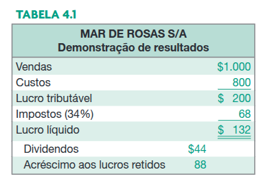
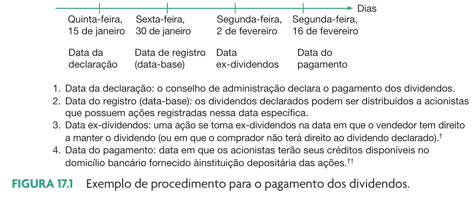
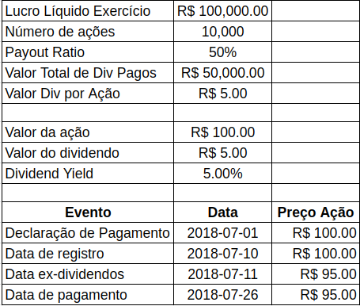
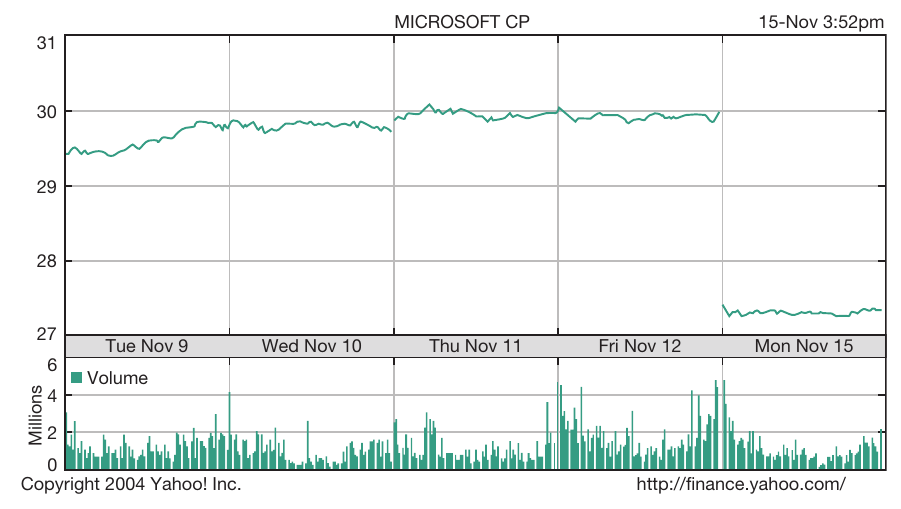

```{r}
link_sheets <- "https://docs.google.com/spreadsheets/d/1bm96H1c11BYZChhmI9mfIpQIhEfEFuBJjocPspfW-o0/edit?usp=sharing"
```

# Política de Dividendos

## Introdução

:::{.incremental}
- Efeitos da política de dividendos de uma empresa
  - A decisão de pagamento de dividendos é uma relação entre reter o lucro da empresa ou distribuí-lo
- Objetivo: uma política ótima de dividendos
  - Maximizar o valor da empresa
  - Importância para investidor: entender como a remuneração por dividendos funciona
:::

## O que é um dividendo?

:::{.incremental}

- Dividendos: Distribuições de lucro da empresa ao acionista, sob a forma de:
  - Dinheiro - dividendo regular
  - Ações - recompra de ação
  - Bonificações - ações “doadas” aos acionistas e pagas com lucro
  - Distribuições: Pagamentos feitos pela empresa a seus donos de outras fontes que não os lucros correntes ou acumulados
  - Distribuição de ações em tesouraria
:::

## O DRE e o Dividendo



## Como funciona o pagamento de dividendos em dinheiro

:::{.incremental}

- Datas  de pagamentos e o quanto pagar é decidida pelo **conselho de administração**, porém temos leis específicas sobre o assunto:
  - Caso do estatuto da empresa não ter cláusula relativa a este pagamento, o dividendo mínimo vai de 25% (empresa com ações preferenciais e ordinárias) a 50% (empresa com apenas ações ordinárias)
- Tributação 
  - Dividendo é livre de imposto para investidor, mas não para a empresa
  - JSCP tem imposto (15%) para investidor, mas dá benefício fiscal para a empresa
:::

## Cronograma de pagamento

```{r}
#| fig-cap: !expr classtools::cite_ross(582)


```


## Exemplo de declaração de pagamento de dividendo (EGIE3)

[https://www.engie.com.br/uploads/2023/04/230426-Aviso-aos-Acionistas-Dividendos-Complementares-2S22-AGO-pagamento-JCP-PORT.pdf](https://www.engie.com.br/uploads/2023/04/230426-Aviso-aos-Acionistas-Dividendos-Complementares-2S22-AGO-pagamento-JCP-PORT.pdf)


## O preço da ação e a data ex-dividendo

> O preço da ação se modifica na abertura do pregão na data ex-dividend. Este ajuste é realizado pela própria bolsa, afetando o preço de abertura e todas ordens de compra e venda

```{r}

```


## O dividendo especial da Microsoft

> Em dezembro de 2004 a Microsoft anunciou um dividendo especial no valor total de 32 bilhões de dólares

- O valor total de dividendos da Microsoft neste ano representou 15% do total de dividendos do mercado acionário americano!
- A renda pessoal dos Estados Unidos cresceu 3,3% naquele ano (3% devido ao pagamento do dividendo da MSFT)
- O dividendo equivale a 3,08\$ por ação, o qual resultou um lucro líquido de 2,62\$ por ação para cada acionista (imposto no USA = 15%)

## Efeito sobre os preços

```{r}
#| fig-cap: !expr classtools::cite_ross(584)


```


## Dividendos da ITSA3

```{r}
library(tidyverse)

df.events <- tibble(Evento = c('Data Anúncio',
                               'Data Ex',
                               'Data Pagamento'),
                    ref.date = as.Date(c('2019-02-18', 
                                         '2019-02-22', 
                                         '2019-03-07')) )

first_date <- df.events$ref.date[1]-20
last_date <- last(df.events$ref.date) + 20

df.prices <- yfR::yf_get(tickers = 'ITSA3.SA', 
                         first_date = first_date,
                         last_date = last_date )


p <- ggplot(df.prices, aes(x = ref_date, y = price_open)) + 
  geom_point(size = 1.5) + 
  geom_line() +
  labs(title = 'Preço de **Abertura** da ITSA3.SA',
       subtitle = paste0('Provento (div e JSCP) de 0,76 por ação em ', lubridate::year(max(df.events$ref.date))),
       x = 'Data',
       y = 'Preço de Fechamento') + 
  geom_vline(data = df.events, 
             mapping = aes(xintercept = ref.date, 
                           color = Evento),
             size = 2) + 
  theme_light()

print(p)

```


# Sobre a irrelevância dos dividendos

## Introdução 

> “O valor da empresa é determinado pela sua capacidade de gerar lucro, e não sobre a forma como o lucro é distribuído”

::: {.incremental}
- Corrente defendida por M&M que prediz que a mudança na política dos dividendos não altera o valor da empresa
- Um dividendo baixo hoje aumenta um dividendo pago no futuro. Com alavancagem caseira, o efeito líquido para o investidor é zero. 

- Existem evidências empíricas de que esta teoria está equivocada
:::

## A Matemática de M&M

Considere dois dividendos ($D_1$ e $D_2$):

$$V_A = \frac{D_1}{(1+r)^1} + \frac{D_2}{(1+r)^2}$$
Considere um aumento de $D_1$ por $X$:

$$V_B = \frac{D_1 + X}{(1+r)^1} + \frac{D_2 - X(1+r)}{(1+r)^2}$$
Podemos provar que:

$$V_A = V_B$$

## O que diz a Teoria de M&M

::: {.incremental}

- Aumentar ou diminuir o dividendo pago não muda a rentabilidade do acionista
- Um dividendo pago a mais hoje é um dividendo não pago no futuro
  - Resultado líquido é nulo
- Principal Conclusão: **A política de dividendos é irrelevante para o acionista e para o valor da empresa**

:::

## Justificativas contrárias a M&M

::: {.incremental}
- Conteúdo informacional: o montante de dividendos pagos hoje dá sinais da futura performance da empresa
  - Se valor de dividendo pago subir, então o mercado entende que a empresa vai lucrar mais no futuro
- O gosto do cliente (acionista) importa!
:::

## Efeito Clientela

::: {.incremental}
- Necessidade de caixa: Investidores com **preferências por caixa** preferem alto valor de payout
  - Investidores com **renda passiva**
  - Fundos com restrições de venda do principal (_endownment fund_ de universidades)
- A forma de tributação limita ou reduz a preferência dos investidores por altos payouts
- Aversão ao risco: A incerteza com relação a distribuição de lucros futuros leva os investidores a preferirem serem recompensados no presente
:::

## Determinação da política de dividendos

::: {.incremental}
- A decisão de pagamento de dividendos é uma relação entre reter o lucro da empresa ou distribuí-lo
  - Capital não pago como dividendo poderia ser utilizado em investimentos na empresa
- Consequências para política de dividendos:
  - Um payout baixo seria bom para os acionistas quando a empresa encontra projetos com VPL positivo (retornos maiores que o WACC)
  - Um payout alto seria bom para os acionistas quando eles conseguem oportunidade de investimentos melhores por eles mesmos
- Efeito: Empresas com poucas oportunidades de novos projetos pagam mais dividendos
:::

# A Teoria Residual

## Conceito

- Os dividendos são o resíduo de um processo de escolha simples e lógico:
  - A empresa investe em todos projetos com VPL positivo usando WACC como custo de capital
  - O que sobrar (se sobrar) desse processo é pago como dividendos


## Problemáticas com uma abordagem residual estrita

::: {.incremental}

- Instabilidade dos pagamentos de dividendos
  - Como projetos com VPL positivo não surgem de forma estável, então o pagamento de dividendos também não será estável!
- A instabilidade pode sinalizar uma fraqueza da empresa no mercado
- Pouco atrativa para acionistas com necessidades de caixa e/ou com alta aversão ao risco
- Efeito clientela
:::

## Uma política de dividendos intermediária

Objetivos (ordem decrescente de importância):

1. Evitar desprezar projetos com VPL positivo para pagamento de dividendos
1. Evitar reduções de dividendos
1. Evitar a necessidade de emissões de novas ações e manter um quociente ótimo entre dívidas e capital próprio
Manter um índice desejado e constante de distribuição de dividendos (% payout)

# O "Rei dos Dividendos" e sua Filosofia {background-image="figs/cropped-luiz-barsi.webp" }

## Introdução

> Luiz Barsi Filho: Um dos maiores investidores individuais da bolsa brasileira, conhecido por sua estratégia de longo prazo focada na geração de renda passiva através de dividendos.

- Filosofia Central ("Jeito Barsi de Investir" ou "Carteira Previdenciária de Ações"):
  - Investir em empresas sólidas, perenes, com histórico consistente de lucratividade e, crucialmente, boas pagadoras de dividendos.
  - Foco em setores essenciais da economia (e.g., bancos, energia, saneamento, seguros).
  - Objetivo Primário: Acumular um grande número de ações de boas empresas com o reinvestimento de Dividendos.
  - Visão de Longo Prazo: Despreza a especulação de curto prazo.

## Referências {.unlisted}
