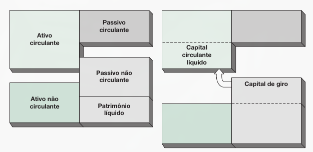
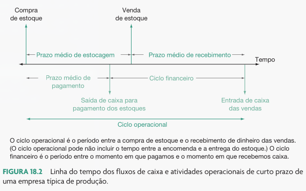
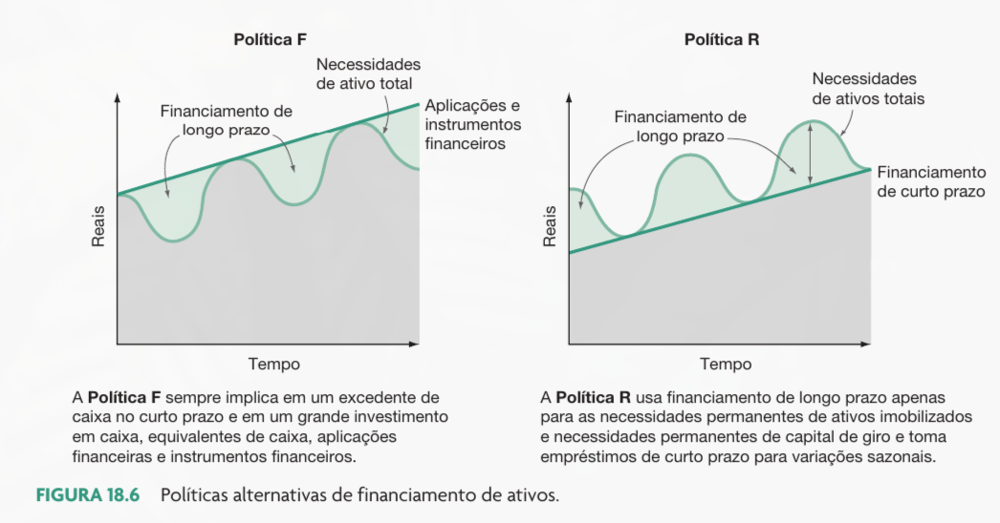

```{r}
classtools::setup_quarto_slides("content")
```

# Planejamento de Curto Prazo

## Introdução

:::{.incremental}
- As decisões financeiras de curto prazo envolvem entradas e saídas de caixa que ocorrem em **um ano ou menos**.
- Distinguem-se das finanças de longo prazo principalmente pela distribuição dos fluxos de caixa no tempo.
- Questões fundamentais:
  - Quanto deve ser mantido em caixa para pagar as contas?
  - Quanto a empresa deve tomar emprestado no curto prazo?
  - Quanto crédito deve ser concedido aos clientes?
- A gestão financeira de curto prazo é frequentemente chamada de **administração do capital de giro**.
:::

## O caminho do caixa

- O AC é composto pelo caixa e por outros ativos que se espera converter em caixa durante o ano: estoques e crédito. 

- O PC contém as obrigações de curto prazo que exigem pagamento em dinheiro dentro de um ano

- O ponto central da análise são as variáções da conta **caixa** em funções de eventos corporativos

$$CCL + AnC = PnC + PL$$

$$CCL = (Caixa - OutrosAC) - Passivo circulante$$

$$Caixa=PnC + PL + PC - OutrosAC - AnC$$


## Fontes e Usos de Caixa

:::{.incremental}
- **Fontes de caixa (aumentam o caixa):**
  - Aumento de passivo (ex: tomar um empréstimo de 90 dias).
  - Aumento de patrimônio líquido (ex: emissão de ações).
  - Diminuição de ativo (ex: vender estoques à vista).
- **Usos de caixa (diminuem o caixa):**
  - Diminuição de passivo (ex: pagar dívidas de curto prazo).
  - Diminuição de patrimônio líquido (ex: recomprar ações).
  - Aumento de ativo (ex: comprar estoques).
- A diferença entre as fontes operacionais e os usos operacionais define a necessidade de capital de giro (NCG).
:::


## Capital Circulante Líquido (CCL) e Capital de Giro (CDG)

:::{.incremental}
- **Capital Circulante Líquido (CCL)**:
  - É a diferença entre o ativo e o passivo circulantes.
  - Representa o uso de recursos provenientes do capital de giro.
  - $CCL = Ativo \ Circulante - Passivo \ Circulante$
- **Capital de Giro (CDG)**:
  - Formado pelos recursos do patrimônio líquido e passivo não circulante que excedem o ativo não circulante.
  - São os recursos disponíveis para financiar o giro das operações.
  - $CDG = (Passivo \ Não \ Circ. + Patrimônio \ Líq.) - Ativo \ Não \ Circ.$
- Por construção do balanço patrimonial: **$CCL = CDG$**.
:::

## Ilustração: CCL & CDG

```{r}
#| fig-cap: !expr classtools::cite_ross(625)


```

# Os Ciclos do Negócio

## Introdução

- As principais preocupações nas finanças de curto prazo são as atividades operacionais e financeiras correntes

- Essas atividades criam sequências de fluxos de caixa  não sincronizados e incertos.

| Evento | Decisão |
|---|---|
| 1. Compra de matéria-prima | 1. Quanto de estoque deve ser encomendado? |
| 2. Pagamento em dinheiro | 2. Tomar um empréstimo ou usar os saldos de caixa? |
| 3. Fabricação do produto | 3. Que tecnologia de produção escolher? |
| 4. Venda dos produtos | 4. Conceder ou não crédito a um determinado cliente? |
| 5. Cobrança das vendas | 5. Como cobrar? |


## O Ciclo Operacional

:::{.incremental}
- É o tempo necessário para adquirir o estoque, processá-lo, vendê-lo e receber o pagamento das vendas.
- Descreve como um produto se movimenta nas contas do ativo circulante (estoque $\rightarrow$ contas a receber $\rightarrow$ caixa).
- É a soma de dois prazos:
  1. **Prazo Médio de Estocagem (PME):** Tempo que a empresa mantém o estoque antes de vendê-lo.
  2. **Prazo Médio de Recebimento (PMR):** Tempo que leva para receber o pagamento das vendas a prazo.
- $Ciclo \ Operacional = PME + PMR$
:::


## O Ciclo Financeiro

:::{.incremental}
- Avalia a defasagem temporal entre o momento em que a empresa **paga** pelas compras e o momento em que **recebe** pelas vendas.
- Incorpora o prazo negociado com os fornecedores:
  - **Prazo Médio de Pagamento (PMP):** Tempo entre a aquisição do estoque e o seu efetivo pagamento.
- Define o tempo durante o qual a empresa precisará financiar seu giro.
- *Quanto maior o ciclo financeiro, maior a necessidade de financiamento.*
- $Ciclo \ Financeiro = Ciclo \ Operacional - PMP$
:::

## A Linha do Tempo dos Fluxos de Caixa

```{r}
#| fig-cap: !expr classtools::cite_ross(628)
#| fig-align: "center"

```


## O Organograma da Empresa e os Ciclos

:::{.incremental}
- A gestão do curto prazo envolve múltiplos gestores, o que pode gerar **conflitos de interesse**:
  - **Gerente de Vendas/Marketing:** Quer prazos mais longos para clientes (aumenta o PMR e as vendas).
  - **Gerente de Crédito:** Quer rigor na concessão para evitar inadimplência (reduz o PMR, mas pode travar vendas).
  - **Gerente de Compras:** Busca estoques altos para evitar falta de material (aumenta o PME).
  - **Gerente Financeiro:** Foca em minimizar a necessidade de caixa e custo da dívida.
- O equilíbrio integrado entre as áreas é essencial para manter a liquidez.
:::

## Cálculos dos Prazos Médios

:::{.incremental}
- Os prazos são derivados dos indicadores de **Giro**:
  - $Giro \ do \ Estoque = \frac{Custo \ das \ Mercadorias \ Vendidas (CMV)}{Estoque \ Médio}$
  - $PME = \frac{365 \ dias}{Giro \ do \ Estoque}$
  - $Giro \ de \ Contas \ a \ Receber = \frac{Vendas \ a \ Prazo}{Média \ de \ Contas \ a \ Receber}$
  - $PMR = \frac{365 \ dias}{Giro \ de \ Contas \ a \ Receber}$
  - $Giro \ de \ Contas \ a \ Pagar = \frac{CMV}{Média \ de \ Contas \ a \ Pagar}$
  - $PMP = \frac{365 \ dias}{Giro \ de \ Contas \ a \ Pagar}$
:::

## Interpretando o Ciclo Financeiro

:::{.incremental}
- **Ciclo Positivo:** A empresa paga antes de receber. Precisa de capital de giro (aplicações ou empréstimos) para financiar as operações no período.
- **Ciclo Negativo:** A empresa recebe antes de pagar. A própria operação gera caixa (Ex: Amazon cobrando do cartão imediatamente e pagando o fornecedor depois de meses).
- **Alerta:** Alterações bruscas no ciclo financeiro servem de aviso. Um ciclo crescente pode indicar problemas para movimentar estoques ou receber de clientes.
- Existe uma ligação direta entre giro do ativo, lucratividade (ROA, ROE) e o tamanho do ciclo financeiro.
:::

# Políticas Financeiras de Financiamento

## Introdução

::: {.incremental}
A política financeira de curto prazo de uma empresa reflete-se pelo menos de duas maneiras:

::: {.columns}

::: {.column}

**Tamanho do investimento da empresa em ativos circulantes**

- Uma política flexível, ou acomodativa, manteria um índice relativamente alto entre ativo circulante e vendas. 
- Uma política financeira de curto prazo restritiva implicaria um índice baixo.

:::

::: {.column}

**Forma de financiamento do ativo circulante**

- Uma política **flexível** implicaria uma baixa proporção de dívidas de curto prazo em relação ao financiamento de longo prazo.
- Uma política **restritiva** significa uma alta proporção de dívidas de curto prazo em relação ao financiamento de longo prazo

:::

:::

:::

## O Tamanho do Investimento (Flexível vs Restritivo)

:::{.incremental}
- **Política Flexível (Acomodativa):**
  - Mantém alto nível de ativos circulantes em relação às vendas.
  - Grandes saldos de caixa, aplicações financeiras e estoques.
  - Condições de crédito liberais (alto contas a receber).

- **Política Restritiva:**
  - Mantém baixo nível de ativos circulantes.
  - Saldos de caixa mínimos e poucos estoques.
  - Pouca ou nenhuma venda a prazo.
:::

## O Trade-off: Custos de Carregamento vs. Falta

:::{.incremental}
- **Custos de Carregamento (aumentam com o investimento):**
  - Custo de oportunidade de manter capital parado no ativo circulante (ex: dinheiro em caixa rendendo pouco).
- **Custos de Falta (diminuem com o investimento):**
  - Custos de transação para obter dinheiro rápido (tarifas, impostos).
  - Custos por perda de vendas, quebra de confiança do cliente ou interrupção de produção devido à falta de estoque.
- A política ideal minimiza a soma dos custos totais (carregamento + falta).
:::

## Financiamento do Ativo Circulante

:::{.incremental}
- As necessidades de ativos totais não são constantes:
  - Crescimento permanente de longo prazo.
  - Necessidades permanentes de capital de giro.
  - Variações e picos sazonais (ex: compras para Natal).
- Como financiar a parcela flutuante e a parcela permanente dos ativos circulantes?
- Duas abordagens extremas: Financiamento Flexível (Política F) e Restritivo (Política R).
:::

## Política Flexível de Financiamento

:::{.incremental}
- A empresa usa **financiamento de longo prazo** para cobrir:
  - Todos os ativos não circulantes (fixos).
  - Toda a necessidade permanente de capital de giro.
  - Parte significativa das variações sazonais.
- A empresa mantém **reservas de caixa** e aplicações financeiras.
- Em picos de sazonalidade, ela resgata suas aplicações em vez de tomar empréstimos de curto prazo.
- Menor risco financeiro, porém maior custo de oportunidade (excesso de liquidez).
:::

## Política Restritiva de Financiamento

:::{.incremental}
- A empresa usa **financiamento de longo prazo** apenas para:
  - As necessidades permanentes de ativos fixos e capital de giro permanente.
- A empresa usa **empréstimos de curto prazo** para cobrir:
  - Todas as variações sazonais.
- Não há manutenção de grandes reservas de caixa ou aplicações.
- À medida que as necessidades caem, o caixa gerado é usado para pagar o empréstimo de curto prazo.
- Maior risco (dependência de crédito bancário frequente), mas otimiza o uso do capital.
:::

## Ilustração - Políticas de financiamento flexível e restritivo

```{r}
#| fig-cap: !expr classtools::cite_ross(637)
#| fig-align: "center"

```


## Qual é a melhor política?

:::{.incremental}
- Não há resposta única. Considerações-chave:
  1. **Reservas de caixa:** Ter recursos parados reduz a chance de problemas financeiros, mas reduz o retorno global.
  2. **Casamento de prazos (Hedging):** Financiar ativo fixo com dívida longa e ativos sazonais com dívida curta diminui o risco de refinanciamento.
  3. **Taxas de juros relativas:** As taxas de curto prazo costumam ser mais voláteis e menores que as de longo prazo (porém no Brasil há distorções com linhas subsidiadas).
- Na prática, empresas utilizam uma **Política Intermediária**, combinando parte em reservas de liquidez e parte dependendo de empréstimos em picos extremos.
:::

## Referências {.unlisted}