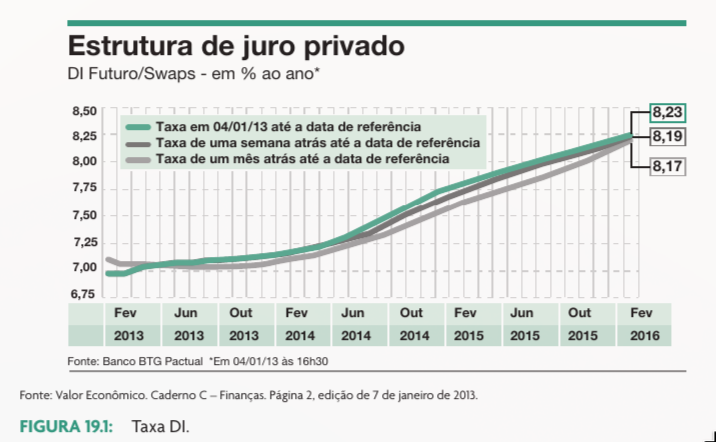
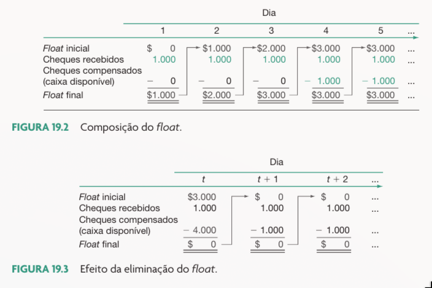
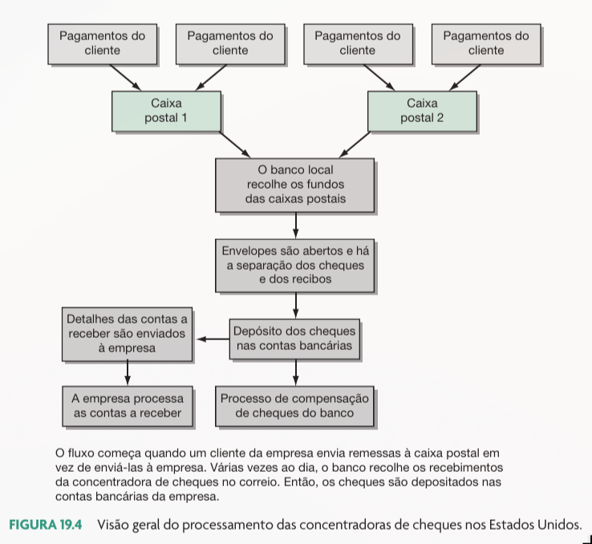
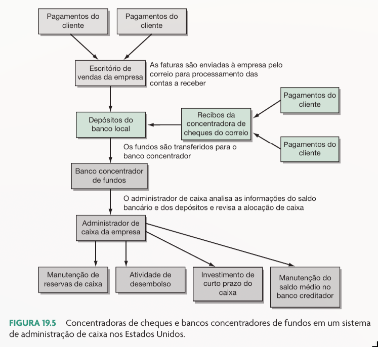
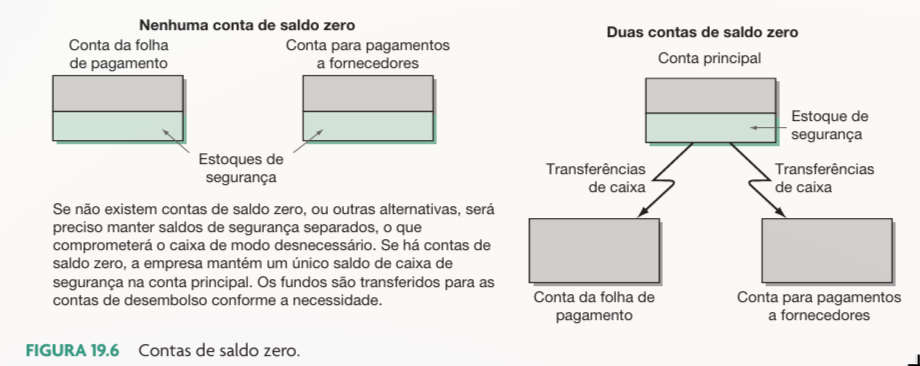
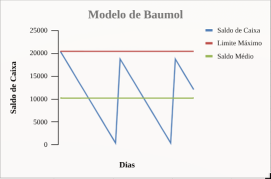
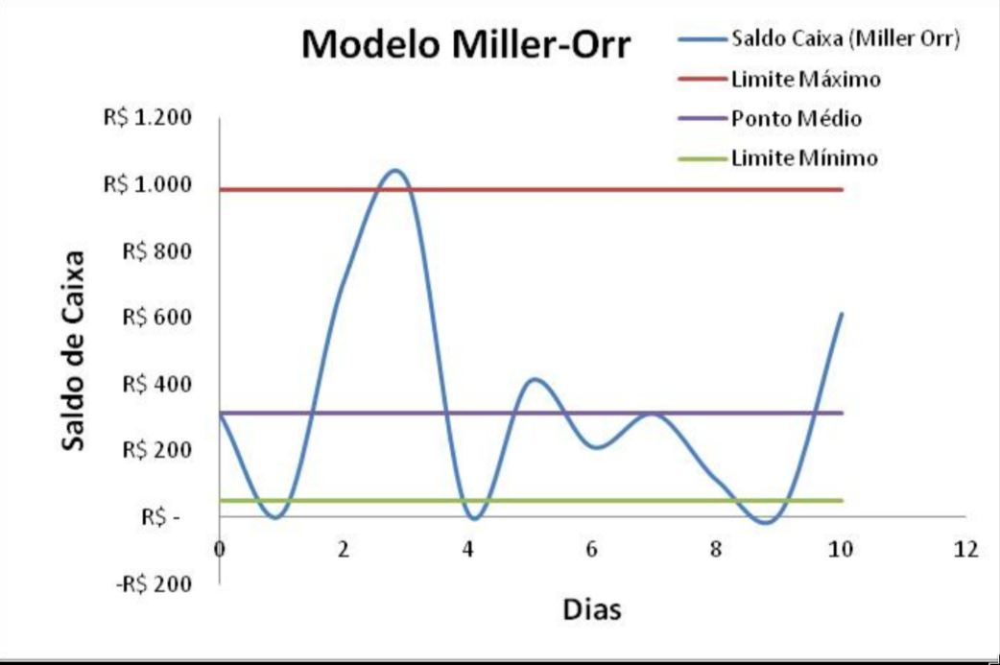

```{r}
classtools::setup_quarto_slides("content")

link_gsheet <- "https://docs.google.com/spreadsheets/d/1aO1SYa_EK3KAQs6jTYqYKdQ3FqgoD8Zh7Fnd32xrwao/edit?usp=sharing"
```

# Introdução

## Motivos para Manter Caixa

Existem três motivos principais para se manter caixa na empresa:

:::{.incremental}
1. **Transação**: Necessidade de pagar as contas rotineiras.
2. **Precaução**: Reserva para imprevistos e emergências.
3. **Especulação**: Aproveitar oportunidades de mercado (ex: quedas de preços de insumos).
- **Trade-off**: O custo de oportunidade (juros perdidos) vs. o custo de falta de liquidez (empréstimos caros).
:::

# Gestão de Caixa no Brasil

## O Sistema Bancário e a Taxa DI

No Brasil, a gestão de caixa é pautada pela eficiência do sistema eletrônico e pelas taxas de juros.

:::{.incremental}
- **Taxa DI**: Referência para o custo de oportunidade do dinheiro no mercado privado.
- **Reservas Bancárias**: Recursos dos bancos no Banco Central para liquidação de pagamentos.
:::

## Estrutura do juro privado e Taxa DI
```{r}
#| fig-cap: !expr classtools::cite_ross(665)

```

## O Conceito de Float

> "Float é a diferença entre o saldo no banco e o saldo nos livros da empresa."

:::{.incremental}
- **Float de Cobrança**: Atraso entre o recebimento do cliente e a disponibilidade do dinheiro.

- **Float de Desembolso**: Atraso entre a emissão do pagamento e a saída efetiva do caixa.

- Ciclo do Float e Prazos de Disponibilidade
  - O tempo total é composto por trânsito, processamento e compensação.
:::


## Exemplo de Float e Prazos

```{r}
#| fig-cap: !expr classtools::cite_ross(674)


```


# Cobrança e Concentração

## Estratégias de Cobrança

O objetivo principal é **acelerar a entrada de recursos** e **reduzir o *float* de cobrança**.

:::{.incremental}
- **PIX:** Revolucionou a cobrança no Brasil ao permitir liquidação instantânea, eliminando o *float* de trânsito e compensação.
- **Boleto Bancário:** Ferramenta tradicional e ainda central, amplamente integrada ao sistema de compensação nacional.
- **Canais Eletrônicos (EDI/APIs):** A integração direta entre os sistemas da empresa e do banco minimiza drasticamente o tempo de processamento.
- **Antecipação de Recebíveis:** Estratégia de desconto de duplicatas ou faturas de cartão para injetar liquidez imediata no caixa.
:::

## Exemplo de Processamento de Cobranças

```{r}
#| fig-cap: !expr classtools::cite_ross(681)


```

## Concentração de Caixa

Centralizar recursos em uma "conta-mãe" permite melhor gestão.

:::{.incremental}
- Facilita o investimento de excedentes.
- Reduz saldos ociosos em contas periféricas.
:::

## Exemplo concentrador de Cheques

```{r}
#| fig-cap: !expr classtools::cite_ross(682)


```

# Administração de Desembolsos

## Controle e Saldo Zero

Gerir pagamentos para maximizar o float de desembolso (dentro da ética e contratos).

:::{.incremental}
- **Contas de Saldo Zero**: Contas que recebem apenas o valor necessário para cobrir os pagamentos do dia.
- **Transferência Automática**: Bancos brasileiros oferecem varredura automática para fundos de liquidez.
:::

## Exemplo de Contas de Saldo Zero
```{r}
#| fig-cap: !expr classtools::cite_ross(684)

```

# Investimento e Sazonalidade

## Investimento do caixa ocioso

> Empresas frequentemente possuem excesso de caixa devido à sazonalidade ou ciclos operacionais.

:::{.incremental}
- **Investimentos**: Títulos Públicos (Selic), CDBs, e Fundos DI.
- **Critérios**: Liquidez, Segurança e Rentabilidade.
- **Tributação**: Imposto de renda sobre ganho de capital + IOF para resgates em curto prazo.
:::

## Exemplo simples de aplicação de recursos

> Uma determinada empresa possui um montante de 100.000 R$ em sua conta caixa, o qual não será utilizado nos próximos 15 dias. Considerando uma taxa do CDI de 0.8% ao mês, qual o montante resgatado no final do período de 15 dias (10 dias úteis) através de uma operação no mercado de moedas?

r_diário (taxa over) = 0.8%/30 = 0.0267%

Valor resgate = 100000*(1+0.0267%)^10 = 100267 R$

## Exemplo completo de aplicação de recursos

Produto: [BB CDI Corporate](https://www.bb.com.br/pbb/pagina-inicial/corporate/produtos-e-servicos/investimentos/que-tenha-pouco-risco-e-me-de-retorno,-mesmo-que-a-longo-prazo/bb-cdb-di#/)

Cálculos: [Link](`r link_gsheet`)

# Modelos Matemáticos para determinação do saldo de caixa

## Modelo do Saldo Mínimo Operacional (Assaf Neto cap. 4, pag. 88)

- Utiliza o desembolso total previsto no período e o ciclo de caixa para determinar o valor mínimo de caixa
- O ciclo de caixa define o período compreendido entre o pagamento da compra de matéria prima até o momento do recebimento das vendas
- Um alto giro do caixa define que a empresa tem maior capacidade de gerar recursos, o que diminui o valor mínimo a ser mantido em caixa

$$ValorMínimoCaixa = \frac{DesembolsoTotalPrevisto}{GiroDoCaixa}$$

$$GiroDoCaixa = \frac{Vendas}{CiclodeCaixa}$$

$$CicloDoCaixa = CicloOperacional - PrazoMedioPagamentoFornecedores$$

## Críticas ao modelo do saldo mínimo operacional

- Baseado em fortes premissas
  - Fluxos são conhecidos

- O modelo não assume sazonalidades nos fluxos de caixa

- O método não define o montante máximo

- A abordagem tem enfoque flexível (mais $ em caixa)

## Modelo BAT (Baumol-Allais-Tobin)

> Baseado no modelo do lote econômico de produção, o modelo BAT é uma abordagem clássica para a gestão de caixa que busca equilibrar os custos de manutenção de caixa e os custos de transação.

- Análise específica dos custos e benefícios de manter caixa

- Permite definir matematicamente o montante máximo a ser deixado em caixa com base em uma fórmula intuitiva

- Elementos:
  - Custo fixo de conversão de caixa  (custo do pedido)
  - Custo de oportunidade (investimento em títulos de renda fixa)
  - Demanda de caixa (determinada pela demanda total do período e assumida fixa para cada intervalo)
  - A empresa SEMPRE gasta o mesmo valor para cada período

## Ilustração Modelo de Baumol

```{r}
#| fig-cap: Exemplo de aplicação do modelo de Baumol
 

```

## Determinação do caixa ótimo

$$CustoTotal = CC*\frac{M}{m} + i*\frac{m}{2}$$

$CC$: Custo fixo de conversão de caixa (custo do pedido)

$M$: Demanda total de caixa para o período

$m$: Montante de caixa retirado a cada conversão

$i$: Custo de oportunidade (taxa de juros)

> Como achar o valor de $m$ que minimiza o custo total?

Solução: $$m^* = \sqrt{\frac{2*CC*M}{i}}$$

## Modelo de Miller-Orr (1966)

Proposta baseada em modelo estocástico, sujeito a chances, que trabalha com limites de controle (Superior, Inferior e Retorno).

:::{.incremental}
- Adequado quando os fluxos de caixa são imprevisíveis.
- Define o ponto de retorno $Z$ e o limite superior $H$.
:::

## Ilustração Modelo de Miller-Orr

```{r}
#| fig-cap: "Limites de Controle de Miller-Orr"

```


# Resumo

## Conclusões

:::{.incremental}
- Gestão de caixa foca na eficiência operacional e minimização de custos.
- O *float* líquido deve ser gerido para liberar capital de giro.
- No Brasil, a integração eletrônica e a Taxa DI são pilares da tesouraria.
- Modelos como BAT e Miller-Orr ajudam a definir o colchão de liquidez ideal.
:::

## Referências {.unlisted}

