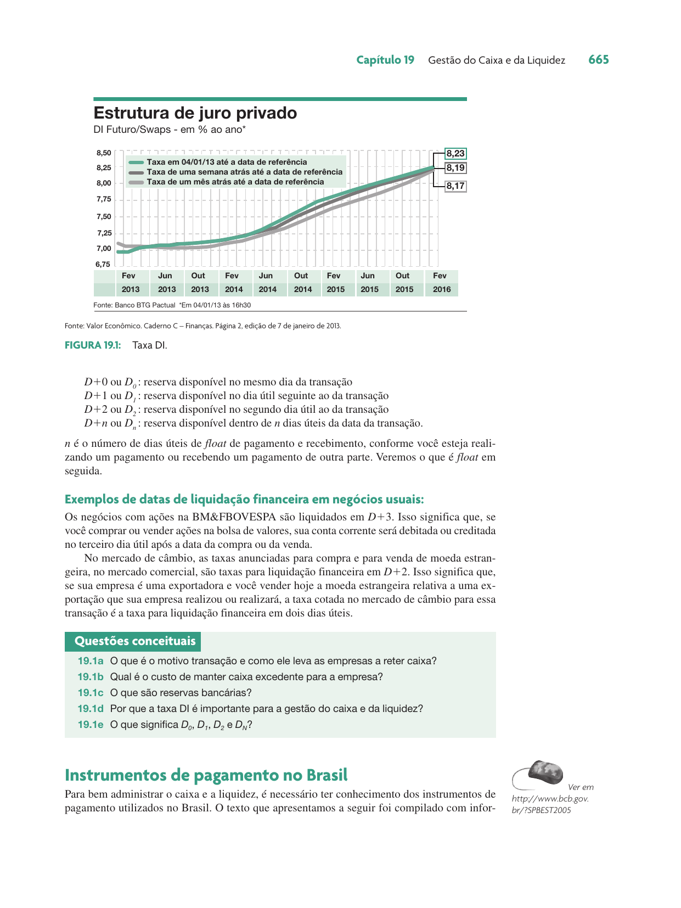
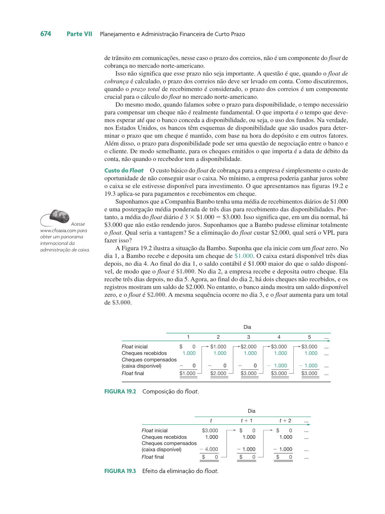
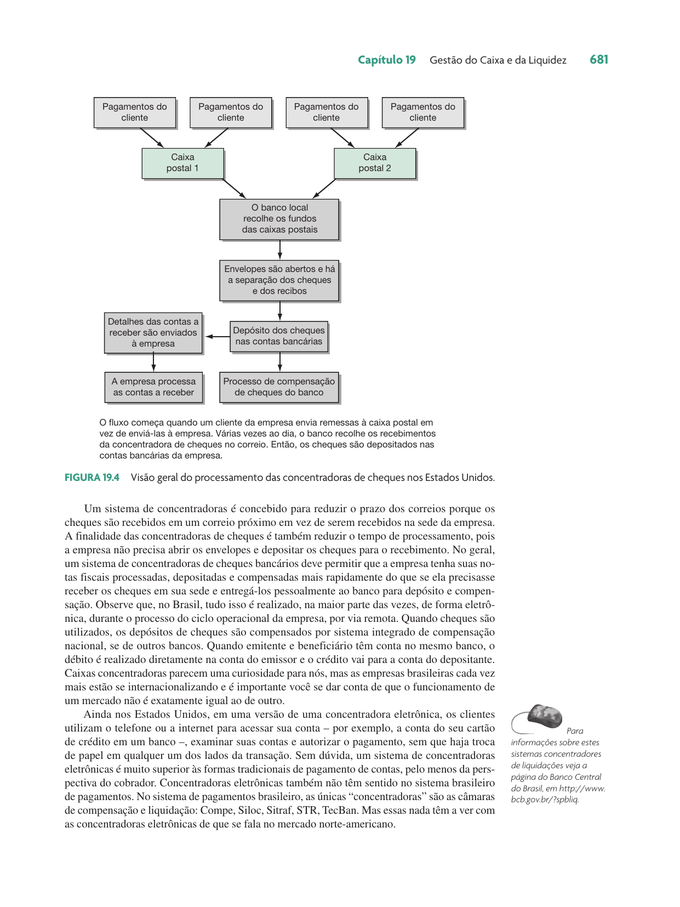
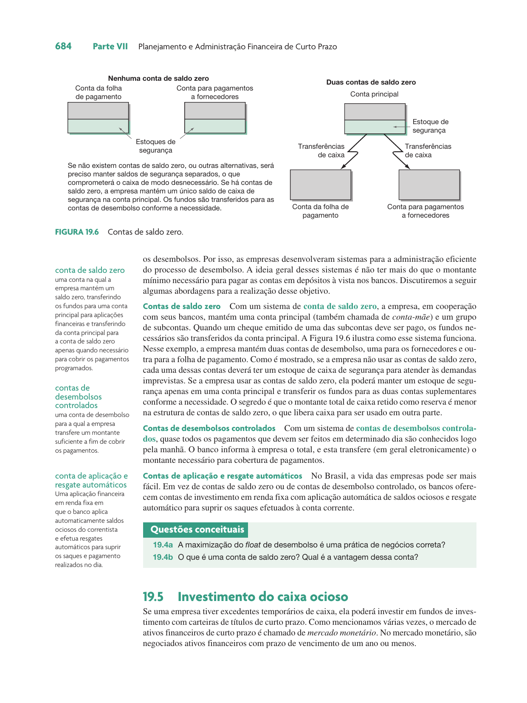
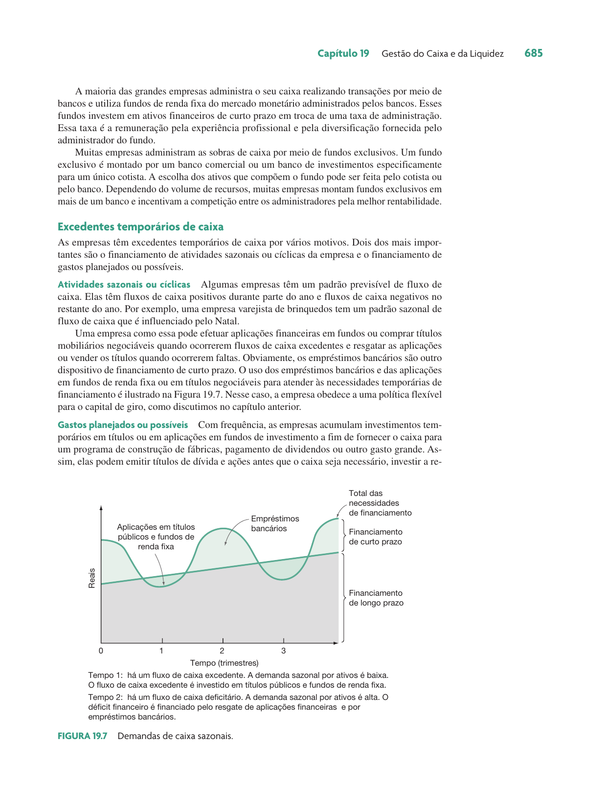
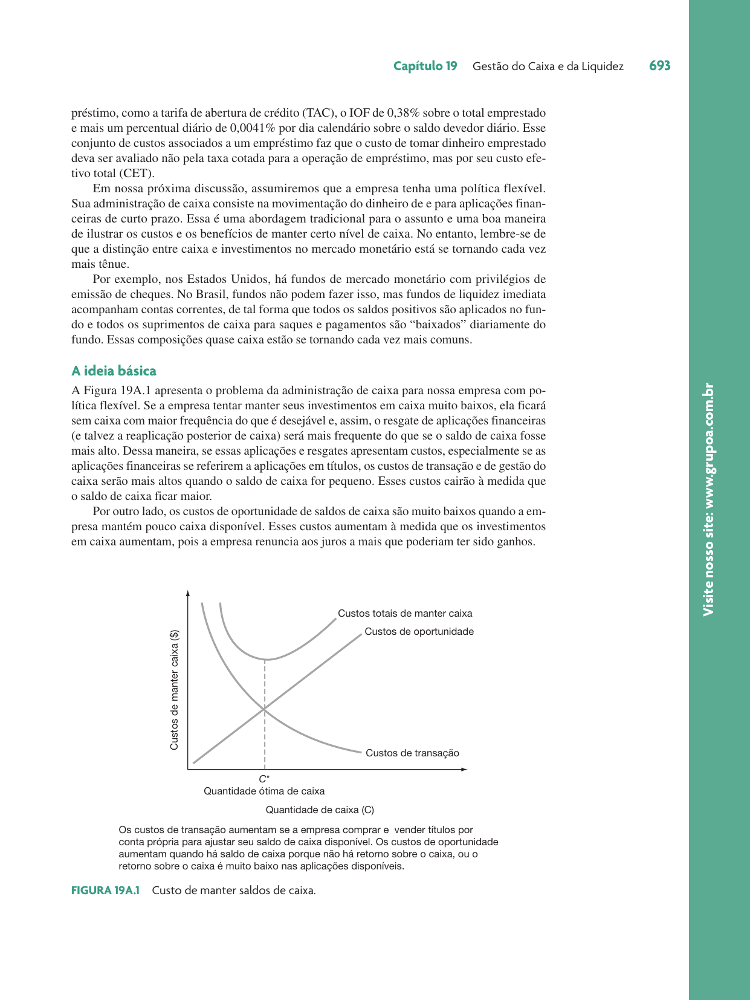
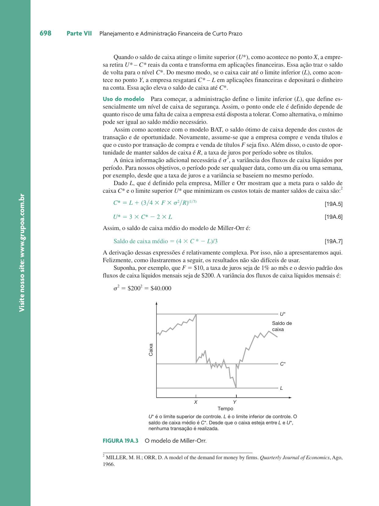

```{r}
classtools::setup_quarto_slides("content")
```

# Introdução

## Objetivos de Aprendizado

:::{.incremental}
- **OA1** O que é *float* e como ele afeta os saldos de caixa.
- **OA2** Como as empresas administram o caixa e as técnicas de cobrança e desembolso.
- **OA3** Vantagens e desvantagens de manter saldos de caixa e formas de investir o caixa ocioso.
- **OA4** O papel das reservas bancárias e datas de liquidação financeira.
- **OA5** A importância da taxa DI como custo de oportunidade do dinheiro.
:::

## O Objetivo da Gestão de Caixa

:::{.incremental}
- Manter o investimento em caixa o mais baixo possível.
- Garantir que a empresa opere de modo eficiente.
- Filosofia básica: **"receber cedo e pagar tarde"**.
- Gestão de caixa envolve:
  - Acelerar recebimentos.
  - Administrar desembolsos.
  - Investir o caixa ocioso em títulos negociáveis.
:::

# Motivos para Manter Saldos de Caixa

## A Preferência por Liquidez (Keynes)

John Maynard Keynes identificou três motivos principais:

:::{.incremental}
1. **Motivo Especulação**: Manter saldos para aproveitar oportunidades de compras vantajosas ou taxas de juros atraentes.
2. **Motivo Precaução**: Manter uma reserva financeira como segurança contra imprevistos.
3. **Motivo Transação**: Caixa necessário para pagar as contas rotineiras (salários, impostos, fornecedores).
:::

## Custos de Manter Caixa

:::{.incremental}
- **Custo de Oportunidade**: A renda de juros que poderia ser ganha se o dinheiro estivesse aplicado.
- **Trade-off**:
  - Saldo muito baixo: Risco de falta de caixa e custos de captação de curto prazo (empréstimos).
  - Saldo muito alto: Perda de rentabilidade.
- O objetivo é encontrar o **saldo ótimo** que minimiza os custos totais.
:::

# Gestão de Caixa vs. Gestão da Liquidez

## Diferenças Fundamentais

:::{.incremental}
- **Gestão da Liquidez**: Otimização da quantidade de ativos líquidos (caixa + títulos negociáveis) que a empresa deve possuir.
- **Gestão do Caixa**: Otimização dos mecanismos de cobrança e de desembolso (processos operacionais).
- Títulos negociáveis são frequentemente chamados de **equivalentes de caixa** ou "quase caixa".
:::

# O Sistema Brasileiro

## Reservas Bancárias

:::{.incremental}
- Recursos imediatamente disponíveis mantidos pelos bancos no Banco Central do Brasil.
- Todas as transações bancárias são realizadas via transferência de titularidade de reservas.
- Bancos com sobra de reservas negociam entre si para suprir necessidades opostas.
:::

## Taxas Selic e DI

:::{.incremental}
- **Taxa Selic**: Taxa média dos negócios com títulos públicos federais. Referência para a política monetária.
- **Taxa DI (CDI)**: Taxa das transações entre bancos lastreadas em títulos privados.
- **Custo de Oportunidade**: No Brasil, a taxa DI é a referência mais importante para a gestão do caixa e da liquidez corporativa.
:::

```{r}
#| fig-cap: "Estrutura de juro privado (Taxa DI)"

```

## Datas de Liquidação Financeira

No mercado brasileiro, a disponibilização de reservas é identificada como $D+n$:

:::{.incremental}
- **D+0**: Reserva disponível no mesmo dia da transação.
- **D+1**: Reserva disponível no dia útil seguinte.
- **Exemplos**:
  - Ações (B3): Liquidação em $D+3$.
  - Mercado de Câmbio: Liquidação em $D+2$.
:::

# O Conceito de Float

## O que é Float?

> "A diferença entre o saldo contábil (nos livros da empresa) e o saldo disponível (no banco)."

:::{.incremental}
- **Float de Desembolso**: Criado quando a empresa emite um cheque. O saldo contábil cai, mas o bancário só diminui após a compensação.
- **Float de Cobrança**: Criado quando a empresa recebe um pagamento. O saldo contábil aumenta, mas o dinheiro só está disponível após a liquidação.
- **Float Líquido**: Soma dos dois efeitos.
:::

```{r}
#| fig-cap: "Composição do Float"

```

## Administração do Float

:::{.incremental}
- O objetivo na cobrança é **agilizar** os recebimentos (reduzir o float de cobrança).
- O objetivo no desembolso é **controlar** os pagamentos.
- Componentes do prazo:
  1. **Trânsito em comunicações** (ex: correios).
  2. **Prazo de processamento** (interno e bancário).
  3. **Prazo para disponibilidade** (compensação).
:::

# Instrumentos de Pagamento no Brasil

## Transferências de Crédito

:::{.incremental}
- **TED (Transferência Eletrônica Disponível)**: Disponibilidade no mesmo dia.
- **DOC (Documento de Crédito)**: Disponibilidade em $D+1$.
- **Boleto Bancário**: Instrumento eletrônico amplamente utilizado para cobranças.
- **Canais Eletrônicos**: Internet banking e mobile banking representam a maioria das transações hoje.
:::

## Cheques e Cartões

:::{.incremental}
- **Cheques**: Ainda utilizados, mas em declínio. Compensação em $D+1$.
- **Cartões de Crédito**: Prazo médio de recebimento lojista é de cerca de 28 dias.
- **Cartões de Débito**: Débito imediato para o cliente; crédito para o lojista em prazo curto.
- **Tendência**: Substituição de instrumentos de papel por eletrônicos.
:::

# Cobrança e Concentração de Caixa

## Estratégias de Cobrança

:::{.incremental}
- O prazo de cobrança trabalha contra a empresa (reduz o VP).
- **Concentradoras de Cheques (Lockboxes)**: Usadas nos EUA para agilizar recebimentos via correio.
- **Brasil**: O sistema é altamente eletrônico e eficiente, com compensação nacional integrada.
:::

```{r}
#| fig-cap: "Visão Geral do Processamento de Concentradoras"

```

## Caixa Central (Caixa-mãe)

:::{.incremental}
- Centralização da tesouraria para gerir saldos de várias unidades ou subsidiárias.
- **Contas de Saldo Zero**: As subsidiárias operam com saldo zero, e a matriz cobre os débitos ou absorve os créditos diariamente.
- **Vantagem**: Redução do caixa ocioso e melhor gestão do custo de oportunidade.
:::

# Administração de Desembolsos

## Técnicas de Controle

:::{.incremental}
- **Contas de Desembolsos Controlados**: O banco informa o total de pagamentos do dia pela manhã, e a empresa transfere o valor necessário.
- **Aplicação e Resgate Automático**: No Brasil, os bancos oferecem fundos de liquidez diária com resgate automático para cobrir saldos da conta corrente.
:::

```{r}
#| fig-cap: "Contas de Saldo Zero"

```

# Investimento do Caixa Ocioso

## Mercado Monetário

:::{.incremental}
- Títulos de curto prazo altamente negociáveis e de baixo risco.
- **Atividades Sazonais**: Empresas acumulam caixa em períodos de superávit para cobrir déficits cíclicos.
- **Gastos Planejados**: Acúmulo de recursos para grandes investimentos ou pagamentos programados.
:::

```{r}
#| fig-cap: "Demandas de Caixa Sazonais"

```

## Tipos de Títulos no Brasil

:::{.incremental}
- **Títulos Públicos**:
  - **LFT**: Corrigida pela Selic (baixo risco de mercado).
  - **LTN**: Títulos prefixados (negociados com deságio).
  - **NTN**: Indexadas (IPCA, IGP-M, Câmbio).
- **Títulos Privados**:
  - **CDB**: Certificado de Depósito Bancário.
  - **Notas Promissórias (Commercial Papers)**: Captação direta por empresas.
- **Fundos de Investimento**: Gestão profissional e diversificação.
:::

# Modelos Matemáticos (Apêndice)

## O Modelo BAT (Baumol-Allais-Tobin)

Abordagem determinística para o saldo de caixa ótimo ($C^*$).

:::{.incremental}
- Minimiza a soma do **custo de oportunidade** e do **custo de transação**.
- Fórmula: $$C^* = \sqrt{\frac{2TF}{R}}$$
  - $T$: Desembolso total no período.
  - $F$: Custo fixo por transação.
  - $R$: Taxa de juros (custo de oportunidade).
:::

```{r}
#| fig-cap: "Custo de manter saldos de caixa"

```

## O Modelo de Miller-Orr

Abordagem estocástica para fluxos de caixa aleatórios.

:::{.incremental}
- Define limites de controle:
  - **Limite Inferior ($L$)**: Definido pela administração (margem de segurança).
  - **Ponto de Retorno ($C^*$)**: Para onde o saldo volta após uma operação.
  - **Limite Superior ($U^*$)**: Gatilho para investir excesso.
- Considera a **variância ($\sigma^2$)** dos fluxos diários de caixa.
:::

```{r}
#| fig-cap: "O Modelo de Miller-Orr"

```

# Resumo e Conclusões

## Principais Pontos

:::{.incremental}
1. O objetivo é a eficiência: "receber cedo e pagar tarde".
2. No Brasil, a taxa DI é o custo de oportunidade fundamental.
3. O *float* deve ser administrado para liberar recursos para investimento.
4. A centralização de caixa (caixa-mãe) otimiza a liquidez do grupo.
5. Modelos como BAT e Miller-Orr auxiliam na definição do saldo ótimo.
:::

## Referências {.unlisted}

Ross, Westerfield, Jaffe. *Administração Financeira*. 10ª Edição. McGraw Hill Brasil, 2013. Capítulo 19.
