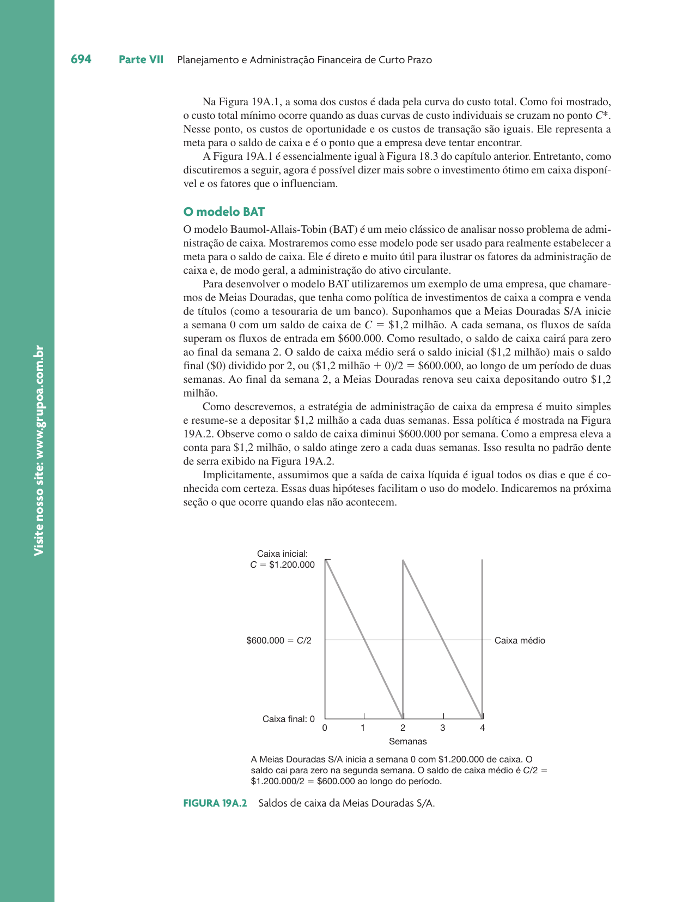

```{r}
classtools::setup_quarto_slides("content")
```

# Introdução

## Objetivos de Aprendizado

:::{.incremental}
- **OA1**: Entender o conceito de *float* e seu impacto nos saldos.
- **OA2**: Conhecer as técnicas de cobrança e desembolso.
- **OA3**: Avaliar os custos de manter caixa ocioso.
- **OA4**: Compreender o funcionamento das reservas bancárias no Brasil.
- **OA5**: Identificar os principais instrumentos de investimento de curto prazo.
:::

## Motivos para Manter Caixa

Segundo Keynes, existem três motivos principais:

:::{.incremental}
1. **Transação**: Necessidade de pagar as contas rotineiras.
2. **Precaução**: Reserva para imprevistos e emergências.
3. **Especulação**: Aproveitar oportunidades de mercado (ex: quedas de preços de insumos).
- **Trade-off**: O custo de oportunidade (juros perdidos) vs. o custo de falta de liquidez (empréstimos caros).
:::

# Gestão de Caixa no Brasil

## O Sistema Bancário e a Taxa DI

No Brasil, a gestão de caixa é pautada pela eficiência do sistema eletrônico e pelas taxas de juros.

:::{.incremental}
- **Taxa DI**: Referência para o custo de oportunidade do dinheiro no mercado privado.
- **Reservas Bancárias**: Recursos dos bancos no Banco Central para liquidação de pagamentos.
:::

## Estrutura do juro privado e Taxa DI
```{r}
#| fig-cap: "Estrutura de juro privado e Taxa DI"
knitr::include_graphics('figs/estrutura-juro-privado.png')
```

## O Conceito de Float

> "Float é a diferença entre o saldo no banco e o saldo nos livros da empresa."

:::{.incremental}
- **Float de Cobrança**: Atraso entre o recebimento do cliente e a disponibilidade do dinheiro.
- **Float de Desembolso**: Atraso entre a emissão do pagamento e a saída efetiva do caixa.
:::

## Exemplo de Float e Prazos

```{r}
#| fig-cap: "Composição do Float e Prazos"
knitr::include_graphics('figs/exemplo-float.png')
```

## Ciclo do Float e Prazos de Disponibilidade

O tempo total é composto por trânsito, processamento e compensação.


# Cobrança e Concentração

## Estratégias de Cobrança

O objetivo é acelerar a entrada de recursos.

:::{.incremental}
- No Brasil, o **Boleto Bancário** é a ferramenta central, integrada ao sistema de compensação nacional.
- O uso de canais eletrônicos minimiza o tempo de processamento.
:::

## Exemplo de Processamento de Cobranças

```{r}
#| fig-cap: "Visão Geral do Processamento de Cobranças"
knitr::include_graphics('figs/exemplo-processamento-cheque.png')
```

## Concentração de Caixa

Centralizar recursos em uma "conta-mãe" permite melhor gestão.

:::{.incremental}
- Facilita o investimento de excedentes.
- Reduz saldos ociosos em contas periféricas.
:::

## Exemplo concentrador de Cheques

```{r}
#| fig-cap: "Fluxo de Concentração de Caixa"
knitr::include_graphics('figs/exemplo-concentrador-de-cheque.png')
```

# Administração de Desembolsos

## Controle e Saldo Zero

Gerir pagamentos para maximizar o float de desembolso (dentro da ética e contratos).

:::{.incremental}
- **Contas de Saldo Zero**: Contas que recebem apenas o valor necessário para cobrir os pagamentos do dia.
- **Transferência Automática**: Bancos brasileiros oferecem varredura automática para fundos de liquidez.
:::

## Exemplo de Contas de Saldo Zero
```{r}
#| fig-cap: "Mecanismo de Contas de Saldo Zero"
knitr::include_graphics('figs/exemplo-contas-saldo-zero.png')
```

# Investimento e Sazonalidade

## Investimento do caixa ocioso

> Empresas frequentemente possuem excesso de caixa devido à sazonalidade ou ciclos operacionais.

:::{.incremental}
- **Investimentos**: Títulos Públicos (Selic), CDBs, e Fundos DI.
- **Critérios**: Liquidez, Segurança e Rentabilidade.
- **Tributação**: Imposto de renda sobre ganho de capital + IOF para resgates em curto prazo.
:::

## Exemplo de aplicação de recursos

> Uma determinada empresa possui um montante de 100.000 R$ em sua conta caixa, o qual não será utilizado nos próximos 15 dias. Considerando uma taxa do CDI de 0.8% ao mês, qual o montante resgatado no final do período de 15 dias (10 dias úteis) através de uma operação no mercado de moedas?

r_diário (taxa over) = 0.8%/30 = 0.0267%
Valor resgate = 100000*(1+0.0267%)^10 = 100267 R$

# Modelos Matemáticos

## Modelo BAT (Baumol-Allais-Tobin)

Abordagem para encontrar o saldo de caixa ótimo minimizando custos totais.

:::{.incremental}
- **Custo de Oportunidade**: Sobe com o saldo médio.
- **Custo de Transação**: Cai com saldos maiores (menos idas ao banco).
:::

```{r}
#| fig-cap: "Custos de Manutenção de Caixa"
knitr::include_graphics('figs/figura-19a-1.png')
```

## Saldo de Caixa Ótimo (BAT)

A fórmula de lote econômico aplicada ao caixa: $C^* = \sqrt{2TF/R}$.

```{r}
#| fig-cap: "Minimização dos Custos Totais"

```

## Modelo de Miller-Orr

Modelo estocástico que trabalha com limites de controle (Superior, Inferior e Retorno).

:::{.incremental}
- Adequado quando os fluxos de caixa são imprevisíveis.
- Define o ponto de retorno $Z$ e o limite superior $H$.
:::

```{r}
#| fig-cap: "Limites de Controle de Miller-Orr"
knitr::include_graphics('figs/figura-19a-3.png')
```

# Resumo

## Conclusões

:::{.incremental}
- Gestão de caixa foca na eficiência operacional e minimização de custos.
- O *float* líquido deve ser gerido para liberar capital de giro.
- No Brasil, a integração eletrônica e a Taxa DI são pilares da tesouraria.
- Modelos como BAT e Miller-Orr ajudam a definir o colchão de liquidez ideal.
:::

## Referências {.unlisted}

Ross, Westerfield, Jaffe. *Administração Financeira*. 10ª Edição. McGraw Hill Brasil, 2013. Capítulo 19.
